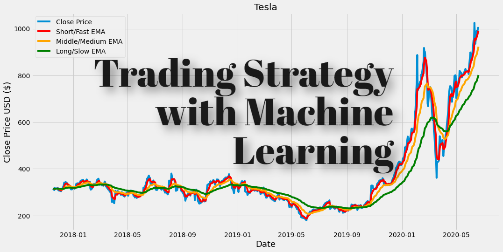

## Table of Contents

## What is deep learning and how does it differ from traditional machine learning?

Deep learning is a type of artificial intelligence that uses neural networks with many layers to learn and make decisions. These layers help the computer understand complex patterns in data, like recognizing objects in a picture or understanding speech. The more layers there are, the "deeper" the learning can be, which is why it's called deep learning. It's a bit like how our brains work, with different parts working together to process information.

Traditional machine learning, on the other hand, often uses simpler models that don't have as many layers. These models can be good at tasks like predicting house prices or classifying emails as spam or not spam. But they might struggle with more complex tasks, like understanding spoken language or recognizing faces in different lighting conditions. Traditional machine learning usually needs more help from humans to tell it what to look for in the data, while deep learning can figure out a lot of that on its own.

In summary, deep learning is like a more advanced version of machine learning. It can handle tougher jobs because of its deep layers, but it also needs a lot more data and computing power. Traditional machine learning is simpler and can work well for many tasks, but it might not be as good at understanding really complicated patterns without extra help.

## How can deep learning be applied to financial markets and trading?

Deep learning can be used in financial markets and trading to help make better predictions and decisions. It can look at a lot of data, like stock prices, news articles, and even social media posts, to find patterns that might be hard for humans to see. For example, deep learning can help predict how stock prices might change in the future by studying past price movements and other factors. This can help traders decide when to buy or sell stocks.

Another way deep learning can be used is in high-frequency trading, where computers make lots of trades very quickly. Deep learning models can analyze market data in real-time and make quick decisions to buy or sell. This can be useful for taking advantage of small price changes that happen in just a few seconds. However, it's important to remember that while deep learning can be powerful, it's not perfect and there's always a risk of making bad trades.

Overall, deep learning can be a helpful tool for traders and investors. It can process a lot of information quickly and find patterns that might be missed otherwise. But it's important to use it carefully and understand its limits, as the financial markets can be unpredictable and deep learning models can sometimes make mistakes.

## What are the basic types of neural networks used in deep learning for trading?

In deep learning for trading, one common type of [neural network](/wiki/neural-network) is the feedforward neural network. This kind of network is simple and works by taking in data, like stock prices or news, and passing it through different layers to make a prediction. It's like a straight line where information goes in one direction, from the input layer to the output layer, with hidden layers in between helping to make sense of the data. Traders use feedforward networks to predict future stock prices or to decide when to buy or sell.

Another type is the recurrent neural network (RNN), which is good at understanding sequences of data. This means it can remember past information and use it to make better predictions. In trading, RNNs can look at how stock prices have changed over time and use that to guess what might happen next. A special kind of RNN called a Long Short-Term Memory (LSTM) network is often used because it's even better at remembering long sequences of data, which can be really helpful in the financial markets where past trends can affect future prices.

Lastly, convolutional neural networks (CNNs) are also used, especially when dealing with data like images or text. In trading, CNNs can analyze news articles or social media posts to understand how people feel about a company or the market. This can help traders make better decisions by considering not just numbers, but also what people are saying. Each of these types of neural networks has its own strengths and can be used together to make trading strategies even more powerful.

## What data is typically used to train deep learning models for trading strategies?

To train deep learning models for trading strategies, people usually use a lot of different kinds of data. The most common data is historical price data, which includes things like the opening price, closing price, highest price, and lowest price of a stock each day. This data helps the model learn how prices have changed in the past, which can help predict what might happen in the future. Traders also use [volume](/wiki/volume-trading-strategy) data, which shows how many shares of a stock were bought and sold, because this can give clues about how interested people are in a stock.

Besides price and volume data, other types of information are also used. News articles and social media posts are important because they can affect how people feel about a company or the market. Deep learning models can read these texts and figure out if people are feeling positive or negative, which can help predict how stock prices might change. Economic indicators, like unemployment rates or interest rates, are also used because they can influence the whole market. By using all these different kinds of data, deep learning models can learn to make better trading decisions.

## How do you preprocess financial data for use in deep learning models?

Before using financial data in deep learning models, it needs to be cleaned and prepared. This means getting rid of any missing or wrong information. For example, if some stock prices are missing, you might fill them in with the last known price or just leave them out. You also need to make sure the data is in the right format. Numbers like stock prices and trading volumes should be turned into a form that the computer can easily understand. Sometimes, you might need to change the data so it's on a similar scale, like making sure all the numbers are between 0 and 1. This helps the model learn better because it won't be confused by very big or very small numbers.

Another important step is to split the data into different parts. You use one part to train the model, another part to test how well it's doing, and sometimes a third part to fine-tune it. This helps make sure the model can work well with new data it hasn't seen before. Also, you might need to create new features from the data. For example, you could calculate how much a stock's price has changed from one day to the next, or how many times a stock was mentioned in the news. These new features can help the model understand the data better and make better predictions.

## What are the common performance metrics for evaluating trading strategies based on deep learning?

When you want to see how well a trading strategy based on deep learning is doing, you look at some important numbers. One of these is the return, which tells you how much money you made or lost. Another one is the Sharpe ratio, which shows how much return you get for the risk you take. A higher Sharpe ratio means you're getting more return for less risk, which is good. You also look at the drawdown, which is the biggest drop in your money from the highest point to the lowest point. A smaller drawdown means your strategy is more stable and less risky.

Another important thing to check is the accuracy of your predictions. This means how often your model guesses the right direction of the stock price, like whether it will go up or down. But accuracy alone isn't enough because sometimes the market can be unpredictable. So, you also look at the confusion matrix, which shows how many times your model got it right or wrong in different ways. This helps you understand if your model is good at predicting big moves or if it's just guessing small changes correctly. By looking at all these numbers together, you can get a good idea of how well your deep learning trading strategy is working.

## How can overfitting be prevented when using deep learning for trading?

Overfitting happens when a deep learning model learns too much from the data it's trained on and doesn't work well with new data. To stop this from happening when using deep learning for trading, you can use a technique called regularization. This means adding a little penalty to the model to stop it from getting too complicated. Another way is to use dropout, where you randomly turn off some parts of the model during training. This makes the model learn to work even if some parts are missing, which helps it be more flexible and not overfit.

Another good way to prevent overfitting is to use more data for training. The more different kinds of data the model sees, the better it can learn without getting too focused on just one part. You can also split your data into training, validation, and testing sets. The training set is used to teach the model, the validation set helps you check how it's doing and adjust it, and the testing set lets you see how well it works on completely new data. By using these methods, you can make sure your deep learning model for trading is strong and works well with new data, not just the data it was trained on.

## What are some advanced deep learning architectures used specifically for financial predictions?

One advanced deep learning architecture used for financial predictions is the Long Short-Term Memory (LSTM) network. LSTMs are a type of recurrent neural network (RNN) that are really good at remembering things over a long time. In trading, this is super helpful because past prices and trends can tell us a lot about what might happen next. LSTMs can look at how stock prices have changed over days, weeks, or even months, and use that information to make better predictions. They're like having a memory that helps the model understand the ups and downs of the market better than other models.

Another advanced architecture is the Transformer model, which is great at understanding sequences of data, like text or time series. In financial predictions, Transformers can be used to analyze news articles, social media posts, or other text data that can affect stock prices. They're good at figuring out which parts of the text are important and how they relate to each other, which helps them understand the overall mood or sentiment about a company or the market. By combining this with other data, like stock prices, Transformers can make more accurate predictions about future market movements.

Lastly, there's the Generative Adversarial Network (GAN), which is made up of two parts that work together to create and check predictions. One part, called the generator, tries to make predictions that look real, while the other part, called the discriminator, tries to tell if these predictions are fake or not. In trading, GANs can be used to create realistic scenarios of how the market might move in the future. By constantly trying to fool each other, the generator and discriminator get better and better, which can lead to more accurate and useful predictions for traders.

## How do you integrate deep learning models into a trading platform?

To integrate deep learning models into a trading platform, you first need to make sure your platform can talk to the models. This means setting up a way for the platform to send data to the models and get predictions back. You might use something like an API, which is like a messenger that helps different parts of a computer system talk to each other. Once you have this set up, you can send the platform's data, like stock prices and news, to the deep learning model. The model then uses this data to make predictions about what might happen next in the market, and sends these predictions back to the trading platform.

After getting the predictions, the trading platform needs to decide what to do with them. This could mean buying or selling stocks based on what the model says. You might set up rules, like "if the model predicts the stock price will go up, buy the stock." The platform can then automatically make these trades. It's also important to keep an eye on how well the model is doing. You can do this by checking the model's performance with real market data and making changes if needed. By carefully integrating the deep learning model into the trading platform, you can use its predictions to make smarter trading decisions.

## What are the regulatory and ethical considerations when using deep learning for trading?

When using deep learning for trading, it's important to follow the rules set by financial regulators. These rules are there to make sure that trading is fair and safe for everyone. For example, some regulators might want to know how your deep learning model makes its predictions, so you need to be able to explain it. Also, there are rules about using inside information, which is secret information that could give you an unfair advantage. Deep learning models need to be careful not to use this kind of information, or you could get in trouble.

There are also ethical things to think about. Deep learning models can be really powerful, but they can also make mistakes or be used in ways that aren't fair. For example, if your model makes a bad prediction and causes people to lose a lot of money, that's a big problem. It's also important to make sure the model doesn't treat some people unfairly, like by making decisions based on someone's race or gender. Being honest and clear about how you use deep learning in trading is really important for keeping things fair and building trust with others.

## How can one backtest and validate deep learning trading strategies?

To backtest and validate deep learning trading strategies, you first need to use historical data to see how well your model would have done in the past. This means feeding old stock prices, news, and other data into your model and checking if its predictions would have made money. You split your data into different parts: one part to train the model, another part to test it, and sometimes a third part to fine-tune it. By doing this, you can see if your model is good at making predictions on data it hasn't seen before. It's like practicing with old games to see if your strategy would have won.

After [backtesting](/wiki/backtesting), you need to validate your strategy to make sure it's not just good at guessing the past but can also work well in the future. One way to do this is by using a method called walk-forward optimization. This means you keep moving your training data forward in time and testing the model on new data as it comes in. This helps you see if your model can adapt to changes in the market. Another important thing is to keep an eye on how your model is doing in real-time and be ready to make changes if it starts to perform badly. By carefully backtesting and validating your deep learning trading strategy, you can feel more confident that it will work well when you use it for real trading.

## What are the current trends and future directions in deep learning for trading strategies?

Right now, a big trend in using deep learning for trading is combining different kinds of models to make better predictions. People are using things like Long Short-Term Memory (LSTM) networks to understand how stock prices change over time, and Transformer models to read news and social media to see how people feel about the market. By putting these models together, traders can get a fuller picture of what might happen next. Another trend is using more and more data, not just from the stock market but also from other places like weather reports or economic indicators. This helps deep learning models learn more about how different things can affect stock prices.

In the future, deep learning for trading is likely to get even smarter. One direction is making models that can explain their predictions better, so traders can understand why the model is suggesting a certain trade. This is important for following rules and building trust. Another direction is using deep learning to create new trading strategies that can adapt to changes in the market more quickly. This means the models will keep learning and improving even after they start being used for real trading. As technology gets better and more data becomes available, deep learning will become an even more powerful tool for traders.

## What is the role of deep learning in trading?

Deep learning is an advanced subset of [machine learning](/wiki/machine-learning), distinguished by its capability to leverage artificial neural networks composed of multiple layers to model intricate patterns within large datasets. This approach marks a significant evolution in data processing and analysis, enabling the discovery of complex structures that simpler models might overlook.

In the context of trading, [deep learning](/wiki/deep-learning)'s strengths are particularly pronounced. Financial markets generate vast and complex datasets, encompassing a wide array of variables such as stock prices, trading volumes, macroeconomic indicators, and [alternative data](/wiki/best-alternative-data) sources like social media sentiment. The ability of deep learning algorithms to process and analyze these extensive datasets allows them to identify non-linear patterns and subtle relationships that traditional statistical models might miss.

Several deep learning architectures have become popular in [algorithmic trading](/wiki/algorithmic-trading) due to their distinct capabilities:

1. **Convolutional Neural Networks (CNNs):** Although initially designed for image recognition tasks, CNNs have found applications in trading by analyzing financial charts and identifying visual patterns that may correlate with market movements. They excel at learning spatial hierarchies, which can be adapted to identify meaningful patterns in multidimensional financial data.

2. **Recurrent Neural Networks (RNNs):** Specifically suited for sequential data, RNNs are effective in modeling time-series data, a critical component in trading strategies. RNNs, and their variants like Long Short-Term Memory networks (LSTMs), are adept at capturing the temporal dependencies in financial time-series data, making them ideal for forecasting stock prices or volatility.

3. **Deep Q-Networks (DQNs):** Originating from reinforcement learning, DQNs are instrumental in developing trading agents that learn optimal strategies through trial and error interactions with the trading environment. This approach allows the creation of systems that can dynamically adjust strategies based on market conditions.

These models are trained to recognize profitable trading patterns by optimizing their decision-making processes. The training involves feeding the model large volumes of historical financial data, after which it learns to predict future movements or identify optimal trading actions. For instance, the loss function could be designed to minimize prediction errors of asset prices or to maximize the overall return on investment:

$$
L(\theta) = \frac{1}{N} \sum_{i=1}^{N} (y_i - f(x_i; \theta))^2
$$

where $L$ represents the loss function, $\theta$ denotes the model parameters, $y_i$ are the actual values, and $f(x_i; \theta)$ are the model predictions.

Python frameworks, such as TensorFlow and PyTorch, are commonly employed for designing and implementing these deep learning models. These frameworks provide tools for building complex neural networks and efficient methods for model training, validation, and optimization.

Overall, the integration of deep learning in trading strategies offers a promising avenue for identifying intricate market patterns and optimizing trading decisions, potentially leading to smarter and more profitable trading outcomes.

## What is Backtesting and Strategy Evaluation?

Backtesting is an essential step in the development of trading strategies, providing a way to simulate how a strategy would have performed using historical data. By simulating trades under different market conditions, backtesting helps evaluate the potential effectiveness of a strategy before deploying it in live markets. This is crucial for determining whether a strategy has inherent merit or if its perceived success is merely a result of overfitting to the historical data.

To evaluate the performance of trading strategies, several key metrics are commonly employed:

1. **Risk-Adjusted Returns:** This metric considers the return of an investment relative to its risk. One popular measure is the Sharpe ratio, defined as:
$$
   \text{Sharpe Ratio} = \frac{E[R - R_f]}{\sigma}

$$
   where $E[R - R_f]$ is the expected return of the strategy minus the risk-free rate, and $\sigma$ is the standard deviation of the return. A higher Sharpe ratio indicates more attractive risk-adjusted returns.

2. **Maximum Drawdown:** This measures the largest peak-to-trough decline in the value of a portfolio. It helps assess the worst-case scenario in terms of loss, thereby aiding in understanding the risk associated with the strategy.

Tools like **Zipline** and **Backtrader** facilitate rigorous backtesting processes. Zipline is an open-source backtesting library in Python that supports event-driven trading, while Backtrader offers a flexible framework for backtesting with advanced features for handling live data. Both tools provide capabilities to simulate trading strategies under varied market conditions and to visualize the results for better performance analysis.

Backtesting effectively involves:
- Setting up a trading environment that carefully matches historical market conditions.
- Running simulations over extensive periods to ensure robustness across different market cycles.
- Analyzing results using statistical metrics to verify consistency and reliability.

However, it is crucial to recognize potential pitfalls in backtesting, such as data-snooping bias and overfitting. Ensuring that the data used is representative and that the strategy is tested on out-of-sample data can alleviate some of these issues.

In summary, backtesting serves as a foundational practice in the evaluation of trading strategies, offering insights and foresight into potential real-world performance. By applying key performance metrics and utilizing robust tools like Zipline and Backtrader, traders and analysts can refine their approach and enhance their decision-making process, leading to more effective algorithmic trading outcomes.

## References & Further Reading

[1]: Goodfellow, I., Bengio, Y., & Courville, A. (2016). ["Deep Learning."](https://link.springer.com/article/10.1007/s10710-017-9314-z) MIT Press.

[2]: López de Prado, M. (2018). ["Advances in Financial Machine Learning."](https://www.amazon.com/Advances-Financial-Machine-Learning-Marcos/dp/1119482089) Wiley.

[3]: Janz, K. (2020). ["Machine Learning for Algorithmic Trading."](https://github.com/stefan-jansen/machine-learning-for-trading) Packt Publishing.

[4]: Homma, N., & Yoshida, T. (2014). ["A Survey on Deep Learning Techniques for Financial Market Prediction."](https://arxiv.org/abs/2212.12717) Arxiv.

[5]: Aronson, D. R. (2007). ["Evidence-Based Technical Analysis: Applying the Scientific Method and Statistical Inference to Trading Signals."](https://www.amazon.com/Evidence-Based-Technical-Analysis-Scientific-Statistical/dp/0470008741) Wiley.

[6]: Chan, E. P. (2008). ["Quantitative Trading: How to Build Your Own Algorithmic Trading Business."](https://github.com/ftvision/quant_trading_echan_book) Wiley.

[7]: Heaton, J. B., Polson, N. G., & Witte, J. H. (2017). ["Deep Learning in Finance."](https://arxiv.org/abs/1602.06561) Arxiv. 

[8]: Hochreiter, S., & Schmidhuber, J. (1997). ["Long Short-Term Memory."](https://dl.acm.org/doi/10.1162/neco.1997.9.8.1735) Neural Computation, 9(8), 1735-1780. 

[9]: Silver, D., et al. (2017). ["Mastering Chess and Shogi by Self-Play with a General Reinforcement Learning Algorithm."](https://arxiv.org/abs/1712.01815) Nature, 550(7676), 354-359. 

[10]: Backtrader. ["Backtrader: Backtest, Optimize and Live Algorithmic Trading."](https://tradesearcher.ai/blog/backtrader-beginner-friendly-python-guide) Backtrader.com.

[11]: Zipline. ["Zipline: A Backtester for Financial Algorithms."](https://www.piwheels.org/project/zipline/) Zipline.io.