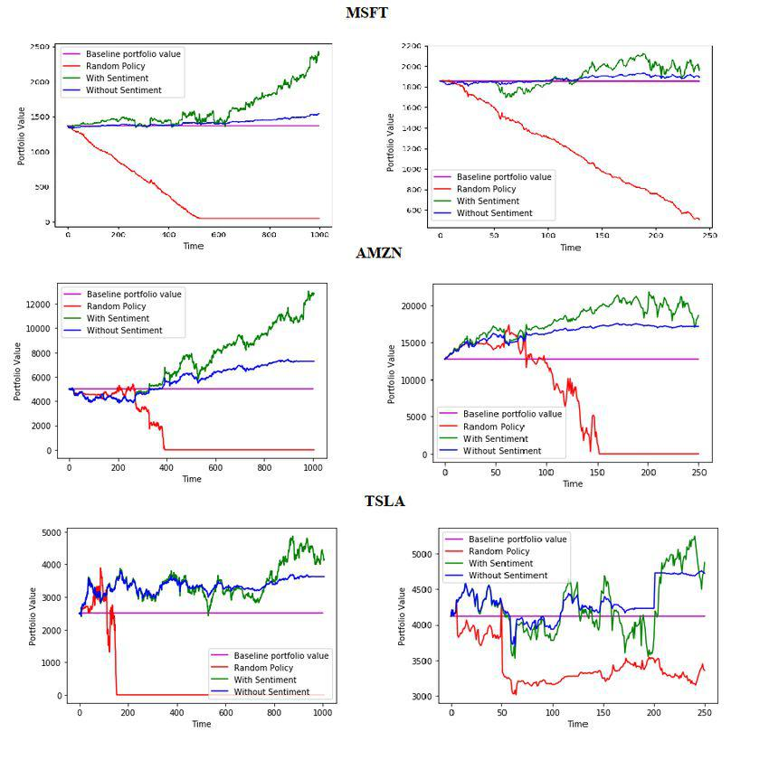

Deep learning in the context of trading strategies represents a revolutionary shift in how we approach algorithmic trading. By leveraging advanced neural networks, traders and financial analysts can devise strategies that were previously unimaginable. This article explores the role of deep learning in developing sophisticated trading strategies and how it improves algorithmic trading (Algo Trading).

Deep learning, a subset of artificial intelligence, utilizes neural networks with multiple layers to process and analyze extensive datasets. This capability is particularly advantageous in the financial markets, where vast amounts of data and complex patterns exist. By employing deep learning techniques, algorithmic trading models can identify intricate non-linear patterns and correlations within market data, providing a significant edge over traditional statistical models.



The field of deep learning offers a plethora of model architectures applicable to trading, such as Convolutional Neural Networks (CNNs), Recurrent Neural Networks (RNNs), and Long Short-Term Memory networks (LSTMs). Each model has unique properties suited for specific types of data and trading scenarios. For instance, CNNs excel in tasks requiring pattern recognition in structured data, whereas RNNs are adept at processing sequential data, making them ideal for time-series analysis in financial markets.

To effectively harness deep learning for trading, robust data handling and preprocessing techniques are essential. The financial domain presents unique challenges, such as non-stationarity and the presence of noise, which necessitate careful data preprocessing and feature engineering. These processes ensure the data fed into neural networks is of high quality, enhancing model performance and prediction accuracy.

Strategy development using deep learning involves more than just model selection; it requires a comprehensive understanding of backtesting and risk management. Backtesting allows traders to evaluate the potential effectiveness of a trading strategy using historical data before its live deployment. Tools such as Zipline and Backtrader facilitate rigorous backtesting, helping traders measure strategy performance through metrics like risk-adjusted returns and maximum drawdown.

Real-world applications of deep learning in trading highlight its transformative impact. Enhanced trading strategies have been observed in areas ranging from high-frequency trading to portfolio management, where neural networks provide insights that were previously unattainable. Case studies illustrate successful implementations of CNNs for sentiment analysis, a technique that analyzes news and social media to predict market trends, and RNNs for multivariate time series forecasting.

As the field of deep learning rapidly evolves, new trends and challenges emerge. The development of trading agents using reinforcement learning, which can learn from interactions with the market environment, represents a significant advancement. However, challenges such as overfitting, interpretability, and data quality remain prevalent and necessitate ongoing research and innovation.

This comprehensive guide is designed to serve both newcomers and experienced professionals in the trading industry. By fostering a better understanding of deep learning's capabilities, traders can harness these powerful tools to enhance decision-making and improve trading outcomes.

## Table of Contents

## Understanding Deep Learning in Trading

Deep learning is an advanced subset of [machine learning](/wiki/machine-learning), distinguished by its capability to leverage artificial neural networks composed of multiple layers to model intricate patterns within large datasets. This approach marks a significant evolution in data processing and analysis, enabling the discovery of complex structures that simpler models might overlook.

In the context of trading, [deep learning](/wiki/deep-learning)'s strengths are particularly pronounced. Financial markets generate vast and complex datasets, encompassing a wide array of variables such as stock prices, trading volumes, macroeconomic indicators, and [alternative data](/wiki/best-alternative-data) sources like social media sentiment. The ability of deep learning algorithms to process and analyze these extensive datasets allows them to identify non-linear patterns and subtle relationships that traditional statistical models might miss.

Several deep learning architectures have become popular in [algorithmic trading](/wiki/algorithmic-trading) due to their distinct capabilities:

1. **Convolutional Neural Networks (CNNs):** Although initially designed for image recognition tasks, CNNs have found applications in trading by analyzing financial charts and identifying visual patterns that may correlate with market movements. They excel at learning spatial hierarchies, which can be adapted to identify meaningful patterns in multidimensional financial data.

2. **Recurrent Neural Networks (RNNs):** Specifically suited for sequential data, RNNs are effective in modeling time-series data, a critical component in trading strategies. RNNs, and their variants like Long Short-Term Memory networks (LSTMs), are adept at capturing the temporal dependencies in financial time-series data, making them ideal for forecasting stock prices or volatility.

3. **Deep Q-Networks (DQNs):** Originating from reinforcement learning, DQNs are instrumental in developing trading agents that learn optimal strategies through trial and error interactions with the trading environment. This approach allows the creation of systems that can dynamically adjust strategies based on market conditions.

These models are trained to recognize profitable trading patterns by optimizing their decision-making processes. The training involves feeding the model large volumes of historical financial data, after which it learns to predict future movements or identify optimal trading actions. For instance, the loss function could be designed to minimize prediction errors of asset prices or to maximize the overall return on investment:

$$
L(\theta) = \frac{1}{N} \sum_{i=1}^{N} (y_i - f(x_i; \theta))^2
$$

where $L$ represents the loss function, $\theta$ denotes the model parameters, $y_i$ are the actual values, and $f(x_i; \theta)$ are the model predictions.

Python frameworks, such as TensorFlow and PyTorch, are commonly employed for designing and implementing these deep learning models. These frameworks provide tools for building complex neural networks and efficient methods for model training, validation, and optimization.

Overall, the integration of deep learning in trading strategies offers a promising avenue for identifying intricate market patterns and optimizing trading decisions, potentially leading to smarter and more profitable trading outcomes.

## Data Sourcing and Preprocessing for Trading Strategies

Successful trading strategies are fundamentally reliant on the quality and integrity of the data utilized. Data plays an instrumental role in the training and performance of deep learning models within algorithmic trading. To ensure a comprehensive and robust strategy, data from various sources such as financial market data, alternative data, and fundamental data is essential. 

Financial market data refers to information on asset prices, volumes, and other trade-related attributes obtained from financial exchanges. This data is often high-frequency and voluminous, requiring methods that can efficiently handle and analyze such vast datasets. Fundamental data, on the other hand, includes metrics such as earnings reports, balance sheets, and economic indicators which help infer the intrinsic value of financial assets. Alternative data sources, which have gained prominence in recent years, include news articles, social media sentiment, satellite imagery, and web traffic [statistics](/wiki/bayesian-statistics), providing additional dimensions of insights that are not captured by traditional datasets.

Once suitable data is gathered, the preprocessing stage is initiated. This stage involves several critical steps:

1. **Cleaning**: This is a crucial first step whereby errors and inconsistencies in the data are removed. Outliers, missing values, and incorrect records are identified and treated appropriately. For instance, missing data may be handled via imputation methods such as mean substitution, interpolation, or model-based techniques.

2. **Normalizing**: Financial data can have different ranges and units, necessitating normalization to ensure compatibility. Techniques like min-max scaling or z-score standardization transform the data into a uniform scale, facilitating more effective model training.

3. **Transforming**: Involves converting raw data into structured formats that deep learning models can interpret. This may involve aggregating data into time-series formats, encoding categorical variables, or developing indices from the raw metrics.

Feature engineering is a critical process aiming to glean meaningful insights and signals from preprocessed data. By creating new features or modifying existing ones, feature engineering enables models to capture significant patterns. For example, generating technical indicators such as moving averages, Bollinger Bands, or relative strength indices can provide additional context to raw price data, enhancing model performance.

Managing challenges such as missing data, outliers, and ensuring data consistency is an ongoing task. Python libraries like Pandas and NumPy are often employed for data manipulation and cleaning. Below is a simple illustration of how missing values might be handled using Pandas:

```python
import pandas as pd

# Sample DataFrame with missing values
data = {'price': [100, 101, None, 103, 105],
        'volume': [200, None, 250, 270, 300]}
df = pd.DataFrame(data)

# Impute missing values using forward-fill method
df.fillna(method='ffill', inplace=True)

print(df)
```

This process ensures the integrity and usability of datasets for modeling purposes. By streamlining the data sourcing and preprocessing stages, traders and analysts can significantly enhance the efficacy of their deep learning-driven trading strategies.

## Designing and Training Deep Learning Models for Trading

Model architecture is a fundamental aspect of integrating deep learning into trading, as it determines the model's ability to effectively process complex market data and infer trading decisions. Selecting an appropriate model is crucial, with Convolutional Neural Networks (CNNs) often used for data with spatial hierarchies such as images or signals, and Recurrent Neural Networks (RNNs) being well-suited for sequential data like time series, which is prevalent in financial markets.

### Model Selection

In trading, RNNs, including their advanced variants like Long Short-Term Memory (LSTM) and Gated Recurrent Units (GRU), are preferred for capturing temporal dependencies in time series data. These models excel at learning from sequences, making them ideal for predicting stock prices, which are influenced by historical trends. Conversely, CNNs can be utilized for tasks such as sentiment analysis where structured data from news articles or reports include patterns that can be interpreted spatially through convolutions.

### Hyperparameter Tuning

Hyperparameter tuning is a pivotal process in enhancing the performance of deep learning models. Techniques such as grid search and random search are conventional methods where different combinations of hyperparameters, such as learning rates, batch sizes, and network layers, are tested to identify the optimal configuration. Automation tools like AutoML have gained popularity, allowing for more efficient exploration of hyperparameter space by leveraging machine learning to predict optimal settings based on model performance.

```python
# Example of using GridSearchCV for hyperparameter tuning in Python
from sklearn.model_selection import GridSearchCV
from keras.models import Sequential
from keras.layers import Dense, LSTM
from keras.wrappers.scikit_learn import KerasClassifier

# Function to create model required for KerasClassifier
def create_model(optimizer='adam'):
    model = Sequential()
    model.add(LSTM(50, input_shape=(10, 1)))
    model.add(Dense(1))
    model.compile(loss='mean_squared_error', optimizer=optimizer)
    return model

model = KerasClassifier(build_fn=create_model, verbose=0)
# Define the grid search parameters
param_grid = {'batch_size': [10, 20, 50],
              'epochs': [10, 50, 100],
              'optimizer': ['SGD', 'RMSprop', 'Adam']}
grid = GridSearchCV(estimator=model, param_grid=param_grid, n_jobs=-1, cv=3)
# Execute search
grid_result = grid.fit(X, y)
```

### Training Techniques

Training techniques in deep learning for trading include both supervised and unsupervised learning. In supervised learning, models learn by mapping input data to output labels, such as predicting stock price movements (up, down, static) from historical price data. Conversely, unsupervised learning does not have labeled outputs; it is useful for clustering and anomaly detection in financial data, where groups of stocks or unusual trading patterns can be identified without a prior label.

### Importance of Backtesting

Backtesting is a critical step in evaluating the effectiveness of trading strategies developed through deep learning. It involves running the trading model on historical data to assess how it would have performed. This procedure helps in validating model predictions and provides insights into potential real-world application outcomes. Model performance metrics obtained from [backtesting](/wiki/backtesting), such as Sharpe ratios and maximum drawdown, provide a robust framework for assessing the risk-adjusted returns of strategies.

```python
# Example of backtesting using a simple moving average strategy
import pandas as pd
import numpy as np

# Generate a trading signal
def generate_signal(data, short_window=40, long_window=100):
    signals = pd.DataFrame(index=data.index)
    signals['signal'] = 0.0

    # Create short simple moving average
    signals['short_mavg'] = data['Close'].rolling(window=short_window, min_periods=1, center=False).mean()

    # Create long simple moving average
    signals['long_mavg'] = data['Close'].rolling(window=long_window, min_periods=1, center=False).mean()

    # Create signals
    signals['signal'][short_window:] = np.where(signals['short_mavg'][short_window:] 
                                                > signals['long_mavg'][short_window:], 1.0, 0.0)   

    # Generate trading orders
    signals['positions'] = signals['signal'].diff()
    return signals

# Backtesting a strategy
def backtest_strategy(data, signals):
    initial_capital= float(10000.0)
    positions = pd.DataFrame(index=signals.index).fillna(0.0)
    positions['asset'] = signals['signal'] * 100
    portfolio = positions.multiply(data['Close'], axis=0)
    pos_diff = positions.diff()
    portfolio['holdings'] = (positions.multiply(data['Close'], axis=0)).sum(axis=1)
    portfolio['cash'] = initial_capital - (pos_diff.multiply(data['Close'], axis=0)).sum(axis=1).cumsum()   
    portfolio['total'] = portfolio['cash'] + portfolio['holdings']
    portfolio['returns'] = portfolio['total'].pct_change()
    return portfolio

# Perform backtesting
data = pd.read_csv('market_data.csv', index_col='Date', parse_dates=True)
signals = generate_signal(data)
portfolio = backtest_strategy(data, signals)
```

Overall, the careful design and training of deep learning models are crucial for developing effective trading strategies. Through an informed selection of model architectures, diligent hyperparameter tuning, and rigorous training and backtesting methodologies, financial analysts can craft sophisticated algorithmic trading systems that leverage the full potential of deep learning.

## Backtesting and Strategy Evaluation

Backtesting is an essential step in the development of trading strategies, providing a way to simulate how a strategy would have performed using historical data. By simulating trades under different market conditions, backtesting helps evaluate the potential effectiveness of a strategy before deploying it in live markets. This is crucial for determining whether a strategy has inherent merit or if its perceived success is merely a result of overfitting to the historical data.

To evaluate the performance of trading strategies, several key metrics are commonly employed:

1. **Risk-Adjusted Returns:** This metric considers the return of an investment relative to its risk. One popular measure is the Sharpe ratio, defined as:
$$
   \text{Sharpe Ratio} = \frac{E[R - R_f]}{\sigma}

$$
   where $E[R - R_f]$ is the expected return of the strategy minus the risk-free rate, and $\sigma$ is the standard deviation of the return. A higher Sharpe ratio indicates more attractive risk-adjusted returns.

2. **Maximum Drawdown:** This measures the largest peak-to-trough decline in the value of a portfolio. It helps assess the worst-case scenario in terms of loss, thereby aiding in understanding the risk associated with the strategy.

Tools like **Zipline** and **Backtrader** facilitate rigorous backtesting processes. Zipline is an open-source backtesting library in Python that supports event-driven trading, while Backtrader offers a flexible framework for backtesting with advanced features for handling live data. Both tools provide capabilities to simulate trading strategies under varied market conditions and to visualize the results for better performance analysis.

Backtesting effectively involves:
- Setting up a trading environment that carefully matches historical market conditions.
- Running simulations over extensive periods to ensure robustness across different market cycles.
- Analyzing results using statistical metrics to verify consistency and reliability.

However, it is crucial to recognize potential pitfalls in backtesting, such as data-snooping bias and overfitting. Ensuring that the data used is representative and that the strategy is tested on out-of-sample data can alleviate some of these issues.

In summary, backtesting serves as a foundational practice in the evaluation of trading strategies, offering insights and foresight into potential real-world performance. By applying key performance metrics and utilizing robust tools like Zipline and Backtrader, traders and analysts can refine their approach and enhance their decision-making process, leading to more effective algorithmic trading outcomes.

## Real-World Applications and Case Studies

Deep learning has increasingly become integral to various trading strategies, demonstrating its potential to enhance decision-making processes across different domains within financial markets. These applications encompass high-frequency trading, portfolio management, sentiment analysis, and synthetic data generation, each showcasing distinct aspects of deep learning's contribution to the trading landscape.

High-frequency trading ([HFT](/wiki/high-frequency-trading-strategies)) benefits significantly from deep learning models due to their ability to process extensive datasets in real-time and make rapid decisions. By employing algorithms that detect short-lived [arbitrage](/wiki/arbitrage) opportunities or market inefficiencies, traders can execute trades within milliseconds. Convolutional Neural Networks (CNNs) and Recurrent Neural Networks (RNNs) are particularly effective in HFT, given their capacity to analyze intricate patterns across time-series data. CNNs, originally designed for image processing, can encapsulate time-series data spatially to identify patterns, while RNNs are inherently suitable for sequential data, allowing the model to remember previous inputs and predict future trends.

In portfolio management, deep learning assists in optimizing asset allocations by continuously learning and adapting to changing market dynamics. Models like Long Short-Term Memory networks (LSTMs), a type of RNN, excel in capturing temporal dependencies, facilitating more informed forecasting of asset price movements and enhancing the development of risk-adjusted investment strategies. This capability is crucial for creating diversified portfolios that maximize returns while minimizing potential risks.

Sentiment analysis further exemplifies deep learning's utility, employing CNNs to transform textual data from news articles and social media into actionable trading signals. By quantifying market sentiment, these models enable traders to anticipate market reactions to news events and adjust their strategies accordingly. The sentiment score derived from textual data can be combined with technical indicators to form a holistic view of the market state.

Generative Adversarial Networks (GANs) contribute by generating synthetic data, which is valuable for stress-testing trading algorithms against a variety of hypothetical scenarios. GANs consist of two neural networks— a generator and a discriminator— that operate in tandem, with the generator creating synthetic data and the discriminator evaluating its authenticity. This approach allows for robust scenario analysis without relying solely on historical data, thus enhancing the resilience of trading strategies under unpredictable market conditions.

Several case studies illustrate these applications in practice. One notable example involves CNNs applied to sentiment analysis, where the model successfully predicted stock price movements by evaluating the sentiment of tweets and news headlines. The study demonstrated improved trading outcomes over strategies that did not incorporate sentiment analysis.

Another example is the implementation of RNNs in multivariate time-series analysis for forecasting currency exchange rates. This model effectively identified patterns across multiple currency pairs, aiding traders in executing profitable foreign exchange trades. The study highlighted the RNN's capability to leverage sequential data for accurate prediction, outperforming traditional statistical models.

Challenges associated with deploying deep learning in trading primarily involve overfitting, model interpretability, and data quality. Overfitting occurs when a model becomes too tailored to historical data, reducing its predictive power for new data. Regularization techniques and dropout layers can mitigate this issue. Additionally, deep learning models are often perceived as "black boxes," making their decision-making processes difficult to interpret. Research into explainability is ongoing, focusing on methods to elucidate model inner workings.

Lastly, high-quality data remains essential. Models trained on biased or incomplete data may lead to erroneous predictions. Therefore, ensuring robust data preprocessing and feature engineering is critical for the successful application of deep learning to trading strategies.

## Future Trends and Challenges

While deep learning provides significant advantages in trading strategies, it also presents several challenges that need to be addressed for optimal performance. One of the primary challenges is overfitting, which occurs when a model learns the training data too well, including its noise and outliers, thereby reducing its ability to generalize to new, unseen data. Techniques such as dropout, L2 regularization, and cross-validation can be employed to mitigate overfitting and improve model robustness.

Another critical challenge is interpretability. Deep learning models, especially those with numerous layers, often function as "black boxes," making it difficult to understand how they reach specific decisions. This lack of transparency can pose significant risks in the financial markets, where understanding the rationale behind a model's predictions is crucial for risk management and regulatory compliance. Efforts are being made to develop tools and techniques, such as feature importance scores and visualization tools, to enhance the interpretability of these complex models.

High-quality data is another prerequisite for effective deep learning models. Financial markets generate vast amounts of data, but this data can be noisy, unreliable, and sometimes unavailable. Ensuring data integrity through rigorous preprocessing steps, such as data cleaning, normalization, and outlier handling, is essential for building robust models. Additionally, alternative data sources, which provide non-traditional insights, are becoming a key component in enhancing model accuracy and resilience.

Emerging trends in algorithmic trading involve the integration of [reinforcement learning](/wiki/reinforcement-learning), where trading [agents](/wiki/agents) learn effective strategies through interactions with the market environment. Reinforcement learning techniques enable agents to optimize trading strategies by receiving feedback in the form of rewards or penalties based on the outcomes of their actions. This dynamic learning process allows agents to adapt to changing market conditions and improve their decision-making over time.

Future developments in algorithmic trading are likely to be influenced by ongoing research in several areas. One promising avenue is the use of Explainable AI (XAI) to address the challenge of model interpretability. XAI aims to create models that are both powerful and understandable, ensuring that stakeholders can trust and effectively utilize AI systems in critical applications. Additionally, advancements in hardware, such as the use of graphical processing units (GPUs) and tensor processing units (TPUs), are expected to accelerate model training and deployment, making deep learning more efficient and accessible.

Another area of interest is the application of quantum computing in deep learning to solve complex optimization problems more efficiently than classical computers. While still in its nascent stages, quantum computing holds the potential to revolutionize data processing, offering unprecedented computational power for large-scale deep learning models in trading.

In conclusion, while deep learning provides transformative capabilities for trading strategies, addressing challenges related to overfitting, interpretability, and data quality remains critical. Emerging trends such as reinforcement learning and advances in computing resources are set to drive future developments, helping traders harness the full potential of deep learning in dynamic market environments.

## Conclusion

Deep learning offers a transformative capability within the field of trading, providing traders with the means to develop strategies that are more refined and adaptive than traditional approaches. By utilizing advanced [neural network](/wiki/neural-network) architectures, these models can uncover complex patterns in market data, allowing for more informed decision-making and potentially leading to higher returns. As computational resources and data availability continue to expand, the capabilities of deep learning-driven trading strategies are poised to surpass those of conventional models, offering a new frontier in financial analytics.

The dynamism of financial markets necessitates a commitment to continuous learning and model enhancement. As new research emerges, staying abreast of the latest developments is crucial for maintaining a competitive edge. This involves not only understanding but also refining model architectures, exploring novel data sources, and employing cutting-edge techniques like reinforcement learning and generative models.

Financial professionals and data scientists are encouraged to integrate AI advancements into their trading methodologies actively. As the intersection of big data, machine learning, and financial markets evolves, embracing these technologies ensures alignment with rapid industry changes. By fostering a culture of innovation and adaptability, traders can not only optimize current practices but also set the stage for future advancements in algorithmic trading.

## References & Further Reading

[1]: Goodfellow, I., Bengio, Y., & Courville, A. (2016). ["Deep Learning."](https://link.springer.com/article/10.1007/s10710-017-9314-z) MIT Press.

[2]: López de Prado, M. (2018). ["Advances in Financial Machine Learning."](https://www.amazon.com/Advances-Financial-Machine-Learning-Marcos/dp/1119482089) Wiley.

[3]: Janz, K. (2020). ["Machine Learning for Algorithmic Trading."](https://github.com/stefan-jansen/machine-learning-for-trading) Packt Publishing.

[4]: Homma, N., & Yoshida, T. (2014). ["A Survey on Deep Learning Techniques for Financial Market Prediction."](https://arxiv.org/abs/2212.12717) Arxiv.

[5]: Aronson, D. R. (2007). ["Evidence-Based Technical Analysis: Applying the Scientific Method and Statistical Inference to Trading Signals."](https://www.amazon.com/Evidence-Based-Technical-Analysis-Scientific-Statistical/dp/0470008741) Wiley.

[6]: Chan, E. P. (2008). ["Quantitative Trading: How to Build Your Own Algorithmic Trading Business."](https://github.com/ftvision/quant_trading_echan_book) Wiley.

[7]: Heaton, J. B., Polson, N. G., & Witte, J. H. (2017). ["Deep Learning in Finance."](https://arxiv.org/abs/1602.06561) Arxiv. 

[8]: Hochreiter, S., & Schmidhuber, J. (1997). ["Long Short-Term Memory."](https://dl.acm.org/doi/10.1162/neco.1997.9.8.1735) Neural Computation, 9(8), 1735-1780. 

[9]: Silver, D., et al. (2017). ["Mastering Chess and Shogi by Self-Play with a General Reinforcement Learning Algorithm."](https://arxiv.org/abs/1712.01815) Nature, 550(7676), 354-359. 

[10]: Backtrader. ["Backtrader: Backtest, Optimize and Live Algorithmic Trading."](https://tradesearcher.ai/blog/backtrader-beginner-friendly-python-guide) Backtrader.com.

[11]: Zipline. ["Zipline: A Backtester for Financial Algorithms."](https://www.piwheels.org/project/zipline/) Zipline.io.