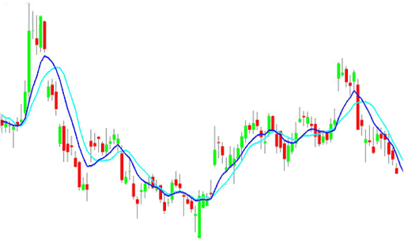

In recent years, deep learning has seen explosive growth in the financial sector, particularly within algorithmic trading. This growth is driven by deep learning's capability to model intricate patterns and make nuanced predictions, offering new possibilities for traders and investors. Algorithmic trading, also known as algo trading, utilizes computer algorithms to execute trades at high speed and volume, enabling traders to capitalize on market opportunities with precision and efficiency. This mechanized approach streamlines the trading process, effectively responding to market changes often imperceptible to human traders.

The intersection of deep learning and trading is a fertile ground for innovation, where advanced machine learning techniques enhance the performance of trading strategies. Deep learning models, particularly those employing neural networks, can analyze an extensive range of data to identify emerging market trends and detect subtle correlations. This capability allows for the development of sophisticated algorithms that predict market fluctuations, optimize investment portfolios, and create autonomous trading agents capable of making quick, data-driven decisions.



By understanding the role of deep learning in trading, investors can gain a competitive advantage, enabling them to make more informed decisions amidst the rapidly changing conditions of financial markets. The integration of deep learning approaches equips traders with tools that go beyond traditional analytical methods, allowing for a more comprehensive understanding of market dynamics. As algorithmic trading techniques evolve alongside advancements in deep learning, the potential for innovation within the financial sector continues to grow, promising more efficient and effective trading strategies for the future.

## Table of Contents

## Understanding Deep Learning in Trading

Deep learning, a sophisticated subset of machine learning, employs neural networks composed of multiple layers to process and interpret substantial volumes of data. This method is adept at drawing valuable insights from intricate data sets, such as those found in financial markets. In the trading context, deep learning models are engineered to detect patterns and correlations that may not be readily apparent to human analysts. These insights enable the creation of predictive algorithms that bolster trading strategies by offering new perspectives on market dynamics.

The versatility of deep learning lies in its ability to integrate a wide assortment of data sources. It can handle structured market data, such as historical prices and volumes, along with unstructured data, including news articles and social media posts. By amalgamating these diverse data sets, traders can derive more precise predictions and generate actionable signals. This comprehensive approach offers a more holistic view of market conditions, thus facilitating informed decision-making.

Innovations in deep learning architecture, such as recurrent neural networks (RNN) and convolutional neural networks (CNN), have expanded the range of applications for these techniques in trading. RNNs are well-suited for modeling time-series data, which is quintessential in analyzing stock prices or trading volumes over time. An RNN can process sequential information efficiently by maintaining a 'memory' of previous inputs, making it highly effective for predictive tasks in trading scenarios.

For example, consider a simple RNN architecture designed to predict future stock prices based on historical data:

```python
import numpy as np
from keras.models import Sequential
from keras.layers import Dense, SimpleRNN

# Sample data: historical stock prices
data = np.array([...])  # Replace with actual data

# Normalizing the data for better performance
data = (data - data.mean()) / data.std()

# Splitting data into input (X) and output (y) sets
X, y = data[:-1], data[1:]

# Reshape input data to be 3-dimensional [samples, time_steps, features]
X = X.reshape((X.shape[0], 1, X.shape[1]))

# Creating the RNN model
model = Sequential()
model.add(SimpleRNN(units=50, activation='relu', input_shape=(1, X.shape[2])))
model.add(Dense(units=1))  # Single output unit for price prediction

# Compile and train the model
model.compile(optimizer='adam', loss='mean_squared_error')
model.fit(X, y, epochs=200, batch_size=32)
```

CNNs, on the other hand, excel in processing visual data and can be applied to recognize complex patterns in candlestick charts or other graphical representations of market data. This makes CNNs particularly useful for technical analysis, where visual patterns often signify potential trading signals.

By leveraging these [deep learning](/wiki/deep-learning) techniques, trading systems can become more adept at handling the complexities of financial markets. The integration of time-series and visual data modeling capabilities allows for more sophisticated and adaptive trading strategies, empowering traders with tools that can adapt to the fast-paced and unpredictable nature of financial markets.

## Applications of Deep Learning in Trading

Deep learning is revolutionizing various facets of the trading industry, presenting substantial advancements from risk management to the formulation of automated trading strategies. 

One predominant application is the prediction of asset prices by analyzing historical market data and price trends through neural networks. These deep learning models aim to forecast future price movements with greater accuracy than traditional statistical methods. Through the use of complex architectures such as Long Short-Term Memory (LSTM) networks, which are adept at handling sequential data, traders can model temporal dependencies in financial time series more effectively. This facilitates more informed predictions of asset price fluctuations.

Portfolio optimization is another domain significantly enhanced by deep learning. By assessing correlations among multiple assets, deep learning models can construct a portfolio that optimizes the trade-off between risk and return. This involves solving optimization problems where the goal is to maximize expected returns while minimizing risk, represented mathematically as:

$$
\text{minimize } f(\mathbf{w}) = \frac{1}{2}\mathbf{w}^T \Sigma \mathbf{w} - \mathbf{\mu}^T\mathbf{w}
$$

subject to constraints such as $\sum w_{i} = 1$ and $w_{i} \geq 0$, where $\mathbf{w}$ is the vector of asset weights, $\Sigma$ is the covariance matrix of asset returns, and $\mathbf{\mu}$ is the expected returns vector.

In addition, deep learning facilitates the creation of sophisticated trading algorithms that execute trades autonomously by utilizing real-time market data and adapting to emerging market conditions. Reinforcement learning techniques are often applied to develop algorithms that learn optimal trading strategies by interacting with the market environment.

Furthermore, sentiment analysis leveraging natural language processing (NLP) enhances decision-making by evaluating qualitative data from financial news and social media. Through techniques such as transformer-based models (e.g., BERT), deep learning can capture nuanced sentiment dynamics, helping traders infer market sentiment and anticipate market movements effectively.

Collectively, these applications underscore deep learning's transformative impact on trading strategies, enabling more precise predictions, optimized portfolios, algorithmic autonomy, and insights into market sentiment, thus providing traders with robust tools to navigate complex financial markets.

## Challenges and Considerations

While deep learning offers remarkable advantages, several challenges remain in its application to trading. High computational costs and the need for large datasets are significant hurdles. Training deep learning models involves extensive computational resources, often necessitating specialized hardware like GPUs or TPUs to manage the intensive processing tasks. Moreover, the acquisition and preparation of large datasets, essential for training these models, pose additional logistical and financial challenges.

Model interpretability is another concern since deep learning models are often seen as 'black boxes.' Traders and investors need to understand how predictions are formulated to build trust in these automated systems. Despite advancements in techniques like SHAP (SHapley Additive exPlanations) and LIME (Local Interpretable Model-agnostic Explanations), achieving complete transparency remains elusive.

Traders must also adapt to the dynamic nature of markets; models trained on historical data may not always account for unprecedented events or changes in market conditions. This challenge necessitates a robust framework for continuously updating models to reflect current market realities. The iterative process of retraining and validation becomes a critical component in maintaining the efficacy of deep learning models.

Overfitting is a common issue, where models become too tailored to past data and fail to generalize to new scenarios. This phenomenon can occur when a model learns the noise in the training data rather than the underlying patterns. Careful validation and testing across diverse datasets are necessary to mitigate this risk. Techniques such as cross-validation and regularization (e.g., L1/L2 penalties) are employed to ensure models maintain their predictive power without overfitting.

Ultimately, successful implementation of deep learning in trading requires expertise in both finance and data science, as well as ongoing monitoring and adjustment of models in real-time environments. The interdisciplinary knowledge allows for the integration of financial principles with advanced computational techniques, fostering adaptable and reliable trading strategies. Continuous monitoring and recalibration help address evolving market conditions and technological advancements, ensuring these sophisticated models remain aligned with trading objectives.

## Future of Deep Learning in Trading

The future of deep learning in trading holds immense potential as technological advancements continue to enhance its capabilities. As algorithms progress and computational power escalates, deep learning models are expected to play a more crucial role in shaping trading strategies. This technological evolution is driven by several factors that contribute to the increasing integration of deep learning in financial markets.

Firstly, the proliferation of big data and enhancements in data processing capabilities equip traders with more refined and efficient AI-driven tools. The vast amounts of data generated every day, from structured financial metrics to unstructured sources like news and social media, provide deep learning models with extensive datasets to train on. As a result, the models can generate more accurate predictions and actionable insights that are essential for effective trading strategies.

Moreover, deep learning has the potential to foster the growth of decentralized trading platforms. These platforms enable peer-to-peer transactions, reducing the need for traditional intermediaries. By leveraging real-time analytics powered by deep learning, these platforms can offer increased transparency and efficiency in market transactions. The implementation of blockchain technology could further enhance the security and reliability of these decentralized systems, allowing seamless trading experiences.

The regulatory landscape will also need to evolve in accordance with these technological changes. Regulatory bodies are tasked with ensuring that the adoption of deep learning tools in trading is conducted fairly and securely. This involves updating existing policies and developing new frameworks that address the ethical and operational challenges posed by advanced AI technologies. As a result, traders and investors can expect a more structured and secure environment that supports innovation while safeguarding market integrity.

In summary, the integration of deep learning into trading strategies is set to become a fundamental aspect of modern finance, providing unprecedented levels of insight and operational efficiency. With continuous advancements in technology and a keen focus on regulatory compliance, deep learning will undoubtedly transform how trading is conducted, offering traders and investors significant competitive advantages in the financial landscape.

## Conclusion

Deep learning represents a groundbreaking progression in the development of trading strategies. Its capacity to process and derive insights from extensive datasets enables traders to refine their strategies and enhance decision-making. Algorithms that leverage deep learning can identify intricate patterns and correlations that may elude traditional analytical methods. This capability is invaluable in a market environment characterized by rapid fluctuations and vast amounts of data.

Despite facing challenges, such as the high computational demands inherent in training complex models and the opacity often associated with model interpretability, the advantages offered by deep learning are both evident and profound. The ability of these models to generalize and adapt to new, unseen market conditions is a testament to their transformative power.

As technological capabilities and methodologies advance, the influence of deep learning in shaping the future of financial markets is poised to grow. The increasing sophistication of these models is likely to yield more robust predictions and strategies, thereby solidifying their significance in financial decision-making processes. Traders and investors who harness these advancements stand to gain considerable competitive advantages, ensuring their strategies remain pertinent amidst the ever-changing financial landscape.

The continual exploration and understanding of deep learning's potential in trading promise a future brimming with innovation. As these techniques mature, they are expected to redefine traditional investment approaches, offering unprecedented levels of insight and efficiency. The financial sector is on the cusp of a new era, one where deep learning not only enhances current methodologies but also paves the way for novel investment strategies that better navigate the complexities of global markets.

## References & Further Reading

[1]: ["Deep Learning for Finance: A Natural Language Processing Perspective"](https://www.sciencedirect.com/science/article/pii/S1566253524005335) by Alireza Gandomi, Amir H. Gandomi, and Maryam Gandomi

[2]: Fischer, T. & Krauss, C. (2018). ["Deep learning with long short-term memory networks for financial market predictions."](https://www.sciencedirect.com/science/article/pii/S0377221717310652) European Journal of Operational Research, 270(2), 654-669.

[3]: ["Advances in Financial Machine Learning"](https://www.amazon.com/Advances-Financial-Machine-Learning-Marcos/dp/1119482089) by Marcos Lopez de Prado

[4]: ["Machine Learning for Algorithmic Trading"](https://github.com/stefan-jansen/machine-learning-for-trading) by Stefan Jansen

[5]: Bao, W., Yue, J., & Rao, Y. (2017). ["A deep learning framework for financial time series using stacked autoencoders and long-short term memory."](https://journals.plos.org/plosone/article?id=10.1371/journal.pone.0180944) Expert Systems with Applications, 83, 58-78.