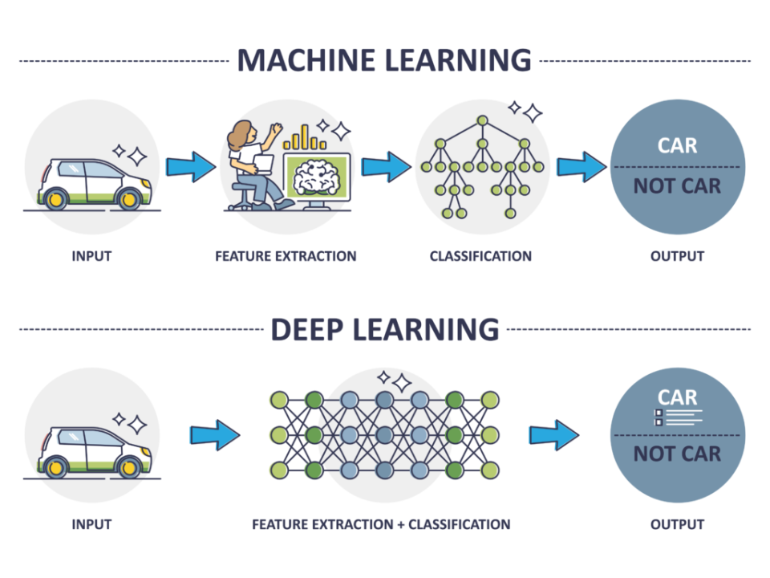

## Table of Contents

## What is deep learning and how does it differ from traditional machine learning?

Deep learning is a type of artificial intelligence that uses something called neural networks to learn from data. These neural networks are designed to mimic how the human brain works, with layers of interconnected nodes that process information. Deep learning is great at handling large amounts of data and can automatically find patterns and features in the data without needing people to tell it what to look for. This makes it really useful for things like recognizing images, understanding speech, and even playing games.

Traditional machine learning, on the other hand, relies on algorithms that are given specific instructions by humans on what to look for in the data. These algorithms can learn from the data, but they need more guidance from people to do so. For example, if you want a machine learning model to recognize cats in pictures, you would need to tell it what features of a cat to look for, like the shape of the ears or the length of the tail. Machine learning is good for tasks where the data is smaller and the patterns are easier to understand, but it might not be as good at handling very complex data or finding new patterns on its own.

In summary, deep learning is a more advanced form of machine learning that can handle more complex tasks and larger amounts of data, thanks to its ability to automatically learn and find patterns. Traditional machine learning, while still very useful, needs more human input to work well and is better suited for simpler tasks with clearer patterns.

## How can deep learning be applied to financial markets?

Deep learning can be used in financial markets to help predict stock prices and market trends. By using large amounts of historical data, deep learning models can find patterns that are hard for humans to see. For example, a deep learning model might look at past stock prices, trading volumes, and even news articles to guess where a stock's price might go next. This can help traders and investors make better decisions about when to buy or sell stocks.

Another way deep learning is used in finance is for risk management. Banks and other financial institutions use deep learning to predict how likely it is that a borrower will not pay back a loan. By looking at a person's credit history, income, and other factors, these models can help decide if it's safe to lend money to someone. This can help reduce the risk of losing money and make the financial system more stable.

Overall, deep learning is a powerful tool in the financial world because it can handle a lot of data and find complex patterns. This can lead to better predictions and smarter decisions, which can help people make more money and manage risk better.

## What are some common deep learning models used in finance?

In finance, one common deep learning model is the Recurrent Neural Network (RNN). RNNs are good at understanding sequences of data, like stock prices over time. They can remember past information and use it to make predictions about future prices. This makes them useful for trading and investing because they can help predict how a stock might move based on its history. A special type of RNN called Long Short-Term Memory (LSTM) is often used because it's even better at remembering long-term patterns in data.

Another popular model is the Convolutional Neural Network (CNN). While CNNs are most famous for image recognition, they can also be used in finance to analyze data from charts and graphs. They are good at picking out important features from complex data, which can help in tasks like predicting stock market trends or analyzing financial reports. By looking at patterns in stock charts, CNNs can help traders make better decisions about when to buy or sell.

Lastly, there are also models like the Autoencoder, which are used for tasks like fraud detection. Autoencoders can learn to compress and then reconstruct data, which helps them find unusual patterns that might be signs of fraud. By comparing the original data to the reconstructed version, these models can spot transactions that don't fit the normal pattern, helping banks and other financial institutions keep their systems safe.

## How does deep learning help in predicting stock prices?

Deep learning helps predict stock prices by looking at a lot of data from the past. It uses models like Recurrent Neural Networks (RNNs) to understand how stock prices change over time. These models can remember what happened before and use that information to guess what might happen next. For example, if a stock's price went up after certain news came out last time, the model might predict it will go up again if similar news comes out now. This can help traders and investors decide when to buy or sell stocks.

Another way deep learning helps is by finding patterns that are hard for people to see. It can look at not just stock prices, but also things like trading volumes, news articles, and even social media posts. By putting all this information together, deep learning models can find connections that might not be obvious. This can lead to better predictions about where a stock's price might go, helping people make smarter choices in the stock market.

## What role does deep learning play in algorithmic trading?

Deep learning plays a big role in algorithmic trading by helping to predict how stock prices will change. It uses special models like Recurrent Neural Networks (RNNs) to look at past stock prices and other data. These models can remember what happened before and use that to guess what might happen next. For example, if a stock's price went up after certain news came out last time, the model might predict it will go up again if similar news comes out now. This helps traders decide when to buy or sell stocks automatically, making trading faster and more efficient.

Deep learning also helps by finding patterns in data that are hard for people to see. It can look at not just stock prices, but also things like trading volumes, news articles, and even social media posts. By putting all this information together, deep learning models can find connections that might not be obvious. This can lead to better predictions about where a stock's price might go, helping traders make smarter choices. Overall, deep learning makes algorithmic trading more accurate and helps traders make more money.

## How can deep learning improve risk management in finance?

Deep learning can help with risk management in finance by looking at a lot of data to predict if someone might not pay back a loan. Banks use deep learning models to check a person's credit history, income, and other information. These models can find patterns that show if someone is likely to have trouble paying back money. By using this information, banks can decide if it's safe to lend money to someone. This helps them avoid losing money and makes the financial system more stable.

Another way deep learning helps with risk management is by spotting fraud. It uses models like Autoencoders to look at transactions and find ones that don't fit the normal pattern. For example, if someone suddenly starts spending a lot more money than usual, the model might flag it as possible fraud. By catching these unusual activities early, banks can stop fraud before it causes big problems. This keeps customers' money safe and helps the bank manage risk better.

## What are the challenges of implementing deep learning in financial institutions?

Implementing deep learning in financial institutions can be tough because it needs a lot of data. Deep learning models work best when they have a lot of information to learn from. But, getting this data can be hard because of rules about privacy and keeping information safe. Also, the data needs to be clean and ready to use, which takes a lot of time and work. If the data is not good, the models might make wrong predictions, which can be a big problem in finance where decisions need to be accurate.

Another challenge is that deep learning models can be hard to understand. These models often work like a "black box," meaning it's tough to see how they make their decisions. In finance, it's important to know why a model makes a certain prediction, especially for things like giving out loans or spotting fraud. If people can't understand how the model works, they might not trust it, and that can make it hard to use in real situations. Plus, these models need a lot of computer power to run, which can be expensive and take a lot of time to set up.

Overall, while deep learning can help with things like predicting stock prices and managing risk, there are big challenges to using it in financial institutions. It needs a lot of good data, the models can be hard to understand, and it takes a lot of computer power. But, if these challenges can be overcome, deep learning can be a powerful tool for making better decisions in finance.

## How does deep learning assist in fraud detection within the financial sector?

Deep learning helps catch fraud in the financial world by looking at a lot of data to find strange patterns. It uses special models like Autoencoders to check transactions and see if anything looks unusual. For example, if someone starts spending a lot more money than usual, the model might think it's fraud. By spotting these odd activities early, banks can stop fraud before it causes big problems. This keeps customers' money safe and helps the bank manage risk better.

Another way deep learning helps with fraud detection is by learning from past data. It can remember what kinds of activities were signs of fraud before and use that to guess if something is wrong now. This makes it good at finding new types of fraud that might not have been seen before. By using deep learning, banks can be more proactive in protecting their customers and keeping their systems safe.

## What are the ethical considerations of using deep learning in finance?

Using deep learning in finance raises some important ethical questions. One big worry is privacy. Deep learning models need a lot of data to work well, and this data often includes personal information about people. If this data is not kept safe, it could be used in harmful ways, like stealing someone's identity or making unfair decisions about them. So, it's important for financial institutions to protect people's data and use it in a way that respects their privacy.

Another ethical issue is fairness. Deep learning models can sometimes make decisions that are biased. This happens because the data they learn from might not represent everyone equally. For example, if a model is used to decide who gets a loan, it might unfairly say no to certain groups of people if the data it learned from had biases. It's important for banks and other financial institutions to check their models for bias and make sure they treat everyone fairly. This helps make sure that deep learning is used in a way that is good for everyone.

## How can deep learning be used to enhance customer service in banking?

Deep learning can help make customer service better in banks by understanding what customers want and need. It can use special models to look at what customers say in chats or on the phone. By doing this, deep learning can figure out what the customer is asking for and give quick, helpful answers. For example, if a customer asks about their account balance, the deep learning model can understand the question and give the right information fast. This makes customers happier because they don't have to wait long to get help.

Another way deep learning helps with customer service is by predicting what customers might need before they even ask. It can look at a customer's past actions, like what they've bought or how they've used their account, to guess what they might want next. For example, if a customer often asks about their credit card rewards, the bank can use deep learning to send them information about new rewards programs without them having to ask. This makes customers feel taken care of and can make them more likely to stay with the bank.

## What advanced techniques in deep learning are being researched for future financial applications?

One advanced technique being researched for future financial applications is called reinforcement learning. This is a type of deep learning where the model learns by trying different actions and seeing what works best. In finance, this could be used to make better trading strategies. The model would try different ways of buying and selling stocks and learn from the results. Over time, it would get better at making money. This could help traders make smarter decisions and make more profit.

Another technique is called transfer learning. This is where a deep learning model learns from one task and then uses that knowledge to do another task better. In finance, a model could learn to predict stock prices in one market and then use that knowledge to predict prices in another market. This can save time and make predictions more accurate. It's like learning to ride a bike and then using that skill to learn how to ride a motorcycle. Transfer learning could help financial institutions make better decisions faster.

## How do regulatory frameworks impact the use of deep learning in finance?

Regulatory frameworks play a big role in how deep learning is used in finance. These rules are made to keep the financial system safe and fair. They often require banks and other financial institutions to explain how they make decisions, especially when using advanced technology like deep learning. Since deep learning models can be hard to understand, this can be a challenge. Banks need to make sure their models follow the rules and can explain why they make certain choices. This helps protect customers and keeps the financial system trustworthy.

Another impact of regulatory frameworks is on data privacy and security. Deep learning needs a lot of data to work well, but rules about data privacy can limit what information banks can use. For example, laws like the General Data Protection Regulation (GDPR) in Europe set strict rules on how personal data can be used. Banks have to make sure they follow these rules when using deep learning, which can make it harder to gather and use the data they need. But, following these rules helps keep customers' information safe and builds trust in the financial system.

## What is the role of Deep Learning in Algorithmic Trading?

Algorithmic trading leverages sophisticated computer algorithms to streamline trading decisions by analyzing an array of market factors. Deep learning significantly augments this process by empowering these algorithms with the ability to learn and adapt from a continuous influx of market data. This learning capability enhances the precision of predictions and overall decision-making quality.

In the context of pattern recognition, Convolutional Neural Networks (CNNs) are frequently employed within algorithmic trading. These networks are adept at recognizing intricate patterns and structures in data due to their layered architecture, which applies convolutional operations to input data. The utilization of CNNs allows trading systems to efficiently identify and react to specific market signals that are indicative of favorable trading opportunities.

For time-series data, Recurrent Neural Networks (RNNs) are among the preferred models. Unlike traditional feedforward neural networks, RNNs incorporate loops within the network allowing information to persist. This feature is particularly beneficial for time-series forecasting in financial markets, as it enables the model to account for sequential dependencies and temporal patterns inherent in market data.

Consider the example of predicting stock price movements: by applying an RNN, where each input is a sequence of past stock prices, the model can predict future prices with higher accuracy by capturing dynamic temporal patterns. The mathematical representation for such an RNN can be given by:

$$
h_t = \sigma(W_{hh}h_{t-1} + W_{xh}x_t + b_h)
$$

$$
y_t = W_{hy}h_t + b_y
$$

where $h_t$ represents the hidden state at time $t$, $x_t$ is the input at time $t$, and $y_t$ is the output. The weights $W_{hh}$, $W_{xh}$, $W_{hy}$, and biases $b_h$, $b_y$ are learned during training.

To illustrate deep learning's impact on trading strategies, case studies have shown that firms using these methods experience a substantial improvement in their trading outcomes. Data-intensive strategies that leverage deep learning are capable of uncovering insights and correlations that traditional quantitative models might overlook, providing firms with a competitive edge in terms of reaction speed and decision accuracy. Such advancements in technology enable more systematic and profitable trading strategies, reflecting a major shift in the financial industry’s landscape.

## References & Further Reading

[1]: ["Deep Reinforcement Learning in Portfolio Management"](https://www.sciencedirect.com/science/article/pii/S095070512300655X) by Jiang, Z., Xu, X., & Liang, J. (2017).

[2]: ["Advances in Financial Machine Learning"](https://www.amazon.com/Advances-Financial-Machine-Learning-Marcos/dp/1119482089) by Marcos Lopez de Prado

[3]: Zhang, B., Zohren, S., & Roberts, S. (2019). ["Deep Learning for Portfolio Optimization"](https://arxiv.org/abs/2005.13665) 

[4]: ["Machine Learning for Asset Managers"](https://github.com/emoen/Machine-Learning-for-Asset-Managers) by Marcos Lopez de Prado

[5]: Heaton, J. B., Polson, N. G., & Witte, J. H. (2017). ["Deep Learning for Finance: Deep Portfolios"](https://arxiv.org/abs/1602.06561)

[6]: ["Algorithmic Trading and DMA: An introduction to direct access trading strategies"](https://www.amazon.com/Algorithmic-Trading-DMA-introduction-strategies/dp/0956399207) by Barry Johnson

[7]: ["The Elements of Statistical Learning: Data Mining, Inference, and Prediction"](https://link.springer.com/book/10.1007/978-0-387-84858-7) by Trevor Hastie, Robert Tibshirani, and Jerome Friedman