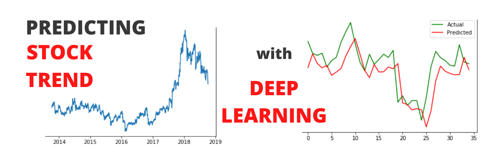

The rise of big data and computational capabilities has significantly enhanced the ability to predict market movements. Advances in hardware and software have enabled the collection, storage, and processing of vast amounts of financial data, which provides an unprecedented opportunity for analyzing market dynamics and making informed decisions. This transformation has paved the way for deep learning to become an essential component in algorithmic trading.

Deep learning, a subset of artificial intelligence, involves training neural networks with multiple layers to discern complex patterns and correlations within data. It has revolutionized multiple fields, including finance, due to its ability to autonomously learn and improve from vast datasets. With the capability to manage large volumes of data and perform complex computations efficiently, deep learning tools are now strategically employed in forecasting market trends, identifying trading opportunities, and minimizing risks. 



This article delves into the universe of deep learning applications for market prediction. It explores various models and techniques and discusses both opportunities and challenges in leveraging these advanced technologies for generating more accurate and effective trading strategies.

## Table of Contents

## Understanding Deep Learning

Deep learning represents a significant advancement in artificial intelligence, fundamentally designed to emulate the human brain's capability to process data and discern intricate patterns. This computational method employs structures known as neural networks, which consist of multiple layers to analyze and transform data. These networks are inspired by the human brain's neural networks, where neurons are interconnected, allowing for the transmission and transformation of data signals.

A neural network typically consists of three layers: input, hidden, and output layers. The input layer receives the initial data, which is then passed through one or more hidden layers, transforming and refining these inputs through a series of weights and biases. The output layer provides the final prediction or classification. This multilayered approach enables the network to capture complex patterns and relationships in data that linear algorithms might miss.

One of the primary advantages of deep learning resides in its ability to conduct end-to-end learning. This implies that a model can ingest raw data and independently learn hierarchies of features that are crucial for performing a given task, without explicit guidance on selecting which features might be relevant. This capacity for automated feature extraction significantly reduces the need for domain expertise in pre-processing data, allowing the model to discern the intrinsic properties and patterns of the data autonomously.

For instance, in image recognition tasks, instead of manually defining features such as edges or textures, a deep [neural network](/wiki/neural-network) can be trained on large datasets, progressively learning low-level features such as edges in the initial layers and more complex features like object parts in deeper layers. Similarly, in time-series prediction, a neural network might learn low-level temporal patterns and progress to understanding long-term dependencies.

The learning process in neural networks involves backpropagation, an algorithm used to adjust weights within the network. The aim is to minimize the difference between the predicted and actual outcomes, often quantified by a cost function such as mean squared error. Optimizers such as stochastic gradient descent (SGD) are then used to update the weights, ensuring the model eventually converges to an optimal solution that accurately maps inputs to the desired outcomes.

In essence, [deep learning](/wiki/deep-learning) transforms the paradigm of data processing by employing neural networks to model complex relationships and patterns, paving the way for advancements across various domains. Its proficiency in high-dimensional and non-linear data processing is pivotal, especially in areas requiring predictive analytics and pattern recognition.

## Market Prediction and Its Challenges

Market prediction, fundamental to financial analysis, involves using historical data to forecast future financial prices. Its goal is to identify price movements and trends to inform trading decisions. The use of quantitative models and algorithms is common in attempting to predict market behavior. 

However, several challenges complicate the task of market prediction. Key among these is data noise, which refers to the random fluctuations in historical data that do not necessarily indicate meaningful market patterns. This noise can obscure valuable signals, making it difficult for predictive models to distinguish between random variations and actual market trends.

Market [volatility](/wiki/volatility-trading-strategies) presents another significant challenge. Financial markets are inherently dynamic and influenced by numerous factors, including economic indicators, geopolitical events, and investor sentiment. This volatility can lead to rapid and unpredictable price changes, complicating efforts to make accurate predictions. Models must be robust enough to adapt to these fluctuations to maintain reliability.

The need for real-time processing further complicates market prediction. Financial markets operate continuously, and traders require timely information to capitalize on fleeting opportunities. Consequently, predictive models must process large volumes of data swiftly and efficiently. This necessitates high computational power and sophisticated algorithms capable of delivering predictions with minimal latency.

Overall, while market prediction is a critical component of [algorithmic trading](/wiki/algorithmic-trading), overcoming these challenges requires a combination of advanced modeling techniques and computational resources to improve accuracy and reliability.

## Deep Learning Models Used in Market Prediction

Deep learning models have become instrumental in enhancing market prediction accuracy, particularly through the use of specialized neural networks such as Long Short-Term Memory (LSTM) networks, Convolutional Neural Networks (CNNs), and Recurrent Neural Networks (RNNs).

Long Short-Term Memory (LSTM) networks are a unique type of recurrent neural network (RNN) designed to capture and remember long-term dependencies in data sequences, which is crucial for time-series market prediction. LSTMs address the vanishing gradient problem commonly associated with traditional RNNs by using special units called memory cells. Each memory cell contains three different gates (input, forget, and output gates) that regulate the flow of information, allowing the model to maintain information over extended periods. This capability is particularly beneficial in financial markets, where capturing temporal patterns from past data is essential for accurate forecasting.

Convolutional Neural Networks (CNNs), traditionally used in image recognition, have been adapted for market prediction by recognizing and interpreting patterns in time-series data. The core strength of CNNs lies in their ability to apply convolutional filters to local receptive fields, which enables them to capture spatial hierarchies in data. In the context of market prediction, CNNs can identify complex patterns and structures within financial data by treating temporal datasets as grids and detecting correlations across different timeframes. This adaptation involves leveraging one-dimensional convolutional layers that process sequential time-series data, highlighting relevant patterns that may indicate potential market movements.

Recurrent Neural Networks (RNNs) are designed to handle sequence prediction problems by utilizing their inherent feedback loops. These loops allow RNNs to maintain a contextual understanding of prior inputs while processing new information, which is critical for financial market data that is inherently sequential and dynamic. RNNs excel in modeling temporal dependencies where the order and timing of events are significant. Unlike standard neural networks, RNNs share parameters across all time steps, making them well-suited to capture the underlying temporal dynamics of complex datasets. Despite their strengths, traditional RNNs are prone to issues such as gradient vanishing, which have been effectively mitigated by LSTM networks, making LSTMs a preferred choice for sequential data modeling in market prediction.

Incorporating these deep learning models into algorithmic trading and market prediction frameworks enables the development of more robust and accurate predictive algorithms, with LSTM networks being particularly prominent for their ability to model time-dependent sequences effectively. Each model type brings unique advantages to the domain, illustrating the diverse capabilities of deep learning technologies in transforming financial market analytics.

## Applications in Algorithmic Trading

Deep learning models have become pivotal in the development and implementation of algorithmic trading strategies, particularly in high-frequency trading environments. These strategies leverage advanced predictive models to enhance portfolio management and optimize trading decisions by analyzing vast amounts of financial data to forecast market trends and price movements.

In high-frequency trading, where decisions need to be made in fractions of a second, deep learning models excel due to their ability to process and analyze time-series data swiftly and accurately. For instance, Long Short-Term Memory (LSTM) networks can be utilized to capture and predict temporal patterns in data, providing precise insights that aid in the execution of trading instructions in real-time.

An integral application of deep learning in algorithmic trading is the generation of predictive models for efficient portfolio management. These models employ various evaluation metrics such as Root Mean Square Error (RMSE) and Mean Absolute Percentage Error (MAPE) to ensure high prediction accuracy, subsequently guiding trading decisions. A Python implementation to demonstrate this might involve the use of libraries such as TensorFlow or PyTorch to develop and train neural networks using historical market data:

```python
import numpy as np
import pandas as pd
from keras.models import Sequential
from keras.layers import LSTM, Dense
from sklearn.preprocessing import MinMaxScaler

# Load and preprocess data
data = pd.read_csv('market_data.csv')
scaler = MinMaxScaler(feature_range=(0, 1))
scaled_data = scaler.fit_transform(data['Close'].values.reshape(-1, 1))

# Prepare data for LSTM
look_back = 60
X, y = [], []
for i in range(look_back, len(scaled_data)):
    X.append(scaled_data[i-look_back:i, 0])
    y.append(scaled_data[i, 0])

X, y = np.array(X), np.array(y)
X = np.reshape(X, (X.shape[0], X.shape[1], 1))

# Build LSTM model
model = Sequential()
model.add(LSTM(units=50, return_sequences=True, input_shape=(X.shape[1], 1)))
model.add(LSTM(units=50))
model.add(Dense(units=1))

model.compile(optimizer='adam', loss='mean_squared_error')
model.fit(X, y, epochs=10, batch_size=32)
```

Moreover, integrating [reinforcement learning](/wiki/reinforcement-learning) with deep learning models augments the decision-making process by tailoring actions based on predefined criteria and prediction accuracy. Reinforcement learning algorithms, like Q-learning, enable algorithmic traders to adopt strategies that learn from interactions with the market environment, continuously adapting and optimizing strategies for better trading outcomes.

This integration ensures that trading systems can dynamically respond to changes in market conditions while maintaining a focus on strategic investment goals. The convergence of predictive deep learning models with reinforcement learning techniques enhances overall trading performance by providing intelligent systems capable of self-improvement and incremental learning based on real-time data and market feedback. Overall, deep learning's evolution represents a significant advancement in algorithmic trading, transforming how financial markets are analyzed and navigated.

## Performance Evaluation and Optimization

In the application of deep learning to market prediction, the performance evaluation and optimization of models are pivotal to their success in practical scenarios. Evaluating the performance of deep learning models involves the use of multiple metrics to ensure a comprehensive understanding of their predictive capabilities. 

Root Mean Square Error (RMSE) is one of the most commonly used metrics due to its ability to measure the average magnitude of the errors between predicted and actual values. RMSE is mathematically represented as:

$$
\text{RMSE} = \sqrt{\frac{1}{n} \sum_{i=1}^{n} (\hat{y}_i - y_i)^2}
$$

where $\hat{y}_i$ is the predicted value, $y_i$ is the actual value, and $n$ is the number of observations. RMSE emphasizes larger errors by squaring the differences, making it useful for highlighting significant deviations.

Mean Absolute Percentage Error (MAPE) offers another perspective by calculating the accuracy as a percentage of error relative to the actual values. It is useful in understanding prediction errors in the context of the scale of the actual data. MAPE can be expressed as:

$$
\text{MAPE} = \frac{100\%}{n} \sum_{i=1}^{n} \left| \frac{\hat{y}_i - y_i}{y_i} \right|
$$

Directional accuracy, a non-traditional metric, evaluates how often the predicted changes in the market align with actual trends. This metric is particularly relevant in financial contexts where predicting the direction of movement is often more critical than the magnitude.

Optimization of deep learning models in market prediction entails techniques such as hyperparameter tuning, regularization, and ensemble methods. Hyperparameter tuning involves searching for the optimal set of parameters, such as learning rate and batch size, to improve model performance. This can be carried out using methods like grid search or more efficiently with random search and Bayesian optimization.

Regularization techniques, such as L1 or L2 regularization, help prevent overfitting by adding a penalty to the loss function based on the magnitude of model weights. Implementing dropout layers during training can also mitigate overfitting by randomly deactivating neurons, thus forcing the network to learn more robust features.

Ensemble methods, which combine predictions from multiple models, can enhance accuracy and reliability. Techniques like bagging and boosting are prevalent in market prediction scenarios, as they help in capturing a broader range of data patterns.

By employing these evaluation metrics and optimization techniques, deep learning models can be fine-tuned to produce more accurate and robust market predictions. The continuous development and application of these methodologies are essential in adapting to the challenges posed by dynamic financial markets.

## Challenges and Considerations

Deep learning has significantly influenced the field of market prediction, yet it is accompanied by various challenges and considerations that must be addressed to ensure effective model implementation and performance.

One major challenge is the substantial computational resources required for processing and training deep learning models. Deep learning models, particularly those involving large neural networks, demand powerful processing capabilities and substantial memory usage to manage the extensive data involved. The training process can be computationally intensive, often necessitating the use of specialized hardware such as Graphics Processing Units (GPUs) or Tensor Processing Units (TPUs) to decrease the time required for training. This need for high computational resources not only increases the cost but also the complexity of setting up and maintaining these systems.

Data quality and availability are additional critical factors for achieving robust model outcomes. The accuracy and reliability of a deep learning model are directly tied to the quality of the input data. Noisy or incomplete data can lead to inaccurate predictions, thereby undermining the overall efficacy of the model. It is essential to ensure that data is pre-processed and cleaned to remove inconsistencies and enhance the quality of inputs. Data availability is also paramount; in financial markets, timely access to vast amounts of historical and real-time data is necessary for training models that can accurately predict market trends and dynamics.

Ethical and regulatory considerations are integral to the deployment of deep learning models in market prediction. As algorithmic trading systems increasingly rely on automated decision-making processes, there arises a need to address issues of fairness, transparency, and accountability in model outcomes. Ethical concerns include the potential for algorithmic biases that could unfairly advantage or disadvantage certain market participants. Regulatory bodies have started to focus on the transparency of algorithms used in trading to prevent market manipulation and ensure a fair trading environment. Consequently, developers and firms must consider these factors when designing and implementing deep learning models to ensure compliance with existing regulations and ethical standards.

In conclusion, while deep learning offers significant potential for enhancing market prediction capabilities, the challenges of computational requirements, data quality and availability, and ethical and regulatory considerations must be carefully managed. Addressing these challenges is essential for optimizing deep learning models for reliable and impactful outcomes in algorithmic trading and market prediction.

## Conclusion

Incorporating deep learning into market prediction opens new avenues for enhancing the accuracy and efficiency of financial forecasts. This technological advancement leverages neural network architectures to process vast amounts of financial data, identifying patterns that are typically elusive to traditional statistical models. However, the successful deployment of deep learning models in market predictions necessitates careful attention to inherent challenges. 

High computational demands and the need for robust data infrastructure are primary considerations. Ensuring the availability of high-quality, real-time data is critical, as the accuracy of predictions is contingent on the relevancy and granularity of input data. Moreover, ethical and regulatory concerns must be addressed, particularly in algorithmic trading, where the potential impact on market stability can be significant.

Looking forward, ongoing advancements in [artificial intelligence](/wiki/ai-artificial-intelligence) and data processing are likely to enhance the sophistication of market prediction models. These developments hold the promise of yielding more precise and reliable trading strategies. Enhancements in hardware acceleration, like Graphics Processing Units (GPUs) and Tensor Processing Units (TPUs), will facilitate faster training times and greater model complexity. Furthermore, innovations in algorithms, such as reinforcement learning and unsupervised learning techniques, are expected to refine predictive capabilities further. Integrating these technological strides will be instrumental in advancing the field of algorithmic trading, offering substantial implications for financial markets globally.

## References & Further Reading

[1]: Goodfellow, I., Bengio, Y., & Courville, A. (2016). ["Deep Learning"](https://www.deeplearningbook.org/). MIT Press.

[2]: Hochreiter, S., Schmidhuber, J. (1997). ["Long Short-Term Memory"](https://www.researchgate.net/publication/13853244_Long_Short-term_Memory). Neural Computation, 9(8), 1735-1780.

[3]: Lopez de Prado, M. (2018). ["Advances in Financial Machine Learning"](https://www.amazon.com/Advances-Financial-Machine-Learning-Marcos/dp/1119482089). Wiley.

[4]: Jansen, S. (2020). ["Machine Learning for Algorithmic Trading"](https://github.com/stefan-jansen/machine-learning-for-trading). Packt Publishing.

[5]: Chan, E. P. (2009). ["Quantitative Trading: How to Build Your Own Algorithmic Trading Business"](https://github.com/egorpe/EPChan-QuantitativeTrading/blob/master/example7_6.m). Wiley.

[6]: Silver, D., Schrittwieser, J., Simonyan, K., Antonoglou, I., Huang, A., Guez, A., ... & Hassabis, D. (2017). ["Mastering the game of Go without human knowledge."](https://pubmed.ncbi.nlm.nih.gov/29052630/) Nature, 550(7676), 354-359.

[7]: Sutton, R. S., & Barto, A. G. (2018). ["Reinforcement Learning: An Introduction"](https://web.stanford.edu/class/psych209/Readings/SuttonBartoIPRLBook2ndEd.pdf). MIT Press.