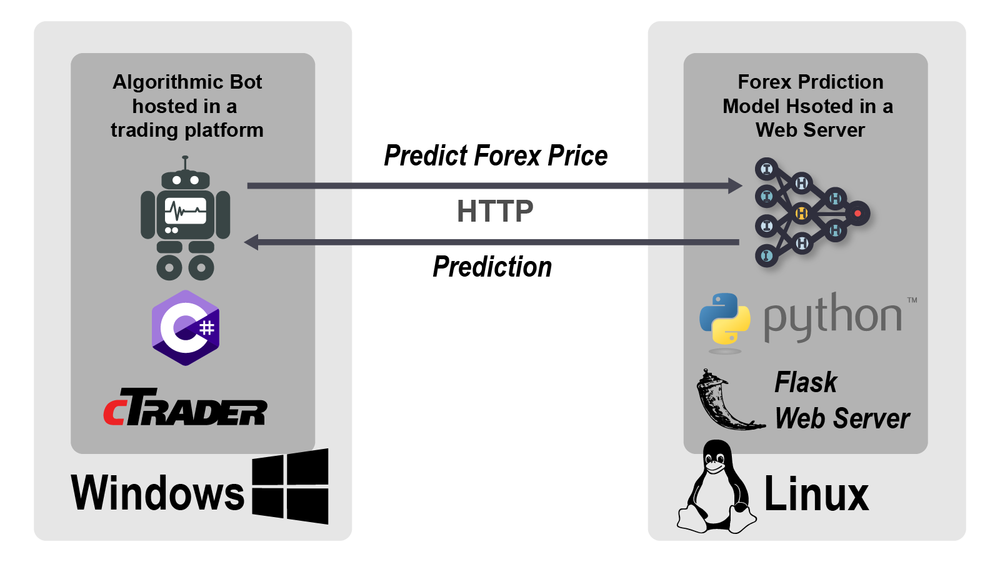

## Table of Contents

## What is deep learning and how does it differ from traditional machine learning?

Deep learning is a type of artificial intelligence that uses neural networks with many layers to learn and make decisions on its own. These layers help the computer understand complex patterns in data, like recognizing objects in a picture or understanding human speech. The more layers there are, the "deeper" the learning becomes, which is why it's called deep learning. It's like teaching a computer to think more like a human by showing it lots of examples and letting it figure out the rules by itself.

Traditional machine learning, on the other hand, uses simpler methods to learn from data. Instead of using many layers, it often relies on algorithms that a human programmer designs. These algorithms look at data and find patterns based on the rules the programmer set. For example, a traditional machine learning program might be used to predict house prices based on factors like size and location, using a formula created by a person. The main difference is that traditional machine learning needs more human input to set up the rules, while deep learning figures out the rules on its own through its layers.

## How can deep learning be applied to financial trading?

Deep learning can help with financial trading by looking at lots of data, like stock prices and news, to find patterns that might be hard for people to see. For example, a deep learning model can learn from past stock prices to predict what might happen next. It does this by using many layers to understand complex relationships in the data. Traders can then use these predictions to decide when to buy or sell stocks, hoping to make more money.

Another way [deep learning](/wiki/deep-learning) is used in trading is to analyze news and social media. By reading lots of text, deep learning models can figure out if people are feeling positive or negative about a company. This can affect stock prices, so knowing what people think can help traders make better decisions. For instance, if a deep learning model sees a lot of negative news about a company, it might suggest selling that company's stock before the price drops.

## What are the basic components of a neural network used in trading?

A [neural network](/wiki/neural-network) used in trading has a few key parts that work together. The first part is the input layer, which takes in all the data like stock prices, news, or other information that might affect trading. This data is then passed on to the hidden layers, which are the heart of the neural network. These layers are made up of many small units called neurons, and they figure out patterns and relationships in the data. The more hidden layers there are, the more complex patterns the network can understand.

The next important part is the output layer, which gives the final result of what the network has learned. For trading, this could be a prediction about whether a stock price will go up or down. To make these predictions better, the network uses something called weights, which are like knobs that can be adjusted to fine-tune how the network processes the data. During training, the network looks at lots of past data and adjusts these weights to make more accurate predictions. This process of adjusting weights to improve performance is called training, and it's what makes the neural network useful for trading decisions.

## What types of data are commonly used in deep learning models for trading?

In deep learning models for trading, one common type of data is historical price data. This includes things like the opening and closing prices of stocks, the highest and lowest prices each day, and the [volume](/wiki/volume-trading-strategy) of stocks traded. By looking at this data, a deep learning model can spot patterns and trends over time, helping it predict what might happen to stock prices in the future. For example, the model might notice that certain stocks go up after a big news event, and use that to make trading decisions.

Another type of data used is news and social media. Deep learning models can read and understand text from news articles, tweets, and other online sources to see what people are saying about a company or the market. This can help the model figure out if people feel good or bad about a stock, which can affect its price. For instance, if there's a lot of negative news about a company, the model might predict that the stock price will drop, and suggest selling it before that happens.

Some models also use other types of data like economic indicators, company financial reports, and even satellite images of things like parking lots to estimate how busy a company might be. All this different data helps the deep learning model get a fuller picture of what's going on in the market, making its predictions more accurate and useful for traders.

## How do you prepare and preprocess financial data for deep learning?

To prepare financial data for deep learning, you first need to gather all the information you want to use, like stock prices, news articles, and other data. Once you have this data, you need to clean it up. This means checking for any missing or wrong information and fixing it. For example, if some stock prices are missing, you might fill them in with the last known price or an average of nearby prices. You also need to make sure all the data is in the same format, so it's easy for the computer to understand. This might mean changing dates to a standard form or turning text into numbers that the model can work with.

After cleaning the data, you need to preprocess it to make it ready for the deep learning model. One important step is normalization, which means making all the numbers in the data fit within a certain range, usually between 0 and 1. This helps the model learn better because it treats all the data equally. Another step is feature engineering, where you create new pieces of data from the existing ones. For example, you might calculate the daily return of a stock by comparing its closing price to the opening price. You also need to split the data into training, validation, and test sets. The training set is used to teach the model, the validation set helps you check how well it's learning, and the test set is used at the end to see how good the model really is. By doing all these steps, you make sure the financial data is ready for the deep learning model to use and learn from.

## What are some common deep learning architectures used in trading, such as CNNs and RNNs?

In trading, one common deep learning architecture is the Convolutional Neural Network (CNN). CNNs are good at understanding patterns in data that has a grid-like structure, like images. But they can also be used with financial data, especially when you want to look at patterns over time. For example, a CNN can look at stock price charts and find important features that might predict future price movements. The way CNNs work is by using layers that slide over the data and pick out important parts, kind of like how a person might look at a chart and see trends. This makes them useful for traders who want to understand and predict stock prices based on historical data.

Another popular architecture is the Recurrent Neural Network (RNN), which is great for handling data that comes in sequences, like time series data in trading. RNNs can remember past information and use it to make predictions about the future. This is really helpful in trading because stock prices often depend on what happened before. A special type of RNN called Long Short-Term Memory (LSTM) is often used because it can remember information over longer periods of time, which is important for understanding long-term trends in the market. By using RNNs or LSTMs, traders can build models that learn from the sequence of stock prices and other financial data to make better trading decisions.

## How can deep learning models help in predicting stock prices or market trends?

Deep learning models can help predict stock prices or market trends by looking at lots of data and finding patterns that might be hard for people to see. These models use many layers to understand complex relationships in the data, like how stock prices move over time or how news affects the market. For example, a deep learning model can look at past stock prices and learn what usually happens after certain events, like a big company announcement or a change in the economy. By recognizing these patterns, the model can make predictions about what might happen next, helping traders decide when to buy or sell stocks.

Another way deep learning models help is by analyzing news and social media. These models can read lots of text and figure out if people feel good or bad about a company or the market. This is important because people's feelings can affect stock prices. For instance, if there's a lot of positive news about a company, the model might predict that the stock price will go up, suggesting it's a good time to buy. By combining different types of data, like stock prices and news, deep learning models can give traders a better idea of what might happen in the market, helping them make smarter trading decisions.

## What are the challenges and limitations of using deep learning in trading?

Using deep learning in trading can be tricky because it needs a lot of data to work well. If there isn't enough data, the model might not be able to learn all the important patterns and could make bad predictions. Also, financial markets can be unpredictable, and past data might not always help predict the future. This means the model might learn patterns that don't work anymore, leading to losses. Another challenge is that deep learning models can be like black boxes, meaning it's hard to understand why they make certain predictions. This can be a problem for traders who need to explain their decisions to others or follow strict rules.

Another limitation is that deep learning models can take a lot of time and computer power to train. This can be expensive and might not be worth it if the predictions aren't much better than simpler methods. Plus, markets can change quickly, and it can be hard to keep the model up to date with new data. If the model isn't updated regularly, it might miss out on new patterns and make less accurate predictions. Overall, while deep learning can be a powerful tool for trading, it comes with challenges that need to be carefully managed to be effective.

## How can one evaluate the performance of a deep learning trading model?

To evaluate the performance of a deep learning trading model, you can look at how well it predicts stock prices or market trends. One way to do this is by using metrics like accuracy, which tells you how often the model's predictions are correct. Another important metric is the profit it makes. You can test the model on past data that it hasn't seen before to see if it makes good trading decisions and if those decisions lead to more money. This is called [backtesting](/wiki/backtesting). By comparing the model's performance to simpler methods or even to just buying and holding stocks, you can see if the deep learning model is really better.

Another way to evaluate the model is by looking at how it handles different situations. For example, you can check if it works well during times when the market is going up or down, or if it can adapt to new events like big news or changes in the economy. It's also important to see if the model is overfitted, which means it works well on the data it was trained on but not on new data. You can use a separate set of data, called a validation set, to check for overfitting. By looking at all these things, you can get a good idea of how reliable and useful the deep learning trading model really is.

## What advanced techniques can be used to improve the accuracy of deep learning models in trading?

One advanced technique to improve the accuracy of deep learning models in trading is called ensemble learning. This is when you use several different models together to make predictions. Instead of relying on just one model, you can combine the predictions from many models to get a more accurate result. It's like asking a group of experts for their opinions and then making a decision based on what most of them think. By using ensemble learning, you can reduce the chance of making a bad prediction because the mistakes of one model can be balanced out by the others.

Another technique is transfer learning, which means using a model that was already trained on one type of data to help with another type of data. For example, you might start with a model that's good at understanding news articles and then fine-tune it to predict stock prices. This can save time and make the model more accurate because it already knows a lot about the data. Transfer learning is especially helpful in trading because it can help the model learn from different kinds of information, like news, social media, and financial reports, all at once.

A third technique is using [reinforcement learning](/wiki/reinforcement-learning), where the model learns by trying different trading strategies and getting feedback on how well they work. This is like playing a game where the model tries to make the most money possible. Over time, the model figures out the best ways to trade by learning from its successes and failures. Reinforcement learning can help the model adapt to changing market conditions and improve its accuracy by constantly learning and updating its strategies.

## How does reinforcement learning integrate with deep learning for algorithmic trading?

Reinforcement learning works with deep learning in [algorithmic trading](/wiki/algorithmic-trading) by letting the model learn the best trading strategies through trial and error. In this setup, the deep learning model acts like a trader, making decisions about when to buy or sell stocks. It gets feedback from the market, which tells it if its decisions were good or bad. Over time, the model uses this feedback to adjust its strategies, trying to make more money. The deep learning part helps the model understand complex patterns in the market data, while the reinforcement learning part helps it figure out the best actions to take based on those patterns.

This combination is powerful because it allows the model to keep learning and improving even as the market changes. For example, if a new event like a big company announcement affects the market, the model can quickly learn how to react to it. By using deep learning to understand the data and reinforcement learning to make decisions, the model can adapt to new situations and find the best ways to trade. This makes it a smart tool for traders who want to make better decisions and hopefully earn more money.

## What are the ethical considerations and regulatory issues surrounding the use of deep learning in trading?

Using deep learning in trading brings up some important ethical questions. One big issue is fairness. If only a few people or companies have access to these powerful tools, they might have an unfair advantage over others in the market. This could make the market less fair for everyone. Another concern is transparency. Deep learning models can be hard to understand, like a black box. Traders and regulators might not know why the model makes certain decisions, which can be a problem if the model makes bad trades or if people need to explain their actions.

There are also regulatory issues to think about. Governments and financial watchdogs want to make sure that markets are safe and fair. They might create rules about how deep learning can be used in trading. For example, there could be rules about how much data traders can use or how they need to explain their trading decisions. These rules are important to stop people from using deep learning to do things like manipulate the market or cheat other traders. Balancing the power of deep learning with the need for fairness and transparency is a big challenge for everyone involved in trading.

## References & Further Reading

[1]: ["Deep Learning for Finance: Deep Portfolios"](https://onlinelibrary.wiley.com/doi/abs/10.1002/asmb.2209) by L. Dixon, Y. Klabjan, J.H. Bang, Applied Artificial Intelligence.

[2]: ["Advances in Financial Machine Learning"](https://www.amazon.com/Advances-Financial-Machine-Learning-Marcos/dp/1119482089) by Marcos Lopez de Prado

[3]: ["Machine Learning for Algorithmic Trading: Predictive models to extract signals from market and alternative data for systematic trading strategies using Python"](https://www.amazon.com/Machine-Learning-Algorithmic-Trading-alternative/dp/1839217715) by Stefan Jansen

[4]: Heaton, J.B., Polson, N.G., & Witte, J.H. (2017). ["Deep Learning in Finance"](https://arxiv.org/abs/1602.06561). arXiv preprint arXiv:1602.06561.

[5]: ["Algorithmic Trading: Winning Strategies and Their Rationale"](https://www.amazon.com/Algorithmic-Trading-Winning-Strategies-Rationale/dp/1118460146) by Ernie Chan