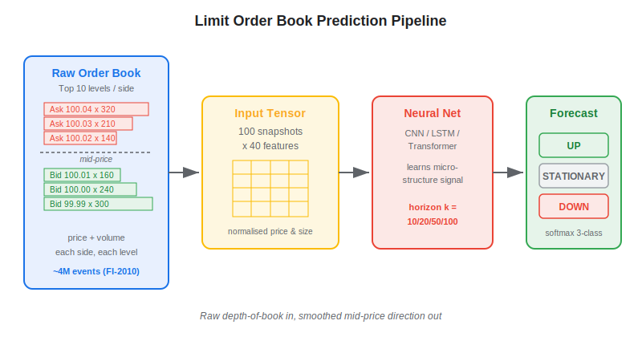
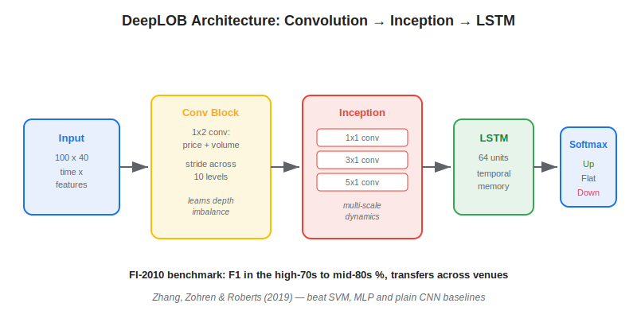
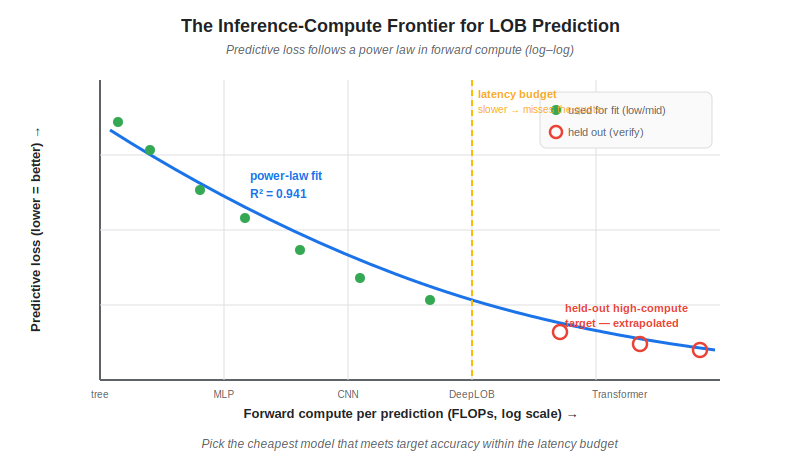

**Deep learning for limit order book prediction** is the use of neural networks — convolutional, recurrent, and transformer architectures — to forecast short-horizon price movements directly from the raw bid and ask levels of an exchange's order book. Instead of hand-crafting features like spread, imbalance, or microprice, these models ingest the full depth-of-book snapshot and learn the patterns that precede an up-tick, down-tick, or stationary mid-price. The approach gained traction with the DeepLOB model in 2019 and the public FI-2010 benchmark, and it remains one of the most active intersections of machine learning and market microstructure. This article covers what the task is, how the leading architectures work, how they compare, and the latest research on the compute-versus-accuracy trade-off.

## Table of Contents

## What Is Limit Order Book Prediction?

A **limit order book** (LOB) is the real-time record of all resting buy and sell limit orders for an instrument, organised into discrete price levels. Each level reports a price and the aggregated volume waiting there. The task of LOB prediction is to take a window of recent book states — typically the top 10 levels on each side — and predict the direction of the next mid-price move over a fixed horizon measured in events (e.g., the next 10, 20, 50, or 100 order-book updates). Because the mid-price is a noisy, discrete process, the problem is almost always framed as a three-class classification: the price goes up, stays flat, or goes down.

The reference dataset for this task is **FI-2010**, released by Ntakaris et al. (2018) — the first public LOB benchmark for machine learning. It contains roughly 4 million limit-order events from five Nasdaq Nordic (Helsinki) stocks over 10 trading days, with 10 price levels per side and 144 derived features. FI-2010 standardised the labelling scheme that nearly every later paper adopts, which makes it the de-facto leaderboard for the field. The connection to broader microstructure work — [Kyle's lambda](https://paperswithbacktest.com/wiki/kyles-lambda), order-flow imbalance, and [tick data](https://paperswithbacktest.com/wiki/tick-data) handling — is direct: deep models are simply learning the price-formation signal that microstructure theory describes analytically.

## How Deep Learning Models the Order Book

The raw input is a tensor. For the top 10 levels, each book snapshot has 40 values — ask price, ask size, bid price, and bid size at each level — and a model typically stacks the last 100 snapshots, producing a 100×40 input window. Volumes and prices are normalised (z-score or decimal-precision scaling) so the network sees relative structure rather than absolute price.

The label uses smoothed mid-price means to suppress micro-noise. With mid-price $p_t = (p^{ask}_{t,1} + p^{bid}_{t,1})/2$, define a backward and forward mean over horizon $k$:

$$ m_-(t) = \frac{1}{k}\sum_{i=0}^{k-1} p_{t-i}, \qquad m_+(t) = \frac{1}{k}\sum_{i=1}^{k} p_{t+i}, \qquad \ell_t = \frac{m_+(t) - m_-(t)}{m_-(t)} $$

The sample is labelled *up* if $\ell_t > \alpha$, *down* if $\ell_t < -\alpha$, and *stationary* otherwise, where the threshold $\alpha$ controls class balance.

The seminal architecture is **DeepLOB** (Zhang, Zohren and Roberts, 2019). It processes the input in three stages:

- **Convolutional block** — A first 1×2 convolution combines each price with its paired volume; subsequent convolutions stride across the 10 levels, so the network builds features that mix bid/ask depth without being told what "imbalance" means.
- **Inception module** — Parallel convolutional paths with different kernel sizes capture both fast and slow dynamics, concatenated into a single feature map (the same idea behind GoogLeNet, adapted to order-book time series).
- **LSTM head** — A recurrent layer (64 units) models the temporal dependence across the 100-step window, followed by a softmax over the three classes.

On FI-2010, DeepLOB reported F1 scores in the high-70s to mid-80s percent depending on the horizon, beating support-vector machines, multilayer perceptrons, and plain CNNs by a wide margin. Crucially, the authors showed it generalised: a model trained on Nordic stocks transferred to London Stock Exchange instruments it had never seen — evidence the network learns a universal microstructure signal rather than memorising one venue.

## DeepLOB vs Transformers vs Simple MLPs

DeepLOB's success triggered a wave of architectures. **TransLOB** (Wallbridge, 2020) replaced the recurrent head with self-attention, arguing that attention captures long-range dependencies in the book more cleanly than an LSTM. More recently, the **TLOB** family (Briola, Bartolucci and Aste, 2025) introduced a dual-attention transformer that attends over both the temporal and the feature axes — and, surprisingly, paired it with **MLPLOB**, a pure multilayer-perceptron baseline that is far simpler yet competitive.

| Model | Year | Core mechanism | Strength | Cost |
|---|---|---|---|---|
| DeepLOB | 2019 | CNN + Inception + LSTM | Strong baseline, transfers across venues | Moderate |
| TransLOB | 2020 | Convolution + self-attention | Long-range dependencies | Higher |
| TLOB | 2025 | Dual (time + feature) attention | State-of-the-art accuracy | High |
| MLPLOB | 2025 | Plain MLP | Cheap, surprisingly strong | Low |

The pattern mirrors the broader [neural-network landscape in quantitative trading](https://paperswithbacktest.com/wiki/how-are-neural-networks-used-in-quantitative-trading): more elaborate architectures buy accuracy, but a well-tuned simple model often closes most of the gap at a fraction of the compute. That trade-off is exactly what the newest research tries to formalise.

## The Inference-Compute Frontier

A 2026 study, *The Inference-Compute Frontier and a Latency-Efficient Architecture for Limit Order Book Prediction*, asks whether LOB models obey a scaling law like the ones seen in large language models. Sweeping architectures from small decision trees to deep neural LOB networks on FI-2010, the authors find that predictive loss versus structural forward compute (the work a model does per prediction) is well described by a **power law**. A fit to the low- and mid-compute frontier — with the MLPLOB family held out — extrapolated across several orders of magnitude and still hit $R^2 = 0.941$ on the excluded high-compute target.

The practical takeaway is sharper than the academic one. In live trading, the model runs in the inference loop on every book update, so latency is a hard constraint: a model that is 2% more accurate but 10× slower can be useless if it misses the quote it was predicting. A frontier curve lets a quant pick the cheapest architecture that reaches a target accuracy, rather than blindly chasing the largest network — the same discipline that governs any latency-sensitive [HFT limit-order-book system](https://paperswithbacktest.com/wiki/high-frequency-trading-ii-limit-order-book).

## Practical Considerations in Algo Trading

A high classification F1 does not equal a profitable strategy. Several realities separate the benchmark from the book:

- **Horizon and tradability.** Predicting the next 10 events sounds precise, but 10 updates can elapse in milliseconds on a liquid name. The signal is only tradable if your execution path is fast enough to act before the move completes — otherwise you are forecasting a price you can no longer trade at.
- **Costs dominate at short horizons.** The predicted move often lives inside the [bid-ask spread](https://paperswithbacktest.com/wiki/bid-ask-spread). After crossing the spread and paying fees, a 75%-accurate up/down call can still lose money. Net Sharpe, not classification accuracy, is the only honest metric, and realistic backtests must model queue position and partial fills.
- **Label leakage and overlap.** The smoothing window peeks forward by $k$ events, so naive train/test splits leak information. Use strictly chronological, gap-separated splits and walk-forward evaluation.
- **Stationarity.** Microstructure regimes shift with volatility, tick-size changes, and venue fragmentation. A model trained in a calm quarter degrades when spreads widen, which is why these signals pair naturally with [reinforcement learning for trade execution](https://paperswithbacktest.com/wiki/reinforcement-learning-trade-execution) rather than standalone directional bets.
- **Data volume.** Training a DeepLOB-class model needs millions of labelled events per instrument; storing and replaying full depth-of-book feeds is an infrastructure project in itself, closely tied to order-flow analysis.

## Conclusion

Deep learning has turned the limit order book from a hand-engineered feature source into a raw signal that convolutional, recurrent, and attention-based networks can read end-to-end. DeepLOB established the template, transformers pushed accuracy, and the inference-compute frontier now gives practitioners a principled way to balance predictive power against the latency budget that ultimately decides whether a forecast is tradable. As scaling-law thinking spreads from language models into microstructure, expect the next advances to come less from bigger networks and more from architectures that sit precisely on the accuracy-per-microsecond frontier.

## References & Further Reading

[1]: [DeepLOB: Deep Convolutional Neural Networks for Limit Order Books (Zhang, Zohren, Roberts, 2019)](https://arxiv.org/abs/1808.03668)
[2]: [Benchmark Dataset for Mid-Price Forecasting of Limit Order Book Data (FI-2010, Ntakaris et al., 2018)](https://arxiv.org/abs/1705.03233)
[3]: [The Inference-Compute Frontier and a Latency-Efficient Architecture for Limit Order Book Prediction (2026)](https://arxiv.org/abs/2606.25986)
[4]: [TLOB: A Transformer Model with Dual Attention for Price Trend Prediction with Limit Order Book Data (Briola, Bartolucci, Aste, 2025)](https://arxiv.org/abs/2502.15757)
[5]: [Transformers for Limit Order Books (TransLOB, Wallbridge, 2020)](https://arxiv.org/abs/2003.00130)
