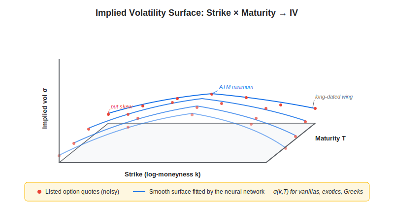
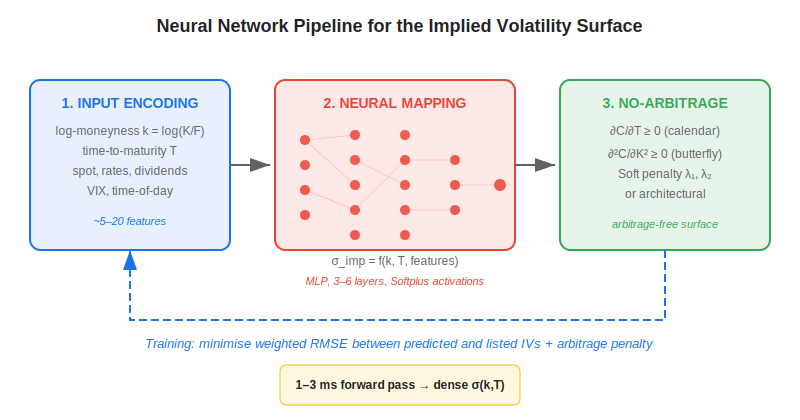
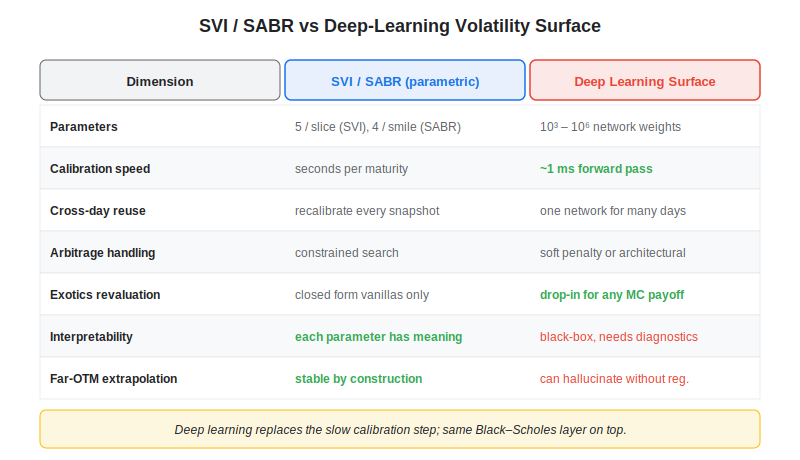

**Deep learning for the volatility surface** is a family of techniques that uses neural networks to model, smooth, calibrate, or forecast the implied-volatility (IV) surface — the two-dimensional map of option IVs across strike and maturity. Unlike classical parametric fits such as SVI or SABR, a neural surface can absorb hundreds of quotes per asset, enforce no-arbitrage constraints through architectural design, and run end-to-end from listed prices to a clean, dense surface in milliseconds. For algorithmic traders this matters because almost every options strategy — dispersion, vol arbitrage, gamma scalping, variance swaps — starts from a trustworthy surface. This article explains what the surface is, how deep learning learns it, how it compares with SVI/SABR, and what it actually delivers in live trading.

## Table of Contents

## What Is the Implied Volatility Surface?

The **implied volatility surface** is the function $\sigma_{\text{imp}}(K, T)$ that returns the Black–Scholes IV implied by the listed price of a European option with strike $K$ and maturity $T$. In practice you observe a noisy point cloud of quotes — often 200 to 2,000 points for a major index — and you need a smooth, arbitrage-free surface to price exotics, compute Greeks, build vol indices, and run risk scenarios. Two structural features make the problem hard: the surface exhibits a strike-skew (deep out-of-the-money puts trade richer than calls), and term structure can flip sign across regimes. Classical models such as Stochastic Volatility Inspired (SVI) by Gatheral (2004) capture skew with five parameters per slice; Heston and SABR model dynamics but calibrate slowly.

Deep learning enters as a function approximator. Given a dataset of $(K, T, \sigma_{\text{imp}})$ triples — possibly enriched with spot, rates, dividends, and time-of-day — a neural network learns a smooth mapping that interpolates inside the listed grid and extrapolates carefully outside it. Architectures range from small fully-connected MLPs (Ackerer et al., 2020) to convolutional networks that process the surface as an image (Funahashi, 2024) to transformer encoders that ingest the full quote book.

## How It Works

The dominant pattern follows three steps: input encoding, neural mapping, and constraint enforcement.

**Input encoding.** The two axes are usually transformed to log-moneyness $k = \log(K/F)$ and time-to-maturity $T$. Working in log-moneyness centres the surface around the forward and removes the leading dependence on spot. Some authors add the forward $F$, dividend yield, or VIX as global features so a single network can price across many days.

**Neural mapping.** A small MLP — three to six hidden layers, 32 to 128 units, ELU or Softplus activations — maps $(k, T, \text{features}) \mapsto \sigma_{\text{imp}}$. Softplus is preferred over ReLU because the surface must be at least $C^2$ for finite gammas. The network is trained on the squared error between the predicted IV (or, equivalently, the predicted call price under Black–Scholes) and the listed value, optionally weighted by bid–ask spread to down-weight illiquid quotes.

**Constraint enforcement.** A raw neural fit can violate no-arbitrage: butterfly arbitrage (negative implied density), calendar arbitrage (negative forward variance), or non-monotone digitals. Ackerer, Tagasovska and Vatter (2020) enforce both constraints by adding penalty terms:

$$\mathcal{L}_{\text{arb}} = \lambda_1 \sum_i \max(0, -\partial_T C_i)^2 + \lambda_2 \sum_i \max(0, -\partial^2_{KK} C_i)^2$$

where $C_i$ is the call price implied by the network at the i-th grid point. Modern variants encode the constraints directly into the architecture — for example by parameterising the surface as a monotone function of $T$ — which removes the need for tuning $\lambda_1, \lambda_2$.

For an end-to-end picture of how this interacts with broader option strategy work, see PWB's overview of [neural networks in quantitative trading](https://paperswithbacktest.com/wiki/how-are-neural-networks-used-in-quantitative-trading).

## Deep Learning vs Classical SVI/SABR

Both approaches produce smooth surfaces — the differences are about flexibility, speed, and where each shines.

| Dimension | SVI / SABR | Deep Learning Surface |
|---|---|---|
| Parameters | 5 per slice (SVI) or 4 per smile (SABR) | $10^3$ – $10^6$ across the network |
| Calibration time | Seconds per maturity | Milliseconds (one forward pass) once trained |
| Cross-day reuse | Re-calibrate every snapshot | One network for many days via global features |
| Arbitrage handling | Constrained search | Soft penalty or architectural |
| Exotics pricing | Closed form only for vanillas | Drop-in for Monte Carlo of any payoff |
| Interpretability | Each parameter has meaning | Black-box, requires diagnostic plots |
| Out-of-sample IV at far-OTM | Extrapolates by construction | Can hallucinate without regularisation |

In a representative benchmark on S&P 500 options, Horvath, Muguruza and Tomas (2021) report a 100× speed-up versus traditional rough-volatility calibration with mean IV errors around 5–10 basis points on the calibration set. Ackerer et al. (2020) achieve sub-basis-point RMSE on dense surfaces by combining a small MLP with explicit no-arbitrage penalties. Itkin (2019) cautions that aggressive architectures can match prices yet still violate the implied density positivity — a reminder that fit quality and tradeable quality are not the same.

The honest takeaway is that deep learning replaces the slow piece of the classical pipeline (calibration) while keeping the same vanilla model on top. If you do not need exotics or fast revaluation, SVI per-slice plus a Tikhonov smoother across maturities will get you 95% of the way at a fraction of the engineering cost. If you do — for instance to mark a book of barrier options or run intraday vega-hedged baskets — neural surfaces become a real lever.

## Practical Considerations in Algo Trading

**Data needs.** A robust network is typically trained on 6–24 months of end-of-day chains for the underlying universe, then optionally fine-tuned per asset. For an SPX-only model that is roughly 1.5 million $(k, T, \sigma)$ points; for a 500-stock equity book it climbs to 50–200 million.

**Latency and revaluation.** Once trained, a forward pass over a full surface (say 60 strikes × 12 maturities) runs in 1–3 ms on a CPU and well under 1 ms on a GPU. That makes neural surfaces tractable inside intraday risk engines, but still too slow for sub-millisecond market making — there, lookup tables filled by the neural model are the standard solution.

**Greeks.** Autodiff gives delta, vega, and vanna at machine precision through the network. Gamma requires architectural smoothness (Softplus, not ReLU) and a $C^2$ output transform. Practitioners often differentiate the call price rather than IV to keep the chain rule clean.

**Capacity and slippage.** Deep-learning surfaces *do not* generate alpha by themselves. They feed strategies — [dispersion trading](https://paperswithbacktest.com/wiki/dispersion-trading), [gamma scalping](https://paperswithbacktest.com/wiki/gamma-scalping), variance-swap replication — and the realistic Sharpe of those strategies sits in the 0.5–1.5 range after fees, with capacity dominated by the underlying option book, not the surface model. Backtests that ignore the bid-ask spread or assume mid-fills will overstate performance by 30–60%; the same warnings apply as in PWB's note on [backtesting pitfalls](https://paperswithbacktest.com/wiki/backtesting-pitfalls-overfitting).

**Stability.** Surfaces evolve smoothly day-to-day, but stress events (earnings, FOMC, geopolitical shocks) can re-shape the skew within minutes. A network trained only on calm periods will under-price tail risk. Curriculum training that over-weights high-VIX days is the simple, effective fix.

## Conclusion

Deep learning for the volatility surface is now a mature toolset: small neural networks with no-arbitrage penalties match or beat SVI on fit quality, calibrate orders of magnitude faster, and make exotic revaluation cheap enough to put inside an intraday loop. They are not a replacement for Black–Scholes — they are a faster, denser fit *on top of* it — and their alpha contribution is indirect, coming from cleaner Greeks and faster revaluation rather than from forecasting. As [foundation models](https://paperswithbacktest.com/wiki/foundation-models-financial-time-series) move into derivatives data, the next step is likely a single pre-trained surface model spanning equities, FX, and commodities, fine-tuned per asset class.

## References & Further Reading

[1]: [Deep Learning Volatility — Horvath, Muguruza, Tomas (2021)](https://arxiv.org/abs/1901.09647)
[2]: [Deep Smoothing of the Implied Volatility Surface — Ackerer, Tagasovska, Vatter (2020)](https://arxiv.org/abs/1906.05065)
[3]: [Deep Learning Calibration of Option Pricing Models: Some Pitfalls and Solutions — Itkin (2019)](https://arxiv.org/abs/1906.03507)
[4]: [A Surface View of Implied Volatility — Gatheral (2006), "The Volatility Surface"](https://www.wiley.com/en-us/The+Volatility+Surface%3A+A+Practitioner%27s+Guide-p-9780471792512)
[5]: [Deep Learning for Exotic Option Valuation — Cao, Chen, Hull, Poulos (2021)](https://www-2.rotman.utoronto.ca/~hull/downloadablepublications/DeepLearningExotic.pdf)
