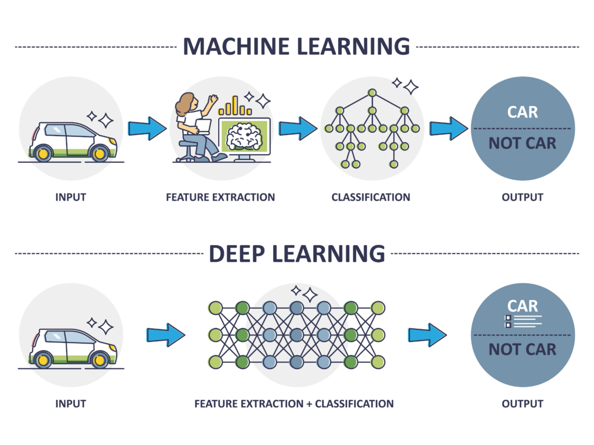

Deep learning has made notable strides in revolutionizing a wide array of fields by providing robust and advanced solution capabilities. One of its promising new applications is found in algorithmic trading. As financial markets become increasingly complex and data-driven, the demand for sophisticated models capable of understanding and predicting market behavior is at an all-time high. Algorithmic trading, which relies on automated systems to execute trading strategies, is well-positioned to benefit from such developments in machine learning technology.

This article aims to explore how the integration of deep reinforcement learning (DRL) can potentially enhance the performance of trading strategies. DRL combines the representational power of deep neural networks with reinforcement learning principles, providing a framework where agents learn to make decisions by interacting with their environment. This suits the finance sector, where decisions must be made in dynamic and complex market conditions.

Unlike traditional machine learning models that require static datasets, DRL adapts and learns from real-time data, adjusting its strategies according to market behavior. The financial markets, much like environments tackled by DRL in gaming, present a rich tapestry of states and decisions. This flexibility makes deep reinforcement learning an attractive approach for developing autonomous trading systems designed to optimize performance with minimal human intervention.

Notably, the success of DRL in complex environments such as gaming heralds its potential for financial applications. In gaming, DRL has already demonstrated its ability to navigate and master environments with intricate dynamics and strategic requirements. Similarly, its applicability in finance suggests that these techniques could lead to transformative changes in how algorithmic trading is approached, offering new avenues to enhance the effectiveness of trading strategies and possibly offering a competitive edge in this rapidly evolving landscape.



## Table of Contents


## Understanding Deep Reinforcement Learning

Deep Reinforcement learning (DRL) represents a convergence of [neural network](/wiki/neural-network)s and [reinforcement learning](/wiki/reinforcement-learning), creating a robust framework for decision-making in complex environments. In trading, DRL is harnessed to formulate strategies that maximize gains through intelligent decision-making.

At its core, DRL operates on the principle of [agents](/wiki/agents) interacting with environments. An agent is a decision-maker, while the environment represents the external world in which the agent operates. The agent observes a state $s_t$ of the environment at time $t$ and selects an action $a_t$ from a set of possible actions. Upon executing this action, the environment transitions to a new state $s_{t+1}$ and provides the agent with a reward $r_t$.

The objective of the DRL agent is to discover a policy $\pi(a|s)$ that maximizes the cumulative reward over time. This goal is often represented by the expected return, denoted as:

$$
R_t = \sum_{k=0}^{\infty} \gamma^k r_{t+k}
$$

where $\gamma$ is the discount factor, balancing immediate and future rewards.

In trading, these components are mapped to financial contexts. The environment could represent market conditions characterized by features like price movements, trading [volume](/wiki/volume-trading-strategy)s, or economic indicators. The state encompasses these features at a given instance, while the action might involve buying, selling, or holding a position in a particular asset. Rewards are often linked to the profitability of trades or changes in portfolio value.

Implementing DRL involves several nuanced steps:

1. **Defining States**: In a trading scenario, states could include asset prices, historical prices, indicators such as moving averages, and other relevant financial metrics.

2. **Designing Rewards**: A common reward structure in trading is the profit or loss from an action. However, more complex schemes considering risk or transaction costs can also refine strategy performance.

3. **Choosing Actions**: Actions in trading are typically discrete (e.g., buy, sell, hold) or continuous (e.g., scaling investment amounts). 

4. **Training the Agent**: The DRL agent uses neural networks to approximate value functions or policies. Techniques like Q-learning, policy gradients, or actor-critic models help optimize the agent's decisions over iterations.

Neural networks enhance the learning capacity of DRL, allowing it to process high-dimensional inputs and uncover nonlinear patterns, crucial for handling the intricate dependencies in market data. Moreover, leveraging advancements like deep Q-networks or LSTM (Long Short-Term Memory) units allows DRL to manage sequential decision-making and temporal dependencies better.

By applying these principles, DRL provides a dynamic approach to trading, adapting strategies in response to real-time market feedback, and optimizing portfolios in ways traditional algorithms cannot. The flexibility inherent in DRL positions it as a formidable tool in navigating the complexities of modern financial markets.


## Applications of Deep Reinforcement Learning in Trading

Deep reinforcement learning (DRL) is reshaping the landscape of trading by transforming how trading policies are optimized. Unlike traditional programming approaches that necessitate pre-defined instructions for each scenario, DRL enables a trading system to learn and adapt by interacting with the market environment. This powerful feature allows the system to optimize portfolios through continuous learning, aiming to maximize cumulative rewards based on observed market behaviors.

A core benefit of DRL in trading is its responsiveness to real-time market feedback. Financial markets are inherently dynamic, with numerous variables influencing asset prices. DRL agents, equipped with neural networks, can analyze these variables and identify patterns or opportunities for trading that might be overlooked by static algorithms. By continuously updating strategies based on current market data, DRL systems remain relevant and effective even as conditions change.

Moreover, the application of DRL in trading extends beyond strategy formulation. It supports the full trading lifecycle, offering autonomy from designing the strategy to executing trades. This level of automation minimizes the need for human intervention, allowing for more efficient trading operations. Such systems can react instantaneously to market variations, capitalizing on short-lived opportunities in a manner that human traders or traditional models could not match.

To illustrate, consider environments where DRL agents are employed to manage portfolios by dynamically allocating weights between various assets to optimize performance metrics like the Sharpe ratio. Through reinforcement learning algorithms, agents adjust allocations based on reward feedback, where rewards are defined by gains adjusted for risk. This real-time adaptability positions DRL as an optimal tool for financial markets that demand agility and precision in strategy execution.

In conclusion, DRL represents a significant advancement in trading technology. Its ability to adapt, learn, and automate processes offers new opportunities for enhancing trading strategies and achieving superior performance in volatile financial landscapes.


## Advantages Over Traditional Algorithms

Deep Reinforcement Learning (DRL) distinguishes itself from traditional algorithms by offering unparalleled flexibility in adapting to a variety of scenarios without explicit programming for each potential situation. Unlike conventional models that require precise instructions and can struggle to handle unseen data, DRL is designed to evolve its strategies dynamically by learning from interactions within its environment, significantly broadening its applicability in complex domains such as [algorithmic trading](/wiki/algorithmic-trading).

One of the most significant advantages of DRL is its capacity to handle a large action space and its ability to continuously adapt. Traditional algorithms often rely on static rule sets or rely heavily on historical data patterns, limiting their responsiveness to new market conditions. DRL agents, however, employ neural networks to predict actions that maximize reward over time, allowing them to adjust strategies continuously as market conditions change. In trading, this translates into the potential for more responsive and adaptable trading strategies that can react to real-time data in ways traditional systems cannot.

The efficacy of DRL is highlighted in other sectors, such as autonomous driving. In self-driving cars, DRL facilitates decision-making in a myriad of real-time situations, such as navigating through traffic or responding to unforeseen obstacles. Here, traditional algorithms struggle due to the sheer unpredictability and diversity of road scenarios. In a similar vein, DRL provides algorithmic trading systems the ability to adapt to volatile financial markets, offering enhanced decision-making capabilities without being bogged down by the limitations of hard-coded rules.

Mathematically, the ability of DRL to manage such complexity is rooted in its formulation of the decision-making problem as a Markov Decision Process (MDP). In an MDP framework, the process is defined by a set of states $S$, actions $A$, a transition model $T$, and a reward function $R$. The objective is to find a policy $\pi$ that maximizes the expected cumulative reward:

$$
\pi^* = \arg\max_{\pi} \mathbb{E} \left[ \sum_{t=0}^{\infty} \gamma^t R(s_t, a_t) \right]
$$

where $\gamma$ is the discount factor applied to future rewards, encapsulating the agent's perspective on the importance of immediate versus long-term payoffs.

This adaptability and learning capability allow DRL models to outperform traditional systems that might optimize for a limited set of scenarios. Such capability provides a transformative effect not only in fields like autonomous driving but also in financial trading, where market dynamics require continuous learning and adaptation. The dynamic adjustment to strategies enabled by DRL sets the stage for more robust and reliable algorithmic trading solutions, enabling traders to meet the demands of increasingly fragmented and fast-paced markets.


## Deep Reinforcement Learning Strategies

Deep reinforcement learning (DRL) integrates the power of [deep learning](/wiki/deep-learning) with the adaptive capabilities of reinforcement learning, creating systems that learn optimal strategies in complex environments like financial markets. Among the notable DRL strategies are Q-networks, Policy Gradients, and Actor-Critic models, each with distinct advantages when applied to trading.

**Q-Networks:**
Q-networks, a form of value-based DRL, estimate the value of taking a particular action in a given state. This approach, known as Q-learning, uses a neural network to approximate the Q-function, which guides the agent in maximizing cumulative reward. In trading, Q-networks can identify undervalued or overvalued assets by learning the Q-values associated with various market states and trading actions. For example, combined with techniques like experience replay, Q-networks efficiently predict market trends, adapting to changing conditions.

**Policy Gradients:**
Policy Gradient methods optimize the policy directly, rather than estimating value functions. These methods are adept at handling large and continuous action spaces, making them suitable for trading environments with numerous possible actions. By parameterizing the trading policy with neural networks, traders can derive refined trading signals that improve transaction execution over time. The policy gradient theorem drives this process, updating policy parameters in the direction of gradient ascent on expected reward.

**Actor-Critic Models:**
Actor-Critic models merge the strengths of policy-based and value-based methods. They consist of two components: the Actor, which proposes actions, and the Critic, which evaluates them. This interaction allows more efficient learning and exploration, as the Critic aids the Actor by providing feedback on action effectiveness. Such models excel in scenarios requiring fine-tuned decision-making, such as selecting optimal buy/sell orders amidst volatile market conditions.

**Enhancing DRL with Neural Networks:**
The integration of neural networks, particularly Long Short-Term Memory (LSTM) networks, enhances DRL strategies by addressing the temporal dependencies in financial data. LSTM networks are adept at capturing the sequential nature of price movements, making them ideal for financial time series prediction. For instance, LSTMs can be employed within Q-networks to better handle time-series data, refining the decision-making process in trend-following strategies.

Research demonstrates the effectiveness of these approaches. In one study, a reinforcement learning framework incorporating LSTM and Q-learning proved successful in managing portfolio allocation by predicting asset value changes with high accuracy. This study, among others, highlights how DRL strategies, bolstered by advanced neural network architectures, can navigate the inherently uncertain and dynamic landscape of trading.

In summary, Deep Reinforcement Learning strategies offer a range of tools for developing sophisticated algorithmic trading models, leveraging the strengths of neural networks to adapt and thrive in the mercurial domain of modern finance.


## Developing a Deep Reinforcement Learning Trading Strategy

To develop and deploy a deep reinforcement learning (DRL) trading strategy, a structured approach is essential to ensure effectiveness and adaptability within the dynamic financial markets.

### Instrument Selection

The starting point involves selecting suitable trading instruments, such as stocks, [forex](/wiki/forex-system), or cryptocurrencies. The choice depends on market [liquidity](/wiki/liquidity-risk-premium), [volatility](/wiki/volatility-trading-strategies), and personal or institutional trading goals. It's crucial to pick assets with sufficient historical data to train and validate your DRL model effectively.

### Designing the DRL Framework

A DRL trading strategy incorporates several key components: 

1. **Agent**: The decision-maker, equipped with a neural network, tasked with predicting optimal actions.
2. **Environment**: Represents the market, providing states such as price data and technical indicators.
3. **States**: Define the inputs to the model, typically including historical prices, volume, and economic indicators.
4. **Actions**: Possible decisions like buying, selling, or holding an instrument.
5. **Reward Function**: Quantifies success, often through profit, loss mitigation, or risk-adjusted returns.

### Model Training and Testing

The training phase involves exposing the DRL agent to historical market data, allowing it to learn from past trends and patterns. Key methodologies include:

- **Backtesting**: This critical step uses historical data to test the DRL model's performance before any real-world application. Backtesting helps in identifying overfitting and ensures the strategy's viability under various market conditions. 
- **Simulating Different Market Conditions**: By using historical data from different periods, traders can assess how the strategy performs under scenarios like bull markets, bear markets, or during high volatility.

Backtesting is typically implemented with the help of custom or open-source libraries in Python, such as Backtrader or Zipline. A simple [backtesting](/wiki/backtesting) script might look like this:

```python
import backtrader as bt

class DRLStrategy(bt.Strategy):
    def __init__(self):
        # Initialize your model and state variables here
        pass

    def next(self):
        # Define the logic to execute trades based on your DRL agent's output
        pass

cerebro = bt.Cerebro()
data = bt.feeds.YahooFinanceData(dataname='AAPL', fromdate=datetime(2020,1,1), todate=datetime(2021,1,1))
cerebro.adddata(data)
cerebro.addstrategy(DRLStrategy)
cerebro.run()
```

### Final Checks and Deployment

Before going live, it's crucial to:

- **Conduct Robustness Testing**: Ensure the strategy can handle sudden market changes and unexpected events.
- **Evaluate Transaction Costs**: Consider the impact of slippage and commissions to avoid eroding potential profits.
- **Risk Management Protocols**: Define stop-loss levels and position sizing to mitigate potential drawdowns.
- **Monitoring and Adjustment**: Post-deployment, continuously monitor the strategy's performance to make iterative adjustments as needed.

These considerations ensure that the DRL trading strategy is not only theoretically sound but also practical and resilient against real-world financial market challenges. This approach not only maximizes potential financial returns but also ensures that the underlying strategy remains robust and adaptive over time.


## Role of AutoML in Enhancing DRL Models

AutoML plays a significant role in enhancing Deep Reinforcement Learning (DRL) models by automating the creation and optimization of [machine learning](/wiki/machine-learning) models. This automation is crucial in DRL systems because it streamlines the iterative process of model tuning, allowing developers to focus on crafting enhanced trading strategies rather than getting bogged down in technical minutiae.

AutoML platforms, such as Google Cloud's AutoML, offer advanced tools that simplify the creation of high-quality predictive models. These platforms use sophisticated algorithms to automate tasks like feature selection, hyperparameter tuning, and model selection, which are traditionally time-consuming. For instance, Google's AutoML navigates the complex landscape of model training by providing a user-friendly interface and robust backend processes. This enables users to develop models without needing deep expertise in machine learning, which accelerates the model development lifecycle.

Incorporating AutoML into DRL strategies enhances the ability to respond swiftly to the ever-changing dynamics of financial markets. AutoML's automation capabilities ensure that models are continuously updated and optimized, maintaining their performance over time. By delegating repetitive, complex processes to AutoML, traders and analysts can employ DRL frameworks more efficiently, enabling a faster transition from model development to deployment.

A practical example of this integration is the use of AutoML to refine the parameters and structures of neural networks within DRL models. For instance, in tuning a DRL agent's neural network, AutoML can identify optimal learning rates, network architectures, and other parameters that improve model performance, potentially achieving better accuracy and faster convergence in complex trading environments.

Overall, the integration of AutoML streamlines the refinement of DRL strategies, allowing for more scalable and adaptable algorithmic trading systems. These advancements bring us closer to self-improving trading models, capable of autonomous operation with minimal human intervention, reshaping how we approach algorithmic trading.


## Case Study: LSTM for Stock Price Prediction

In a recent study, Long Short-Term Memory (LSTM) networks were applied within a Deep Reinforcement Learning (DRL) framework to predict stock prices of Intel Corporation (NASDAQ: INTC) and enhance trading strategies. LSTM, a type of recurrent neural network (RNN), is adept at learning from sequential data, making it suitable for financial time series prediction due to its ability to capture long-term dependencies.

### Study Methodology

The study involved training an LSTM model on historical stock price data of Intel, incorporating various technical indicators as inputs to capture market dynamics. The model was integrated into a DRL system to refine trading decisions. Key steps included:

1. **Data Preprocessing**: Raw stock data was normalized, and features were engineered to reflect price movements and trends.
   
2. **LSTM Model Architecture**: The architecture consisted of multiple LSTM layers, capable of retaining information over time, crucial for analyzing dependencies in stock prices.

3. **Training**: The model was trained using a backpropagation algorithm through time, optimizing to minimize forecast error on validation data.

4. **DRL Integration**: The predictions served as inputs for a DRL agent that learned to optimize trading actions, employing strategies such as Q-learning or policy gradients.

### Results and Insights

The application of LSTM within the DRL framework yielded promising results, demonstrating improved predictive accuracy and profitability. Key findings included:

- **Accuracy**: The LSTM model showed a marked improvement in forecasting accuracy over traditional models like ARIMA, particularly in capturing short-term market trends.

- **Profitability**: DRL strategies informed by LSTM forecasts outperformed baseline buy-and-hold strategies, highlighting the potential for enhanced decision-making.

- **Robustness**: The system exhibited resilience to market volatility, adjusting trading actions in response to rapid price changes, showcasing the adaptability of DRL augmented with LSTM.

### Implications for the Future

The successful integration of LSTM in DRL frameworks for stock price prediction indicates significant implications for financial applications:

- **Scalability**: The approach is scalable to other stocks and markets, offering a robust method for enhancing algorithmic trading strategies across diverse financial instruments.

- **Innovation in DRL**: The study exemplifies how advancements in neural network architectures can be leveraged to boost the performance of DRL models in dynamic environments like finance.

- **Future Research**: Continued exploration into hybrid models combining LSTMs with convolutional neural networks (CNNs) or transformers may further enhance predictive accuracy and strategy efficacy.

In sum, this application underscores the potential of LSTM networks in advancing the predictive capabilities of DRL systems, offering a compelling direction for future research and development in algorithmic trading.


## Conclusion

Deep reinforcement learning (DRL) holds considerable promise in algorithmic trading, effectively pushing the boundaries of strategy development and execution. Its capacity to learn and adapt in real-time has the potential to revolutionize trading strategies, offering a competitive advantage in rapidly changing financial markets. DRL's strength lies in its ability to process complex and vast datasets autonomously, continually refining strategies to maximize returns.

However, applying DRL to trading is not without challenges. One significant hurdle is handling market unpredictability, where sudden changes in market conditions can greatly affect performance. The model's adaptability needs to match the market's rapid fluctuations, which can be daunting given the stochastic nature of financial markets. Additionally, refining predictive accuracy remains a critical area for further research. The complexity of financial markets means that even sophisticated models may struggle with accurate predictions, requiring ongoing enhancements to ensure reliability and precision.

Despite these challenges, DRL's transformative potential is undeniable. It offers not just incremental improvements but a fundamental shift in approach, promising more autonomous and efficient trading systems. As research and development continue, DRL is set to play a pivotal role in redefining how algorithmic trading is conducted, potentially leading to more sustainable, high-performance strategies in the financial sector. The journey towards fully realizing DRL's capabilities is ongoing, with significant opportunities for innovation and advancement on the horizon.


## References & Further Reading

[1]: Mnih, V., Kavukcuoglu, K., Silver, D., Rusu, A. A., Veness, J., Bellemare, M. G., ... & Hassabis, D. (2015). ["Human-level control through deep reinforcement learning."](https://www.nature.com/articles/nature14236) Nature, 518(7540), 529-533.

[2]: Silver, D., Huang, A., Maddison, C. J., Guez, A., Sifre, L., Van Den Driessche, G., ... & Hassabis, D. (2016). ["Mastering the game of Go with deep neural networks and tree search."](https://www.nature.com/articles/nature16961) Nature, 529(7587), 484-489.

[3]: Francois-Lavet, V., Henderson, P., Islam, R., Bellemare, M. G., & Pineau, J. (2018). ["An introduction to deep reinforcement learning."](https://arxiv.org/abs/1811.12560) Foundations and Trends® in Machine Learning, 11(3-4), 219-354.

[4]: Sutton, R. S., & Barto, A. G. (2018). ["Reinforcement Learning: An Introduction."](https://www.amazon.com/Reinforcement-Learning-Introduction-Adaptive-Computation/dp/0262039249) MIT Press.

[5]: Lillicrap, T. P., Hunt, J. J., Pritzel, A., Heess, N., Erez, T., Tassa, Y., ... & Wierstra, D. (2015). ["Continuous control with deep reinforcement learning."](https://arxiv.org/abs/1509.02971) arXiv preprint arXiv:1509.02971.