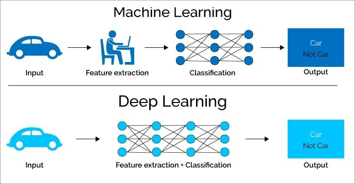

## Table of Contents

## What is a deep model in machine learning?

A deep model in machine learning is a type of artificial neural network that has many layers. These layers are stacked on top of each other, and each layer processes the data before passing it to the next layer. The idea is that by having many layers, the model can learn more complex patterns in the data. For example, in image recognition, the first layers might learn to recognize edges, the next layers might learn to recognize shapes, and the final layers might learn to recognize objects.

Training a deep model can be challenging because it requires a lot of data and computational power. However, once trained, deep models can be very powerful and are used in many applications, such as speech recognition, image classification, and natural language processing. The key to their success is their ability to automatically learn features from the data, which means they can often perform better than traditional machine learning methods that require hand-crafted features.

## How do deep models differ from traditional machine learning models?

Deep models and traditional machine learning models differ mainly in their structure and how they process data. Traditional models, like decision trees or linear regression, often rely on hand-crafted features. This means experts need to decide which parts of the data are important and how to represent them before feeding them into the model. These models are usually simpler, with fewer layers, and they can be easier to understand and interpret.

On the other hand, deep models, like neural networks, have many layers and can automatically learn features from the data. They don't need experts to tell them which parts of the data to focus on. Instead, deep models can find patterns and relationships in the data by themselves. This makes them very powerful, especially for complex tasks like recognizing images or understanding speech, but it also means they can be harder to understand and might need more data and computing power to train.

## What are the basic components of a deep neural network?

A deep neural network is made up of several layers, and each layer has many small parts called neurons. These neurons are connected to each other in a way that lets them pass information from one layer to the next. Each neuron takes in some numbers, does a simple calculation, and then sends out a new number. The calculation usually involves multiplying the input numbers by some weights and then adding them up. After that, the result goes through an activation function, which decides if the neuron should send a strong signal or a weak one to the next layer. A common activation function is the ReLU, which stands for Rectified Linear Unit, and it works like this: $$ f(x) = \max(0, x) $$. This means if the input is positive, the output is the same as the input, but if the input is negative, the output is zero.

The weights in a deep neural network are very important because they decide how much each input affects the output. At first, these weights are set randomly, but then the network learns to change them to get better results. This learning happens during a process called training, where the network sees lots of examples and tries to guess the right answer. If the guess is wrong, the network adjusts the weights a little bit to make a better guess next time. This is done using a method called backpropagation, which figures out how much each weight contributed to the mistake and changes it accordingly. Over many examples, the network gets better at making correct guesses, and the weights become fine-tuned to the task at hand.

## Can you explain the concept of layers in deep learning?

In deep learning, layers are like the building blocks of a neural network. Imagine a neural network as a series of steps where each step is a layer. Each layer takes in information from the layer before it, does some calculations, and then sends the new information to the next layer. The first layer is called the input layer, and it gets the raw data. The last layer is called the output layer, and it gives the final result. In between, there can be many layers, called hidden layers, which help the network learn complex patterns from the data.

The layers in a deep neural network can be different types, each doing a specific job. For example, a convolutional layer is good at finding patterns in images, while a recurrent layer is good at understanding sequences, like words in a sentence. Each layer has many small parts called neurons, and each neuron does a simple calculation. The calculation usually involves multiplying the input numbers by some weights and then adding them up. After that, the result goes through an activation function, which decides if the neuron should send a strong signal or a weak one to the next layer. A common activation function is the ReLU, which stands for Rectified Linear Unit, and it works like this: $$ f(x) = \max(0, x) $$. This means if the input is positive, the output is the same as the input, but if the input is negative, the output is zero.

## What is the role of activation functions in deep models?

Activation functions are really important in deep models. They help the neural network decide whether a neuron should be active or not. When data goes through the network, each neuron does some math with the numbers it gets. After that, the activation function looks at the result and decides if it should send a strong signal or a weak one to the next layer. This helps the network learn complex patterns and make decisions.

One common activation function is the ReLU, which stands for Rectified Linear Unit. It works like this: $$ f(x) = \max(0, x) $$. This means if the number coming into the function is positive, the output is the same number. But if the number is negative, the output is zero. ReLU is popular because it helps the network learn faster and works well with many types of data. Without activation functions, a neural network would just be doing simple math and wouldn't be able to learn the complicated things we need it to.

## How does backpropagation work in training deep models?

Backpropagation is a way to help deep models learn from their mistakes. Imagine you're trying to guess the answer to a question, and you get it wrong. Backpropagation is like figuring out which parts of your thinking led to the wrong answer, so you can do better next time. In a deep model, the weights between neurons are like the parts of your thinking. When the model makes a mistake, backpropagation looks at how each weight affected the final answer and adjusts them a little bit to make the next guess better.

The process of backpropagation starts at the end of the network, where the final guess is made. It calculates how far off the guess was from the right answer, and then it works backwards through the layers. For each neuron, it figures out how much it contributed to the mistake by using the chain rule from calculus. The weights are then updated using a formula like this: $$ w_{new} = w_{old} - \eta \cdot \frac{\partial E}{\partial w} $$, where $$ w $$ is the weight, $$ \eta $$ is the learning rate, and $$ \frac{\partial E}{\partial w} $$ is the gradient of the error with respect to the weight. By repeating this process over many examples, the model learns to make better and better guesses.

## What are some common architectures of deep models?

One common architecture of deep models is the Convolutional Neural Network (CNN). CNNs are great for tasks like image recognition because they can find patterns in pictures. They have layers that do special math to look at small parts of the image at a time. These layers are called convolutional layers. After that, there are usually some layers that make the data smaller, called pooling layers. Finally, there are fully connected layers that help the network make a final guess. CNNs are popular because they can learn to recognize things in images really well, even if the images are a bit different from what the network has seen before.

Another common architecture is the Recurrent Neural Network (RNN). RNNs are good at understanding sequences, like words in a sentence or sounds in speech. They have a special way of remembering what they've seen before, which is called a hidden state. This hidden state gets updated as the network goes through the sequence. A type of RNN that's often used is the Long Short-Term Memory (LSTM) network. LSTMs are better at remembering things over long sequences because they have special parts called gates that help them decide what to keep and what to forget. This makes them very useful for tasks like language translation or generating text.

A third architecture is the Transformer, which is really good at understanding and generating text. Transformers use something called attention, which lets them focus on different parts of the input at the same time. This is different from RNNs, which look at the input one piece at a time. Transformers have layers that do the attention math and other layers that do normal neural network math. They are used a lot in natural language processing tasks, like answering questions or summarizing text. The attention mechanism in transformers can be described with the formula: $$ \text{Attention}(Q, K, V) = \text{softmax}\left(\frac{QK^T}{\sqrt{d_k}}\right)V $$, where $$ Q $$ is the query, $$ K $$ is the key, $$ V $$ is the value, and $$ d_k $$ is the dimension of the key vectors.

## What are the challenges in training deep models and how can they be addressed?

Training deep models can be tough because they need a lot of data and computing power. If you don't have enough data, the model might not learn well and could start to memorize the data instead of learning from it. This is called overfitting. Also, deep models have many layers and lots of weights to adjust, which makes training take a long time. Another problem is that the gradients, which are used to update the weights, can get very small as they go through the layers. This is called the vanishing gradient problem and can make it hard for the model to learn.

To deal with these challenges, you can use a few tricks. First, you can use more data or create more data by changing the existing data a bit. This is called data augmentation. Second, you can use special methods to stop the model from overfitting, like adding some randomness to the weights or stopping the training early. These methods are called regularization and early stopping. To help with the vanishing gradient problem, you can use different activation functions, like the ReLU function $$ f(x) = \max(0, x) $$, or special architectures like LSTMs that can remember things better over many layers. By using these tricks, you can train deep models more easily and make them work better.

## How do you evaluate the performance of a deep model?

To evaluate the performance of a deep model, you need to see how well it does its job. One common way is to use a test set, which is a bunch of examples the model hasn't seen before. You run the model on the test set and compare its guesses to the right answers. If the model gets a lot of them right, it's doing well. You can measure this with accuracy, which is the percentage of correct guesses. For example, if the model gets 90 out of 100 right, its accuracy is 90%. But accuracy isn't always the best way to measure performance, especially if some mistakes are more important than others.

Another way to evaluate a deep model is to use different metrics that focus on specific parts of its performance. For example, precision and recall are good for tasks where you need to find something specific, like finding sick people in a group. Precision measures how many of the model's positive guesses are actually right, while recall measures how many of the actual positives the model found. You can also use the F1 score, which is a mix of precision and recall, calculated as $$ F1 = 2 \cdot \frac{\text{precision} \cdot \text{recall}}{\text{precision} + \text{recall}} $$. These metrics help you understand the model's strengths and weaknesses better. By looking at these different measures, you can get a full picture of how well the deep model is doing and where it might need to improve.

## What are some advanced techniques used to optimize deep models?

One advanced technique to optimize deep models is called transfer learning. Imagine you've trained a model to recognize dogs and cats, and now you want to use it to recognize different kinds of dogs. Instead of starting from scratch, you can take the part of the model that's already good at recognizing animals and just teach it the new kinds of dogs. This saves time and makes the model better because it's using what it already knows. Transfer learning is really helpful when you don't have a lot of new data to train on.

Another technique is called batch normalization. Sometimes, the numbers going through the layers of a deep model can get too big or too small, which makes it hard for the model to learn. Batch normalization helps by making sure the numbers stay in a good range. It does this by looking at a group of examples, called a batch, and adjusting the numbers so they have a mean of zero and a standard deviation of one. This makes the model train faster and work better. The formula for batch normalization is $$ \hat{x}_i = \frac{x_i - \mu_B}{\sqrt{\sigma_B^2 + \epsilon}} $$, where $$ x_i $$ is the input, $$ \mu_B $$ is the mean of the batch, $$ \sigma_B^2 $$ is the variance of the batch, and $$ \epsilon $$ is a small number to avoid dividing by zero.

## Can you discuss the application of deep models in specific fields like image recognition or natural language processing?

In the field of image recognition, deep models like Convolutional Neural Networks (CNNs) are very popular. They are great at finding patterns in pictures because they use special layers called convolutional layers. These layers look at small parts of the image at a time and do math to find edges, shapes, and other features. After that, there are usually some layers that make the data smaller, called pooling layers, which help the network focus on the important parts. Finally, there are fully connected layers that help the network make a final guess about what's in the picture. CNNs are used in things like face recognition, where they can tell who someone is just by looking at a photo, or in self-driving cars, where they help the car see and understand the road.

In natural language processing, deep models like Recurrent Neural Networks (RNNs) and Transformers are used a lot. RNNs are good at understanding sequences, like words in a sentence. They have a special way of remembering what they've seen before, which is called a hidden state. A type of RNN that's often used is the Long Short-Term Memory (LSTM) network. LSTMs are better at remembering things over long sequences because they have special parts called gates that help them decide what to keep and what to forget. This makes them very useful for tasks like language translation or generating text. Transformers, on the other hand, use something called attention, which lets them focus on different parts of the input at the same time. The attention mechanism can be described with the formula: $$ \text{Attention}(Q, K, V) = \text{softmax}\left(\frac{QK^T}{\sqrt{d_k}}\right)V $$. Transformers are used in tasks like answering questions or summarizing text, and they're really good at understanding and generating human language.

## What are the current trends and future directions in deep model research?

One current trend in deep model research is the focus on making models smaller and faster while keeping their performance high. This is important for using deep models on devices like phones or in places where there isn't a lot of computing power. Researchers are working on techniques like pruning, which means cutting out parts of the model that aren't very important, and quantization, which means using smaller numbers to do the math. Another big trend is in self-supervised learning, where models learn from data without needing labels. This is helpful because it means you don't need as much labeled data to train a model, which can be expensive and hard to get. For example, a model might learn to predict the next word in a sentence or the missing part of an image, and this helps it understand the data better.

Another important direction is in the development of more explainable and ethical AI. As deep models become more common in important areas like healthcare or finance, it's crucial to understand how they make decisions and make sure they are fair and unbiased. Researchers are working on ways to explain what the models are doing, like showing which parts of an image or text the model is focusing on. They're also looking at how to make sure the models don't learn or show biases from the data they're trained on. In the future, we can expect to see more work on combining different types of deep models, like using both CNNs and Transformers together, to solve more complex problems. There's also a lot of interest in using deep models for new areas, like drug discovery or climate modeling, where they could help find new solutions to big problems.