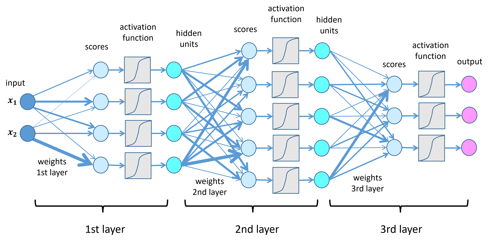

## Table of Contents

## What is a Deep Neural Network (DNN)?

A Deep Neural Network (DNN) is a type of artificial neural network with multiple layers between the input and output layers. These layers are called hidden layers, and they help the network learn and process data in a more complex way. Think of a DNN like a team of workers, where each worker specializes in a certain task. The more workers (or layers) you have, the more detailed and accurate the final result can be. DNNs are used in many areas like image recognition, speech recognition, and natural language processing because they can handle and learn from large amounts of data.

Training a DNN involves feeding it a lot of data and adjusting the connections between neurons, called weights, to improve its performance. This process is usually done using an algorithm called backpropagation, which calculates the error in the network's predictions and works backward to adjust the weights. The goal is to minimize the error, so the network can make better predictions or decisions. For example, if you're using a DNN to recognize pictures of cats and dogs, the network will adjust its weights to better distinguish between the two based on the features it learns from the images.

DNNs have revolutionized many fields by allowing computers to perform tasks that were previously thought to require human intelligence. They can learn to recognize patterns and make decisions from raw data, which makes them very powerful tools. However, training a DNN can be computationally intensive and requires a lot of data. Despite these challenges, the ability of DNNs to solve complex problems has made them a cornerstone of modern artificial intelligence and machine learning.

## How does a DNN differ from a traditional neural network?

A Deep Neural Network (DNN) is different from a traditional neural network mainly because of its depth. A traditional neural network usually has just one or two hidden layers between the input and output layers. These networks can learn and make predictions, but they are limited in how much complexity they can handle. On the other hand, a DNN has many more hidden layers, sometimes even hundreds. This allows DNNs to learn and process much more complex patterns and relationships in the data. Think of it like a simple calculator versus a powerful computer; the DNN can handle much more sophisticated tasks.

The extra layers in a DNN help it to break down the data into smaller, more manageable parts. Each layer can learn different features from the data. For example, if you're using a DNN to recognize pictures of animals, the first few layers might learn to identify edges and shapes, while deeper layers might learn to recognize more complex features like eyes or ears. This hierarchical learning makes DNNs very good at tasks like image and speech recognition. In contrast, a traditional [neural network](/wiki/neural-network) might struggle with these tasks because it can't break down the data into as many levels of detail.

## What are the basic components of a DNN?

A Deep Neural Network (DNN) is made up of several basic parts. The most important part is the neuron, which is like a tiny computer inside the network. Each neuron takes in information, does some math with it, and then sends out a new piece of information. These neurons are organized into layers, with the input layer at the start, the output layer at the end, and many hidden layers in between. The connections between neurons in different layers are called weights, and they decide how much influence one neuron has on another. 

The way a DNN works is by taking in data at the input layer, processing it through the hidden layers, and giving out a result at the output layer. Each hidden layer can learn different things about the data, making the network smarter as it goes deeper. The math that happens inside each neuron usually involves something called an activation function, which helps decide if the neuron should send out a signal or not. A common activation function is the ReLU (Rectified Linear Unit), which can be written as $$ f(x) = \max(0, x) $$. To make the network better at its job, we use a process called training, where we adjust the weights to make the output more accurate. This training often uses a method called backpropagation to figure out how to change the weights.

## What types of problems can DNNs solve?

Deep Neural Networks (DNNs) are very good at solving problems that involve recognizing patterns in data. They are often used for tasks like image recognition, where the network learns to tell the difference between different objects in pictures. For example, a DNN can learn to recognize cats and dogs by looking at many photos and figuring out the features that make them different. DNNs are also great at understanding human speech, which is called speech recognition. They can listen to what people say and turn it into written text, which is useful for things like voice assistants on phones.

Another type of problem DNNs can solve is natural language processing, which is about understanding and generating human language. They can help translate languages, answer questions, or even write stories. In addition to these, DNNs are used in playing games, like chess or Go, where they can learn to make smart moves by studying many games. They are also used in predicting things, like what products people might want to buy or how likely someone is to get sick based on their health data. DNNs are powerful because they can handle a lot of data and learn from it, making them useful for many different kinds of problems.

## How does the training process of a DNN work?

Training a Deep Neural Network (DNN) is like teaching it to be smart by showing it lots of examples. You start by feeding the network data, like pictures or sounds, and telling it what the correct answer should be. The network then tries to guess the answer and compares its guess to the real answer. If the guess is wrong, the network uses a special method called backpropagation to figure out how to make its guess better next time. Backpropagation is like a teacher giving feedback on a test; it helps the network learn from its mistakes by adjusting the connections, called weights, between the neurons. The goal is to make the network's guesses more accurate over time.

During training, the network goes through many rounds, called epochs, where it sees the data again and again. Each time, it tweaks the weights a little bit to get better at making predictions. The math that helps with this tweaking is often done using an optimization algorithm like gradient descent. This algorithm calculates how to change the weights to reduce the error in the network's predictions. The formula for updating weights using gradient descent can be written as $$ w_{new} = w_{old} - \eta \cdot \frac{\partial E}{\partial w} $$, where $$ w $$ is the weight, $$ \eta $$ is the learning rate, and $$ \frac{\partial E}{\partial w} $$ is the gradient of the error with respect to the weight. By repeating this process many times, the network learns to make very good guesses, solving complex problems like recognizing faces in photos or understanding human speech.

## What is backpropagation and why is it important in DNNs?

Backpropagation is a way to teach a Deep Neural Network (DNN) by showing it how wrong its guesses are and helping it get better. Imagine you're trying to guess the right path in a maze. You take a guess, see how far off you are, and then backtrack a bit to try a different path. Backpropagation does something similar in a DNN. It starts from the end, where the network makes its final guess, and works backward to figure out which connections, called weights, need to be changed to make the guess more accurate. This process uses the chain rule from calculus to calculate how much each weight contributed to the error, and then adjusts the weights to reduce that error.

This method is really important for DNNs because it helps them learn from lots of data. Without backpropagation, training a DNN would be like trying to solve a puzzle without knowing if you're getting closer to the solution. The formula for updating weights using backpropagation can be written as $$ w_{new} = w_{old} - \eta \cdot \frac{\partial E}{\partial w} $$, where $$ w $$ is the weight, $$ \eta $$ is the learning rate, and $$ \frac{\partial E}{\partial w} $$ is the gradient of the error with respect to the weight. By using backpropagation, DNNs can slowly but surely improve their guesses, making them very good at tasks like recognizing faces in photos or understanding what people are saying.

## What are some common activation functions used in DNNs and their purposes?

Activation functions are like the decision-makers in a Deep Neural Network (DNN). They help the network decide if a neuron should send out a signal or not. One common activation function is the ReLU (Rectified Linear Unit), which is written as $$ f(x) = \max(0, x) $$. The ReLU function is simple and fast to compute, making it popular in DNNs. It helps the network learn faster by allowing it to focus on important features in the data while ignoring the rest. Another popular activation function is the sigmoid function, which is written as $$ f(x) = \frac{1}{1 + e^{-x}} $$. The sigmoid function squashes the input into a value between 0 and 1, which is useful for tasks like binary classification, where the network needs to decide between two options.

The tanh (hyperbolic tangent) function is also commonly used, and it is written as $$ f(x) = \frac{e^x - e^{-x}}{e^x + e^{-x}} $$. The tanh function is similar to the sigmoid but squashes the input into a value between -1 and 1. This can help the network learn faster and handle data that has both positive and negative values. For the output layer, especially in multi-class classification problems, the softmax function is often used. It is written as $$ f(x_i) = \frac{e^{x_i}}{\sum_{j} e^{x_j}} $$. The softmax function turns the network's raw outputs into probabilities, making it easier to decide which class is the most likely. Each of these activation functions has its own strengths and is chosen based on the specific needs of the DNN and the problem it is trying to solve.

## How do you choose the number of layers and neurons in a DNN?

Choosing the number of layers and neurons in a Deep Neural Network (DNN) is like [picking](/wiki/asset-class-picking) the right tools for a job. You start by thinking about the problem you want to solve. If it's a simple problem, like telling the difference between two types of fruit, you might not need many layers or neurons. But if it's a harder problem, like recognizing different faces in a crowd, you might need more layers and neurons to learn all the details. The number of layers can be decided by trying different numbers and seeing which one works best. This is called experimenting. For example, you might start with a few layers and then add more if the network isn't doing well.

The number of neurons in each layer also matters. Each neuron helps the network learn a little bit about the data. If you have too few neurons, the network might miss important details. If you have too many, it might take longer to train and could even start to memorize the data instead of learning from it, which is called overfitting. A good rule of thumb is to start with a number of neurons that's about the same as the number of inputs, and then adjust from there. You can use formulas like $$ \text{Number of Neurons} = \text{Number of Inputs} \times \text{Factor} $$ where the [factor](/wiki/factor-investing) could be something like 2 or 3, depending on how complex the problem is. By trying different numbers of layers and neurons, you can find the best setup for your DNN.

## What are some techniques to prevent overfitting in DNNs?

Overfitting is when a Deep Neural Network (DNN) learns the training data too well, including the little mistakes and noise, instead of learning the important patterns. To prevent overfitting, one common technique is regularization. Regularization adds a penalty to the network's weights, making them smaller and simpler. A popular type of regularization is called L2 regularization, which adds a term to the loss function that is proportional to the square of the weights, written as $$ \text{Loss} = \text{Original Loss} + \lambda \sum w^2 $$ where $$ \lambda $$ is a small number that controls how strong the penalty is. By keeping the weights small, the network is less likely to overfit and can generalize better to new data.

Another technique to prevent overfitting is dropout. Dropout randomly turns off some neurons during training, which forces the network to learn from different combinations of neurons. This makes the network more robust and less likely to rely too much on any single neuron or group of neurons. During training, a dropout rate is set, like 0.5, which means half of the neurons are turned off at each step. When it's time to use the network, all neurons are active, but their outputs are scaled down to account for the dropout during training. By using dropout, the network can learn to be more flexible and perform better on new data it hasn't seen before.

## What is the role of convolutional layers in DNNs?

Convolutional layers are a special type of layer used in Deep Neural Networks (DNNs) that are really good at understanding images. They work by sliding a small window, called a filter or kernel, over the image and doing some math at each spot. This helps the network learn important features like edges, corners, or even more complex shapes as it goes deeper. The math that happens in a convolutional layer can be written as $$ (f * g)(i, j) = \sum_m \sum_n f(i + m, j + n) \cdot g(m, n) $$, where $$ f $$ is the image and $$ g $$ is the filter. By using these layers, the network can figure out what's in the picture without needing to look at every single pixel, which makes it faster and more efficient.

These layers are really important because they help the network focus on the parts of the image that matter the most. For example, if you're trying to recognize a cat in a picture, the convolutional layers can help the network see the cat's eyes, ears, and whiskers, even if the cat is in different positions or the picture is a bit blurry. This makes the network much better at understanding and recognizing things in images, which is why convolutional layers are used in many image-related tasks like face recognition, object detection, and even medical image analysis.

## How can DNNs be optimized for performance and efficiency?

To optimize Deep Neural Networks (DNNs) for better performance and efficiency, you can start by choosing the right architecture. This means picking the number of layers and neurons that work best for your problem. Sometimes, you might find that a smaller network can do the job just as well as a bigger one, which can make it faster and use less memory. You can also use techniques like pruning, where you remove connections that aren't very important. This makes the network simpler and faster. Another way to improve efficiency is by using quantization, which means using smaller numbers to represent the weights and activations. This can make the network run faster on devices like smartphones.

Another important way to optimize DNNs is by using better training techniques. For example, you can use a method called batch normalization, which helps the network learn faster and be more stable. Batch normalization works by normalizing the inputs to each layer, which can be written as $$ \hat{x} = \frac{x - \text{E}[x]}{\sqrt{\text{Var}[x] + \epsilon}} $$, where $$ \text{E}[x] $$ is the mean, $$ \text{Var}[x] $$ is the variance, and $$ \epsilon $$ is a small number to avoid dividing by zero. You can also use techniques like learning rate scheduling, where you change the learning rate during training to help the network learn better. By combining these methods, you can make your DNNs more efficient and perform better on the tasks they need to do.

## What are some advanced architectures of DNNs and their applications?

One advanced architecture of DNNs is the Convolutional Neural Network (CNN), which is great for understanding images. CNNs use special layers called convolutional layers that look at small parts of an image at a time. These layers help the network learn important features like edges and shapes. For example, if you're trying to recognize a cat in a picture, the CNN can learn to see the cat's eyes, ears, and whiskers. CNNs are used a lot in things like face recognition, where they can tell who someone is by looking at their face, and in self-driving cars, where they help the car see the road and other cars.

Another advanced architecture is the Recurrent Neural Network (RNN), which is good for understanding sequences of data, like words in a sentence or sounds in speech. RNNs can remember what they saw or heard before, which helps them understand context. For example, if you're using an RNN to translate languages, it can remember the beginning of a sentence to help translate the end correctly. RNNs are often used in natural language processing, like chatbots that can understand and respond to what you say, and in speech recognition, where they can turn what you say into written text. A special type of RNN called the Long Short-Term Memory (LSTM) network is even better at remembering things over long sequences, making it very useful for tasks like predicting stock prices or generating text.

A third advanced architecture is the Generative Adversarial Network (GAN), which is used to create new data that looks real. A GAN has two parts: a generator that makes new data, and a discriminator that tries to tell if the data is real or fake. They work together like a game, where the generator tries to fool the discriminator, and the discriminator tries to get better at spotting fakes. Over time, the generator gets really good at making realistic data. GANs are used to create things like realistic images, where they can make pictures of people or places that don't actually exist, and in style transfer, where they can make a picture look like it was painted by a famous artist.

## References & Further Reading

[1]: LeCun, Y., Bengio, Y., & Hinton, G. (2015). ["Deep Learning."](https://www.nature.com/articles/nature14539) Nature, 521(7553), 436-444.

[2]: Goodfellow, I., Bengio, Y., & Courville, A. (2016). [Deep Learning.](https://www.deeplearningbook.org/) MIT Press.

[3]: Rumelhart, D. E., Hinton, G. E., & Williams, R. J. (1986). ["Learning representations by back-propagating errors."](https://www.nature.com/articles/323533a0) Nature, 323(6088), 533-536.

[4]: Krizhevsky, A., Sutskever, I., & Hinton, G. E. (2012). ["ImageNet Classification with Deep Convolutional Neural Networks."](https://dl.acm.org/doi/10.1145/3065386) Advances in Neural Information Processing Systems 25.

[5]: Hochreiter, S., & Schmidhuber, J. (1997). ["Long Short-Term Memory."](https://dl.acm.org/doi/10.1162/neco.1997.9.8.1735) Neural Computation, 9(8), 1735-1780.

[6]: Srivastava, N., Hinton, G., Krizhevsky, A., Sutskever, I., & Salakhutdinov, R. (2014). ["Dropout: A Simple Way to Prevent Neural Networks from Overfitting."](https://dl.acm.org/doi/abs/10.5555/2627435.2670313) Journal of Machine Learning Research, 15, 1929-1958.

[7]: Ioffe, S., & Szegedy, C. (2015). ["Batch Normalization: Accelerating Deep Network Training by Reducing Internal Covariate Shift."](https://arxiv.org/abs/1502.03167) Proceedings of the 32nd International Conference on Machine Learning.

[8]: Radford, A., Metz, L., & Chintala, S. (2016). ["Unsupervised Representation Learning with Deep Convolutional Generative Adversarial Networks."](https://arxiv.org/abs/1511.06434) arXiv:1511.06434.

[9]: Chollet, F. (2017). ["Xception: Deep Learning with Depthwise Separable Convolutions."](https://ieeexplore.ieee.org/document/8099678) Proceedings of the IEEE Conference on Computer Vision and Pattern Recognition (CVPR).