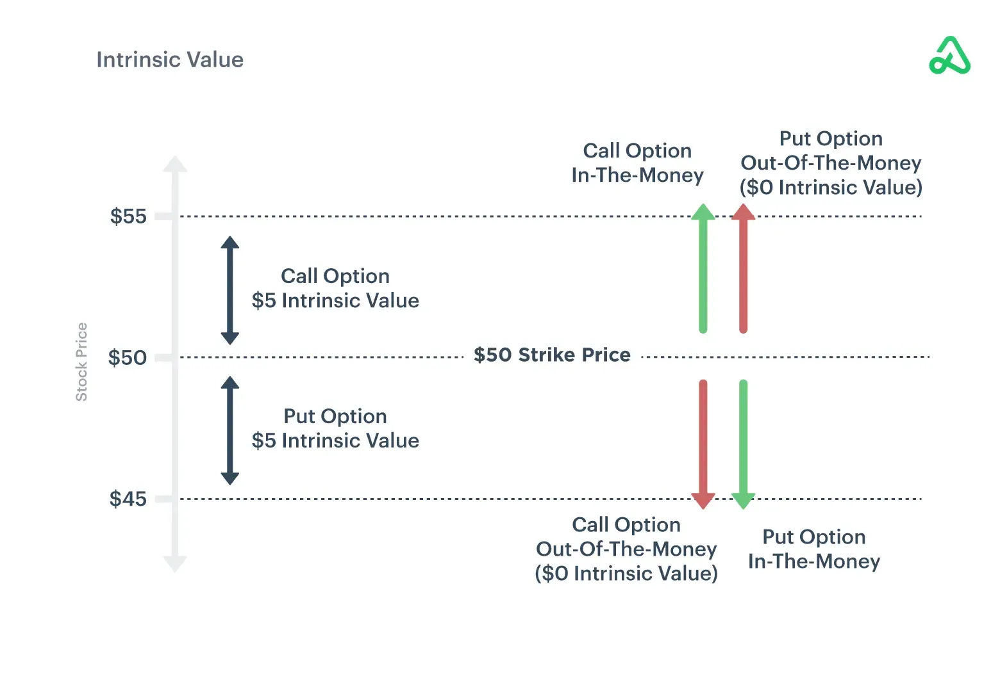

## Table of Contents

## What are deep out of the money options?

Deep out of the money options are options contracts that have a strike price far away from the current market price of the underlying asset. For a call option, this means the strike price is much higher than the current stock price. For a put option, it means the strike price is much lower than the current stock price. These options are considered "deep out of the money" because it's very unlikely that the stock price will move enough for the option to become profitable before it expires.

Because these options are so far from being profitable, they are usually very cheap to buy. This low cost can be attractive to some investors who are willing to take a big risk for a small investment. However, the chances of making money from deep out of the money options are very low. Most of the time, these options will expire worthless, and the investor will lose the entire amount they paid for the option.

## How do deep out of the money options differ from at the money and in the money options?

Deep out of the money options are different from at the money and in the money options mainly because of their strike price compared to the current market price of the stock. Deep out of the money options have a strike price that is far away from the current stock price. For a call option, this means the strike price is much higher than the stock price. For a put option, it means the strike price is much lower than the stock price. Because the stock price would need to move a lot for these options to become profitable, they are usually very cheap to buy.

At the money options have a strike price that is very close to the current stock price of the stock. This means that for a call or put option, the stock price is right around the strike price. These options are more likely to end up profitable than deep out of the money options because the stock price doesn't need to move as much. They are also more expensive than deep out of the money options because of this higher chance of profit.

In the money options are the opposite of deep out of the money options. For a call option, the strike price is lower than the current stock price, and for a put option, the strike price is higher than the current stock price. This means that these options are already profitable, even if the stock price stays the same. Because they are already in a profitable position, in the money options are the most expensive of the three types.

## What are the risks associated with trading deep out of the money options?

Trading deep out of the money options is very risky. These options have a strike price that is far away from the current stock price. This means the stock needs to move a lot for the option to become profitable. Most of the time, this doesn't happen, and the option expires worthless. When this happens, the trader loses all the money they spent on the option. It's like buying a lottery ticket with a very small chance of winning.

Another risk is that even if the stock moves in the right direction, it might not move enough before the option expires. Deep out of the money options are usually cheap, but they can still cost a lot of money if you buy a lot of them. If the stock doesn't move enough, the trader still loses their investment. It's important for traders to understand these risks and only trade with money they can afford to lose.

## Can you explain the potential rewards of trading deep out of the money options?

The main reward of trading deep out of the money options is the potential for big profits with a small investment. Because these options are very cheap, a trader can buy a lot of them for a little money. If the stock price moves a lot in the right direction, the value of the options can go up a lot. This means the trader can make a lot of money from a small investment. It's like hitting the jackpot on a lottery ticket.

However, these big profits don't happen very often. Most of the time, the stock price doesn't move enough, and the options expire worthless. But when it does happen, the reward can be huge. For example, if a trader buys a deep out of the money call option for a dollar, and the stock price jumps a lot, that option could be worth a lot more. So, the reward is the chance to turn a small amount of money into a big amount, but it's a big risk.

## What are some common strategies for trading deep out of the money options?

One common strategy for trading deep out of the money options is to use them as a way to make a big bet on a stock with a small amount of money. Traders might buy these options if they think a stock is going to move a lot in a short time. They know the options are cheap and have a low chance of paying off, but if they're right, the payoff can be huge. This is like playing the lottery with a small ticket price but a big potential prize.

Another strategy is to use deep out of the money options as a way to hedge a big position in a stock. For example, if a trader owns a lot of shares in a company, they might buy deep out of the money put options as insurance. These options are cheap, so they don't cost much, but if the stock price drops a lot, the puts can help limit the trader's losses. This way, the trader can protect their big investment without spending a lot of money on the insurance.

A third strategy is to sell deep out of the money options to collect the premium. Traders who think a stock won't move much might sell these options to other traders who are willing to take the risk. The sellers get to keep the money from selling the options, which can be a steady source of income if they're right about the stock not moving. However, if the stock does move a lot, the sellers can lose a lot of money, so this strategy also comes with risks.

## How does volatility affect deep out of the money options?

Volatility is how much a stock's price goes up and down. When volatility is high, deep out of the money options can become more valuable. This is because there's a bigger chance the stock price will move enough to make these options profitable. So, if a stock is expected to have big price swings, the price of deep out of the money options will go up, even if the stock price itself stays the same.

On the other hand, when volatility is low, deep out of the money options become less valuable. This is because there's less chance the stock will move enough to make these options worth anything. So, if a stock is expected to stay pretty steady, the price of deep out of the money options will go down. This makes them even cheaper to buy, but also even less likely to pay off.

## What is the impact of time decay on deep out of the money options?

Time decay is how the value of an option goes down as it gets closer to expiring. For deep out of the money options, time decay can be a big problem. These options are already very cheap because they're not likely to be profitable. As time goes by, their value drops even more because there's less time for the stock to move enough to make them worth something. If the stock doesn't move a lot before the option expires, the option will be worth nothing at the end.

The impact of time decay on deep out of the money options is bigger than on other options. This is because these options are so far away from being profitable. Every day that goes by without a big move in the stock price makes it less likely that the option will ever be in the money. So, traders who buy deep out of the money options need to be right about the stock moving a lot, and they need to be right soon. If they're not, time decay will eat away at the value of their options until they're worth nothing.

## How can one use deep out of the money options for speculation?

Deep out of the money options are often used for speculation because they are very cheap. This means a trader can buy a lot of them without spending much money. If the trader thinks a stock will move a lot in a short time, they might buy these options. They know the chances of making money are small, but if they're right, they can make a big profit. It's like buying a lottery ticket with a small cost but a big potential prize.

For example, if a trader believes a stock is going to go up a lot, they might buy deep out of the money call options. These options have a strike price much higher than the current stock price, so they're very cheap. If the stock does go up a lot, the value of these options can increase a lot, too. But if the stock doesn't move enough before the options expire, the trader will lose the money they spent on the options. So, using deep out of the money options for speculation is a high-risk, high-reward strategy.

## What are the tax implications of trading deep out of the money options?

Trading deep out of the money options can have different tax implications depending on whether you make money or lose money. If you make money from these options, it's usually considered a capital gain. How much tax you pay depends on how long you held the options before selling them. If you held them for less than a year, it's a short-term capital gain, and you'll pay your regular income tax rate on it. If you held them for more than a year, it's a long-term capital gain, and you'll pay a lower tax rate, usually between 0% and 20%.

If you lose money on deep out of the money options, you can use those losses to reduce your taxes. You can deduct these losses from any capital gains you made in the same year. If your losses are more than your gains, you can use up to $3,000 of those losses to reduce your regular income. Any losses you can't use in the current year can be carried over to future years. It's important to keep good records of your trades so you can report them correctly on your taxes.

## How can deep out of the money options be used in a hedging strategy?

Deep out of the money options can be used in a hedging strategy to protect a big investment in a stock. For example, if a trader owns a lot of shares in a company, they might buy deep out of the money put options as a way to limit their losses if the stock price drops a lot. These options are cheap because they have a strike price much lower than the current stock price, so they don't cost much to buy. If the stock price stays the same or goes up, the trader only loses the small amount they spent on the options. But if the stock price drops a lot, the put options can help the trader make back some of the money they lost on the stock.

Using deep out of the money options for hedging is a way to get some protection without spending a lot of money. The trader knows that these options are not likely to be worth much, but they are a cheap way to have some insurance. If the stock price doesn't move much, the trader will lose the money they spent on the options, but it's a small price to pay for the peace of mind that comes with knowing they're protected if the stock price crashes.

## What advanced techniques can be used to optimize the trading of deep out of the money options?

One advanced technique for optimizing the trading of deep out of the money options is to use them in combination with other options in a spread strategy. For example, a trader might buy a deep out of the money call option and sell a closer to the money call option at the same time. This is called a bull call spread. The idea is to reduce the cost of the deep out of the money option by using the premium from selling the other option. If the stock price goes up a lot, the trader can still make money, but they also limit their risk if the stock doesn't move enough.

Another technique is to use technical analysis to time the purchase of deep out of the money options. Traders can look at charts and indicators to find times when a stock might be about to make a big move. For example, if a stock is close to breaking out of a trading range, a trader might buy deep out of the money call options if they think the stock will go up, or put options if they think it will go down. By timing their trades with technical analysis, traders can increase their chances of catching a big move in the stock price and making a profit from their options.

## Can you discuss case studies or real-world examples of successful deep out of the money options trades?

One famous example of a successful deep out of the money options trade happened during the 2008 financial crisis. A trader named Andy Krieger made a big bet against the U.S. dollar. He bought deep out of the money put options on the dollar, which were very cheap because they were far away from the current exchange rate. When the financial crisis hit, the dollar dropped a lot, and Krieger's options became very valuable. He made a huge profit from his trade, showing how deep out of the money options can pay off big if the market moves a lot in the right direction.

Another example comes from the world of biotech stocks. In 2018, a small biotech company called Sarepta Therapeutics was waiting for FDA approval for a new drug. A trader bought deep out of the money call options on Sarepta, betting that the stock would go up if the drug was approved. These options were cheap because the stock price would need to jump a lot to make them profitable. When the FDA did approve the drug, Sarepta's stock price soared, and the trader made a lot of money from their options. This shows how deep out of the money options can be used to make big profits from specific events or news.

## What are Options Strategies for DOTM?

### Options Strategies for DOTM

Deep out of the money (DOTM) options involve strategies that capitalize on the intrinsic volatility and price anomalies of the underlying asset. A few prevalent strategies include long straddles, volatility trading, skew trading, market [dispersion](/wiki/dispersion-trading) strategies, and delta hedging.

### Long Straddles

A long straddle involves purchasing both a call and a put option at the same strike price and expiration date. The strategic advantage lies in the potential for profit from significant price movements in either direction of the underlying asset. DOTM options in a long straddle can be particularly cost-effective due to their lower premiums. The maximum potential loss is limited to the total premiums paid for the options, while the profit potential is theoretically unlimited on the upside and substantial on the downside. 

### Volatility Trading

Volatility trading seeks to benefit from discrepancies between the expected and actual volatility of the underlying asset. Traders may use DOTM options to place bets on volatility by buying calls and puts that gain value if actual volatility exceeds expectations. The key to successful volatility trading with DOTM options is accurate forecasting of volatility changes and swift adjustments to positions in response to market conditions.

### Skew Trading

Skew trading exploits the volatility skew, which is the pattern by which implied volatility varies with different strike prices. DOTM options often present varying levels of implied volatility across different strikes, influenced by investor perception of potential price moves. By identifying points where the implied volatility is mispriced, traders can establish positions that may yield profits as the volatility skew normalizes.

### Market Dispersion Strategies

Market dispersion strategies involve taking advantage of the volatility spread between a basket of individual stocks and an index. Traders can utilize DOTM options to exploit discrepancies between the implied volatilities of the index and its constituent stocks. By going long (buying options) on under-priced volatilities and short (selling options) on overpriced ones, dispersion traders can potentially profit from the convergence of implied volatilities.

### Delta Hedging

Delta hedging is a critical risk management technique that involves adjusting the quantity of the underlying asset to offset the option's delta. Delta represents the sensitivity of the option's price to changes in the price of the underlying asset. In the context of DOTM options, delta hedging helps manage the directional risk associated with large price swings, although the delta of DOTM options is often low due to the unlikelihood of the strike price being reached. The formula for delta hedging is:

$$
\Delta = \frac{\partial V}{\partial S}
$$

where $V$ is the option's price and $S$ is the price of the underlying asset. Traders continuously adjust their position size to maintain a delta-neutral portfolio, thus mitigating risk.

These strategies, when integrated with algorithmic trading techniques, offer enhanced efficiency and precision in capturing the opportunities presented by DOTM options.

## What is Risk Management in DOTM Options?

Risk management is a critical component of trading deep out of the money (DOTM) options due to their inherent high risk and volatility. Effective risk management strategies help traders mitigate potential losses while maximizing the unique opportunities DOTM options present.

Volatility management and position sizing are fundamental to controlling risk in DOTM options. Volatility, often measured by the standard deviation of returns, indicates the extent of price fluctuations and is a sensitive factor in options pricing. The higher the volatility, the greater the potential profit or loss from trading DOTM options. Therefore, traders must assess the implied volatility against historical volatility to determine if the option is fairly priced and to anticipate future price movements. Position sizing strategies involve allocating a specific portion of the trading capital to each position based on the perceived risk and potential reward. This allocation should reflect the maximum acceptable loss, which can be determined using the formula:

$$
\text{Position Size} = \frac{\text{Total Capital} \times \text{Percent Risk}}{\text{Value at Risk (VaR)}}
$$

Here, Percent Risk is the percentage of the total capital that the trader is willing to risk, and Value at Risk is the potential loss in the value of the portfolio.

The options Greeks—delta, gamma, theta, vega, and rho—play a crucial role in dynamic risk management and hedging. These metrics provide insights into how various factors affect the price of options and help in devising strategies to mitigate risk. For instance:

- **Delta** measures the sensitivity of the option's price to changes in the underlying asset's price. DOTM options typically have low delta, indicating small price movements in response to changes in the underlying asset, which implies high leverage and the potential for significant gains or losses.

- **Gamma** assesses the rate of change of delta, and in the context of DOTM options, helps in managing large swings in delta as the underlying asset price changes sharply.

- **Theta** represents the time decay of options, a critical factor for DOTM options, as these options lose value rapidly as expiration nears if they do not move closer to being in-the-money.

- **Vega** measures the sensitivity to volatility changes. DOTM options are particularly sensitive to changes in vega, making it crucial for traders to monitor volatility levels closely.

- **Rho** evaluates sensitivity to interest rate changes, though it generally has less impact compared to the other Greeks in most market environments.

Employing a combination of these Greeks can lead to sophisticated strategies that dynamically adjust to market conditions, thus improving the odds of succeeding with DOTM options trades. Advanced models, often implemented in software using languages like Python, can assist in calculating these metrics and conducting scenario analysis. For example, using the popular `Greeks` library in Python could facilitate rapid adjustment to market changes:

```python
from quantlib.pricingengines.vanilla import AnalyticEuropeanEngine
from quantlib.processes.black_scholes_process import BlackScholesProcess
from quantlib.instruments.option import EuropeanOption
from quantlib.quotes import SimpleQuote
from quantlib.time.calendar import TARGET
from quantlib.settings import Settings
from quantlib.time.date import Date, today, January, Months

# Example Greeks calculator using QuantLib
settings = Settings()
settings.evaluation_date = Date(15, January, 2024)

# Define market data
underlying_price = SimpleQuote(100.0)
volatility = SimpleQuote(0.2)
risk_free_rate = 0.01

# Define the option
expiry_date = today() + 3 * Months
strike_price = 120  # Deep out of the money
option_type = EuropeanOption.Call

# Black-Scholes process setup
bsm_process = BlackScholesProcess(underlying_price,
                                  risk_free_rate,
                                  volatility)

european_option = EuropeanOption(option_type, strike_price, expiry_date)
engine = AnalyticEuropeanEngine(bsm_process)
european_option.set_pricing_engine(engine)

# Calculate Greeks
delta = european_option.delta()
gamma = european_option.gamma()
theta = european_option.theta()
vega = european_option.vega()
rho = european_option.rho()

print(f"Delta: {delta}, Gamma: {gamma}, Theta: {theta}, Vega: {vega}, Rho: {rho}")
```

By understanding and effectively applying these risk management tools, traders can better navigate the complexities of trading DOTM options while optimizing their risk-reward profiles.

## References & Further Reading

[1]: Black, F., & Scholes, M. (1973). ["The Pricing of Options and Corporate Liabilities."](https://www.cs.princeton.edu/courses/archive/fall09/cos323/papers/black_scholes73.pdf) Journal of Political Economy, 81(3), 637-654.

[2]: Jabbour, R. (2020). ["Options Trading: Stratagem for Investing and Options Trading Strategies"](https://www.amazon.com/Option-Trader-Handbook-Strategies-Adjustments/dp/0470481617).

[3]: Kissell, R. (2013). ["The Science of Algorithmic Trading and Portfolio Management"](https://www.sciencedirect.com/book/9780124016897/the-science-of-algorithmic-trading-and-portfolio-management) by Robert Kissell.

[4]: Lopez de Prado, M. (2018). ["Advances in Financial Machine Learning"](https://www.amazon.com/Advances-Financial-Machine-Learning-Marcos/dp/1119482089).

[5]: Sheleifer, A. (2000). ["Inefficient Markets: An Introduction to Behavioral Finance"](https://academic.oup.com/book/27761) by Andrei Shleifer.

[6]: Taleb, N. (1997). ["Dynamic Hedging: Managing Vanilla and Exotic Options"](https://archive.org/details/dynamichedgingma0000tale).

[7]: Wilmott, P. (2006). ["Paul Wilmott Introduces Quantitative Finance"](https://www.amazon.com/Paul-Wilmott-Introduces-Quantitative-Finance/dp/0470319585).