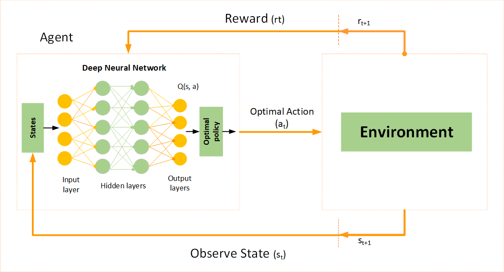

## Table of Contents

## What is a Deep Q-Network (DQN) and how does it relate to reinforcement learning?

A Deep Q-Network (DQN) is a type of artificial neural network used in reinforcement learning to help an agent learn how to make decisions. In reinforcement learning, an agent interacts with an environment, taking actions and receiving rewards or penalties based on those actions. The goal is for the agent to learn a policy, or a set of rules, that maximizes the total reward over time. DQN uses a deep neural network to approximate the Q-value function, which estimates the expected future rewards for taking a specific action in a given state. By using a neural network, DQN can handle complex environments with large state and action spaces, making it a powerful tool for solving challenging reinforcement learning problems.

The way DQN works is by training the neural network to predict the Q-values for different state-action pairs. During training, the agent explores the environment, collecting experiences in the form of state, action, reward, and next state. These experiences are stored in a replay memory, and the network is trained on random samples from this memory. This approach helps to break the correlation between consecutive experiences and improves the stability of the learning process. The network is updated using a loss function that measures the difference between the predicted Q-values and the target Q-values, which are calculated based on the observed rewards and the estimated future rewards. Over time, the agent learns to make better decisions by improving its Q-value estimates, leading to a more effective policy for maximizing rewards.

## What are the basic components of a DQN?

A Deep Q-Network (DQN) has a few main parts that work together to help an agent learn how to make good decisions. The first part is the neural network itself, which is used to estimate the Q-values. These Q-values tell the agent how good it is to take a certain action in a certain situation. The neural network takes the current state of the environment as input and outputs Q-values for all possible actions. The network is trained to get better at predicting these Q-values over time.

The second important part of a DQN is the replay memory. This is like a big storage where the agent keeps all its experiences. An experience includes the current state, the action taken, the reward received, and the next state. The agent randomly picks experiences from this memory to train the neural network. This helps the network learn from a variety of situations and makes the training more stable. The third part is the target network, which is another neural network that helps to calculate the target Q-values during training. The target network is updated less often than the main network, which helps to keep the training process steady and prevents the Q-values from changing too quickly.

## How does a DQN use neural networks to approximate Q-values?

A Deep Q-Network (DQN) uses a [neural network](/wiki/neural-network) to guess how good it is to take certain actions in different situations. This guess is called a Q-value, and it's like a score that tells the agent how much reward it can expect in the future if it takes a specific action in the current state. The neural network takes the current state as an input and spits out Q-values for all possible actions. For example, if you're playing a video game and you need to decide whether to jump or duck, the neural network would look at the game screen and give you scores for each action, helping you pick the best one.

To train the neural network to make better guesses, the DQN uses something called replay memory. This is just a big list where the agent keeps track of all the things it has done, including the state it was in, the action it took, the reward it got, and the new state it ended up in. The agent then picks random experiences from this list to train the neural network. By doing this, the network learns from a variety of situations, which makes it better at predicting Q-values. Additionally, there's a target network, which is another neural network that helps calculate the target Q-values during training. This target network is updated less often than the main network, which helps keep the training process stable and prevents the Q-values from changing too quickly.

## What is the role of experience replay in DQN training?

Experience replay is a key part of training a Deep Q-Network (DQN). It works by saving all the things an agent does in a big list called a replay memory. Every time the agent does something, like choosing an action and getting a reward, it adds this experience to the list. The cool thing about this list is that the agent can go back and learn from these old experiences randomly. This helps the agent learn from a variety of situations, not just the most recent ones. By mixing up the experiences, the agent can learn more evenly and avoid focusing too much on what just happened.

Using experience replay makes the training process more stable and efficient. When the agent picks random experiences from the list to train its neural network, it breaks the connection between experiences that happen one after the other. This randomness helps the neural network learn better because it sees a mix of different situations. Also, by reusing old experiences, the agent can get more out of each one, making the training more effective. This way, the agent can learn to make better decisions by improving its guesses about how good each action is in different situations.

## How does the epsilon-greedy algorithm contribute to DQN exploration?

The epsilon-greedy algorithm helps a DQN explore new actions while still using what it has learned. It works by [picking](/wiki/asset-class-picking) a random number between 0 and 1. If this number is less than a certain value called epsilon, the agent will try a random action instead of choosing the action with the highest Q-value. This randomness helps the agent discover new ways to get rewards that it might not have found otherwise. As the agent keeps learning, epsilon usually gets smaller over time, so the agent relies more on what it has learned and less on random actions.

By using epsilon-greedy, the DQN can balance exploring new actions and using the best actions it knows. At the start, when epsilon is high, the agent does a lot of exploring. This means it tries many different actions to see what works best. As training goes on and epsilon gets smaller, the agent starts to use the actions that have given it the highest rewards more often. This way, the agent can learn from its experiences while still trying out new things, which is important for finding the best way to get the most rewards in the long run.

## What are the advantages of using DQN over traditional Q-learning?

Deep Q-Networks (DQN) have several advantages over traditional Q-learning, especially when dealing with complex environments. One big advantage is that DQN can handle situations with a lot of different states and actions. Traditional Q-learning uses a table to keep track of Q-values for every state-action pair, but this can get really big and hard to manage when there are many states and actions. DQN solves this problem by using a neural network to guess the Q-values. This means it can work well even when the environment is very complicated.

Another advantage of DQN is that it uses experience replay and a target network to make learning more stable and efficient. In traditional Q-learning, the agent learns from its experiences one at a time, which can make the learning process slow and unstable. DQN, on the other hand, stores experiences in a replay memory and picks them randomly to train the neural network. This helps the agent learn from a variety of situations and makes the training smoother. Also, the target network in DQN helps to keep the Q-value estimates steady, which makes the learning process even more reliable.

## Can you explain the concept of target networks in DQN and why they are used?

Target networks in DQN help make the learning process more stable. In DQN, we have two neural networks: the main network and the target network. The main network is used to guess the Q-values for the current state and action, and it gets updated a lot during training. The target network, on the other hand, is used to calculate the target Q-values, which are the Q-values we want the main network to learn towards. The target network is updated less often than the main network, which helps keep the training process smooth and prevents the Q-values from changing too quickly.

The reason we use target networks is to avoid a problem called the "moving target" problem. When we train the main network, we use the Q-values it predicts to update itself. If we only used the main network to calculate both the current and target Q-values, these values would be changing all the time, making it hard for the network to learn properly. By using a target network that updates more slowly, we keep the target Q-values steady for a while. This gives the main network a stable target to learn from, making the training more reliable and effective.

## How does double DQN improve upon the original DQN algorithm?

Double DQN improves on the original DQN by fixing a problem called overestimation of Q-values. In the original DQN, the same neural network is used to choose the best action and to estimate its Q-value. This can lead to the network thinking some actions are better than they really are, because it might pick an action that looks good but actually leads to lower rewards. Double DQN solves this by using two networks: one to pick the best action and another to estimate its Q-value. This way, it's less likely to overestimate how good an action is, leading to more accurate learning and better decision-making.

The way Double DQN works is by using the main network to choose the action with the highest Q-value, but then it uses the target network to estimate the Q-value of that action. This separation helps to reduce the overestimation problem. For example, if the main network thinks action A is the best in a certain state, it will pick action A. But then, the target network will estimate the Q-value for action A, which might be lower than what the main network thought. By doing this, Double DQN can learn more accurately and make better decisions over time.

## What are some common challenges and limitations when implementing DQN?

Implementing a Deep Q-Network (DQN) can be tricky because of a few common challenges. One big problem is that DQN can take a long time to train, especially in complex environments with lots of states and actions. This is because the neural network needs to see a lot of different situations to learn well. Another challenge is that DQN can sometimes learn in a way that's not stable. This means the Q-values it predicts can jump around a lot, making it hard for the agent to learn the best actions. This instability can happen because the network is always updating itself based on its own predictions, which can lead to a cycle of bad guesses.

There are also some limitations to using DQN. For example, DQN might not work well in environments where the rewards are very delayed. If an agent has to do a lot of actions before getting a reward, it can be hard for the DQN to figure out which actions were good. Another limitation is that DQN can struggle with environments that have a lot of different things happening at the same time. In these cases, the neural network might have a hard time figuring out which parts of the state are important for making good decisions. Despite these challenges and limitations, DQN is still a powerful tool for many [reinforcement learning](/wiki/reinforcement-learning) problems, and researchers are always working on ways to make it better.

## How can DQN be applied to real-world problems, and can you provide examples?

Deep Q-Networks (DQN) can be used to solve real-world problems by helping machines learn how to make good decisions in complex situations. For example, DQN can be used in robotics to teach a robot how to move around and do tasks in a changing environment. The robot uses a camera to see its surroundings, and the DQN helps it figure out the best actions to take based on what it sees. This can be really helpful in places like warehouses, where robots need to navigate and pick up items without bumping into things.

Another example is using DQN in video games to create smart computer players. In games like Atari, DQN can learn to play the game by watching the screen and figuring out which actions lead to high scores. This is useful for making game AI that can challenge human players and make the game more fun. DQN can also be used in energy management systems to help control how much power is used in a building. By learning from past data, the DQN can decide when to turn on or off different devices to save energy and reduce costs.

## What advanced techniques can be used to further optimize DQN performance?

One way to make DQN work better is by using something called Double DQN. This helps fix a problem where the DQN thinks some actions are better than they really are. In Double DQN, we use two neural networks instead of one. One network picks the best action, and the other one guesses how good that action is. This makes the learning more accurate and helps the agent make better choices. Another technique is called Prioritized Experience Replay. Instead of picking experiences randomly from the replay memory, we pick the ones that are more important or surprising. This helps the DQN learn faster because it focuses on the experiences that can teach it the most.

Another advanced technique is Dueling DQN. This splits the neural network into two parts: one part guesses how good the state is, and the other part figures out how much better each action is compared to others. This can help the DQN learn better in situations where many actions lead to similar results. We can also use something called Noisy Nets to help with exploration. Noisy Nets add a bit of randomness to the neural network's guesses, which encourages the agent to try new actions and find new ways to get rewards. All these techniques can make DQN more powerful and help it solve harder problems.

## How do you evaluate the performance of a DQN model and what metrics should be considered?

To evaluate how well a DQN model is doing, you can look at a few important things. One key metric is the total reward the agent gets over time. This shows how good the agent is at making choices that lead to more rewards. You can also look at how the average reward changes as the agent keeps learning. If the average reward goes up, it means the DQN is getting better at figuring out the best actions. Another useful metric is the number of steps or episodes it takes for the agent to finish a task. If this number goes down, it means the DQN is learning to do the task faster.

Another way to check the DQN's performance is by comparing it to other methods or to a random agent. If the DQN does better than a random agent or other methods, it shows that it's learning well. You can also use something called the Q-value error to see how accurate the DQN's guesses are. This is the difference between the Q-values the DQN predicts and the true Q-values. If this error gets smaller over time, it means the DQN is getting better at guessing how good each action is. By looking at these metrics, you can get a good idea of how well the DQN is working and where it might need to improve.