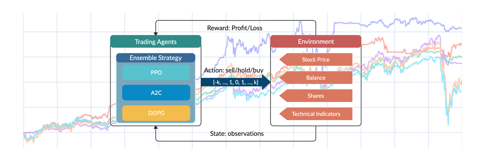

The application of Deep Reinforcement Learning (DRL) in algorithmic trading represents a cutting-edge approach to financial market analysis and decision-making. By marrying advanced machine learning techniques with the complexities of trading, DRL offers the potential for developing highly adaptive trading strategies that evolve based on continuous market feedback. This comprehensive guide will walk you through the entire process of developing, implementing, and deploying a DRL-based trading system.

At its core, DRL utilizes a learning agent that piques its performance by interacting with a simulated environment, enabling it to learn optimal strategies for varying market conditions. This approach contrasts with traditional algorithmic trading systems, which are often rule-based and lack the capacity for dynamic adaptation. DRL trading systems are designed to learn optimal policies from raw inputs, making them particularly suited for the stochastic and non-linear nature of financial markets.



Whether you’re a finance professional looking to leverage AI, a data scientist interested in financial applications, or simply curious about the intersection of AI and trading, this guide will provide valuable insights into this exciting and rapidly evolving field. Understanding how to harness DRL involves grasping fundamental concepts such as reinforcement signals, state-action representations, and policy optimization.

To highlight the scope of DRL in trading, consider a learning algorithm's capacity to simulate trades in a virtual stock market, repeatedly adjusting based on simulated feed-backs. For example, integerating DRL models often involves the iterative updating of parameters based on equations like:

$$
Q(s, a) \leftarrow Q(s, a) + \alpha \left[ r + \gamma \max_{a'} Q(s', a') - Q(s, a) \right]
$$

Where:
- $Q(s, a)$ is the value of being in a state $s$ and taking action $a$.
- $\alpha$ is the learning rate.
- $r$ is the reward following action $a$.
- $\gamma$ is the discount factor for future rewards.
- $s'$ and $a'$ denote the subsequent state and optimal action, respectively.

By the end of this guide, readers will appreciate not only the technical intricacies involved in setting up a DRL-based trading system but will also gain insight into how such systems can transform conventional approaches to trading, leading to more robust and adaptable investment strategies. As you familiarize yourself with the confluence of DRL and trading, you'll discover the creative potential within an algorithmic strategy that is not only data-driven but also dynamically self-improving.

## Table of Contents

## Data Collection: Building the Foundation

Data is crucial in [algorithmic trading](/wiki/algorithmic-trading), providing the foundation upon which effective AI-driven trading systems are built. Acquiring comprehensive and accurate data is akin to collecting puzzle pieces that fit together to reveal the full picture of market dynamics. For successful deployment of AI in trading, several types of data are essential.

Firstly, historical stock prices form the backbone of any trading algorithm. This data includes the open, high, low, close (OHLC) prices, and adjusted prices for splits and dividends, providing insights into past market behavior. It allows the AI to identify patterns and trends, which are essential for making informed predictions and decisions. Trading volumes, which indicate the number of shares traded over a particular time period, also play a critical role. They help in understanding the [liquidity](/wiki/liquidity-risk-premium) and [volatility](/wiki/volatility-trading-strategies) of stocks, crucial factors for assessing the feasibility of trades.

Additionally, company financials provide a deeper understanding of a firm's economic health and future prospects. Key financial indicators such as earnings per share, price-to-earnings ratio, and return on equity can be used to evaluate a company's performance and assess its stock value. This financial information enables the AI to make more nuanced trading decisions based on a company's fundamentals.

Incorporating news sentiment analysis enhances the AI's ability to interpret and react to market emotions and external factors affecting financial markets. Sentiment analysis can be derived from news articles, reports, and social media platforms, providing a qualitative dimension to the AI's decision-making process. This data helps capture real-time market reactions to events, enabling the AI to adjust its strategies dynamically.

Python, a preferred language for data handling and analysis in algorithmic trading, offers tools and libraries like Pandas for data manipulation, NumPy for numerical computations, and BeautifulSoup for web scraping news data. Collecting and organizing data efficiently enables the AI to process large datasets and extract meaningful patterns, laying a strong foundation for developing robust trading algorithms. This emphasis on comprehensive and precise data collection enhances the AI's capacity to understand and predict market behavior, forming the essential groundwork for a successful AI-driven trading system.

## Data Preprocessing: Polishing the Raw Diamonds

Once data is collected, it requires meticulous cleaning and preprocessing to ensure it is ready for use in training a deep [reinforcement learning](/wiki/reinforcement-learning) (DRL) model. Raw data can be thought of as uncut diamonds—valuable, but not yet in a usable form. 

The initial step in data preprocessing involves data cleaning. This process typically includes handling missing data, which is a common issue in financial datasets. Missing values can be managed through imputation methods, such as filling them with the mean or median, or using more sophisticated techniques like regression imputation or k-nearest neighbors. Consistency in formatting, dealing with duplicate entries, and removing erroneous records are also vital to maintaining data integrity.

Normalization and scaling are essential preprocessing tasks that ensure the data falls within a certain range. These techniques help to enhance the performance and convergence of [machine learning](/wiki/machine-learning) algorithms. Normalization can be achieved by scaling features to a specified range, often between 0 and 1, using the formula:

$$
X' = \frac{(X - X_{\text{min}})}{(X_{\text{max}} - X_{\text{min}})}
$$

where $X$ represents an original data point, and $X'$ is the normalized data point. Meanwhile, standardization transforms data to have a mean of 0 and a standard deviation of 1, which is particularly useful when the features have different units or scales.

Feature engineering is a crucial step that involves transforming raw data into a set of features that better reflect the underlying patterns and relationships necessary for effective learning. This might include creating new variables, such as moving averages or technical indicators, from the raw data to provide additional insights into market dynamics. Feature selection techniques, such as recursive feature elimination or principal component analysis (PCA), can further be applied to reduce dimensionality and improve model performance.

A clean and well-organized dataset enables AI models to learn more effectively and improves their generalization capabilities. This preprocessing stage lays the foundation for building robust, data-driven trading strategies capable of adapting to the complexities of financial markets. Therefore, rigorous preprocessing is indispensable for the successful deployment of a DRL-based trading system.

## Environment Design: Creating a Virtual Stock Market

Creating a simulated environment for testing deep reinforcement learning (DRL) models is a critical step in developing a robust algorithmic trading system. This environment serves as a safe space where AI models can engage in trading activities, accumulating experience without incurring financial risks. Designing such a virtual stock market requires a comprehensive understanding of several key elements, including state space, action space, reward systems, and market dynamics.

**State Space**

The state space in a simulated trading environment represents all possible conditions or configurations that the AI agent might encounter. This includes a variety of market indicators and features such as price histories, trading volumes, technical indicators (like moving averages), and other relevant financial signals. Formally, a state $S_t$ at time $t$ can be defined as a vector comprising these features:

$$
S_t = [P_t, V_t, MA_t, \ldots]
$$

where $P_t$ is the current price, $V_t$ is the trading volume, and $MA_t$ is the moving average.

**Action Space**

The action space defines the possible actions the AI can take within the trading environment. Common actions in a trading environment include "buy," "sell," and "hold." These actions directly influence the portfolio and are mapped to numerical representations that the AI can optimize during training. For example:

- $a_0$ = Hold
- $a_1$ = Buy
- $a_2$ = Sell

The choice of action space affects the granularity with which the AI can respond to market changes.

**Reward System**

The reward system is a core component of the DRL framework, guiding the AI's learning process. The reward function typically evaluates the financial outcome of actions taken, providing positive rewards for profitable trades and negative rewards for losses. A simple reward function might focus on net portfolio value changes:

$$
R_t = \text{Portfolio Value at } t - \text{Portfolio Value at } t-1
$$

More sophisticated reward structures might account for risk-adjusted returns or transaction costs, enabling more comprehensive strategy optimization.

**Market Dynamics**

Simulating realistic market dynamics is essential to create a credible trading environment. This involves modeling the stochastic nature of market movements, including price fluctuations, liquidity, and [order book](/wiki/order-book-trading-strategies) behavior. These dynamics can be represented using historical data playback, stochastic differential equations, or complex agent-based models that mimic different market participants.

**Simulating Trading Experience**

By integrating the state space, action space, reward system, and market dynamics, the virtual environment allows the AI model to iteratively engage in trade simulations. This experience is crucial for learning market patterns and optimizing trading strategies. Over numerous iterations, the AI refines its decision-making process, enhancing its ability to generate consistent, profitable trades.

In conclusion, a well-designed virtual stock market is pivotal for the development of competent AI trading systems, providing the necessary foundation for DRL models to learn, adapt, and ultimately succeed in real-world financial markets.

## DRL Agent Architecture: Building Our AI Trader

The construction of the Deep Reinforcement Learning (DRL) agent architecture is a critical step in developing an AI trader, comprising several key components that collectively enable decision-making, learning, and continuous optimization. These components include a policy network, a value network, a memory buffer, and a learning algorithm.

The policy network is central to the DRL agent, determining the agent's actions based on the current state of the environment. It is often represented by a [neural network](/wiki/neural-network) which maps states to a probability distribution over possible actions. This network is updated through training, using methods such as policy gradient techniques, which adjust the policy network's parameters to maximize expected rewards. A common algorithm used for this purpose is the Proximal Policy Optimization (PPO), which improves policy learning stability and efficiency.

The value network estimates the expected return or value of being in a given state, aiding the policy network in making informed decisions. It evaluates how good a particular state is in terms of the potential future rewards. The Advantage Actor-Critic (A2C) architecture combines both policy and value networks to improve training efficiency, where the actor (policy network) chooses actions and the critic (value network) evaluates them.

```python
import torch
import torch.nn as nn

class PolicyNetwork(nn.Module):
    def __init__(self, state_dim, action_dim):
        super(PolicyNetwork, self).__init__()
        self.fc1 = nn.Linear(state_dim, 128)
        self.fc2 = nn.Linear(128, 64)
        self.fc3 = nn.Linear(64, action_dim)

    def forward(self, x):
        x = torch.relu(self.fc1(x))
        x = torch.relu(self.fc2(x))
        action_prob = torch.softmax(self.fc3(x), dim=-1)
        return action_prob
```

The memory buffer, or replay buffer, stores experiences from the agent's interactions with the environment in the form of state, action, reward, and next state tuples. This buffer allows the agent to learn from past experiences, leveraging techniques such as experience replay to break correlation between consecutive data samples and stabilize training.

The learning algorithm underpins the entire architecture. Common approaches include Q-learning and its variants, such as Deep Q-Networks (DQN) and Double DQN. Q-learning involves updating the Q-values, which represent the expected rewards of state-action pairs. A modified version, Dueling DQN, introduces separate networks for learning the value and advantage functions, enhancing learning efficiency.

The combination of these components creates a robust framework for training AI [agents](/wiki/agents). By leveraging techniques like policy gradients or Q-learning, the DRL agent can continuously refine its trading strategies. Such sophistication enables the system to adjust actions based on learned experiences, ultimately optimizing its performance in the trading environment.

## Training Process: Learning the Ropes

Training an AI for algorithmic trading involves running numerous iterative simulations, where the AI agent incrementally enhances its decision-making capabilities. The core objective of these simulations is to enable the AI to learn effective trading strategies based on past actions and market responses. At the heart of this process lies the balance between exploration and exploitation. Exploration refers to the AI trying new strategies to discover their potential effectiveness, while exploitation involves leveraging existing knowledge to maximize trading performance. This balance is crucial to ensure the AI does not stagnate on suboptimal strategies.

A typical reinforcement learning framework employs a policy, π(s), which represents the probability distribution over possible actions given the state s of the market. During training, the agent updates this policy iteratively to improve decision-making. The Bellman equation is used to evaluate the expected long-term return, V(s), of a given state s:

$$
V(s) = \mathbb{E}\left[ R(s, a) + \gamma \sum_{s'} P(s'|s, a) V(s') \right]
$$

Where:
- $R(s, a)$ is the immediate reward received after taking action a.
- $\gamma$ is the discount factor, a value between 0 and 1, determining the importance of future rewards.
- $P(s'|s, a)$ is the state transition probability.

The learning process requires frequent updates to the neural network used by the AI. These updates enable the system to refine its policy based on the received feedback. One common method for policy updates is the use of policy gradient techniques, which involve calculating the gradient of expected reward and adjusting the policy in the direction that increases this reward. An example of such an algorithm is the Advantage Actor-Critic (A2C) method, which updates both the actor (policy) and the critic (value function) networks.

Performance monitoring is an integral aspect of the training process. Key metrics such as the cumulative reward, win/loss ratios, and volatility profiles are tracked to gauge the AI's learning trajectory. If the performance plateaus, it might be necessary to adjust the neural network architecture or the learning rate to reinvigorate learning.

Python is a popular choice for implementing these training processes due to its rich ecosystem of libraries such as TensorFlow and PyTorch for building and optimizing neural networks. The following is a simplified code snippet to illustrate a policy gradient update:

```python
import torch
import torch.optim as optim

# Assume `policy_network` is our neural network for the policy π
optimizer = optim.Adam(policy_network.parameters(), lr=0.001)

# Given a batch of experiences:
states, actions, rewards = ...
log_probs = policy_network(states).log_prob(actions)
loss = -torch.mean(log_probs * rewards)

# Gradient descent step
optimizer.zero_grad()
loss.backward()
optimizer.step()
```

Such a rigorous training process enables the AI to learn from potentially millions of trade simulations, continuously honing its strategies to adapt to complex and evolving market environments. The goal is to equip the AI system with the ability to make informed decisions that improve overall trading performance over time.

## Performance Evaluation: Putting Our AI to the Test

Before deploying a Deep Reinforcement Learning (DRL) agent in a real-world trading environment, it is essential to conduct a thorough performance evaluation. The evaluation process is crucial for assessing the agent's potential effectiveness and robustness in trading financial instruments.

One primary method of evaluation involves testing the AI on previously unseen data, often referred to as a test set. This step ensures that the AI model can generalize beyond the data it was trained on and perform effectively in new, unknown market conditions. By examining the model's performance on this test set, it is possible to gain insights into how well it might perform when exposed to live market data.

The quantitative evaluation of the model typically involves several key metrics. One such metric is the total return, which measures the cumulative profit or loss generated by the agent over a specified period. This is often one of the most direct indicators of the model's effectiveness in generating financial gains.

Another vital metric is the Sharpe Ratio. The Sharpe Ratio assesses the risk-adjusted return of the AI agent by calculating the ratio of the average excess return over the risk-free rate to the standard deviation of the excess return. Mathematically, it is represented as:

$$
\text{Sharpe Ratio} = \frac{E[R_p - R_f]}{\sigma_p}
$$

where $E[R_p - R_f]$ is the expected return of the portfolio in excess of the risk-free rate, and $\sigma_p$ is the standard deviation of the portfolio's excess return. A higher Sharpe Ratio indicates a more favorable risk-adjusted return, which is desirable in financial trading.

Maximum drawdown, another critical metric, measures the largest peak-to-trough decline in the portfolio's value over a given period. It provides insights into the potential risk and downside the agent might endure in unfavorable market conditions. Lower values of maximum drawdown signify a lower level of risk exposure.

These metrics collectively provide a comprehensive view of the AI's readiness for real-world trading applications. By ensuring the AI can maintain performance standards across diverse market conditions, we can increase the likelihood of successful deployment. Furthermore, evaluating the AI's strategy across varying time frames and market scenarios other than those in the training set helps in determining the robustness and adaptability of the trading strategy. This rigorous evaluation process is critical in establishing confidence in the AI's ability to perform consistently and profitably in live financial markets.

## Optimization: Fine-Tuning Our AI

Optimization in Deep Reinforcement Learning (DRL) for algorithmic trading focuses on refining various components to enhance the model's decision-making capabilities and profitability. This process is multifaceted, involving the adjustment of hyperparameters, reward functions, network architecture, and feature selection. Each of these elements plays a critical role in fine-tuning the overall performance of the DRL trader.

Hyperparameter optimization is a crucial step. It involves systematically searching for the optimal set of parameters that dictate the learning process, such as learning rates, discount factors, and batch sizes. These parameters significantly influence how the DRL model converges to a solution. Techniques like grid search, random search, and more sophisticated methods such as Bayesian optimization or gradient-based methods can be employed. For example, using Python's library `Optuna`, we can automate the search for hyperparameters as follows:

```python
import optuna

def objective(trial):
    learning_rate = trial.suggest_loguniform('learning_rate', 1e-5, 1e-1)
    batch_size = trial.suggest_categorical('batch_size', [32, 64, 128, 256])
    discount_factor = trial.suggest_uniform('discount_factor', 0.9, 0.999)

    # Assume 'train_model' is a function to train a DRL model
    performance = train_model(learning_rate, batch_size, discount_factor)

    return performance

study = optuna.create_study(direction='maximize')
study.optimize(objective, n_trials=100)

best_hyperparameters = study.best_params
```

Adjusting reward functions is another vital aspect of optimization. The reward function guides the agent in understanding which actions are beneficial, directly affecting its trading strategies. A well-designed reward function aligns closely with the financial goals, such as maximizing returns or minimizing risk. Consider using a reward function that incorporates both profit and risk, expressed mathematically as:

$$
R_t = \alpha \cdot \text{Profit} - \beta \cdot \text{Risk}
$$

where $\alpha$ and $\beta$ are coefficients that balance the importance of profit and risk.

Enhancing network architecture involves revising the structure of neural networks employed in the DRL model, such as increasing the depth or width of layers, or utilizing advanced architectures like Long Short-Term Memory (LSTM) networks for time-series data. The architecture modifications aim to improve the model’s ability to capture complex patterns in financial data.

Feature selection refinement ensures that only the most relevant data features are used, thereby reducing noise and improving the model's prediction accuracy. Techniques such as recursive feature elimination or principle component analysis (PCA) can be applied to identify pertinent features.

Optimization is inherently iterative, requiring ongoing monitoring and adjustment. It necessitates a continuous feedback loop where performance metrics guide further refinements. Regular evaluation using indicators like [backtesting](/wiki/backtesting) returns, Sharpe Ratio, or maximum drawdown helps in assessing the impact of optimizations, ensuring the DRL model remains robust and adaptable to changing market dynamics.

## Deployment and Monitoring: Going Live

Deployment of a Deep Reinforcement Learning (DRL) trading system marks the transition from development to real-world application. This phase begins with paper trading, which serves as a crucial testing ground. Paper trading allows for the evaluation of trading strategies in a simulated environment that mirrors live market conditions without risking actual capital. It enables the identification and rectification of strategy flaws before engaging in live trading.

Once confidence in the system's performance is established through successful paper trading, a gradual transition to live trading is recommended. This cautious approach mitigates potential risks inherent to sudden exposure to the volatility and unpredictability of financial markets. A phased introduction allows for incremental scaling of the trading system's influence, thereby limiting exposure while gaining real-time feedback on performance.

Continuous performance monitoring is integral to managing an algorithmic trading system. Key metrics, such as return on investment (ROI), Sharpe Ratio, and maximum drawdown, should be regularly analyzed. Moreover, market conditions are characterized by their dynamic nature, necessitating continuous adaptation of trading strategies. This can be achieved through an iterative cycle of performance evaluation and strategy refinement.

Incorporating automated alerts can enhance monitoring efficiency. For instance, Python scripts can be employed to track certain thresholds or conditions in real-time, triggering alerts whenever specific criteria are met. This ensures prompt reactions to significant market movements or anomalies in trading behavior.

Here is an example of a simple Python script for monitoring trading performance metrics using a fictive trading library:

```python
import trading_library as tl

def monitor_performance():
    portfolio = tl.get_portfolio()
    roi = portfolio.calculate_roi()
    sharpe_ratio = portfolio.calculate_sharpe_ratio()
    max_drawdown = portfolio.calculate_max_drawdown()

    if roi < 0.02:  # low ROI threshold
        alert("ROI below 2%")
    if sharpe_ratio < 1.0:
        alert("Sharpe Ratio below 1")
    if max_drawdown > 0.15:
        alert("Maximum drawdown exceeded 15%")

def alert(message):
    print(f"ALERT: {message}")

while True:
    monitor_performance()
    time.sleep(3600)  # check every hour
```

Lastly, adaptation strategies should incorporate machine learning methods to fine-tune trading models in response to observed market behaviors. Techniques such as reinforcement learning can automate the optimization process, dynamically adjusting models to enhance performance. Regular recalibration of models also prevents overfitting to historical data and keeps the trading system resilient to new market trends.

In conclusion, deploying and monitoring a DRL trading system requires a structured approach. Starting with paper trading, transitioning carefully to live markets, and maintaining vigilant performance oversight ensures an effective and responsive trading operation.

## Conclusion

Following these steps, we can create an AI system capable of making informed trading decisions. The integration of Deep Reinforcement Learning (DRL) into algorithmic trading allows for a sophisticated approach to analyzing financial markets and executing trades with enhanced accuracy. The complexity inherent in developing such a trading system is justified by the potential for achieving consistent, data-driven trading strategies that have a significant advantage over traditional methods. The DRL-based trading system harnesses vast amounts of historical and real-time data, making it possible to identify intricate market patterns and execute trades based on these insights.

The rigorous process of data collection, preprocessing, environment design, and agent training culminates in a robust AI capable of adapting to new information efficiently. By continuously optimizing through hyperparameter adjustment and performance monitoring, the system remains agile in addressing the demands of dynamic financial markets.

As financial markets continue to evolve with the influx of new data sources and computational methods, DRL stands at the forefront, offering a platform for innovation within algorithmic trading. The flexibility of DRL to learn and adapt holds promise for future advancements, ensuring that trading strategies remain not only competitive but also resilient against unforeseen market shifts. This capability to continually refine and adapt trading strategies can yield significant profitability and provide a robust defense against market volatility.

Incorporating DRL into trading amalgamates cutting-edge AI techniques with financial acumen, creating a symbiotic relationship between technology and market understanding. This approach not only maximizes the potential for returns but also redefines the standards of trading efficiency and decision-making, fostering new avenues for exploration and development in financial technologies.

## References & Further Reading

[1]: Li, Y., & Deng, Y. (2019). ["Deep Reinforcement Learning for Portfolio Management."](https://arxiv.org/abs/2012.13773) arXiv preprint arXiv:1909.09571.

[2]: Sutton, R. S., & Barto, A. G. (2018). ["Reinforcement Learning: An Introduction."](https://web.stanford.edu/class/psych209/Readings/SuttonBartoIPRLBook2ndEd.pdf) MIT Press.

[3]: Mnih, V., Kavukcuoglu, K., Silver, D., Rusu, A.A., et al. (2015). ["Human-level control through deep reinforcement learning."](https://www.nature.com/articles/nature14236) Nature, 518(7540), 529-533.

[4]: ["Advances in Financial Machine Learning"](https://www.amazon.com/Advances-Financial-Machine-Learning-Marcos/dp/1119482089) by Marcos Lopez de Prado

[5]: ["Deep Reinforcement Learning Hands-On"](https://www.amazon.com/Deep-Reinforcement-Learning-Hands-Q-networks/dp/1788834240) by Maxim Lapan

[6]: Lillicrap, T. P., et al. (2015). ["Continuous control with deep reinforcement learning."](https://arxiv.org/abs/1509.02971) arXiv preprint arXiv:1509.02971.