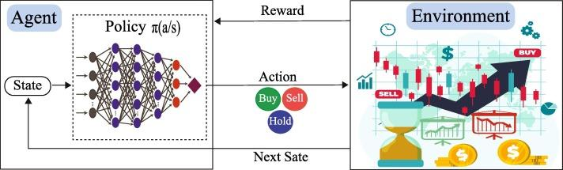

## Table of Contents

## What is deep reinforcement learning?

Deep reinforcement learning is a way for computers to learn how to do things by trying them out and getting feedback. It's like how you might learn to ride a bike. You try to balance, fall off, and then try again until you get it right. In deep reinforcement learning, a computer program, called an agent, tries to solve a problem or complete a task. It does this by taking actions in an environment and learning from the results, like getting a reward for doing something good or a penalty for doing something bad.

The "deep" part of deep reinforcement learning comes from using something called a deep neural network. This is a type of computer system that can learn from lots of data and make decisions. The neural network helps the agent understand the environment better and figure out the best actions to take. Over time, the agent gets better at the task because it keeps learning from its experiences. This method has been used to teach computers to play games, control robots, and even help with things like managing traffic or trading stocks.

## How does deep reinforcement learning differ from traditional machine learning?

Deep reinforcement learning and traditional machine learning are different in how they learn and what they learn from. Traditional machine learning usually involves giving the computer a lot of examples, like pictures of cats and dogs, and telling it what each picture is. The computer then looks for patterns in these examples to make predictions or decisions. For instance, it might learn to tell the difference between cats and dogs by looking at the shapes of their ears or the length of their fur. This type of learning is good when you have a lot of data and know exactly what you want the computer to learn.

On the other hand, deep reinforcement learning is more like learning by doing. Instead of just giving the computer examples, you let it try things out in a world or environment. The computer, or agent, takes actions and gets feedback in the form of rewards or penalties. It learns over time what actions lead to good outcomes and tries to do those more often. This method is useful when you don't have a lot of examples to start with, or when the task is more about figuring out the best way to do something through trial and error, like playing a game or controlling a robot.

## What are the basic components of a reinforcement learning system?

A reinforcement learning system has three main parts: the agent, the environment, and the reward signal. The agent is like a learner that tries to do things in the environment. The environment is the world where the agent acts, and it can change based on what the agent does. The reward signal is like a score that tells the agent if it did something good or bad. When the agent does something, it gets a reward, and it tries to do things that give it higher rewards over time.

The agent learns by trying different actions and seeing what rewards it gets. It uses a policy, which is like a set of rules, to decide what to do next. The policy can change as the agent learns more about what works best. The agent also keeps track of the state, which is like a snapshot of the environment at any moment. By understanding the state and the rewards, the agent can figure out the best actions to take to reach its goal.

## How can deep reinforcement learning be applied to financial trading?

Deep reinforcement learning can be used in financial trading to help make better decisions about buying and selling stocks or other financial assets. In this setup, the computer, or agent, learns to trade by trying different actions and seeing what happens. It uses a deep [neural network](/wiki/neural-network) to understand the market and make predictions. The agent gets a reward when it makes a good trade and a penalty when it makes a bad one. Over time, it learns to make trades that lead to higher rewards, which means making more money.

This method is useful because financial markets can be very hard to predict. Traditional methods might use past data to guess what will happen next, but they don't always work well because the market can change quickly. With deep reinforcement learning, the agent can keep learning and adapting to new situations. It can learn from its mistakes and improve its trading strategy. This could lead to better performance in the long run, helping traders make more profitable decisions.

## What are the key advantages of using deep reinforcement learning in trading?

One big advantage of using deep reinforcement learning in trading is that it can learn and adapt to new situations. The financial market changes all the time, and what worked yesterday might not work today. With deep reinforcement learning, the computer keeps trying different things and learning from the results. This means it can adjust its trading strategy to fit the current market conditions, which can lead to better performance over time.

Another advantage is that deep reinforcement learning can handle complex data and make decisions based on it. The market has a lot of information, like stock prices, news, and economic reports. A deep neural network can look at all this data and find patterns that might be hard for a human to see. This can help the computer make smarter trading decisions, which could lead to more profitable trades.

## What are some common challenges and risks associated with using deep reinforcement learning for trading?

One big challenge with using deep reinforcement learning for trading is that it can be hard to know if the computer is really learning the right things. The market can be unpredictable, and the computer might learn to make trades that look good in the short term but don't work well over time. This is called overfitting, where the computer gets too focused on past data and doesn't do well with new situations. It's important to keep testing and checking the computer's performance to make sure it's learning the right way.

Another risk is that deep reinforcement learning can be risky because it involves trying out different actions. If the computer makes a big mistake, it could lead to big losses. It's important to set limits on how much the computer can trade and to have safety measures in place. Also, the computer might not understand things like market crashes or big news events, which can change the market quickly. So, it's important to have human traders watching and ready to step in if something goes wrong.

## What specific algorithms are commonly used in deep reinforcement learning for trading?

One common algorithm used in deep reinforcement learning for trading is Deep Q-Networks (DQN). DQN uses a deep neural network to learn the best actions to take in different situations. It works by trying different trades and learning from the rewards it gets. Over time, it figures out which trades lead to the most profit. DQN is good for trading because it can handle a lot of data and learn from it, but it can be slow to learn and might not work well with very complex markets.

Another popular algorithm is Proximal Policy Optimization (PPO). PPO is a type of policy gradient method that helps the computer learn how to trade by adjusting its strategy little by little. It tries to make small changes to its trading rules to get better rewards without making big mistakes. PPO is faster at learning than DQN and can handle more complex situations, which makes it useful for trading in fast-changing markets. However, it can still be hard to know if PPO is learning the right things, so it needs careful watching and testing.

A third algorithm often used is the Advantage Actor-Critic (A2C) method. A2C combines two approaches: one that decides what to do (the actor) and one that judges how good the decision was (the critic). The actor tries different trades, and the critic gives feedback on how well those trades worked. This helps the computer learn faster and make better trading decisions. A2C can be good for trading because it balances learning speed and stability, but like other methods, it needs to be carefully managed to avoid big losses.

## How do you train a deep reinforcement learning model for trading?

To train a deep reinforcement learning model for trading, you start by setting up the environment. This environment is like a pretend market where the computer, or agent, can try out different trades. You give the agent some starting money and let it buy and sell stocks. Every time it makes a trade, it gets a reward or a penalty based on how much money it makes or loses. The agent uses a deep neural network to look at the market data and decide what to do next. It keeps trying different trades and learning from the rewards it gets.

As the agent keeps practicing, it gets better at making trades that lead to higher rewards. You can use algorithms like Deep Q-Networks (DQN), Proximal Policy Optimization (PPO), or Advantage Actor-Critic (A2C) to help the agent learn. These algorithms help the agent figure out the best way to trade by trying different things and adjusting its strategy. It's important to keep testing the agent to make sure it's learning the right things and not making big mistakes. Over time, the agent can get good at trading in the pretend market, and then you can try using it in the real market with careful watching and limits to keep things safe.

## What kind of data is needed to effectively train a deep reinforcement learning model for trading?

To train a deep reinforcement learning model for trading, you need a lot of different kinds of data. This includes historical stock prices, which show how stocks have gone up and down in the past. You also need data on trading volumes, which tells you how many stocks are being bought and sold. Other important data includes financial reports from companies, news articles about the market, and economic indicators like interest rates or unemployment numbers. All of this data helps the computer understand what's happening in the market and make better trading decisions.

It's also important to have data that's up to date and covers a long time period. The computer needs to see how the market changes over time and learn from different situations. For example, it should see what happens during good times and bad times, like when the market goes up a lot or when there's a big crash. This way, the computer can learn to handle all kinds of market conditions and make smart trades no matter what's going on.

## How can one evaluate the performance of a deep reinforcement learning trading model?

To evaluate the performance of a deep reinforcement learning trading model, you need to look at how well it does in the market. One way to do this is by checking its returns, which means seeing how much money it makes or loses over time. You can compare these returns to a simple strategy like buying and holding stocks or to other trading models to see if it's doing better. Another important thing to look at is how much risk the model takes. You want to know if it makes big bets that could lead to big losses, so you can check things like how much the returns go up and down, which is called [volatility](/wiki/volatility-trading-strategies).

It's also helpful to test the model in different situations to see how it handles them. You can use past data to pretend the market is going through different times, like a bull market where prices go up a lot or a bear market where prices go down. This way, you can see if the model can make good trades no matter what's happening. Another thing to do is to keep an eye on the model as it trades in real time. This helps you catch any problems early and make sure it's still working well. By looking at all these things, you can get a good idea of how well the deep reinforcement learning trading model is doing and if it's worth using.

## What are some advanced techniques to improve the performance of deep reinforcement learning models in trading?

One advanced technique to improve the performance of deep reinforcement learning models in trading is to use transfer learning. This means starting with a model that has already learned from another task and then fine-tuning it for trading. For example, you could use a model that learned to play a game and then teach it to trade stocks. This can help the model learn faster because it already knows some things about making decisions. Another technique is to use ensemble methods, where you combine the predictions of several different models. This can make the trading decisions more reliable because it's like getting advice from a group of experts instead of just one.

Another way to boost performance is by using more advanced algorithms like Deep Deterministic Policy Gradients (DDPG) or Twin Delayed DDPG (TD3). These algorithms are good at handling continuous actions, which means they can decide exactly how much of a stock to buy or sell instead of just choosing to buy or sell. This can lead to more precise trading and better results. Also, you can use techniques like risk-sensitive reinforcement learning, where the model learns to balance making money with avoiding big losses. This can make the model more careful and help it perform better in the long run.

## Can you discuss case studies or real-world examples where deep reinforcement learning has been successfully applied to trading?

One real-world example of deep reinforcement learning in trading comes from a company called Hudson River Trading. They used a deep reinforcement learning model to help make trading decisions in the stock market. The model learned to trade by trying different things and seeing what worked best. Over time, it got better at making profitable trades. The company found that the model could handle a lot of data and make smart decisions, which helped them make more money.

Another example is from a research team at the University of Oxford. They created a deep reinforcement learning model to trade in the foreign exchange market. The model learned to buy and sell different currencies by looking at past data and figuring out what to do next. The researchers found that the model could make good trades and even beat some traditional trading strategies. This showed that deep reinforcement learning could be useful for trading in different types of markets.

## What is Data Preprocessing: Polishing the Raw Diamonds?

Once data is collected, it requires meticulous cleaning and preprocessing to ensure it is ready for use in training a deep [reinforcement learning](/wiki/reinforcement-learning) (DRL) model. Raw data can be thought of as uncut diamonds—valuable, but not yet in a usable form. 

The initial step in data preprocessing involves data cleaning. This process typically includes handling missing data, which is a common issue in financial datasets. Missing values can be managed through imputation methods, such as filling them with the mean or median, or using more sophisticated techniques like regression imputation or k-nearest neighbors. Consistency in formatting, dealing with duplicate entries, and removing erroneous records are also vital to maintaining data integrity.

Normalization and scaling are essential preprocessing tasks that ensure the data falls within a certain range. These techniques help to enhance the performance and convergence of [machine learning](/wiki/machine-learning) algorithms. Normalization can be achieved by scaling features to a specified range, often between 0 and 1, using the formula:

$$
X' = \frac{(X - X_{\text{min}})}{(X_{\text{max}} - X_{\text{min}})}
$$

where $X$ represents an original data point, and $X'$ is the normalized data point. Meanwhile, standardization transforms data to have a mean of 0 and a standard deviation of 1, which is particularly useful when the features have different units or scales.

Feature engineering is a crucial step that involves transforming raw data into a set of features that better reflect the underlying patterns and relationships necessary for effective learning. This might include creating new variables, such as moving averages or technical indicators, from the raw data to provide additional insights into market dynamics. Feature selection techniques, such as recursive feature elimination or principal component analysis (PCA), can further be applied to reduce dimensionality and improve model performance.

A clean and well-organized dataset enables AI models to learn more effectively and improves their generalization capabilities. This preprocessing stage lays the foundation for building robust, data-driven trading strategies capable of adapting to the complexities of financial markets. Therefore, rigorous preprocessing is indispensable for the successful deployment of a DRL-based trading system.

## How can you design an environment for creating a virtual stock market?

Creating a simulated environment for testing deep reinforcement learning (DRL) models is a critical step in developing a robust [algorithmic trading](/wiki/algorithmic-trading) system. This environment serves as a safe space where AI models can engage in trading activities, accumulating experience without incurring financial risks. Designing such a virtual stock market requires a comprehensive understanding of several key elements, including state space, action space, reward systems, and market dynamics.

**State Space**

The state space in a simulated trading environment represents all possible conditions or configurations that the AI agent might encounter. This includes a variety of market indicators and features such as price histories, trading volumes, technical indicators (like moving averages), and other relevant financial signals. Formally, a state $S_t$ at time $t$ can be defined as a vector comprising these features:

$$
S_t = [P_t, V_t, MA_t, \ldots]
$$

where $P_t$ is the current price, $V_t$ is the trading volume, and $MA_t$ is the moving average.

**Action Space**

The action space defines the possible actions the AI can take within the trading environment. Common actions in a trading environment include "buy," "sell," and "hold." These actions directly influence the portfolio and are mapped to numerical representations that the AI can optimize during training. For example:

- $a_0$ = Hold
- $a_1$ = Buy
- $a_2$ = Sell

The choice of action space affects the granularity with which the AI can respond to market changes.

**Reward System**

The reward system is a core component of the DRL framework, guiding the AI's learning process. The reward function typically evaluates the financial outcome of actions taken, providing positive rewards for profitable trades and negative rewards for losses. A simple reward function might focus on net portfolio value changes:

$$
R_t = \text{Portfolio Value at } t - \text{Portfolio Value at } t-1
$$

More sophisticated reward structures might account for risk-adjusted returns or transaction costs, enabling more comprehensive strategy optimization.

**Market Dynamics**

Simulating realistic market dynamics is essential to create a credible trading environment. This involves modeling the stochastic nature of market movements, including price fluctuations, [liquidity](/wiki/liquidity-risk-premium), and [order book](/wiki/order-book-trading-strategies) behavior. These dynamics can be represented using historical data playback, stochastic differential equations, or complex agent-based models that mimic different market participants.

**Simulating Trading Experience**

By integrating the state space, action space, reward system, and market dynamics, the virtual environment allows the AI model to iteratively engage in trade simulations. This experience is crucial for learning market patterns and optimizing trading strategies. Over numerous iterations, the AI refines its decision-making process, enhancing its ability to generate consistent, profitable trades.

In conclusion, a well-designed virtual stock market is pivotal for the development of competent AI trading systems, providing the necessary foundation for DRL models to learn, adapt, and ultimately succeed in real-world financial markets.

## What is the training process for learning the ropes?

Training an AI for algorithmic trading involves running numerous iterative simulations, where the AI agent incrementally enhances its decision-making capabilities. The core objective of these simulations is to enable the AI to learn effective trading strategies based on past actions and market responses. At the heart of this process lies the balance between exploration and exploitation. Exploration refers to the AI trying new strategies to discover their potential effectiveness, while exploitation involves leveraging existing knowledge to maximize trading performance. This balance is crucial to ensure the AI does not stagnate on suboptimal strategies.

A typical reinforcement learning framework employs a policy, π(s), which represents the probability distribution over possible actions given the state s of the market. During training, the agent updates this policy iteratively to improve decision-making. The Bellman equation is used to evaluate the expected long-term return, V(s), of a given state s:

$$
V(s) = \mathbb{E}\left[ R(s, a) + \gamma \sum_{s'} P(s'|s, a) V(s') \right]
$$

Where:
- $R(s, a)$ is the immediate reward received after taking action a.
- $\gamma$ is the discount factor, a value between 0 and 1, determining the importance of future rewards.
- $P(s'|s, a)$ is the state transition probability.

The learning process requires frequent updates to the neural network used by the AI. These updates enable the system to refine its policy based on the received feedback. One common method for policy updates is the use of policy gradient techniques, which involve calculating the gradient of expected reward and adjusting the policy in the direction that increases this reward. An example of such an algorithm is the Advantage Actor-Critic (A2C) method, which updates both the actor (policy) and the critic (value function) networks.

Performance monitoring is an integral aspect of the training process. Key metrics such as the cumulative reward, win/loss ratios, and volatility profiles are tracked to gauge the AI's learning trajectory. If the performance plateaus, it might be necessary to adjust the neural network architecture or the learning rate to reinvigorate learning.

Python is a popular choice for implementing these training processes due to its rich ecosystem of libraries such as TensorFlow and PyTorch for building and optimizing neural networks. The following is a simplified code snippet to illustrate a policy gradient update:

```python
import torch
import torch.optim as optim

# Assume `policy_network` is our neural network for the policy π
optimizer = optim.Adam(policy_network.parameters(), lr=0.001)

# Given a batch of experiences:
states, actions, rewards = ...
log_probs = policy_network(states).log_prob(actions)
loss = -torch.mean(log_probs * rewards)

# Gradient descent step
optimizer.zero_grad()
loss.backward()
optimizer.step()
```

Such a rigorous training process enables the AI to learn from potentially millions of trade simulations, continuously honing its strategies to adapt to complex and evolving market environments. The goal is to equip the AI system with the ability to make informed decisions that improve overall trading performance over time.

## How do we evaluate the performance of our AI when putting it to the test?

Before deploying a Deep Reinforcement Learning (DRL) agent in a real-world trading environment, it is essential to conduct a thorough performance evaluation. The evaluation process is crucial for assessing the agent's potential effectiveness and robustness in trading financial instruments.

One primary method of evaluation involves testing the AI on previously unseen data, often referred to as a test set. This step ensures that the AI model can generalize beyond the data it was trained on and perform effectively in new, unknown market conditions. By examining the model's performance on this test set, it is possible to gain insights into how well it might perform when exposed to live market data.

The quantitative evaluation of the model typically involves several key metrics. One such metric is the total return, which measures the cumulative profit or loss generated by the agent over a specified period. This is often one of the most direct indicators of the model's effectiveness in generating financial gains.

Another vital metric is the Sharpe Ratio. The Sharpe Ratio assesses the risk-adjusted return of the AI agent by calculating the ratio of the average excess return over the risk-free rate to the standard deviation of the excess return. Mathematically, it is represented as:

$$
\text{Sharpe Ratio} = \frac{E[R_p - R_f]}{\sigma_p}
$$

where $E[R_p - R_f]$ is the expected return of the portfolio in excess of the risk-free rate, and $\sigma_p$ is the standard deviation of the portfolio's excess return. A higher Sharpe Ratio indicates a more favorable risk-adjusted return, which is desirable in financial trading.

Maximum drawdown, another critical metric, measures the largest peak-to-trough decline in the portfolio's value over a given period. It provides insights into the potential risk and downside the agent might endure in unfavorable market conditions. Lower values of maximum drawdown signify a lower level of risk exposure.

These metrics collectively provide a comprehensive view of the AI's readiness for real-world trading applications. By ensuring the AI can maintain performance standards across diverse market conditions, we can increase the likelihood of successful deployment. Furthermore, evaluating the AI's strategy across varying time frames and market scenarios other than those in the training set helps in determining the robustness and adaptability of the trading strategy. This rigorous evaluation process is critical in establishing confidence in the AI's ability to perform consistently and profitably in live financial markets.

## How can we fine-tune our AI through optimization?

Optimization in Deep Reinforcement Learning (DRL) for algorithmic trading focuses on refining various components to enhance the model's decision-making capabilities and profitability. This process is multifaceted, involving the adjustment of hyperparameters, reward functions, network architecture, and feature selection. Each of these elements plays a critical role in fine-tuning the overall performance of the DRL trader.

Hyperparameter optimization is a crucial step. It involves systematically searching for the optimal set of parameters that dictate the learning process, such as learning rates, discount factors, and batch sizes. These parameters significantly influence how the DRL model converges to a solution. Techniques like grid search, random search, and more sophisticated methods such as Bayesian optimization or gradient-based methods can be employed. For example, using Python's library `Optuna`, we can automate the search for hyperparameters as follows:

```python
import optuna

def objective(trial):
    learning_rate = trial.suggest_loguniform('learning_rate', 1e-5, 1e-1)
    batch_size = trial.suggest_categorical('batch_size', [32, 64, 128, 256])
    discount_factor = trial.suggest_uniform('discount_factor', 0.9, 0.999)

    # Assume 'train_model' is a function to train a DRL model
    performance = train_model(learning_rate, batch_size, discount_factor)

    return performance

study = optuna.create_study(direction='maximize')
study.optimize(objective, n_trials=100)

best_hyperparameters = study.best_params
```

Adjusting reward functions is another vital aspect of optimization. The reward function guides the agent in understanding which actions are beneficial, directly affecting its trading strategies. A well-designed reward function aligns closely with the financial goals, such as maximizing returns or minimizing risk. Consider using a reward function that incorporates both profit and risk, expressed mathematically as:

$$
R_t = \alpha \cdot \text{Profit} - \beta \cdot \text{Risk}
$$

where $\alpha$ and $\beta$ are coefficients that balance the importance of profit and risk.

Enhancing network architecture involves revising the structure of neural networks employed in the DRL model, such as increasing the depth or width of layers, or utilizing advanced architectures like Long Short-Term Memory (LSTM) networks for time-series data. The architecture modifications aim to improve the model’s ability to capture complex patterns in financial data.

Feature selection refinement ensures that only the most relevant data features are used, thereby reducing noise and improving the model's prediction accuracy. Techniques such as recursive feature elimination or principle component analysis (PCA) can be applied to identify pertinent features.

Optimization is inherently iterative, requiring ongoing monitoring and adjustment. It necessitates a continuous feedback loop where performance metrics guide further refinements. Regular evaluation using indicators like [backtesting](/wiki/backtesting) returns, Sharpe Ratio, or maximum drawdown helps in assessing the impact of optimizations, ensuring the DRL model remains robust and adaptable to changing market dynamics.

## References & Further Reading

[1]: Li, Y., & Deng, Y. (2019). ["Deep Reinforcement Learning for Portfolio Management."](https://arxiv.org/abs/2012.13773) arXiv preprint arXiv:1909.09571.

[2]: Sutton, R. S., & Barto, A. G. (2018). ["Reinforcement Learning: An Introduction."](https://web.stanford.edu/class/psych209/Readings/SuttonBartoIPRLBook2ndEd.pdf) MIT Press.

[3]: Mnih, V., Kavukcuoglu, K., Silver, D., Rusu, A.A., et al. (2015). ["Human-level control through deep reinforcement learning."](https://www.nature.com/articles/nature14236) Nature, 518(7540), 529-533.

[4]: ["Advances in Financial Machine Learning"](https://www.amazon.com/Advances-Financial-Machine-Learning-Marcos/dp/1119482089) by Marcos Lopez de Prado

[5]: ["Deep Reinforcement Learning Hands-On"](https://www.amazon.com/Deep-Reinforcement-Learning-Hands-Q-networks/dp/1788834240) by Maxim Lapan

[6]: Lillicrap, T. P., et al. (2015). ["Continuous control with deep reinforcement learning."](https://arxiv.org/abs/1509.02971) arXiv preprint arXiv:1509.02971.