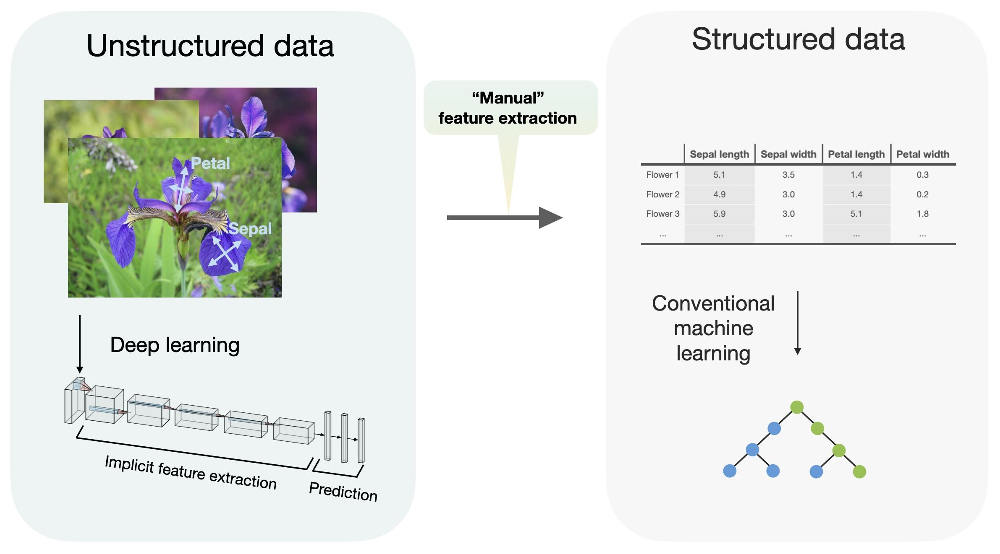

## Table of Contents

## What is Deep Tabular Learning and how does it differ from traditional machine learning?

Deep Tabular Learning is a method that uses deep learning techniques to analyze and make predictions from structured data, which is often organized in tables. This approach is different from traditional machine learning because it uses neural networks with many layers, called deep neural networks, to find patterns in the data. These deep networks can learn complex relationships between the different pieces of data, which can lead to better predictions and more accurate models.

Traditional machine learning methods, on the other hand, often use simpler models like decision trees, linear regression, or logistic regression. These models are good at finding straightforward patterns in the data but can struggle with more complex relationships. For example, a traditional model might be good at predicting house prices based on simple factors like the number of bedrooms and the size of the house. But it might not be as good at understanding how the combination of many different factors, like the neighborhood, the age of the house, and recent renovations, all work together to affect the price. Deep Tabular Learning can handle these complex relationships better because it can learn from the data in a more flexible way.

## What are the common applications of Deep Tabular Learning in various industries?

Deep Tabular Learning is widely used in the finance industry to predict stock prices, credit risks, and fraud detection. Banks and financial institutions use this method to analyze large amounts of data from transactions, customer behavior, and market trends. By using deep neural networks, they can better understand the complex patterns that affect financial outcomes. For example, a bank might use Deep Tabular Learning to predict if a customer is likely to default on a loan by looking at their credit history, income, and spending habits all at once.

In healthcare, Deep Tabular Learning helps doctors and researchers to predict patient outcomes and diagnose diseases more accurately. Hospitals can use this technology to analyze patient data, including medical history, test results, and lifestyle factors. This helps them to identify patterns that might be missed by traditional methods. For instance, a hospital might use Deep Tabular Learning to predict the likelihood of a patient developing a certain disease based on their genetic information and past medical records.

Other industries like retail and marketing also benefit from Deep Tabular Learning. Retailers use it to predict customer buying behavior and optimize inventory management. By analyzing sales data, customer demographics, and seasonal trends, they can make better decisions about what products to stock and when to offer promotions. Similarly, marketing teams use Deep Tabular Learning to tailor advertising campaigns to specific customer segments, improving the effectiveness of their marketing efforts.

## How does a BiLSTM model work in the context of Deep Tabular Learning?

A BiLSTM (Bidirectional Long Short-Term Memory) model is a type of [deep learning](/wiki/deep-learning) model that can be used in Deep Tabular Learning to understand and predict patterns in structured data. In the context of tabular data, a BiLSTM model looks at the data in two directions: forward and backward. This means it can capture relationships and dependencies that might not be obvious if you only look at the data in one direction. For example, if you're predicting stock prices, a BiLSTM can consider both past and future data points to make a more accurate prediction.

When using a BiLSTM for Deep Tabular Learning, the model processes the data through two LSTM layers, one going forward and one going backward. These layers are connected to a final output layer that combines the information from both directions. This allows the model to understand the context of each data point in relation to all other data points in the table. For instance, in healthcare, a BiLSTM model can analyze a patient's medical history by looking at past and future test results to predict the likelihood of a future health event. This bidirectional approach helps the model to capture more nuanced patterns and make better predictions.

## What is the NODE model and how does it improve upon traditional neural networks for tabular data?

The NODE (Neural Oblivious Decision Ensembles) model is a special type of [neural network](/wiki/neural-network) designed to work well with tabular data. It combines the strengths of decision trees and neural networks to make better predictions. Unlike traditional neural networks that use complex layers to find patterns, NODE uses a simpler approach called "oblivious decision trees." These trees split the data in the same way at each level, which makes the model easier to understand and train. This approach helps NODE to handle different types of data more effectively, including data with missing values or outliers.

NODE improves upon traditional neural networks for tabular data by being more robust and easier to interpret. Traditional neural networks can struggle with tabular data because they are designed for more structured data like images or text. They often need a lot of data to work well and can be hard to understand because they use many layers and complex math. NODE, on the other hand, can work well with smaller datasets and is easier to explain. This makes it a better choice for many real-world applications where data might be messy or limited. By using oblivious decision trees, NODE can capture important patterns in the data without getting overwhelmed by the complexity of traditional neural networks.

## Can you explain the architecture and benefits of using TabNet for tabular data?

TabNet is a special kind of neural network made just for working with tabular data. It has a smart way of figuring out which pieces of data are important for making predictions. TabNet uses something called "sequential attention" to look at the data step by step. It decides which parts of the data to pay attention to and which parts to ignore. This helps TabNet focus on the most useful information and make better predictions. The architecture of TabNet includes layers that choose which data to use and layers that learn from that data to make predictions.

One big benefit of using TabNet for tabular data is that it can handle different types of data well. Whether the data is numbers, categories, or even missing values, TabNet can work with it. This makes TabNet very useful for real-world data, which is often messy and incomplete. Another benefit is that TabNet can explain its decisions. It tells you which pieces of data it used to make a prediction, so you can understand how it works. This makes TabNet a good choice for businesses and researchers who need to trust and understand their models.

## How does TABPFN approach the problem of feature selection in Deep Tabular Learning?

TABPFN, which stands for Tabular Prior-Network, is a model that helps with feature selection in Deep Tabular Learning by using a special way to understand the data. It looks at all the features in the data and decides which ones are important for making predictions. TABPFN does this by using a "prior network" that knows about the general patterns in tabular data. This helps TABPFN to quickly figure out which features matter the most without needing to look at the data too many times.

One of the big benefits of TABPFN is that it can work well even when you don't have a lot of data. It uses its prior knowledge to make smart guesses about which features to use. This makes TABPFN very useful for situations where you might not have enough data to train a traditional deep learning model. By focusing on the right features, TABPFN can make better predictions and help you understand your data better.

## What makes the MATE model unique in handling multi-task learning scenarios with tabular data?

The MATE model, which stands for Multi-task learning with Attention-based Tabular Embeddings, is unique because it can handle multiple tasks at the same time using tabular data. It does this by using something called attention mechanisms. These mechanisms help the model focus on different parts of the data that are important for each task. For example, if you're trying to predict both customer satisfaction and sales, MATE can look at different features of the data to make the best predictions for each task. This makes MATE very useful in situations where you want to get the most out of your data by doing several things at once.

Another thing that makes MATE special is how it shares information between tasks. Instead of learning each task separately, MATE learns them together. This means it can use what it learns from one task to help with another task. For instance, if it learns that certain customer behaviors are important for predicting sales, it can use that knowledge to also predict customer satisfaction. This sharing of information can make MATE's predictions more accurate and efficient, especially when you have limited data. By using attention and sharing information, MATE can handle complex multi-task learning scenarios with tabular data in a way that other models can't.

## How does the FT-Transformer model leverage transformer architectures for tabular data?

The FT-Transformer model uses a special kind of neural network called a transformer to work with tabular data. Transformers are usually used for things like understanding text or pictures, but FT-Transformer changes them to work well with tables. It does this by treating each row of the table like a sequence of words in a sentence. The model looks at all the pieces of data in the row and figures out which ones are important for making predictions. This way, FT-Transformer can learn complex patterns in the data and make better predictions than older models.

One cool thing about FT-Transformer is how it handles different types of data. Whether the data is numbers, categories, or even missing values, FT-Transformer can deal with it. It uses something called embeddings to turn all these different types of data into a form that the transformer can understand. This makes FT-Transformer very flexible and useful for real-world data, which is often messy and incomplete. By using transformers, FT-Transformer can capture important relationships between the data and make accurate predictions, even when the data is complicated.

## What are the key differences between TabTransformer and SAINT in their approach to tabular data?

TabTransformer and SAINT are both models that use transformers to work with tabular data, but they do it in different ways. TabTransformer treats each row of the table like a sentence, using a transformer to look at all the data in the row and figure out which parts are important for making predictions. It uses something called embeddings to turn different types of data, like numbers and categories, into a form that the transformer can understand. This helps TabTransformer handle messy and incomplete data well. On the other hand, SAINT uses a special kind of attention called self-attention and inter-sample attention. Self-attention helps the model look at the relationships within one row, while inter-sample attention lets it look at relationships between different rows. This makes SAINT good at finding patterns that involve multiple rows of data.

The main difference between the two models is how they use attention to understand the data. TabTransformer focuses on the relationships within each row, using a simple attention mechanism to weigh the importance of different pieces of data. This makes it good for tasks where the data in each row is important on its own. SAINT, however, goes a step further by also looking at how different rows relate to each other. This can be really useful for tasks where understanding the bigger picture across multiple rows is important. Both models can handle different types of data and make good predictions, but they do it in different ways depending on the specific needs of the task.

## How does the Wide&Deep model combine the strengths of linear models and deep neural networks?

The Wide&Deep model is a smart way to use both linear models and deep neural networks to make better predictions from tabular data. Linear models are good at understanding simple, direct relationships in the data. For example, they can easily see that if the number of bedrooms in a house goes up, the price might go up too. But they can struggle with more complex patterns. Deep neural networks, on the other hand, are great at finding these complex patterns. They can learn how different pieces of data work together in ways that linear models can't. By combining both types of models, the Wide&Deep model can use the best parts of each to make better predictions.

In the Wide&Deep model, the "wide" part is like a linear model that looks at the data directly. It helps the model learn simple relationships quickly. The "deep" part is a deep neural network that looks at the data in a more complex way. It can find patterns that the wide part might miss. The model then combines the predictions from both parts to make a final prediction. This combination helps the model be both fast and accurate. For example, if you're predicting how much a customer might spend, the wide part can quickly see that people who buy more items spend more money, while the deep part can understand how different types of items and customer behaviors all work together to affect spending.

## What is the SCARF model and how does it address the challenges of learning from heterogeneous tabular data?

The SCARF model, which stands for Sparse Columnar Autoencoder with Random Forests, is a special way to learn from tabular data that can be very different from one column to another. This kind of data is called heterogeneous because it has different types of information, like numbers, categories, and even missing values. SCARF uses two main parts to handle this: a Sparse Columnar Autoencoder and Random Forests. The Sparse Columnar Autoencoder looks at each column of the data separately and learns how to represent it in a simpler way. This helps the model understand the data better, even if some columns are missing a lot of information. The Random Forests part then uses these simpler representations to make predictions. By combining these two parts, SCARF can handle the challenges of learning from data that is messy and varied.

One of the big challenges with heterogeneous tabular data is that traditional models can struggle to understand it. For example, a model might not know how to deal with a column that has a lot of missing values or a column that has categories instead of numbers. SCARF solves this problem by using the Sparse Columnar Autoencoder to turn each column into a form that the Random Forests can understand easily. This way, SCARF can learn from all kinds of data, no matter how different they are. By doing this, SCARF can make better predictions and help you understand your data better, even when it's complicated and messy.

## Can you discuss the advanced techniques used in Hierarchical MTL for managing multiple related tasks with tabular data?

Hierarchical Multi-Task Learning (MTL) for tabular data uses special ways to handle multiple tasks that are connected. It does this by setting up the tasks in a tree-like structure. Imagine a tree where the main task is at the top, and smaller tasks branch out from it. This helps the model understand how the tasks are related and use that information to make better predictions. For example, if you're predicting both the type of a car and its fuel efficiency, Hierarchical MTL can see that these tasks are related and use what it learns about one to help with the other. This way, the model can share information between tasks and learn more efficiently.

One advanced technique in Hierarchical MTL is called "task grouping." This means the model groups tasks that are similar together. By doing this, the model can learn patterns that are common to all tasks in a group. Another technique is "task-specific layers," where the model has special layers just for certain tasks. These layers help the model focus on what's important for each task. For example, if you're predicting both customer satisfaction and sales, the model might have one layer that looks at customer feedback for satisfaction and another layer that looks at sales data for sales. By using these techniques, Hierarchical MTL can handle multiple related tasks with tabular data in a smart and efficient way.

## References & Further Reading

[1]: Gorishniy, Y., Rubachev, I., Khrulkov, V., & Babenko, A. (2021). ["Revisiting Deep Learning Models for Tabular Data."](https://arxiv.org/abs/2106.11959) arXiv preprint arXiv:2106.11959.

[2]: Popov, S., Morozov, S., & Babenko, A. (2019). ["Neural Oblivious Decision Ensembles for Deep Learning on Tabular Data."](https://arxiv.org/abs/1909.06312) arXiv preprint arXiv:1909.06312.

[3]: Arik, S. O., & Pfister, T. (2019). ["TabNet: Attentive Interpretable Tabular Learning."](https://arxiv.org/abs/1908.07442) arXiv preprint arXiv:1908.07442.

[4]: Shwartz-Ziv, R., & Armon, A. (2021). ["Tabular Data: Deep Learning is Not All You Need."](https://arxiv.org/abs/2106.03253) arXiv preprint arXiv:2106.03253.

[5]: Vaswani, A., Shazeer, N., Parmar, N., Uszkoreit, J., Jones, L., Gomez, A. N., Kaiser, L., & Polosukhin, I. (2017). ["Attention Is All You Need."](https://arxiv.org/abs/1706.03762) Advances in Neural Information Processing Systems.

[6]: Chandar, S., Desai, K., Grover, A., & Yadav, S. (2021). ["SAINT: Improved Neural Networks for Tabular Data via Row Attention and Contrastive Pre-Training."](https://openreview.net/forum?id=nL2lDlsrZU) arXiv preprint arXiv:2106.01342.