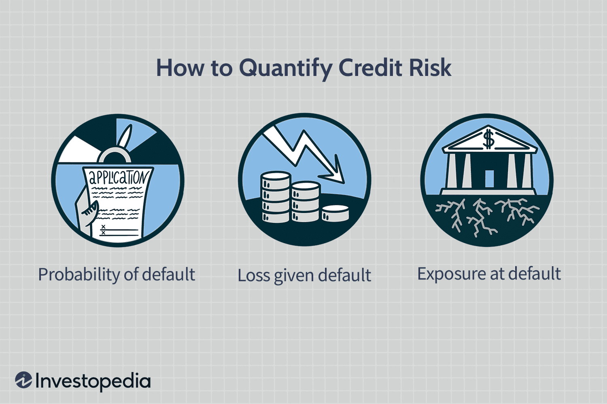

The concept of 'default' in the financial world is multi-faceted, encompassing various scenarios such as failing to meet debt obligations and automated trading systems making decisions based on default parameters. Understanding the consequences of financial defaults and their impact on algorithmic trading is crucial, especially in today's fast-paced financial markets. Financial defaults can disrupt markets, leading to increased volatility and affecting trading strategies. 

This article aims to explore the impacts of defaults in finance, examining how they influence investment strategies and market stability. With a comprehensive understanding of default scenarios, investors and market participants are better equipped to navigate the complexities of modern financial systems. Algorithmic trading, which relies on set algorithms and pre-defined rules, is particularly sensitive to default risks. These systems must adapt to manage and mitigate potential financial losses due to defaults effectively. 

The interplay between financial defaults and algorithmic trading presents both challenges and opportunities for strategic investment and risk management. By investigating these dynamics, investors can improve their decision-making processes and develop more resilient trading strategies. As technological advancements continue to evolve, staying informed about financial default scenarios becomes increasingly significant in the ever-changing landscape of global finance.

## Table of Contents

## Understanding Financial Default

Financial default occurs when a borrower, whether it be an individual, a corporation, or a sovereign entity, fails to meet the payment obligations set forth in a loan agreement. This failure to pay can manifest in various forms such as missing a scheduled payment, not paying the total interest due, or being unable to fulfill the principal repayment by the due date. The implications of a default are significant and vary depending on whether the defaulting party is a corporation or a sovereign nation.

At the corporate level, defaults often result from issues such as cash flow shortages, poor financial management, or adverse business conditions. These can lead to severe consequences, including restructuring of debt terms, loss of access to capital markets, and even bankruptcy. For example, when a company defaults, its credit rating is likely to be downgraded, increasing future borrowing costs and potentially forcing the company to secure funding at higher interest rates or unfavorable terms.

Sovereign defaults occur when a country fails to meet its debt obligations. These defaults can be caused by a range of factors, including economic distress, political instability, mismanagement of national resources, or external economic shocks. Sovereign defaults can have far-reaching implications, not just for the defaulting nation but also for the global economy, as they can lead to disruptions in international trade and fluctuations in global markets.

Understanding financial defaults is crucial for investors as it directly impacts risk assessment and decision-making. Investors must account for potential default risks when constructing their portfolios to ensure they are adequately diversified and to avoid overexposure to any single defaulting entity. Moreover, the likelihood of default can be assessed using various financial metrics and models, such as the Altman Z-score for corporations, which predicts the probability of a company entering bankruptcy within two years.

Economic repercussions of defaults might not be limited to the immediate increase in borrowing costs or credit downgrades. Defaults can shake broader investor confidence, triggering capital outflows and increasing market [volatility](/wiki/volatility-trading-strategies). For example, the 2008 financial crisis underlined the interconnectedness of global markets, showing how defaults on subprime mortgages in the United States could set off a global financial meltdown.

In conclusion, comprehending the dynamics and causes of financial defaults enables investors and policymakers to develop strategies to manage potential risks effectively. As a result, it is vital for market participants to stay informed and cautious about the signs of impending defaults to mitigate potential adverse outcomes.

## Consequences of Financial Default

Financial defaults [carry](/wiki/carry-trading) significant consequences that extend beyond the immediate failure to meet a debt obligation. Among the most immediate repercussions is the deterioration of the defaulter's credit rating. A default signals to credit rating agencies and investors that the borrower is unable, or unwilling, to fulfill their debt commitments. This downgrade in credit rating not only raises future borrowing costs for the defaulter but also limits their access to capital markets, thereby constraining financial flexibility. 

The impacts of defaults are not confined to the individual borrower. At a macroeconomic level, defaults can precipitate a loss of investor confidence, leading to broader market volatility. When a significant corporate or sovereign default occurs, investors may re-evaluate their risk assessments and adjust their investment portfolios, often resulting in a pullback from riskier assets. This shift can lead to a tightening of credit conditions, further exacerbating economic downturns.

Historical case studies offer valuable lessons on the macroeconomic ramifications of defaults. The 2008 financial crisis exemplifies how the collapse of major financial institutions due to defaults on mortgage-backed securities led to a global economic slowdown. A similar scenario unfolded during the European sovereign debt crisis, where defaults or near-default events in countries such as Greece, Portugal, and Ireland contributed to widespread financial instability across the continent.

These events highlight the interconnectedness of global financial systems and the potential for contagion following defaults. A default in one sector or country can quickly ripple through markets, affecting economic conditions worldwide. This underscores the importance of robust risk management and diversification strategies to cushion against such shocks.

In summary, while the immediate consequence of a financial default is the damage to the borrower's credit rating and increased borrowing costs, the broader economic impacts can be profound. Decreased investor confidence and resulting market volatility reflect the far-reaching effects of defaults, making risk assessment and management critical components of financial strategy. Analyzing historical defaults reveals patterns and insights that can inform future financial decision-making, emphasizing the necessity of understanding and preparing for these incidents in global finance.

## Algorithmic Trading and Default Scenarios

Algorithmic trading is heavily reliant on automated systems which operate based on predetermined algorithms and rules. These algorithms are designed to execute trades at speeds and frequencies difficult for human traders to achieve, leveraging complex mathematical models to make decisions. One crucial aspect within these models is the assessment of default risk, which is vital to minimizing unforeseen financial losses.

Assessing default risk involves understanding the probability that a counterparty will fail to meet contractual obligations, thereby leading to losses. This is particularly important in environments that involve credit instruments or leveraged trades, where the risk of default can have significant implications on a portfolio's value. Algorithmic trading systems must, therefore, incorporate sophisticated risk models to predict potential default scenarios efficiently. This involves analyzing an array of data inputs, including credit ratings, financial statements, macroeconomic indicators, and even [machine learning](/wiki/machine-learning) algorithms trained to identify patterns indicative of an impending default.

To navigate these default scenarios effectively, [algorithmic trading](/wiki/algorithmic-trading) systems employ several strategies:

1. **Diversification**: This classic risk management technique involves spreading investments across various financial instruments to reduce the impact of any single default event.

2. **Credit Default Swaps (CDS)**: Algorithms may use these financial derivatives to hedge against the risk of counterparty defaults. A CDS allows the holder to swap the credit risk with another party, effectively transferring the default risk.

3. **Stop-Loss Algorithms**: These automated rules protect a portfolio from excessive losses by triggering the sale of a position once it reaches a preset level of loss.

4. **Dynamic Rebalancing**: Advanced algorithms constantly reassess and adjust portfolio compositions based on real-time market data and risk assessments. This ensures that exposure to default risk is minimized as conditions change.

Recent technological advancements have greatly enhanced the ability to predict and manage default risks within algorithmic trading. Machine learning and [artificial intelligence](/wiki/ai-artificial-intelligence) have provided tools to process vast datasets beyond human capability, identifying real-time patterns that may precede default events. For example, [deep learning](/wiki/deep-learning) architectures, such as recurrent neural networks (RNNs) and [long short](/wiki/equity-long-short)-term memory (LSTM) networks, can capture temporal dependencies in sequential financial data, providing nuanced insights into default risk over time.

Moreover, blockchain technology offers promising pathways for more transparent and secure assessment of counterparty risks. By leveraging a distributed ledger, all financial transactions and credit histories can be recorded and verified, minimizing the information asymmetry that often leads to unexpected defaults.

In conclusion, the integration of sophisticated default risk assessment within algorithmic trading platforms is essential. This not only mitigates potential financial losses but also enhances the robustness of trading strategies in the complex terrain of modern financial systems. As algorithmic trading continues to evolve, ongoing advancements in technology will further refine these systems, offering greater precision and foresight in managing default risks.

## Mitigating Risks in Default through Algorithmic Trading

In the context of algorithmic trading, mitigating risks associated with defaults is essential due to the profound impacts these events can have on financial instruments. Defaults can lead to substantial losses if not properly managed, making risk mitigation strategies crucial. Among these strategies, diversification and hedging stand out as fundamental techniques to prepare for defaults.

Diversification involves spreading investments across different financial instruments, asset classes, or markets to reduce exposure to any single source of risk. By holding a diversified portfolio, an investor or algorithmic trading system can potentially offset losses from a defaulting entity with gains from other investments. This approach reduces the overall risk of catastrophic loss. Mathematically, diversification can be expressed in terms of portfolio variance. If $\sigma_i^2$ and $\sigma_j^2$ are the variances of assets $i$ and $j$, and $\rho_{ij}$ is the correlation coefficient between asset returns, the portfolio variance $\sigma_p^2$ is given by:

$$
\sigma_p^2 = w_i^2 \sigma_i^2 + w_j^2 \sigma_j^2 + 2w_iw_j\rho_{ij}\sigma_i\sigma_j
$$

where $w_i$ and $w_j$ are the weights of the assets in the portfolio. A well-diversified portfolio typically involves assets with low or negative correlations to minimize $\sigma_p^2$.

Hedging, another critical strategy, involves taking offsetting positions to reduce the risk of adverse price movements. In algorithmic trading, this could include using derivatives such as options and futures contracts that are designed to provide insurance against potential losses from defaults. For instance, a put option allows a trader to sell an asset at a predetermined price, providing a hedge against the asset's decline beyond a certain level.

To effectively mitigate default risks, algorithmic trading can be structured with these risk management techniques in mind. This involves integrating advanced algorithms that can dynamically adjust portfolio positions based on real-time market data and emerging risk factors. Machine learning and artificial intelligence are increasingly being used to enhance these algorithms. For example, predictive analytics can identify early warning signs of potential defaults by analyzing large volumes of data, allowing for preemptive adjustments to trading strategies.

Moreover, maintaining a balance between automation and manual intervention is vital. While algorithmic systems can process vast amounts of data and execute trades at high speeds, human oversight ensures that the system can adapt to unprecedented market conditions that algorithms may not be programmed to handle. For instance, during a sudden market crash that leads to unexpected defaults, a human trader might intervene to override automated decisions that could lead to excessive losses.

In summary, the integration of diversification, hedging, and adaptive algorithms forms the backbone of effective risk mitigation in algorithmic trading. By employing these strategies, trading systems can enhance their resilience against defaults, thereby securing long-term financial stability and growth.

## Conclusion

Navigating the complexities of financial defaults and their consequences is a critical skill for modern finance professionals. Understanding these dynamics equips market participants to anticipate and respond to potential crises effectively. Algorithmic trading, when designed with foresight, can be a powerful tool in managing and mitigating default risks. By incorporating sophisticated risk management strategies and leveraging real-time data, algorithmic systems can adjust quickly to financial distress signals, thereby minimizing potential losses.

Despite their potential disruptions, defaults also present opportunities for strategic investment and risk management. Investors can capitalize on default scenarios by identifying undervalued assets and positions ripe for recovery. Furthermore, defaults can lead to market corrections, providing entry points for strategic investments.

As financial markets continue to evolve, staying informed about the dynamics of default scenarios remains essential for investors and financial professionals. The rapid influx of data and advancements in artificial intelligence (AI) provide unprecedented opportunities to predict and respond to defaults. By utilizing predictive analytics and machine learning algorithms, market participants can gain insights that enhance decision-making processes and improve the resilience of their trading strategies.

The convergence of finance and technology offers a promising avenue for developing more resilient trading strategies. This synthesis allows for the integration of complex financial models and cutting-edge technology, paving the way for innovative solutions and a deeper understanding of default risks. As these fields continue to intersect, traders and investors stand to benefit from more robust and adaptive strategies in navigating the ever-changing landscape of global finance.

## References & Further Reading

[1]: Altman, E. I. (1968). ["Financial Ratios, Discriminant Analysis and the Prediction of Corporate Bankruptcy."](https://www.semanticscholar.org/paper/FINANCIAL-RATIOS%2C-DISCRIMINANT-ANALYSIS-AND-THE-OF-Altman/a193120975be25b4ba2764e6d7bf9dc01588aafb) The Journal of Finance, 23(4), 589–609.

[2]: Mishkin, F. S. (2006). ["The Next Great Globalization: How Disadvantaged Nations Can Harness Their Financial Systems to Get Rich."](https://www.jstor.org/stable/j.ctt7t55r) Princeton University Press.

[3]: Giesecke, K., & Kim, B. (2011). ["Risk Analysis of Collateralized Debt Obligations."](https://www.jstor.org/stable/pdf/23013104.pdf) Operations Research, 59(1), 32-49.

[4]: López de Prado, M. (2018). ["Advances in Financial Machine Learning."](https://www.amazon.com/Advances-Financial-Machine-Learning-Marcos/dp/1119482089) John Wiley & Sons.

[5]: Chan, E. P. (2009). ["Quantitative Trading: How to Build Your Own Algorithmic Trading Business."](https://github.com/ftvision/quant_trading_echan_book) John Wiley & Sons.

[6]: Jansen, S. (2020). ["Machine Learning for Algorithmic Trading."](https://github.com/stefan-jansen/machine-learning-for-trading) Packt Publishing.

[7]: Reinhart, C. M., & Rogoff, K. S. (2009). ["This Time is Different: Eight Centuries of Financial Folly."](https://www.nber.org/system/files/working_papers/w13882/w13882.pdf) Princeton University Press.

[8]: Taleb, N. N. (2007). ["The Black Swan: The Impact of the Highly Improbable."](https://www.jstor.org/stable/23045073) Random House.