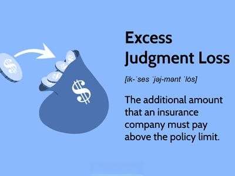

The intersection of default judgments and algorithmic trading presents a unique legal challenge characterized by the increasing convergence of technological innovation, financial systems, and legal processes. As technology advances, particularly in finance, the lines between legal and technical domains become increasingly blurred, introducing complexities that stakeholders must navigate carefully.

Algorithmic trading, utilizing sophisticated algorithms and high-speed data processing, has revolutionized the manner in which financial markets operate. However, the automated nature of these systems introduces a layer of risk concerning legal accountability and regulatory compliance. One such legal aspect is the concept of default judgments. A default judgment occurs when a defendant fails to engage with a legal action against them, leading the court to rule in favor of the plaintiff by default. This legal mechanism, while straightforward, can have profound implications for entities operating in financial markets.



The increasing complexity of the financial landscape is accompanied by intricate legal frameworks that financial traders and institutions must work within to avoid adverse outcomes such as default judgments. Understanding the procedural nuances of default judgments and their implications on financial operations is crucial. A failure to do so not only risks unfavorable legal outcomes but can significantly disrupt trading methodologies and ultimately affect market stability.

This article examines how court rulings on default judgments impact the world of trading, with a particular lens on algorithmic strategies. We explore the broader scope of legal procedures in this context, emphasizing the importance of proactive strategies to mitigate risks. In navigating this landscape, financial entities must ensure robust legal compliance and maintain strategic communication channels to prevent default judgments that could result in severe financial penalties.

As legal rulings continue to influence financial activities, especially in the context of rapidly evolving algorithmic trading, it becomes critical for financial institutions to align their operational strategies with legal requirements. This alignment not only safeguards against potential financial detriments but also ensures sustainable operations within the regulatory frameworks that govern these sectors.

## Table of Contents

## Understanding Court Rulings and Default Judgments

A default judgment is a legal determination made by a court when the defendant in a case fails to respond or appear before the court, resulting in a favorable outcome for the plaintiff by default. This procedural device serves as a consequence for the defendant's inaction, thereby simplifying the judicial process and preserving judicial resources. However, for entities, particularly those operating within the financial markets, such judgments can have substantial ramifications.

In the financial sectors, the repercussions of default judgments are amplified due to the interconnectedness and the scale at which these entities operate. Financial institutions, traders, and corporations may face severe operational and financial setbacks if subjected to a default judgment. The implications often include monetary damages, reputational harm, and disruptions to business operations.

Federal Rules of Civil Procedure, particularly Rule 55, set forth the guidelines for entering default judgments. Rule 55 outlines the procedural requirements, such as the necessity for personal service of the summons and complaint to the defendant, ensuring that the defendant has been adequately notified about the legal proceedings. Furthermore, there is an emphasis on the validity of the plaintiff's claim, mandating that the claim be sufficiently pleaded to justify such a judgment.

However, differences in legal frameworks across jurisdictions necessitate a comprehensive understanding by companies of both state and federal rules applicable to them. For instance, certain states may impose additional requirements for obtaining a default judgment or provide more leniency in setting aside these judgments upon a showing of cause by the defendant.

When a court can assess damages in default judgment proceedings without the defendant's participation, the financial consequences can be severe. The court's determination may lead to substantial monetary liabilities, significantly affecting the defendant's financial standing and market presence. The potential for disproportionate damages highlights the need for financial entities to implement robust risk management and legal response strategies.

Ultimately, understanding the principles and implications of default judgments is essential for financial institutions aiming to minimize legal and financial risks. By proactively ensuring compliance with procedural rules and engaging promptly with legal matters, these entities can better protect their interests and maintain operational stability.

## Legal Procedures in Algorithmic Trading

Algorithmic trading relies heavily on sophisticated computational systems programmed with specific guidelines to execute trades at speeds and efficiencies that surpass human capabilities. As such, the legal procedures surrounding these systems are crucial, particularly concerning compliance and litigation risks.

Increased automation in the trading sphere necessitates that companies engaged in [algorithmic trading](/wiki/algorithmic-trading) develop strategies to avoid potential default judgments. These strategies often include maintaining robust legal and compliance teams adept at navigating the complex regulatory environments. The goal for these teams is to ensure adherence to applicable laws and to preemptively address any potential legal conflicts that may arise from the deployment and operation of trading algorithms.

A fundamental risk associated with default judgments in this context concerns fiduciary duties, wherein algorithmic systems must operate within the ethical and legal frameworks established to protect investors' interests. Any deviation from these obligations due to algorithmic errors or oversights can challenge the operational integrity of these systems, leading to significant legal liabilities.

Moreover, adopting proactive legal measures is critical. This involves implementing comprehensive risk management protocols designed to identify and rectify potential legal discrepancies within the automated trading processes. Regular audits and updates to algorithmic systems ensure continuous compliance with evolving legal standards and financial regulations. For example, ensuring algorithms do not engage in prohibited trading practices, such as spoofing or manipulation, is imperative to avoid legal repercussions.

By upholding stringent compliance measures and fortifying legal defenses, algorithmic trading firms can mitigate the risks associated with default judgments. These efforts not only protect against immediate legal challenges but also preserve the long-term viability and competitiveness of these trading entities in the financial markets.

## Prevention and Mitigation Strategies

To avoid default judgments, companies involved in algorithmic trading should prioritize compliance with legal summons and adhere strictly to court protocols. This can be achieved through multiple proactive strategies. Firstly, it is essential for firms to establish efficient communication channels that ensure swift and accurate processing of legal notices. This step significantly reduces the possibility of oversight and consequent default judgments.

Legal teams within trading firms should routinely review and assess trading algorithms to ensure they comply with relevant regulations. Regulations can be intricate and vary by jurisdiction, so keeping algorithmic strategies aligned with legal guidelines is an ongoing requirement. Regular audits and updates can prevent non-compliance issues that might expose firms to legal risks.

Implementing risk management systems is another critical strategy. These systems can automatically detect potential legal conflicts through anomaly detection or pattern recognition techniques within trading activities. For instance, employing [machine learning](/wiki/machine-learning) models that flag unusual trading behaviors or potential breaches of regulatory conditions can provide a preemptive solution to legal challenges.

In Python, a basic example of such a system might include employing a library like scikit-learn to develop a model that analyzes trading patterns:

```python
from sklearn.ensemble import IsolationForest
import numpy as np

# Sample trading data
trading_data = np.array([[5000, 1.2],
                         [5200, 1.1],
                         [4800, 1.5],
                         [9000, 2.7]])  # Features could include trade size and volatility indexes

# Create and train Isolation Forest model
clf = IsolationForest(random_state=0).fit(trading_data)

# Detect anomalies
anomalies = clf.predict(trading_data)

# Output: -1 for anomaly, 1 for normal
print(anomalies)
```

In scenarios where a default judgment occurs, understanding corrective legal actions is crucial. One of the key measures is filing motions to vacate the judgment. This legal move allows the affected party to contest or nullify the judgment by presenting valid reasons or demonstrating procedural errors. Awareness and prompt action in such cases can significantly mitigate the adverse effects of default judgments on the company.

In conclusion, algorithmic trading firms can better shield themselves from default judgments by fostering robust compliance frameworks, leveraging advanced risk management technologies, and being prepared with effective legal remedies. This comprehensive approach ensures operational efficacy and legal compliance in a rapidly evolving financial landscape.

## Impact on the Financial Market

Default judgments can have a profound impact on financial markets, especially in the context of algorithmic trading. These judgments, often resulting from a party's failure to appear in court or respond to summons, can impose substantial financial liabilities on firms. When such liabilities arise, they directly influence market performance, as firms must allocate resources to satisfy legal demands, potentially affecting their [liquidity](/wiki/liquidity-risk-premium) and operational efficiency.

Algorithmic trading environments, characterized by the rapid execution of trades through automated systems, are particularly vulnerable to sudden market changes triggered by legal outcomes. An unexpected default judgment can necessitate immediate adjustments to trading algorithms, leading to [volatility](/wiki/volatility-trading-strategies) and unpredictable market behavior. The automated nature of these systems means they can quickly amplify the effects of any changes in the financial status of involved parties, with repercussions spanning multiple asset classes.

Financial stability is further impacted as firms navigate the implications of legal liabilities. Companies need to assess their exposure and develop strategies to mitigate risks associated with default judgments. This necessity underscores the importance of integrating legal risk awareness into their overall financial strategies. By doing so, firms can maintain market confidence and ensure continuity in their operations, even in the face of adverse legal situations.

Broader market trends can also shift as a result of algorithmic recalibrations following legal disputes. When firms alter their trading strategies to account for new liabilities or regulatory requirements, these changes can ripple through the market, influencing everything from trading volumes to price swings. This dynamic highlights the interconnectedness of legal and financial systems and the need for ongoing collaboration between financial professionals and legal experts.

In essence, the impact of default judgments extends beyond immediate financial penalties, influencing broader aspects of market behavior and stability. As the trading sector continues to evolve, the integration of legal considerations into algorithmic models will become increasingly vital, ensuring that firms can adapt to the changing landscape while minimizing risks to their operations and the wider financial system.

## Conclusion

Court rulings on default judgments present unique challenges for algorithmic trading companies, particularly due to the intricate nature of legal procedures and their impact on financial operations. Understanding these legal constructs is imperative for safeguarding against potential financial losses that may arise from such rulings. Algorithmic trading companies must remain vigilant and informed about the evolving legal landscapes that regulate their operations. 

To mitigate risks associated with default judgments, trading firms should implement robust legal and procedural strategies. These strategies can include establishing dedicated compliance teams adept at navigating complex legal requirements and ensuring that automated trading activities conform to all pertinent regulations. By maintaining a proactive legal stance, companies can better align their operations within regulatory frameworks, reducing the likelihood of adverse legal outcomes that could otherwise disrupt financial stability.

Furthermore, there is a critical need for ongoing collaboration between financial technologists and legal experts. Such dialogue can foster greater understanding and adaptation to new legal challenges, enabling firms to anticipate and respond effectively to potential legal conflicts. As the legal environment continues to evolve, this cross-disciplinary communication becomes increasingly vital for the resilience of algorithmic trading operations.

Looking ahead, future trends may reveal a strengthened synergy between legal rulings and market behaviors, necessitating firms to remain prepared for legal developments that may influence trading strategies and market positions. Integrating legal awareness into financial decision-making is crucial for maintaining competitive advantage and market confidence. Consequently, algorithmic trading companies must recognize the importance of preparedness, not only to comply with current legal standards but also to strategize effectively within an ever-dynamic financial landscape.

## References & Further Reading

[1]: Lo, Andrew W. (2017). ["Adaptive Markets: Financial Evolution at the Speed of Thought"](https://www.amazon.com/Adaptive-Markets-Financial-Evolution-Thought/dp/0691135142). Princeton University Press.

[2]: Gomber, Peter, et al. (2011). ["High-Frequency Trading"](https://papers.ssrn.com/sol3/papers.cfm?abstract_id=1858626). Communications of the ACM, Vol. 54 No. 10, Pages 42-46.

[3]: Aldridge, Irene. (2017). ["Real-Time Risk: What Investors Should Know About Fintech, High-Frequency Trading, and Flash Crashes"](https://www.wiley.com/en-us/Real+Time+Risk%3A+What+Investors+Should+Know+About+FinTech%2C+High+Frequency+Trading%2C+and+Flash+Crashes-p-9781119318965). Wiley.

[4]: Hasbrouck, Joel. (2007). ["Empirical Market Microstructure: The Institutions, Economics, and Econometrics of Securities Trading"](https://academic.oup.com/book/52241). Oxford University Press.

[5]: Cartea, Álvaro, et al. (2015). ["Algorithmic and High-Frequency Trading"](https://assets.cambridge.org/97811070/91146/frontmatter/9781107091146_frontmatter.pdf). Cambridge University Press.