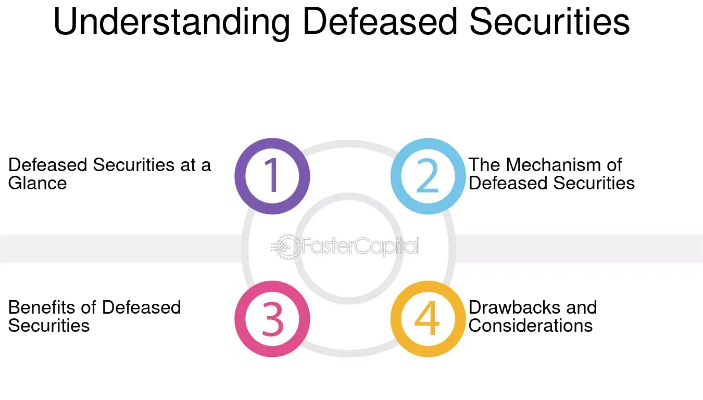

## Table of Contents

## What are defeased securities?

Defeased securities are bonds or other debt instruments where the issuer has set aside enough money or assets to cover all future payments. This means the issuer no longer has to worry about making those payments because the money is already there, in a special account, to take care of it. This process is called "defeasance."

When a bond is defeased, it becomes much safer for investors because the risk of the issuer not being able to pay is greatly reduced. The money set aside usually goes into very safe investments, like government securities, to make sure it will be there when needed. This can make the bond more attractive to buyers, but it also means the issuer can no longer use those funds for other purposes.

## How do defeased securities work?

Defeased securities are bonds where the issuer puts enough money or assets aside to pay all future payments on the bond. This special account is usually filled with safe investments like government securities. By doing this, the issuer makes sure there's enough money to pay the bondholders, even if the issuer faces financial trouble later.

Once the money is set aside, the bond is considered "defeased." This means the issuer doesn't have to worry about making payments anymore because the money is already there. For investors, this makes the bond safer because the risk of not getting paid is very low. However, the issuer can't use that money for anything else once it's in the special account.

## What is the purpose of defeasing securities?

The main purpose of defeasing securities is to remove the risk that the issuer won't be able to make future payments on a bond. When a bond is defeased, the issuer puts enough money into a special account to cover all future payments. This money is usually invested in very safe things like government securities, so it's almost certain to be there when needed. This makes the bond much safer for investors because they know the money will be there to pay them, no matter what happens to the issuer.

Another purpose of defeasing securities is to help the issuer manage their finances better. Once a bond is defeased, the issuer doesn't have to worry about making payments on it anymore. This can free up their cash flow and let them use their money for other things. It can also make it easier for the issuer to get new loans or issue new bonds because their old debt is taken care of. So, defeasing securities can be good for both the issuer and the investors.

## What types of securities can be defeased?

Defeased securities are usually bonds, which are like loans that companies or governments sell to people to get money. The most common types of bonds that can be defeased are municipal bonds, which are issued by local governments, and corporate bonds, which are issued by companies. These bonds can be defeased when the issuer puts enough money into a special account to pay back all the bondholders.

The money in this special account is often invested in very safe things like government securities, like U.S. Treasury bonds. This makes sure the money will be there to pay the bondholders, no matter what happens to the issuer. Besides bonds, other types of debt like mortgages or other loans can also be defeased, but it's less common. Defeasing these securities makes them safer for the people who own them because the risk of not getting paid goes down a lot.

## What are the benefits of investing in defeased securities?

Investing in defeased securities can be a good choice because they are very safe. When a bond is defeased, the issuer puts enough money into a special account to pay back all the bondholders. This money is usually invested in very safe things like government securities, so it's almost certain to be there when you need it. This means there's a very low risk that you won't get your money back, which can make defeased securities a good choice if you want to keep your investment safe.

Another benefit of investing in defeased securities is that they can give you a steady income. Since the money to pay back the bondholders is already set aside, you can count on getting regular payments. This can be helpful if you need a reliable source of income. Plus, because defeased securities are safer, they can be a good addition to a balanced investment portfolio, helping to lower the overall risk of your investments.

## What are the risks associated with defeased securities?

Even though defeased securities are considered safe, there are still some risks to think about. One risk is that the money set aside to pay back the bondholders might not be enough if something unexpected happens. For example, if the government securities that the money is invested in lose value, there might not be enough money to pay everyone back. This is rare, but it can happen.

Another risk is that defeased securities might not give you as much return on your investment as other types of bonds. Because they are safer, they usually don't pay as much interest. If you want to make more money, you might have to look at other investments that are riskier but offer higher returns. So, while defeased securities are a good choice if you want to keep your money safe, they might not be the best if you're looking to grow your money quickly.

## How does the defeasance process affect bondholders?

When a bond is defeased, it usually means good news for bondholders. The issuer puts enough money into a special account to pay back all the bondholders. This money is often invested in very safe things like government securities, so it's almost certain to be there when you need it. This makes the bond safer because the risk of not getting paid goes down a lot. So, if you own a defeased bond, you can feel more secure knowing that your money is safe.

However, there are also some things to think about. Defeased bonds might not pay as much interest as other bonds because they are safer. If you want to make more money, you might need to look at other investments that are riskier but offer higher returns. Also, while it's rare, there's a small chance that the money set aside might not be enough if something unexpected happens, like if the government securities lose value. So, while defeased securities can be a good choice if you want to keep your money safe, they might not be the best if you're looking to grow your money quickly.

## What is the difference between legal defeasance and economic defeasance?

Legal defeasance and economic defeasance are two ways that issuers can set aside money to pay back bonds. In legal defeasance, the issuer puts enough money into a special account to cover all future payments on the bond. Once this is done, the issuer is legally released from any obligation to the bondholders. This means the bond is no longer considered a debt of the issuer, and it can be taken off their financial statements. This is good for the issuer because it makes it easier for them to borrow more money or issue new bonds.

Economic defeasance, on the other hand, also involves setting aside money to pay back the bond, but it doesn't legally release the issuer from their obligations. The issuer still has to report the bond as a debt on their financial statements. The main benefit of economic defeasance is that it makes the bond safer for investors because the risk of not getting paid is lower. However, it doesn't help the issuer as much as legal defeasance because they still have to show the bond as a debt. So, while both types of defeasance make the bond safer, legal defeasance is better for the issuer, and economic defeasance is more about making investors feel secure.

## How is the defeasance of securities structured?

When securities like bonds are defeased, the issuer sets up a special account and puts enough money in it to pay back all the bondholders. This money is usually invested in very safe things like government securities, so it's almost certain to be there when needed. The goal is to make sure that even if the issuer has financial problems later, the bondholders will still get their money. This makes the bond safer for investors because the risk of not getting paid goes down a lot.

The structure of defeasance can be either legal or economic. In legal defeasance, once the money is set aside, the issuer is legally released from any obligation to the bondholders. This means the bond is no longer considered a debt of the issuer, and it can be taken off their financial statements. This is good for the issuer because it makes it easier for them to borrow more money or issue new bonds. In economic defeasance, the money is also set aside, but the issuer is still legally responsible for the bond. The bond remains on their financial statements as a debt, but it's safer for investors because the risk of not getting paid is lower.

## What role do escrow accounts play in defeased securities?

Escrow accounts are very important when securities like bonds are defeased. When a bond is defeased, the issuer puts money into an escrow account to make sure there's enough to pay back all the bondholders. This money is usually invested in very safe things like government securities, so it's almost certain to be there when needed. The escrow account acts like a safe place to keep the money until it's time to pay the bondholders. This makes the bond safer for investors because the risk of not getting paid goes down a lot.

The use of an escrow account in defeasance helps both the issuer and the bondholders. For the issuer, putting money into an escrow account can mean they are legally released from their obligation to pay the bond if it's a legal defeasance. This can help the issuer's financial situation by removing the bond as a debt from their books. For bondholders, the escrow account means their money is safe and they will get paid no matter what happens to the issuer. So, escrow accounts are key to making defeased securities work well for everyone involved.

## How do changes in interest rates impact defeased securities?

Changes in interest rates can affect defeased securities, but usually not as much as other types of bonds. When a bond is defeased, the issuer puts money into an escrow account to pay back the bondholders. This money is often invested in safe things like government securities. If interest rates go up, the value of these securities might go down a bit, but since they are so safe, the impact is usually small. This means that defeased securities are less sensitive to interest rate changes than other bonds.

However, there can still be some effects. If interest rates rise a lot, the money in the escrow account might not grow as much as expected. This could mean there's less money to pay back the bondholders than planned. But this is rare because the securities in the escrow account are chosen to be very safe and stable. So, while interest rate changes can have some impact on defeased securities, they are still a good choice if you want to keep your investment safe.

## What are some real-world examples of defeased securities?

One real-world example of defeased securities happened in 2017 when the city of Chicago defeased some of its municipal bonds. The city put enough money into an escrow account to pay back the bondholders. This money was invested in U.S. Treasury securities, which are very safe. By doing this, Chicago made sure that the bondholders would get their money, even if the city had financial problems later. This made the bonds safer for investors and helped the city manage its debt better.

Another example is when a big company, like AT&T, defeased some of its corporate bonds. In 2019, AT&T set aside money in an escrow account to cover all future payments on these bonds. The money was invested in safe government securities. This meant that even if AT&T faced financial trouble, the bondholders would still get paid. This made the bonds more attractive to investors because they knew their investment was safe. It also helped AT&T by freeing up their cash flow for other uses.

## References & Further Reading

[1]: Bergstra, J., Bardenet, R., Bengio, Y., & Kégl, B. (2011). ["Algorithms for Hyper-Parameter Optimization."](https://dl.acm.org/doi/10.5555/2986459.2986743) Advances in Neural Information Processing Systems 24.

[2]: ["Advances in Financial Machine Learning"](https://www.amazon.com/Advances-Financial-Machine-Learning-Marcos/dp/1119482089) by Marcos Lopez de Prado

[3]: ["Evidence-Based Technical Analysis: Applying the Scientific Method and Statistical Inference to Trading Signals"](https://www.amazon.com/Evidence-Based-Technical-Analysis-Scientific-Statistical/dp/0470008741) by David Aronson

[4]: ["Machine Learning for Algorithmic Trading"](https://github.com/stefan-jansen/machine-learning-for-trading) by Stefan Jansen

[5]: ["Quantitative Trading: How to Build Your Own Algorithmic Trading Business"](https://www.amazon.com/Quantitative-Trading-Build-Algorithmic-Business/dp/1119800064) by Ernest P. Chan