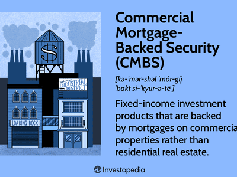

The financial landscape is undergoing a transformative shift, driven by the integration of algorithmic trading, defeased securities, and sophisticated financial mechanisms. These developments are reshaping market dynamics and offering new avenues for risk management and profit generation. Algorithmic trading, utilizing advanced algorithms and AI, is enabling high-frequency transactions and data-driven strategies, allowing traders to operate with heightened efficiency and precision. Meanwhile, defeased securities provide a stable, risk-averse investment option backed by secure financial instruments such as government bonds. These securities offer predictable returns while removing liabilities from an issuer's balance sheet, thus appealing to investors seeking financial stability.

Understanding these concepts is essential for both investors and financial professionals aspiring to refine their market strategies. By recognizing the benefits and challenges associated with these advanced financial tools, one can better navigate the complexities of modern finance. This exploration focuses on the intersection of defeased securities, investment strategies, and algorithmic trading technologies, considering how they work collectively to optimize investment opportunities while minimizing associated risks.



This article aims to dissect the dynamics of these components and their interplay within the current financial ecosystem. The subsequent sections will provide a comprehensive analysis of each element, considering its implications for various sectors such as corporate finance, real estate, and public sector financial management. As we set the foundation for deeper exploration, our objective is to equip readers with insights to adapt to the constantly evolving financial environment, thus enhancing their capability to capitalize on emerging opportunities and safeguard their investment portfolios.

## Table of Contents

## Understanding Defeased Securities

Defeased securities play a critical role in financial markets by providing a low-risk investment option. These securities are characterized by being backed with risk-free financial instruments, typically government bonds. This backing ensures a level of stability and predictability in returns, making defeased securities attractive to risk-averse investors.

The process of defeasance is instrumental in transforming these securities. It involves replacing outstanding obligations with secure assets. When an issuer opts for defeasance, they essentially eliminate liabilities from their balance sheet; the securities are retired, and the issuer's obligations are removed. The assets set aside to back these securities are generally held in an irrevocable trust, with cash flows sufficient to cover all debt service payments until maturity.

The benefits of defeased securities are multifaceted. Investors often seek them for their safety, predictable returns, and immunity to market volatility. Moreover, they can enhance an issuer's credit standing by removing debt from the balance sheet, leading potentially to more favorable finance terms for future borrowing.

However, defeased securities also come with limitations. The yields on these securities tend to be lower than those of more speculative investments given their risk-averse nature. Furthermore, defeasance can involve significant upfront costs, as the issuer must acquire sufficient assets to cover future obligations fully.

In terms of applications, defeased securities are prevalent across corporate finance, real estate, and public sector financial management. In corporate finance, companies may use defeasance to restructure their capital and improve financial ratios, such as debt-to-equity and interest coverage. In real estate, defeasance can play a pivotal role during loan refinancing, allowing property owners to release collateral and attain more favorable financing terms. Public sector entities widely use defeasance when managing municipal bonds. It aids in aligning with fiscal responsibility norms and complying with regulatory requirements.

Defeased securities, through their unique structure, are an instrumental part of modern financial markets. They offer risk mitigation and strategic benefits for both issuers and investors, underscoring their continued relevance in diverse economic landscapes.

## Algorithmic Trading: An Overview

Algorithmic trading, a powerful force in financial markets, facilitates rapid transactions and utilizes data-driven strategies. By leveraging sophisticated algorithms and [artificial intelligence](/wiki/ai-artificial-intelligence) (AI), traders can automate asset transactions with remarkable speed, enabling them to capitalize on fleeting market opportunities.

The core principles of [algorithmic trading](/wiki/algorithmic-trading) focus on enhancing efficiency and reducing costs. Algorithms analyze vast datasets to identify patterns and execute trades, minimizing human intervention and errors. These algorithms are capable of processing large volumes of data at speeds unattainable by human traders, executing trades at optimal prices. High-frequency trading ([HFT](/wiki/high-frequency-trading-strategies)), a subset of algorithmic trading, epitomizes speed and precision, executing thousands of trades per second.

However, algorithmic trading is not without its challenges. Market manipulation risks, such as spoofing and layering, can arise, where traders create false orders to mislead others. Regulatory concerns are significant; governing bodies like the U.S. Securities and Exchange Commission (SEC) impose strict regulations to ensure market fairness and prevent abuse.

AI enhances trading strategies by enabling predictive analytics and market adaptation. Machine learning algorithms can process historical data to forecast future price movements and adjust strategies accordingly. For instance, a predictive model might utilize a variety of inputs, such as moving averages or sentiment analysis, to anticipate market trends. Python, widely used for algorithmic trading, offers libraries like pandas for data manipulation, NumPy for numerical calculations, and scikit-learn for [machine learning](/wiki/machine-learning) tasks:

```python
import pandas as pd
from sklearn.ensemble import RandomForestRegressor

# Load historical market data
data = pd.read_csv('market_data.csv')

# Feature engineering
data['moving_average'] = data['price'].rolling(window=5).mean().shift(1)

# Model training
features = data[['moving_average']]
target = data['price']

model = RandomForestRegressor(n_estimators=100)
model.fit(features, target)

# Predict future prices
predictions = model.predict(features)
```

The continuous evolution of AI and trading technologies suggests a future where trading strategies become even more sophisticated and adaptive to market changes. Consequently, algorithmic trading stands as both a transformative technology and a complex regulatory challenge, reshaping modern financial ecosystems.

## Investment Strategies with Defeased Securities

Incorporating defeased securities into investment portfolios offers a blend of stability and reduced credit risk, making them a strategic choice for various investors. Defeased securities, often backed by risk-free assets such as government bonds, provide predictable returns and significantly mitigate credit risks. By securing outstanding debts with safe assets, investors can preserve their portfolios' integrity and stability.

Investors utilize defeased securities to enhance long-term financial outcomes by employing strategies that capitalize on their low-risk profile. For instance, pension funds and insurance companies, which prioritize capital preservation and stable returns, often allocate a portion of their portfolios to defeased securities. This allocation helps in fortifying the overall portfolio against market [volatility](/wiki/volatility-trading-strategies) and credit events. Furthermore, the certainty of cash flow from defeased securities can be an attractive feature for investors seeking predictable income streams.

Comparisons between defeased securities and other investment types highlight the unique trade-offs they present in terms of yield, risk, and [liquidity](/wiki/liquidity-risk-premium). While defeased securities generally offer lower yields compared to riskier assets like equities or corporate bonds, their appeal lies in the reduced risk of default and minimal impact from market fluctuations. This makes them particularly suitable for risk-averse investors or those with specific liability matching requirements. In terms of liquidity, defeased securities may be less liquid compared to some corporate bonds or equities due to their specialized nature and the long-term horizon typically associated with them.

Case studies provide insight into successful investment strategies involving defeased securities under varying market conditions. During periods of economic uncertainty or rising interest rates, portfolios with a higher allocation to defeased securities have demonstrated resilience and protection against downside risks. For example, during the 2008 financial crisis, investment portfolios with significant exposure to defeased securities experienced less volatility and capital loss compared to those heavily weighted in more risky asset classes.

The impact of defeased securities on financial ratios and credit ratings is a crucial [factor](/wiki/factor-investing) in their attractiveness within corporate finance. By holding defeased securities, corporations can improve their credit profile, as these assets often lead to a favorable assessment of creditworthiness from rating agencies. The enhancement in credit ratings can lead to reduced borrowing costs and greater access to capital markets, providing companies with funding advantages.

In summary, defeased securities play a crucial role in investment strategies aimed at stability and risk reduction. Their ability to offer secure returns and improve financial metrics makes them an essential component of diversified portfolios, particularly for investors focused on maintaining capital and securing predictable income flows in varying market conditions.

## The Role of Financial Mechanisms in Algorithmic Trading

Financial mechanisms are essential in supporting the complex world of algorithmic trading, providing the foundation upon which these advanced operations and strategies are built. At the core of these mechanisms are systems that manage risk, control latency, and ensure compliance with regulatory standards. Each plays a crucial role in safeguarding the integrity of trades and protecting against the systemic risks often associated with high-frequency trading.

Risk management systems are an integral part of algorithmic trading. They identify, assess, and prioritize different risks, allowing traders to make informed decisions to mitigate them effectively. These systems use quantitative models to predict market movements and manage potential losses. Techniques such as Value at Risk (VaR) and stress testing are commonly implemented to evaluate the risk levels. VaR, for instance, measures the maximum potential loss over a given period with a specified confidence level. 

Latency controls are equally vital. In algorithmic trading, where speed is a crucial factor, latency—or the delay between an order being placed and executed—can significantly affect performance. Mechanisms to minimize latency include optimizing network architecture and using co-location services, where trading firms place their servers close to exchange infrastructure to gain microsecond advantages.

Compliance with regulatory standards is another cornerstone of financial mechanisms. Regulations are designed to promote fair trading, prevent market abuse, and protect investors. Algorithmic trading firms must ensure that their systems adhere to these regulations, which may involve periodic audits, proper documentation of trading activities, and implementation of pre-trade and post-trade controls to detect and prevent malpractices.

Balancing innovation and market stability is a delicate task, requiring policies and technologies that encourage advancements while safeguarding market integrity. As algorithmic strategies become more sophisticated, it is crucial for financial mechanisms to evolve accordingly. Machine learning models, for instance, are increasingly utilized for predictive analytics and dynamic market adaptation, but they also introduce new challenges in terms of model risk and interpretability.

Looking to the future, several trends are likely to impact the financial mechanisms supporting algorithmic trading. With the continuous evolution of regulatory environments, firms will need to remain agile to ensure compliance. Meanwhile, technological advancements such as quantum computing and blockchain could drive further innovation, offering new ways to enhance trading speed and security.

The implementation of these advanced technologies and robust financial mechanisms will shape the efficacy and integrity of algorithmic trading, enabling investors to achieve optimized outcomes in a dynamic financial landscape. Maintaining this balance will be critical as the market continues to evolve, highlighting the necessity for continuous adaptation and learning.

## Conclusion and Future Outlook

The integration of defeased securities, financial mechanisms, and algorithmic trading represents a defining evolution within the contemporary finance sector. This triad creates a robust financial ecosystem that enables investors to maximize both security and profitability. By employing strategic investment approaches, leveraging cutting-edge trading technologies, and adhering to regulatory frameworks, stakeholders are equipped to achieve superior outcomes that balance risk and reward.

Advancements in artificial intelligence and related financial technologies are poised to further shape the future of trading and investment practices. AI's capacity for predictive analytics and real-time data processing, for instance, enhances traders' ability to capitalize on market trends dynamically. Furthermore, the evolution of financial mechanisms continues to improve the efficiency and integrity of trading operations, offering tools for rapid adaptation and response to market fluctuations.

Understanding these interconnected components is essential for finance professionals navigating the complex landscape. Knowledge of how defeased securities provide risk mitigation and predictable returns is crucial, as is comprehension of algorithmic trading's role in executing fast, efficient transactions. Together, these elements allow for an optimized investment strategy that is both comprehensive and resilient.

As technological innovation propels the market forward, maintaining an ethos of continuous learning and adaptation is imperative. Professionals must remain vigilant in updating their knowledge and skills to harness the opportunities presented by evolving financial instruments and technologies. This proactive approach will enable investors and traders to sustain and enhance their competitive advantage in a rapidly changing financial environment.

## References & Further Reading

[1]: Bergstra, J., Bardenet, R., Bengio, Y., & Kégl, B. (2011). ["Algorithms for Hyper-Parameter Optimization."](https://dl.acm.org/doi/10.5555/2986459.2986743) Advances in Neural Information Processing Systems 24.

[2]: ["Advances in Financial Machine Learning"](https://www.amazon.com/Advances-Financial-Machine-Learning-Marcos/dp/1119482089) by Marcos Lopez de Prado

[3]: ["Evidence-Based Technical Analysis: Applying the Scientific Method and Statistical Inference to Trading Signals"](https://www.amazon.com/Evidence-Based-Technical-Analysis-Scientific-Statistical/dp/0470008741) by David Aronson

[4]: ["Machine Learning for Algorithmic Trading"](https://github.com/stefan-jansen/machine-learning-for-trading) by Stefan Jansen

[5]: ["Quantitative Trading: How to Build Your Own Algorithmic Trading Business"](https://www.amazon.com/Quantitative-Trading-Build-Algorithmic-Business/dp/1119800064) by Ernest P. Chan