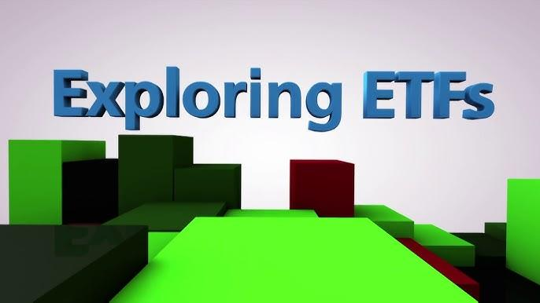

The recent geopolitical climate has seen increased tensions, largely due to North Korea's active participation in supporting Russia's ongoing military efforts. This emerging alliance has significantly heightened global uncertainty and has directed investor attention towards defense-related assets. As nations brace for potential escalations, defense spending is witnessing substantial growth, prompting investors to seek financial instruments that can effectively hedge against these geopolitical risks.

Defense Exchange-Traded Funds (ETFs) have emerged as a key interest for investors in this context. These financial products offer a way to gain exposure to companies in the defense and aerospace sectors, which are expected to benefit from increased government expenditures and heightened security concerns. As a result, defense ETFs are becoming increasingly attractive to those looking to capitalize on the anticipated growth in these industries while managing the risks that come with geopolitical instability.



This article examines the intricate relationship between the rising tensions involving North Korea and the performance of defense ETFs. By understanding this dynamic, investors can better navigate the risks and opportunities presented by this volatile period. Additionally, we will discuss the role of algorithmic trading, which offers sophisticated tools to refine investment strategies, thereby enhancing the ability to predict and respond to market changes more effectively. As geopolitical dynamics continue to evolve, these advanced trading methodologies could prove critical for optimizing defense-related investment portfolios.

## Table of Contents

## Understanding Defense ETFs

Defense ETFs are investment funds that focus on stocks of companies operating in the defense sector, providing investors with exposure to businesses involved in military and aerospace activities. This sector encompasses a range of industries from weapons manufacturing to aerospace engineering, each contributing to national and global security efforts. By investing in defense ETFs, investors are essentially purchasing a portfolio of shares of companies that produce defense and aerospace products or services.

Several prominent defense ETFs offer a means for investors to engage with this sector:

1. **SPDR S&P Aerospace & Defense ETF (XAR):** This fund aims to represent the performance of the S&P Aerospace & Defense Select Industry Index, which includes a variety of companies in the defense industry. It provides diversified exposure to defense and aerospace sectors by holding stocks of companies like Lockheed Martin and Boeing.

2. **iShares U.S. Aerospace & Defense ETF (ITA):** Managed by BlackRock, ITA seeks to track the performance of the Dow Jones U.S. Select Aerospace & Defense Index. This ETF is designed to capture the growth of some of the largest defense contractors, benefiting from rising defense budgets.

3. **Invesco Aerospace & Defense ETF (PPA):** Similar to the aforementioned ETFs, PPA is structured to reflect the SPADE Defense Index. This ETF encompasses a range of companies engaged in defense, homeland security, aerospace, and related technologies.

These ETFs generally track indices tailored to capture the performance dynamics of defense and aerospace stocks. Such indices are composed of companies that derive a significant portion of their revenues from the defense and aerospace sectors. This approach helps in mitigating the [volatility](/wiki/volatility-trading-strategies) associated with investing in individual defense stocks by offering a diversified portfolio, thus reducing risk.

Investors are drawn to these ETFs due to their ability to leverage current geopolitical situations that often lead to increased defense spending. As defense budgets globally are often responsive to geopolitical tensions, these ETFs are positioned to benefit from rises in defense expenditure. Moreover, the participation of these ETFs in the broader stock market context allows them to potentially share in the overall growth of the aerospace and defense industries.

In summary, defense ETFs present a structured investment option focusing on the defense sector’s promising aspects, enabling investors to capitalize on growth opportunities within military and aerospace industries. Through diversification and strategic portfolio compositions, these funds aim to deliver returns that align with the financial health and expansion of the defense market.

## North Korean Tensions and Market Dynamics

North Korea's ongoing geopolitical maneuvers, characterized by periodic missile tests and provocative rhetoric, continue to exert significant influence on global defense markets. Over the years, North Korea has strategically utilized these tactics to bolster its international standing and project power. This persistent state of tension has led to pronounced fluctuations in defense-related investments, as markets react to the potential for heightened conflict.

In recent times, the collaboration between North Korea and Russia has heightened these tensions. Their cooperation, often centered around military technology and mutual geopolitical objectives, has intensified the global spotlight on defense capabilities and assets. This alliance has been perceived as a strategic challenge, particularly by South Korea and its allied nations, resulting in an increased demand for defense stocks. In response, countries under perceived threat, such as South Korea, have bolstered their defense budgets and strengthened military readiness, directly influencing market dynamics within the defense sector.

The volatile relationship between geopolitical events and defense stock movements provides a landscape of both challenges and opportunities for investors. For instance, sudden escalations in geopolitical tensions can lead to rapid increases in defense stock prices, as the demand for military hardware and technology surges. Conversely, diplomatic resolutions or de-escalations could lead to a decrease in stock valuations as perceived risks diminish.

Investors navigating these circumstances must remain vigilant, recognizing that defense stock volatility is inherently linked to geopolitical developments. The complexity of global political interplay means that sudden changes can occur, impacting investment portfolios based on defense assets. Therefore, a nuanced understanding of geopolitical trends and their potential impact on market dynamics is essential for investors seeking to capitalize on opportunities while mitigating associated risks.

## Investment Strategies for Defense ETFs

Investment strategies involving Defense ETFs can provide investors with a means to mitigate risks associated with geopolitical instability. Diversifying portfolios with these ETFs offers exposure to the defense and aerospace industries, which often experience increased demand during times of geopolitical tension.

Key considerations in selecting Defense ETFs include expense ratios, holdings, and annualized returns. The expense ratio is an important [factor](/wiki/factor-investing), as it constitutes the annual fee paid by the investor to manage the fund. Lower expense ratios can significantly improve net returns over time, particularly for long-term investments. Holdings of the [ETF](/wiki/etf-trading-strategies) are another critical factor, as they determine the direct exposure to various sectors within the defense industry. Evaluating the specific companies and industries represented within the ETF can offer insights into potential performance based on current geopolitical dynamics.

Annualized returns provide a historical context for how the ETF has performed over a given period. They reflect not only the past performance of the ETF but also the implications of underlying market conditions. Analyzing these returns can help identify ETFs that have demonstrated resilience and growth through varying market climates.

For long-term investors, focusing on ETFs with proven resilience and growth is crucial. These investors should assess historical data and trends to identify ETFs that consistently deliver positive returns despite market fluctuations. Holding such ETFs over time can capitalize on compounding growth, aiding in wealth accumulation regardless of short-term geopolitical developments.

Conversely, short-term investors may seek to exploit market volatility by engaging in strategic trades. These investors often employ tactics such as [momentum](/wiki/momentum) trading or mean reversion strategies. Momentum trading entails investing in ETFs that are currently experiencing upward price trends, with the expectation that these trends will continue. Mean reversion strategies, on the other hand, involve capitalizing on short-term price corrections, buying when stocks are undervalued and selling when they recover.

Python can be utilized to enhance the analysis and selection of Defense ETFs. A simple example is using Python to evaluate historical performance data and calculate metrics like moving averages or volatility indices. This can be done using libraries such as Pandas and NumPy:

```python
import pandas as pd
import numpy as np

# Load ETF historical data
data = pd.read_csv('defense_etf_data.csv')
data['Date'] = pd.to_datetime(data['Date'])
data.set_index('Date', inplace=True)

# Calculate moving averages
data['50_MA'] = data['Close'].rolling(window=50).mean()
data['200_MA'] = data['Close'].rolling(window=200).mean()

# Calculate volatility
data['Volatility'] = data['Close'].pct_change().rolling(window=30).std() * np.sqrt(252)

# Display the calculated data
print(data[['Close', '50_MA', '200_MA', 'Volatility']].tail())
```

In conclusion, by considering factors such as expense ratios, holdings, and annualized returns, along with employing strategic trading methods, investors can effectively leverage Defense ETFs as part of a diversified investment portfolio.

## Algorithmic Trading and Defense ETFs

Algorithmic trading has become integral to modern financial markets, significantly enhancing investment strategies across various asset classes, including defense ETFs. Employing sophisticated algorithms, traders can process vast amounts of data swiftly, allowing them to identify trends and predict market behaviors with greater accuracy than traditional trading methods.

One of the primary advantages of [algorithmic trading](/wiki/algorithmic-trading) is its ability to execute trades rapidly based on complex criteria that human traders might miss. These algorithms can analyze market data, news, and geopolitical developments in real time, facilitating more informed decision-making. In the context of defense ETFs, this capability is crucial, as the sector is highly sensitive to geopolitical events. For example, shifts in defense policies or military tensions can cause significant market fluctuations, which algorithms can respond to almost instantaneously.

Moreover, algorithmic trading models can evaluate various quantitative factors such as price momentum, trading [volume](/wiki/volume-trading-strategy), and historical volatility to optimize the timing and selection of trades. Predictive analytics, supported by [machine learning](/wiki/machine-learning) techniques, enhance these models by learning from historical data to forecast future price movements. For instance, a [reinforcement learning](/wiki/reinforcement-learning) model might adjust a portfolio of defense ETFs by maximizing expected returns based on simulated market conditions influenced by potential geopolitical scenarios.

A simple illustration of algorithmic trading in action involves moving averages, a common technical indicator. Consider the use of a short-term moving average (SMA) and a long-term moving average (LMA) to generate trading signals. A Python implementation might look like this:

```python
def calculate_moving_average(prices, window):
    return prices.rolling(window=window).mean()

def generate_trading_signal(prices, short_window, long_window):
    sma = calculate_moving_average(prices, short_window)
    lma = calculate_moving_average(prices, long_window)

    # Buy signal when short-term MA crosses above long-term MA
    # Sell signal when short-term MA crosses below long-term MA
    buy_signal = (sma > lma) & (sma.shift(1) <= lma.shift(1))
    sell_signal = (sma < lma) & (sma.shift(1) >= lma.shift(1))

    return buy_signal, sell_signal

# Example application with hypothetical defense ETF prices
import pandas as pd

# Hypothetical price data
prices = pd.Series([120, 122, 121, 123, 125, 124, 126, 127, 125, 128])

# Calculate signals
short_window = 2
long_window = 4
buy_signal, sell_signal = generate_trading_signal(prices, short_window, long_window)

print("Buy signal on days:", buy_signal[buy_signal].index.tolist())
print("Sell signal on days:", sell_signal[sell_signal].index.tolist())
```

In this example, the algorithm triggers buy and sell signals based on the crossing points of SMAs, a strategy that could be applied to defense ETFs during volatile periods.

Furthermore, algorithms can parse text data from news sources covering geopolitical developments, assess sentiments, and quantify their potential impact on defense sectors. Natural Language Processing (NLP) techniques can enhance these capabilities, leading to more nuanced interpretations of market conditions and improved trading outcomes.

Ultimately, the integration of algorithmic trading in the management of defense ETFs presents investors with a robust tool to navigate the complexities of a rapidly evolving geopolitical landscape. By leveraging precise, data-driven insights, investors can achieve a more dynamic approach to ride the ebbs and flows of defense market trends.

## Conclusion

Defense ETFs provide investors with a strategic avenue during times of geopolitical instability, particularly by offering access to industries pivotal to national security—defense and aerospace. These sectors often see increased government spending in response to global security tensions, such as those currently involving North Korea. The geopolitical maneuvers of North Korea, coupled with its interactions with Russia, have heightened the focus on defense markets, impacting both investor sentiment and market performance.

In this evolving landscape, the role of algorithmic trading can be significant. The ability to process and analyze vast amounts of market data swiftly enables the identification of complex trends that can drive informed investment decisions. The integration of algorithmic strategies can enhance portfolio management by optimizing trade execution based on precise market conditions that human traders might overlook. 

Moreover, the union of geopolitical insights and advanced technological tools in trading establishes a framework for mitigating risks and leveraging opportunities within the defense sector. The continual adaptation of these strategies is paramount as international relations develop and fluctuate, affecting market dynamics.

Investors must remain vigilant and adaptive, continuously updating their understanding of geopolitical contexts and employing sophisticated trading techniques. These efforts will be essential for maximizing returns while safeguarding against the inherent volatility of the defense sector during periods of heightened political tension. Consequently, defense ETFs stand not only as repositories for potential growth but also as instruments of strategic significance in an unpredictable global landscape.

## References & Further Reading

[1]: ["Advances in Financial Machine Learning"](https://www.amazon.com/Advances-Financial-Machine-Learning-Marcos/dp/1119482089) by Marcos Lopez de Prado

[2]: ["Evidence-Based Technical Analysis: Applying the Scientific Method and Statistical Inference to Trading Signals"](https://www.amazon.com/Evidence-Based-Technical-Analysis-Scientific-Statistical/dp/0470008741) by David Aronson

[3]: ["Machine Learning for Algorithmic Trading"](https://github.com/stefan-jansen/machine-learning-for-trading) by Stefan Jansen

[4]: ["Quantitative Trading: How to Build Your Own Algorithmic Trading Business"](https://www.amazon.com/Quantitative-Trading-Build-Algorithmic-Business/dp/1119800064) by Ernest P. Chan

[5]: Bergstra, J., Bardenet, R., Bengio, Y., & Kégl, B. (2011). ["Algorithms for Hyper-Parameter Optimization."](https://dl.acm.org/doi/10.5555/2986459.2986743) Advances in Neural Information Processing Systems 24.