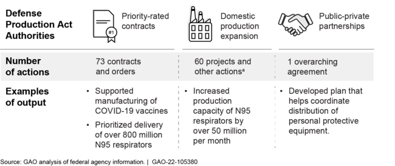

## Table of Contents

## What is the Defense Production Act (DPA)?

The Defense Production Act (DPA) is a law in the United States that was created in 1950. It helps the government make sure that important materials and products are available during emergencies, like wars or national crises. The DPA gives the President special powers to tell companies to prioritize orders for things that are needed for defense and national security.

The DPA can be used in many ways. For example, the government can tell factories to make more of something, like masks or ventilators, during a health emergency. It can also help the government buy or control resources that are important for the country's safety. The DPA is not used every day, but it is a powerful tool that the government can use when there is a big problem that needs quick action.

## When was the Defense Production Act enacted and why?

The Defense Production Act was enacted on September 8, 1950. This was during the Korean War, a time when the United States was worried about having enough resources and supplies to support its military efforts and protect the country.

The main reason for creating the DPA was to make sure that the government could get the materials and products it needed quickly during emergencies. It gave the President special powers to tell companies to focus on making things that were important for defense and national security. This way, the government could be sure that it had what it needed to keep the country safe during times of crisis.

## What are the main purposes of the Defense Production Act?

The Defense Production Act (DPA) helps the government make sure it has what it needs during emergencies. It was made to keep the country safe during times like wars or big crises. The DPA lets the President tell companies to make more of things that are important for defense and national security. This way, the government can get the supplies it needs quickly.

The DPA also helps the government control important resources. If there is a shortage of something that the country needs, the government can use the DPA to buy or manage those resources. This makes sure that the country has enough of what it needs to stay safe and secure. The DPA is a powerful tool that the government can use when there is a big problem that needs quick action.

## How has the Defense Production Act been used historically?

The Defense Production Act has been used many times since it was made in 1950. During the Korean War, it was used to make sure the military had enough supplies. Later, during the Cold War, the DPA helped the government get the materials it needed to be ready for any problems. In the 1970s, it was used during the oil crisis to help manage energy supplies. The DPA was also used during the Gulf War in the early 1990s to support the military efforts.

More recently, the DPA has been used in different kinds of emergencies. After the September 11 attacks in 2001, it helped the government get the tools and materials needed for security and recovery efforts. During the 2009 H1N1 flu outbreak, the DPA was used to make sure there were enough vaccines. Most notably, during the COVID-19 pandemic starting in 2020, the DPA was used to increase the production of things like masks, ventilators, and other medical supplies. This showed how the DPA can be a powerful tool in many different kinds of emergencies, not just military ones.

## What specific authorities does the DPA grant to the President?

The Defense Production Act gives the President special powers to make sure the country has what it needs during emergencies. One important power is the ability to tell companies to focus on making things that are needed for defense and national security. This means the President can order factories to make more of something important, like masks or ventilators, if there is a health crisis. The President can also tell companies to put government orders first, ahead of other customers, to make sure the government gets what it needs quickly.

Another key power is the ability to control important resources. If there is a shortage of something that the country needs, the President can use the DPA to buy or manage those resources. This helps make sure there is enough of what the country needs to stay safe and secure. The President can also help companies expand or modernize their factories if it is needed to increase production of important items. These powers are not used every day, but they are very important when there is a big problem that needs quick action.

## How was the Defense Production Act applied during the COVID-19 pandemic?

During the COVID-19 pandemic, the Defense Production Act was used to help make more of the things needed to fight the virus. The President used the DPA to tell companies to make more masks, ventilators, and other medical supplies. This was important because there were not enough of these items at the beginning of the pandemic. By using the DPA, the government could make sure that hospitals and healthcare workers had what they needed to take care of sick people.

The DPA also helped the government control important resources. For example, the government used the DPA to get more of the materials needed to make vaccines. This helped speed up the process of getting vaccines to people. The DPA was a big help during the COVID-19 crisis because it allowed the government to quickly get the supplies and resources needed to keep people safe and healthy.

## What types of products or services were prioritized under the DPA during the COVID-19 crisis?

During the COVID-19 crisis, the Defense Production Act was used to make more of the things needed to fight the virus. The President told companies to focus on making masks, ventilators, and other medical supplies. These were very important because there were not enough of them at the start of the pandemic. By using the DPA, the government made sure that hospitals and healthcare workers had what they needed to help sick people.

The DPA also helped the government get more of the materials needed to make vaccines. This was important because it helped speed up the process of getting vaccines to people. The DPA was a big help during the COVID-19 crisis because it allowed the government to quickly get the supplies and resources needed to keep people safe and healthy.

## Can you explain the use of Title I and Title III of the DPA in relation to COVID-19?

During the COVID-19 crisis, Title I of the Defense Production Act was used to tell companies to make more of the things that were needed to fight the virus. This part of the DPA lets the President give priority to government orders. So, companies had to make masks, ventilators, and other medical supplies first, before making other things. This helped make sure that hospitals and healthcare workers had enough of what they needed to take care of sick people. It was important because at the start of the pandemic, there were not enough of these items.

Title III of the DPA was used to help companies make more of the materials needed to make vaccines. This part of the law lets the government give money to companies to expand or modernize their factories. By doing this, the government helped companies make more of the things needed for vaccines faster. This was a big help in getting vaccines to people quickly during the crisis. Both Title I and Title III were important in making sure the country had what it needed to fight COVID-19.

## What were the criticisms and controversies surrounding the use of the DPA during the COVID-19 response?

During the COVID-19 response, some people said that the Defense Production Act was not used enough or quickly enough. They thought the President should have used the DPA right away to make more masks, ventilators, and other important medical supplies. People were worried because there were not enough of these things at the start of the pandemic. They thought using the DPA more could have helped hospitals and healthcare workers get what they needed faster.

There were also some problems with how the DPA was used. Some companies did not want to make the things the government asked for. They said it would cost too much or take too long to change their factories. This made it harder for the government to get the supplies it needed. Also, some people thought the government should have been clearer about how it was using the DPA. They wanted to know more about which companies were being told to make things and how much it was costing. These criticisms and controversies showed that using the DPA can be complicated, even when it is very important.

## How effective was the use of the DPA in managing the supply chain issues during the COVID-19 pandemic?

The use of the Defense Production Act during the COVID-19 pandemic helped to manage some supply chain issues, but it was not perfect. The DPA was used to tell companies to make more masks, ventilators, and other important medical supplies. This helped to increase the number of these items available, which was very important because there were not enough at the start of the pandemic. By using the DPA, the government made sure that hospitals and healthcare workers had more of what they needed to take care of sick people. It also helped to get more materials needed to make vaccines, which sped up the vaccination process.

However, there were still some problems. Some people said the DPA was not used quickly enough or as much as it could have been. They thought the government should have used it right away to help with the shortages. Also, some companies did not want to change their factories to make the things the government asked for. They said it would be too expensive or take too long. This made it harder for the government to get the supplies it needed. Overall, the DPA helped to manage supply chain issues during the COVID-19 crisis, but there were still challenges and delays.

## What lessons can be learned from the application of the DPA during the COVID-19 crisis for future emergency responses?

One big lesson from using the Defense Production Act during the COVID-19 crisis is that it is important to use it quickly when there is an emergency. People thought the government should have used the DPA right away to help with the shortages of masks and ventilators. If the government acts fast, it can help make sure there are enough supplies for hospitals and healthcare workers. Waiting too long can make the problem worse and harder to fix.

Another lesson is that working with companies can be tricky. Some companies did not want to change their factories to make the things the government needed. They said it would cost too much or take too long. This made it harder for the government to get the supplies it needed. In the future, the government should talk to companies early and find ways to help them change their factories faster. This can make the DPA more effective during emergencies.

Also, being clear about how the DPA is being used can help. Some people wanted to know more about which companies were being told to make things and how much it was costing. If the government is open about these things, it can build trust and make it easier to work together during a crisis. Learning these lessons can help the government use the DPA better in future emergencies.

## How might the Defense Production Act be reformed or updated based on its use during the COVID-19 pandemic?

One way to update the Defense Production Act could be to make it easier and faster to use during emergencies. During the COVID-19 pandemic, some people thought the government should have used the DPA right away to help with shortages of masks and ventilators. If the DPA was easier to use quickly, it could help make sure there are enough supplies for hospitals and healthcare workers when there is a crisis. The government could change the rules to make it simpler to tell companies what to make and how to make it faster.

Another way to reform the DPA could be to work better with companies. During the pandemic, some companies did not want to change their factories to make the things the government needed. They said it would cost too much or take too long. The government could help companies by giving them more money or support to change their factories quickly. Also, being clear about how the DPA is being used can build trust. If the government tells people which companies are making things and how much it costs, it can help everyone work together better during emergencies.

## References & Further Reading

[1]: Singer, P.W., & Friedman, A. (2014). ["Cybersecurity and Cyberwar: What Everyone Needs to Know."](https://archive.org/details/cybersecuritycyb0000sing) Oxford University Press.

[2]: Lomax, R.G., & Schumacker, R.E. (2012). ["A Beginner's Guide to Structural Equation Modeling."](https://www.taylorfrancis.com/books/mono/10.4324/9780203851319/beginner-guide-structural-equation-modeling-randall-schumacker-richard-lomax) Routledge.

[3]: ["Production for Defense."](https://www.defense.gov/News/Releases/Release/Article/3643326/dod-releases-first-ever-national-defense-industrial-strategy/) National Governors Association. Policy Position.

[4]: ["Markets in the Time of Coronavirus"](https://business.columbia.edu/faculty/research/news-and-markets-time-covid-19-0) by Equitable Growth.

[5]: Bown, C. (2020). ["COVID-19 Could Bring Down the Trading System"](https://www.foreignaffairs.com/articles/united-states/2020-04-28/covid-19-could-bring-down-trading-system) Peterson Institute for International Economics.