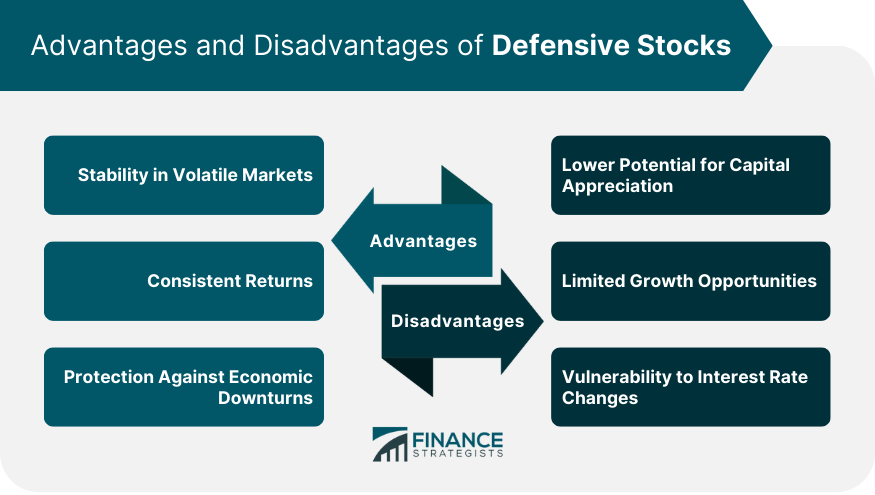

## Table of Contents

## What is a defensive company?

A defensive company is a type of business that tends to be more stable during economic downturns. These companies usually provide essential goods or services that people need no matter how the economy is doing. For example, companies that make food, medicine, or utilities like electricity and water are often considered defensive. People always need to eat, take medicine, and use utilities, so these companies keep making money even when times are tough.

Because of their stability, defensive companies are often seen as safer investments. When the economy is uncertain, investors might move their money into these companies to protect their investments. This can make the stock prices of defensive companies less likely to drop sharply during bad economic times. However, this also means that during good economic times, defensive companies might not grow as quickly as other types of companies.

## What industries are typically considered defensive?

Defensive industries are those that provide things people always need, no matter if the economy is good or bad. These include the food and beverage industry. People have to eat, so companies that make food or drinks, like supermarkets or food producers, are usually safe bets. Another big defensive industry is healthcare. People always need medicine and medical services, so companies like drug makers and hospitals tend to do well even when the economy is struggling.

Utilities are also a key defensive industry. This includes companies that provide electricity, water, and gas. These services are essential for daily life, so people keep paying for them even during tough times. Consumer staples, like household products and personal care items, are another defensive sector. People will still buy toilet paper, soap, and toothpaste even if they're cutting back on other spending.

Lastly, the tobacco and alcohol industries are often seen as defensive. Even during economic downturns, people might still buy cigarettes or drinks. These products can be addictive, so demand stays pretty steady. These industries might not grow a lot during good times, but they tend to hold up better when the economy is bad.

## How do defensive companies function during economic downturns?

During economic downturns, defensive companies keep running smoothly because they sell things people always need. For example, people still need to buy food, medicine, and pay for utilities like electricity and water. So, companies that make or provide these things don't see their sales drop as much as other companies might. This steady demand helps them stay strong even when the economy is struggling.

Because defensive companies are stable, they are often seen as safe places to invest money. When the economy is shaky, people might move their money into these companies to protect their savings. This can help keep the stock prices of defensive companies from falling too much. But, it also means that when the economy is doing well, these companies might not grow as fast as others that sell things people can choose to buy or not.

## What are the key characteristics of a defensive company?

Defensive companies are known for their stability during tough economic times. They sell things that people always need, like food, medicine, and utilities such as electricity and water. Because these products and services are essential, people keep buying them even when money is tight. This steady demand helps defensive companies keep their sales and profits more stable than other companies during economic downturns.

Another key characteristic of defensive companies is that they are seen as safe investments. When the economy is uncertain, investors often move their money into these companies to protect their investments. This can help keep the stock prices of defensive companies from dropping too much during bad times. However, this also means that when the economy is doing well, defensive companies might not grow as quickly as other types of companies that sell things people can choose to buy or not.

## What are the main advantages of investing in defensive companies?

Investing in defensive companies has some big advantages. One main advantage is that they are more stable during tough economic times. This is because they sell things that people always need, like food, medicine, and utilities. So, even when the economy is struggling, people still buy these things. This steady demand helps keep the sales and profits of defensive companies more stable than other companies. This makes them a safer bet for investors who want to protect their money during uncertain times.

Another advantage is that defensive companies can be a good place to put your money when you're worried about the economy. When things are uncertain, investors often move their money into these companies because they are seen as safe. This can help keep the stock prices of defensive companies from dropping too much during bad times. While they might not grow as fast as other companies during good economic times, their stability can be a big plus for investors looking for safety and steady returns.

## What are the potential disadvantages of investing in defensive companies?

One potential disadvantage of investing in defensive companies is that they might not grow as fast as other companies during good economic times. Because they sell things people always need, like food and medicine, their sales and profits don't change much whether the economy is good or bad. This means they might not make as much money as companies that sell things people can choose to buy or not when the economy is doing well.

Another disadvantage is that defensive companies can still be affected by other problems, like changes in laws or competition. For example, new rules about food safety or medicine could hurt their profits. Also, if a new company comes along and offers a better product or service, people might switch to that company instead. So, even though defensive companies are more stable, they are not completely safe from all risks.

## How do defensive companies compare to cyclical companies?

Defensive companies and cyclical companies are different in how they do during good and bad economic times. Defensive companies sell things people always need, like food, medicine, and utilities. So, even when the economy is bad, people still buy these things. This makes defensive companies more stable and safer to invest in during tough times. But, they might not grow as fast as other companies when the economy is doing well.

Cyclical companies, on the other hand, sell things that people can choose to buy or not, like cars, clothes, or vacations. When the economy is good, people have more money and are more likely to buy these things, so cyclical companies can grow a lot. But, when the economy is bad, people cut back on these purchases, and cyclical companies can lose a lot of money. This makes them riskier to invest in, but they can also offer bigger rewards when the economy is doing well.

## What role do defensive companies play in a diversified investment portfolio?

Defensive companies are important in a diversified investment portfolio because they help keep things stable. When the economy is bad, these companies still do well because they sell things people always need, like food, medicine, and utilities. So, if you have some of your money in defensive companies, it can help protect your overall investment from big drops during tough times. This can give you peace of mind knowing that part of your money is in a safer place.

But, defensive companies also mean you might miss out on big gains when the economy is doing well. They don't grow as fast as other companies that sell things people can choose to buy or not, like cars or vacations. So, in a diversified portfolio, having some money in defensive companies can balance out the riskier investments. This way, you can have a mix of stability and growth, helping you reach your financial goals over time.

## How can one identify a defensive company in the market?

To identify a defensive company in the market, look for businesses that sell things people always need, no matter if the economy is good or bad. These things include food, medicine, and utilities like electricity and water. Companies that make or provide these things are called defensive because people keep buying them even when money is tight. For example, supermarkets, drug makers, and utility companies are usually defensive.

Another way to spot a defensive company is by looking at how stable their sales and profits are. Defensive companies don't see big changes in their sales and profits, even during economic downturns. This is because their products and services are essential. When you see a company that keeps doing well even when the economy is struggling, it's likely a defensive company. They might not grow as fast as other companies during good times, but their stability makes them easier to spot in the market.

## What financial metrics should be considered when evaluating a defensive company?

When evaluating a defensive company, one important financial metric to look at is the stability of their revenue and earnings. Defensive companies should have steady sales and profits because they sell things people always need, like food and medicine. If you see that a company's revenue and earnings don't change much even during tough economic times, it's a good sign that it's a defensive company. Another useful metric is the dividend yield. Defensive companies often pay regular dividends because they have stable earnings, which can be attractive to investors looking for steady income.

Another metric to consider is the debt-to-equity ratio. Defensive companies usually have lower debt levels because their stable earnings help them manage their finances better. A lower debt-to-equity ratio means the company is less risky, which is good for a defensive company. Also, look at the price-to-earnings (P/E) ratio. Defensive companies might have higher P/E ratios because investors are willing to pay more for their stability. By looking at these metrics, you can get a better idea of how well a company fits the defensive profile.

## How do macroeconomic factors influence the performance of defensive companies?

Macroeconomic factors like economic growth, inflation, and interest rates can affect defensive companies, but not as much as they do other companies. Defensive companies sell things people always need, like food and medicine. So, even if the economy is slow or prices are going up, people still buy these things. This means that changes in the economy don't hurt defensive companies as much. For example, if the economy is in a recession, people might cut back on buying new cars or going on vacations, but they won't stop buying food or medicine.

However, macroeconomic factors can still have some impact on defensive companies. For instance, high inflation can make it more expensive for these companies to buy the things they need to make their products. This could lead to higher prices for consumers, which might affect sales a bit. Also, if interest rates go up, it can cost more for these companies to borrow money, which could affect their profits. But overall, defensive companies are better at handling these changes than other types of companies because their products are essential.

## What are some advanced strategies for investing in defensive companies?

One advanced strategy for investing in defensive companies is to look for those that are also growing in new areas. Some defensive companies might start selling new products or expand into new markets. This can help them grow faster than other defensive companies that just stay the same. For example, a food company might start making healthier snacks or a drug company might start working on new treatments. By picking these companies, you can get the safety of a defensive stock with the chance for more growth.

Another strategy is to use a sector rotation approach. This means moving your money between different types of companies based on what's happening in the economy. When things look like they might get tough, you can put more money into defensive companies. But when the economy starts doing better, you can move some of that money into companies that might grow faster. This way, you can balance the safety of defensive companies with the chance to make more money when times are good.

## References & Further Reading

- **The Little Book of Safe Money by Jason Zweig**: This book provides practical guidance on maintaining financial safety and emphasizes conservative investment strategies. Zweig focuses on protecting assets through simple, common-sense methods, stressing financial discipline amid volatile markets.

- **Betting Against Beta by Frazzini & Pedersen**: This research discusses an investment strategy that involves betting against high-beta stocks, which typically exhibit greater volatility and risk. Frazzini and Pedersen explore how investing in low-beta stocks can yield substantial returns, favoring a more defensive investment style.

- **Foundations of High-Frequency Trading by John F. Dibbs**: Dibbs examines the essential principles and technologies underpinning high-frequency trading. This work is vital for understanding the mechanics behind algorithmic trading and its impact on financial markets.

- **Global Algorithmic Trading Market Report (2021-2026)**: This report analyzes the trends and forecasts in the algorithmic trading market. It highlights growth factors, challenges, and technological advancements that continue to shape this dynamic field.

