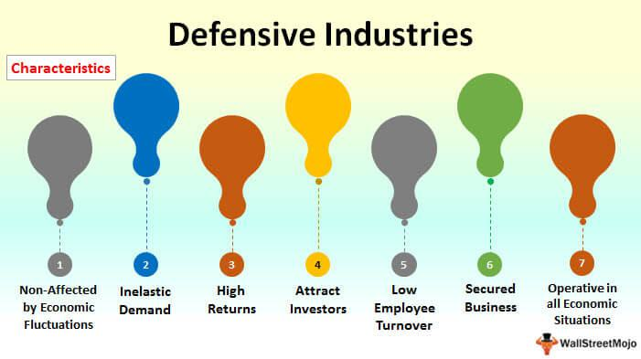

In today’s rapidly evolving financial landscape, two distinct strategies—investment in defensive companies and algorithmic trading—have surged in prominence. Defensive companies, known for their resilience during economic downturns, form the backbone of a stable portfolio. These companies operate in industries that provide essential goods and services, which ensures consistent demand regardless of broader economic conditions. Sectors such as utilities, healthcare, and consumer staples are prominent examples. Their business models often focus on steady dividends and earnings stability, attracting investors looking for reliability rather than rapid growth. 

Conversely, algorithmic trading represents a modern, technology-driven approach to market participation. This strategy employs computer algorithms to automate trading processes, capitalizing on speed and precision that far exceed human capabilities. By leveraging sophisticated mathematical models and extensive historical data, algorithmic trading can execute complex strategies, including trend-following, arbitrage, and mean reversion. This method allows investors to exploit fleeting market opportunities that would be impractical to pursue manually.



Understanding these investment strategies is crucial for navigating both stable and volatile markets efficiently. Defensive companies provide a foundation of security, while algorithmic trading offers the potential for enhanced returns through technological innovation. By integrating these approaches, investors can develop a diversified investment strategy that balances stability with growth potential, adapting to a wide array of market conditions.

## Table of Contents

## The Fundamentals of Defensive Companies

Defensive companies operate within industries that are essential to daily life, ensuring a consistent demand for their products and services regardless of economic conditions. These industries include utilities, healthcare, and consumer staples, all of which cater to basic human needs. Firms such as Procter & Gamble and Johnson & Johnson exemplify this category, offering products ranging from consumer goods to healthcare essentials. 

The hallmark of defensive companies is their ability to maintain steady dividends and earnings stability, even during market downturns. This stability is achieved through their diversified product lines, strong brand recognition, and strategies that prioritize long-term sustainability over short-term profits. For instance, Procter & Gamble's extensive portfolio includes brands like Tide, Pampers, and Gillette, which remain in demand regardless of economic shifts. Similarly, Johnson & Johnson benefits from its broad healthcare offerings, from pharmaceuticals to consumer health products, providing a cushion against economic volatility.

Investors are often drawn to defensive companies for their reliable performance in turbulent times. These companies typically offer lower volatility and a buffer against market shocks, making them attractive to those seeking a balance between risk and return. The stability of defensive stocks can be particularly appealing for risk-averse investors who prioritize preserving capital and securing regular income through dividends. However, it is important to note that the growth potential of defensive companies is generally limited compared to more aggressive investment options, since these companies are more mature and operate within saturated markets.

In summary, defensive companies provide a safe harbor during economic uncertainty, with their intrinsic stability and essential nature fostering investor confidence. This makes them a strategic component of a diversified investment portfolio, particularly for those prioritizing stability over rapid growth.

## Benefits and Drawbacks of Defensive Investments

Investing in defensive stocks offers notable benefits, particularly in their relative stability and lower [volatility](/wiki/volatility-trading-strategies) compared to more aggressive investments. This attribute is primarily due to the nature of industries such as utilities, healthcare, and consumer staples, which are less sensitive to economic fluctuations. These industries produce essential goods and services that maintain consistent demand, regardless of the macroeconomic environment. As a result, companies within these sectors often demonstrate steady earnings and regular dividend payments, which contribute to reduced volatility and financial predictability for investors.

However, the growth potential of defensive investments is typically constrained. Unlike industries that thrive on innovation and expansion, defensive companies are often bound by stringent market regulations and industry-specific challenges. The regulatory landscape in sectors such as healthcare and utilities can limit the speed and scale of growth, as companies must comply with various laws and standards to operate. Additionally, due to their stable nature, these companies may not reinvest as aggressively as their growth-oriented counterparts, potentially limiting returns on equity.

Despite these limitations, the stable returns and reduced risk of bankruptcy that defensive stocks offer are highly appealing to risk-averse investors. For individuals prioritizing capital preservation over rapid expansion, defensive investments provide a reliable income stream and a safeguard against market downturns. The consistent nature of their performance means that even in periods of economic distress, defensive stocks typically retain their value better than more cyclical investments.

In summary, the benefits of defensive stocks lie in their ability to provide financial stability and mitigate risk, making them an attractive choice for conservative or long-term investors. Yet, the trade-off comes in the form of limited growth prospects, as these companies prioritize steady earnings over aggressive market expansion. For investors seeking to balance risk and return, understanding the nuances of defensive investments is crucial in constructing a resilient portfolio.

## Algorithmic Trading: An Overview

Algorithmic trading, often referred to as algo trading, employs complex computer algorithms to automate the buying and selling of financial instruments in various markets. These algorithms are designed to follow a set of predefined rules that determine the timing, price, and quantity of trades, with the aim of generating profits at a speed and frequency that is impossible for a human trader.

One of the primary advantages of [algorithmic trading](/wiki/algorithmic-trading) is its use of speed and precision in executing trades. By leveraging computer technology, algorithmic trading systems can analyze vast amounts of market data in real-time, identifying opportunities that may only exist for a fraction of a second. This high-speed processing allows for the swift execution of trades, often resulting in more favorable pricing than what might be achieved manually. Additionally, algorithmic trading reduces the potential for human error, as decisions are made based on quantifiable data rather than subjective judgment.

Among the key strategies deployed in algorithmic trading are trend-following, [arbitrage](/wiki/arbitrage) opportunities, and mean reversion. Trend-following strategies, as the name suggests, involve buying or selling assets based on the current trends in the market, under the assumption that these trends will continue. These strategies often use indicators such as moving averages to identify potential entry and [exit](/wiki/exit-strategy) points.

Arbitrage strategies exploit price differentials of the same or equivalent financial instruments in different markets or forms. For instance, if a stock is priced lower on one exchange compared to another, an arbitrage algorithm might buy the stock on the cheaper exchange and simultaneously sell it on the more expensive one, thus locking in a risk-free profit.

Mean reversion strategies are based on the statistical analysis of historical data, positing that the price of an asset will revert to its historical average over time. These strategies identify when an asset is overbought or oversold and execute trades to capitalize on the expected reversal in prices.

Algorithmic trading systems also typically incorporate [backtesting](/wiki/backtesting) capabilities, allowing traders to evaluate the effectiveness of their strategies using historical market data. By simulating how a strategy would have performed in the past, traders can refine their algorithms to improve future performance. However, it is critical to be aware of the risk of overfitting, where a strategy is so closely tailored to past data that it loses effectiveness in new market conditions.

In conclusion, algorithmic trading represents a significant shift in how trading is conducted, offering unprecedented speeds and the ability to process complex data sets. By employing strategies such as trend-following, arbitrage, and mean reversion, traders can enhance their capabilities beyond traditional manual trading methods.

## Advantages and Challenges of Algorithmic Trading

Algorithmic trading, commonly referred to as algo trading, significantly enhances trading efficiency through the utilization of computer algorithms that enable trades to be executed with unprecedented speed and precision. This method not only reduces the time needed to complete trades but also minimizes human error, which is particularly advantageous in highly volatile and fast-paced financial markets. Algorithms can process market signals and execute trades in a fraction of the time it would take a human trader, providing a competitive edge in seizing lucrative opportunities.

Despite these advantages, algorithmic trading presents certain challenges that must be meticulously managed. The reliance on technology introduces the risk of technical failures which can result in significant financial loss. A notable example occurred during the 2010 Flash Crash, where a confluence of algorithmic trades led to a rapid market decline. Additionally, algo trading is subject to stringent regulatory scrutiny. Financial authorities impose regulations to curtail excessive risk-taking and ensure market stability, posing a compliance challenge for traders and firms.

Further, substantial infrastructure investment is required for algorithmic trading, encompassing powerful computing systems and sophisticated software. This investment barrier might deter smaller market participants from leveraging this advanced trading method.

Moreover, the ability to backtest trading strategies on historical data is of great value to traders. Backtesting allows the evaluation of a trading strategy's past performance, providing insights into its potential future success. However, it’s crucial to be cautious of overfitting—where a model is too closely fitted to historical data, potentially reducing its effectiveness in real-world scenarios. Overfitted models may not adapt well to new market conditions, posing a risk to traders relying heavily on these strategies.

In balancing these benefits and challenges, astute traders and firms continually refine their algorithms and maintain a robust infrastructure to optimize their trading strategies for efficiency and accuracy, while mitigating technical and regulatory risks.

## Integrating Defensive Investments with Algorithmic Trading

Combining defensive investments with algorithmic trading presents an innovative crossover that allows investors to leverage stability while capitalizing on technological efficiencies. Defensive stocks, known for their resilience during economic downturns, provide a solid foundation for a diversified portfolio. When paired with the speed and precision of algorithmic trading, these investments can yield optimized returns through strategic buying and selling.

Algorithmic trading systems can enhance defensive portfolios by executing timely trades based on market conditions. For instance, algorithms can monitor market data in real-time, identifying opportune moments to buy undervalued defensive stocks or sell overvalued ones. By automating these decisions, investors reduce reaction times from minutes or hours to milliseconds, minimizing the risk of human error and emotional trading.

Furthermore, an effective strategy for integrating these investments is [pair trading](/wiki/pair-trading). This involves selecting two similar defensive stocks and exploiting pricing inefficiencies. For example, if one stock is momentarily underperforming relative to its counterpart, the algorithm can short the overperforming stock while longing the underperformer, expecting that the market will correct any disparities. This approach, which relies on [statistical arbitrage](/wiki/statistical-arbitrage), aims to generate steady returns irrespective of market direction.

This integration not only enhances portfolio performance by utilizing predictive analytics and [machine learning](/wiki/machine-learning) but also mitigates risks through diversification and systematic analysis. Python, as a versatile programming language, can be employed to develop algorithmic trading strategies. Below is a simple example of a Python script for executing a mean-reversion pair trading strategy:

```python
import numpy as np
import pandas as pd

def calculate_spread(stock1, stock2):
    return stock1 - stock2

def z_score(spread):
    return (spread - spread.mean()) / spread.std()

def pair_trading_strategy(stock1, stock2):
    spread = calculate_spread(stock1, stock2)
    z_scores = z_score(spread)

    signals = pd.DataFrame(index=stock1.index)
    signals['positions'] = 0

    signals['positions'][z_scores > 1] = -1  # Short stock1, Long stock2
    signals['positions'][z_scores < -1] = 1  # Long stock1, Short stock2

    return signals

# Example usage
stock1 = pd.Series(...)  # Load stock1 prices
stock2 = pd.Series(...)  # Load stock2 prices
signals = pair_trading_strategy(stock1, stock2)
```

This integration, thoughtfully developed and executed, aligns the inherent stability of defensive stocks with the technological advantages of algorithmic trading, offering a pathway to harness reliable returns while managing risk effectively.

## Choosing the Right Investment Strategy

Selecting the appropriate investment strategy involves a careful assessment of several factors, including individual risk tolerance, market experience, and financial goals. Defensive stocks and algorithmic trading represent two distinct strategies that investors may consider, each with its own unique characteristics and potential benefits.

Defensive stocks are traditionally favored by risk-averse investors who prioritize stability over high growth. These stocks, typically within sectors such as utilities, healthcare, and consumer staples, provide consistent dividends and remain relatively unaffected by economic downturns. This stability makes them appealing for those looking to preserve capital and secure steady returns. However, the trade-off often lies in their limited growth potential compared to more aggressive investments.

On the other hand, algorithmic trading offers a modern, technology-driven approach to the financial markets. By leveraging advanced algorithms, investors can execute trades with speed and precision, capitalizing on short-term market inefficiencies and trends. This method requires a solid understanding of the market, substantial technological infrastructure, and the ability to manage the risks associated with automated trading, such as technical failures and potential over-reliance on historical data.

For investors seeking a robust and balanced portfolio, a hybrid approach that combines both defensive stocks and algorithmic strategies may offer the best of both worlds. This amalgamation allows investors to benefit from the stability of defensive stocks while using algorithmic trading to optimize trading timings and capture additional market opportunities. For example, implementing a pair trading strategy—such as identifying statistical arbitrage opportunities within a set of defensive stocks—can yield consistent returns with reduced volatility.

The implementation of such a hybrid strategy requires careful planning and execution. Investors should consider diversifying their holdings to mitigate potential risks and enhance growth prospects. This could involve a mix of asset classes and employing algorithms tailored to match their risk profile and investment objectives. Furthermore, continuous evaluation and adjustment of the strategy are crucial to ensuring alignment with changing market dynamics and personal financial goals.

Ultimately, choosing the right investment strategy is a dynamic process that necessitates an understanding of both personal investment appetite and the complexities of the financial markets. By judiciously blending defensive investments with algorithmic trading, investors can craft a portfolio that not only withstands market fluctuations but also positions itself for long-term financial success.

## Conclusion

Navigating complex financial markets requires a comprehensive understanding of various investment strategies to effectively manage risk and enhance returns. Defensive stocks and algorithmic trading represent two pivotal approaches that cater to distinct investment needs. Defensive stocks are characterized by their inherent stability, attributable to their operation in essential sectors such as utilities, healthcare, and consumer staples. These sectors are less susceptible to economic downturns, offering consistent dividend payouts and stable earnings. As a result, they serve as a reliable component within an investor's portfolio, particularly for risk-averse individuals seeking to protect their assets from market volatility.

On the other hand, algorithmic trading provides a technologically sophisticated method of engaging with financial markets. By leveraging advanced computer algorithms, this strategy facilitates rapid and precise trade execution that would be impractical for human traders. The ability to backtest strategies on historical data and implement refined techniques like trend-following, arbitrage, and mean reversion underscores its potential to enhance trading efficiency and profitability.

Integrating defensive investments with algorithmic trading offers investors a potent combination of stability and cutting-edge execution capabilities. This hybrid approach enables the optimization of returns through strategic timing and adaptive responses to market conditions. For instance, algorithm-driven pair trading among defensive stocks can capitalize on price discrepancies, striving to yield consistent returns while maintaining a risk-averse stance.

Ultimately, selecting the appropriate investment strategy involves weighing one's risk tolerance, market experience, and long-term financial goals. A carefully structured portfolio that harmonizes the stability of defensive stocks with the agility of algorithmic trading is well-positioned to withstand market fluctuations and achieve enduring success. By thoughtfully combining these strategies, investors can enhance their portfolios, balancing the dual advantages of security and growth potential.

## References & Further Reading

- **The Little Book of Safe Money by Jason Zweig**: This book provides practical guidance on maintaining financial safety and emphasizes conservative investment strategies. Zweig focuses on protecting assets through simple, common-sense methods, stressing financial discipline amid volatile markets.

- **Betting Against Beta by Frazzini & Pedersen**: This research discusses an investment strategy that involves betting against high-beta stocks, which typically exhibit greater volatility and risk. Frazzini and Pedersen explore how investing in low-beta stocks can yield substantial returns, favoring a more defensive investment style.

- **Foundations of High-Frequency Trading by John F. Dibbs**: Dibbs examines the essential principles and technologies underpinning high-frequency trading. This work is vital for understanding the mechanics behind algorithmic trading and its impact on financial markets.

- **Global Algorithmic Trading Market Report (2021-2026)**: This report analyzes the trends and forecasts in the algorithmic trading market. It highlights growth factors, challenges, and technological advancements that continue to shape this dynamic field.

