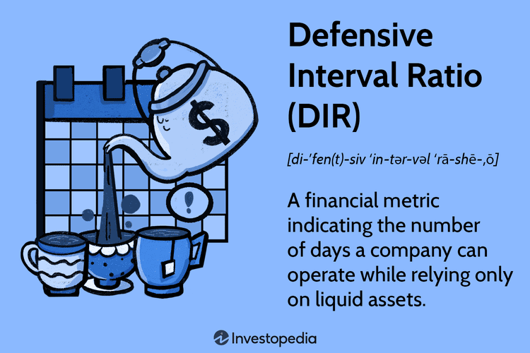

## Table of Contents

## What is the Defensive Interval Ratio (DIR)?

The Defensive Interval Ratio (DIR) is a financial metric that shows how long a company can keep running without any new money coming in. It tells us how many days the company can survive using just the cash and assets it can quickly turn into cash, like stocks or bonds. This is important for understanding if a company is at risk of running out of money.

To calculate the DIR, you take the total of the company's cash and near-cash assets and divide it by the company's daily operational costs. For example, if a company has $100,000 in cash and assets that can be quickly turned into cash, and it spends $1,000 a day to operate, the DIR would be 100 days. This means the company can keep going for 100 days without any new income. A higher DIR means the company is in a safer financial position.

## How is the Defensive Interval Ratio calculated?

The Defensive Interval Ratio (DIR) is calculated by dividing a company's cash and near-cash assets by its daily operational costs. Cash and near-cash assets include money in the bank, stocks, bonds, and other items that can be quickly turned into cash. Daily operational costs are the expenses the company needs to pay every day to keep running, like salaries, rent, and utilities.

To find the DIR, you first add up all the cash and near-cash assets the company has. Then, you figure out how much the company spends each day on its operations. Once you have these two numbers, you divide the total cash and near-cash assets by the daily operational costs. The result is the number of days the company can survive without any new income. For example, if a company has $50,000 in cash and near-cash assets and spends $500 a day, the DIR would be 100 days ($50,000 ÷ $500 = 100).

## What are the key components needed to compute the DIR?

To compute the Defensive Interval Ratio (DIR), you need to know two main things: the company's cash and near-cash assets, and its daily operational costs. Cash and near-cash assets are the money the company has in the bank, plus other things like stocks and bonds that can be quickly turned into cash. These are important because they show how much money the company can use right away if it needs to.

The other key component is the daily operational costs. This is how much money the company spends every day to keep running. It includes things like salaries, rent, and utilities. By knowing these daily costs, you can figure out how long the company can survive without any new money coming in. To find the DIR, you divide the total cash and near-cash assets by the daily operational costs.

## Why is the Defensive Interval Ratio important for businesses?

The Defensive Interval Ratio (DIR) is important for businesses because it tells them how long they can keep going without any new money coming in. By knowing this, a business can see if it is in a safe financial spot or if it might run into money problems soon. If the DIR is high, it means the business has enough cash and things that can be turned into cash quickly to cover its daily costs for a long time. This is really helpful for planning and making sure the business stays stable, especially during tough times when income might drop.

Businesses also use the DIR to make smart decisions about how to use their money. If the DIR shows that the business only has a short time before it runs out of money, leaders might decide to cut costs, look for new ways to bring in money, or maybe even get a loan. On the other hand, if the DIR is high, the business might feel more comfortable spending money on new projects or expanding. So, the DIR is a key tool for keeping a business financially healthy and ready for the future.

## How does the DIR differ from other liquidity ratios like the Current Ratio or Quick Ratio?

The Defensive Interval Ratio (DIR) is different from other liquidity ratios like the Current Ratio and Quick Ratio because it tells you exactly how many days a company can keep running without any new money coming in. It focuses on how long the company can survive using just its cash and things that can be quickly turned into cash, like stocks or bonds. This makes DIR very useful for understanding how safe a company is from running out of money in the short term. On the other hand, the Current Ratio and Quick Ratio give you a snapshot of a company's ability to pay off its short-term debts, but they don't tell you how long the company can keep going without new income.

The Current Ratio is calculated by dividing a company's current assets by its current liabilities. It shows if a company has enough assets to cover what it owes in the short term. The Quick Ratio, also known as the Acid-Test Ratio, is similar but it leaves out inventory from current assets because inventory might not be as easy to turn into cash quickly. Both these ratios are important for understanding a company's short-term financial health, but they don't give you the same detailed view of how long a company can operate without new money that the DIR provides. So, while the Current and Quick Ratios focus on the ability to pay off debts, the DIR focuses on survival time, making it a unique and valuable tool for financial planning.

## What is considered a good Defensive Interval Ratio?

A good Defensive Interval Ratio (DIR) is usually considered to be around 30 to 90 days. This means the company can keep going for 1 to 3 months without any new money coming in. Having a DIR in this range shows that the company is in a pretty safe spot financially. It can handle unexpected problems or dips in income without running out of money too quickly.

However, what counts as a good DIR can change depending on the type of business and the industry it's in. Some businesses might need a higher DIR if they have more ups and downs in their income or if they face bigger risks. For example, a company that makes seasonal products might want a higher DIR to make sure it can keep going during the off-season. In the end, the key is to have a DIR that fits the specific needs and risks of the business.

## How can a company improve its Defensive Interval Ratio?

A company can improve its Defensive Interval Ratio by increasing its cash and near-cash assets. This means they can save more money, sell off things they don't need, or turn things like stocks and bonds into cash. They could also try to bring in more money by selling more products or services, or by finding new ways to make money. If they can do this, they will have more money to use if they need it, which makes their DIR higher.

Another way to boost the DIR is by cutting down on daily operational costs. This means spending less money each day to keep the business running. They could do this by finding cheaper ways to do things, like getting a better deal on rent or utilities, or by not spending money on things they don't really need. When they spend less each day, the same amount of cash and near-cash assets will last longer, so their DIR goes up. By focusing on these two things—making more money and spending less—a company can make its Defensive Interval Ratio better and be in a safer financial spot.

## What are the limitations of using the Defensive Interval Ratio?

The Defensive Interval Ratio (DIR) has some limitations that businesses should know about. One big problem is that it only looks at cash and things that can be quickly turned into cash. It doesn't think about other ways a company might be able to get money, like loans or selling big things like buildings or machines. So, it might make a company look less safe than it really is if it has other ways to get money.

Another issue is that the DIR doesn't change with the business's situation. It uses the same daily costs all the time, but in real life, these costs can go up or down. If a company can cut costs quickly when it needs to, the DIR might make it seem like it can't last as long as it really can. Also, the DIR doesn't tell you anything about how well the company is doing overall or if it's making money. It just shows how long it can keep going without new money, which is only one part of the whole picture.

## Can the DIR be used effectively in all industries, or are there specific sectors where it is more applicable?

The Defensive Interval Ratio (DIR) can be used in many industries, but it works best in some more than others. It's really helpful for businesses that have ups and downs in their income, like companies that sell seasonal products or services. For example, a ski resort might use the DIR to make sure it has enough money to last through the summer when fewer people come. Also, businesses that face big risks, like tech startups or companies in industries that change a lot, can use the DIR to check if they have enough money to keep going during tough times.

However, the DIR might not be as useful for businesses with steady income and low risks, like some utility companies or grocery stores. These businesses might not need to worry as much about how long they can go without new money because their income is more predictable. So, while the DIR can be used in all industries, it's most valuable for businesses that need to plan for times when money might be tight.

## How does the DIR help in financial planning and risk management?

The Defensive Interval Ratio (DIR) is a helpful tool for financial planning because it tells a company how many days it can keep going without any new money coming in. By knowing this, a business can plan better for the future. If the DIR shows that the company can only last for a short time, the leaders might decide to save more money or find new ways to bring in income. On the other hand, if the DIR is high, the company might feel safe enough to spend money on new projects or expanding the business. This helps the company make smart choices about how to use its money.

The DIR is also important for risk management. It helps a business see if it's at risk of running out of money, especially during tough times when income might drop. If the DIR is low, the company might need to take steps to lower its risks, like cutting costs or getting a loan. By keeping an eye on the DIR, a business can be ready for problems and make sure it stays financially stable. This way, the company can handle unexpected challenges without going broke.

## What are some real-world examples of companies using the DIR to make strategic decisions?

A tech startup, facing the ups and downs of the industry, used the DIR to make sure it had enough money to last through tough times. They saw that their DIR was only 45 days, which worried them. So, they decided to cut some costs and look for more investors to bring in more money. This helped them boost their DIR to 90 days, making them feel safer about their future.

A seasonal business, like a beach resort, also used the DIR to plan for the off-season. They knew that during the winter months, they wouldn't make much money. By calculating their DIR, they found out they could last for 60 days without new income. This helped them decide to save more money during the busy summer months, so they could keep going through the winter without worrying about running out of cash.

## How might future economic conditions affect the relevance and application of the Defensive Interval Ratio?

Future economic conditions can change how useful the Defensive Interval Ratio (DIR) is for businesses. If the economy gets shaky, with more ups and downs, companies might use the DIR more often to make sure they have enough money to last through tough times. For example, if there's a chance of a recession, businesses might look at their DIR to see if they need to save more money or cut costs to stay safe. On the other hand, if the economy is doing well and steady, companies might not worry as much about their DIR because they feel more sure about their income.

Even though the DIR is a helpful tool, how well it works can depend on what's happening in the economy. In times of big changes, like new technology or shifts in what people buy, the DIR might not be as useful if it doesn't think about all the new ways a company can get money. So, businesses need to keep an eye on the bigger picture and use the DIR along with other tools to make the best plans for the future.

## What is the Defensive Interval Ratio?

The Defensive Interval Ratio (DIR) is a key financial metric that quantifies the number of days a company can continue its operations using only its liquid assets. Liquid assets typically include cash, marketable securities, and net receivables. By providing a measure of how long a company can sustain its activities without the need for additional external financial resources, the DIR offers valuable insights into financial resilience and operational efficiency.

Unlike traditional liquidity ratios such as the current ratio or quick ratio, which only provide a snapshot of a company's ability to meet its short-term obligations, the DIR sheds light on the duration a company can maintain operations, thus offering a more dynamic assessment of liquidity. The DIR is calculated by dividing a company's current assets by its daily operational expenses.

$$
\text{DIR} = \frac{\text{Current Assets}}{\text{Daily Operational Expenses}}
$$

In this formula, current assets consist of resources that are expected to be converted into cash within a year, ensuring they are readily available for operational needs. Daily operational expenses are derived by taking the annual operating expenses and subtracting non-cash charges such as depreciation, then dividing the result by 365 to obtain an average daily figure. 

This metric serves as a vital tool for assessing a company's ability to navigate through periods of financial instability, highlighting its capacity to sustain operations without relying on new income or financing. By focusing on actual expenditure levels relative to available assets, the DIR provides stakeholders with a clear picture of a company's financial efficiency and [liquidity](/wiki/liquidity-risk-premium) management.

## What is the calculation method for the Defensive Interval Ratio?

The Defensive Interval Ratio (DIR) is calculated using a straightforward formula, aimed at determining how long a company can continue its operations using only its liquid assets. The formula is expressed as:

$$
\text{DIR} = \frac{\text{Current Assets}}{\text{Daily Operational Expenses}}
$$

### Current Assets:

Current assets are those assets of a company that can be converted into cash within a year. These typically include cash, marketable securities, and net receivables. Each of these components plays a vital role in the assessable liquidity of the company:

- **Cash** is the most liquid asset, requiring no conversion.
- **Marketable Securities** are financial instruments that can be quickly sold for cash at a reasonable price.
- **Net Receivables** are the amounts expected to be received from customers based on current credit sales, after adjusting for potential bad debts.

Calculating these components accurately is essential for a precise DIR and reflects a firm's readiness in terms of available liquid resources.

### Daily Operational Expenses:

Daily operational expenses represent the average amount a company spends each day to maintain its operations. To calculate daily operational expenses accurately, follow these steps:

1. **Identify Annual Operating Expenses:** Start by determining the total costs a company incurs annually related to its core business activities.

2. **Subtract Non-Cash Charges:** Adjust these expenses by subtracting non-cash charges like depreciation and amortization. These charges do not affect cash flow and should not be included when evaluating daily liquidity needs.

3. **Divide by 365:** Finally, divide the adjusted annual operating expenses by 365 to achieve the average daily operational expenses.

### Practical Example:

To illustrate the calculation of DIR, consider a hypothetical company with the following details:

- Current Assets:
  - Cash: $500,000
  - Marketable Securities: $300,000
  - Net Receivables: $200,000
- Total Current Assets = $1,000,000

- Annual Operating Expenses = $4,000,000
- Non-Cash Charges (e.g., Depreciation) = $400,000
- Adjusted Annual Operating Expenses = $4,000,000 - $400,000 = $3,600,000

- Daily Operational Expenses = $3,600,000 / 365 = $9,863.01

Applying these figures to the DIR formula:

$$
\text{DIR} = \frac{1,000,000}{9,863.01} \approx 101.4
$$

This result means that the company can sustain its operations for approximately 101 days using its current liquid assets without needing additional funds. This period signifies the company’s financial buffer and can influence strategic decisions related to liquidity management and operational planning.

## What are the advantages of the Defensive Interval Ratio?

The Defensive Interval Ratio (DIR) offers a distinct advantage by providing a clear and comprehensive metric for sustaining business operations through liquid assets. Unlike the quick ratio and current ratio, which offer general insights into liquidity, DIR specifically quantifies the duration for which a company can fund its day-to-day operations based strictly on its liquid assets. This unique focus makes DIR a critical tool for financial management.

DIR surpasses conventional liquidity ratios by calculating the exact number of operating days a company can endure without the influx of additional cash flows. For instance, while the current ratio measures the company's ability to cover short-term liabilities with current assets, it doesn't indicate the time span those assets can sustain operations. The DIR formula, defined as:

$$
\text{DIR} = \frac{\text{Current Assets}}{\text{Daily Operational Expenses}}
$$

allows businesses to gauge with precision the sustainability of their liquidity, offering a transparent view of how long a company can survive purely on liquid resources.

This forward-looking aspect of DIR aids in preemptively addressing financial stress, as companies can identify timeframes within which they must secure new revenue streams or additional funding to continue seamless operations. By regularly monitoring DIR, businesses can better anticipate potential liquidity crises and plan accordingly.

A higher DIR generally indicates a strong capacity for a company to withstand short-term financial challenges. It reflects robust financial health, suggesting that the company possesses sufficient liquid assets to cover its operational expenses for a more extended period, reducing the immediate pressure to generate revenue or raise funds. Furthermore, tracking DIR over time can reveal trends indicating whether a company's liquidity position is improving or deteriorating. Regular analysis of these trends empowers management to make informed financial decisions, optimizing operations while mitigating risks associated with liquidity shortfalls.

## References & Further Reading

[1]: Wetzel, T. S. (2013). ["Understanding Financial Liquidity."](https://snapinnovations.com/what-are-liquidity-needs-understanding-financial-liquidity/) In Encyclopedia of Financial Models. John Wiley & Sons, Inc.

[2]: Fabozzi, F. J., & Markowitz, H. (2011). ["The Theory and Practice of Investment Management: Asset Allocation, Valuation, Portfolio Construction, and Strategies."](https://onlinelibrary.wiley.com/doi/book/10.1002/9781118267028) Wiley Finance.

[3]: Luenberger, D. G. (1997). ["Investment Science"](https://www.amazon.com/Investment-Science-David-G-Luenberger/dp/0199740089) Oxford University Press.

[4]: Chan, E. P. (2013). ["Algorithmic Trading: Winning Strategies and Their Rationale."](https://github.com/leoncuhk/awesome-quant-ai) Wiley Trading.

[5]: Piotroski, J. D. (2000). ["Value Investing: The Use of Historical Financial Statement Information to Separate Winners from Losers."](https://www.semanticscholar.org/paper/Value-Investing%3A-The-Use-of-Historical-Financial-to-Piotroski/0559e92e06dae21e77ea79d79417b8a1d40be772) Journal of Accounting Research, 38(Supplement: Studies on Accounting Information and the Economics of the Firm), 1-41.

[6]: Fraser-Sampson, G. (2013). ["Private Equity as an Asset Class."](https://onlinelibrary.wiley.com/doi/book/10.1002/9781118371985) Wiley Finance.