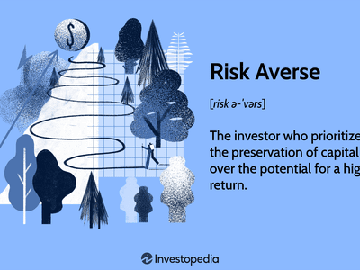

In investing, effective portfolio management is crucial for achieving financial goals. A defensive investment strategy embodies a conservative approach, prioritizing risk minimization and principal preservation. Such a strategy holds particular appeal for risk-averse investors who prioritize stability over high returns. The essentials of constructing a defensive portfolio, bolstered by technological advancements like algorithmic trading, are pivotal in addressing the challenges posed by market volatility. 

Algorithmic trading, through automation and data-driven insights, enhances the management of defensive portfolios by providing precision and removing emotional biases from trading decisions. It enables the consistent implementation of predefined strategies, aids in maintaining target asset allocations, and effectively applies stop-loss orders. This technological integration helps investors to navigate turbulent markets with greater confidence.



For investors considering a defensive strategy, understanding how it aligns with personal risk tolerance and financial objectives is vital. By leveraging technology, specifically algorithmic trading, these strategies can be refined for improved performance and adaptability. As we explore the landscape of defensive investment strategies and their intersection with technology, investors will gain insights into why this approach might be appropriate and how it can be optimized for their unique financial journeys.

## Table of Contents

## Understanding Defensive Investment Strategies

Defensive investment strategies are crafted to protect investors from the adverse effects of major market downturns. At their core, these strategies prioritize the preservation of capital over aggressive capital appreciation. This conservative approach is particularly appealing to risk-averse investors who value stability and aim to avoid significant losses during turbulent market conditions.

A key characteristic of defensive investment strategies is their focus on high-quality, short-term bonds. Options like U.S. Treasury notes are preferred due to their lower risk and government backing, offering a steady, albeit modest, rate of return. These instruments provide a buffer against market volatility because they typically exhibit lower price fluctuations compared to stocks and long-term bonds. 

Additionally, defensive strategies often incorporate blue-chip or defensive stocks into the portfolio. Blue-chip stocks, representing established companies with a history of reliable earnings and dividends, offer resilience against market fluctuations. Similarly, defensive stocks, such as those in the consumer staples or healthcare sectors, maintain stable performance irrespective of economic cycles. This is due to the essential nature of the underlying products and services these companies provide, leading to consistent demand even in downturns.

The overall goal of defensive strategies is to ensure portfolio stability and achieve modest gains. By focusing on asset classes and sectors less sensitive to economic swings, these strategies aim to maintain the capital's value amidst market [volatility](/wiki/volatility-trading-strategies). This approach, while perhaps yielding lower returns during bull markets, offers peace of mind and financial security, aligning with risk-averse investment objectives.

## Key Components of a Defensive Investment Portfolio

A successful defensive investment portfolio is characterized by a strategic and meticulously crafted asset allocation plan. This plan serves as the foundational backbone to manage risk and achieve stability during economic fluctuations. One of the cornerstones of this strategy is regular rebalancing, a process that ensures the portfolio maintains its intended asset distribution over time. Rebalancing is crucial to minimize risk exposure by aligning the portfolio with the investor's risk tolerance and investment objectives. This can typically involve adjusting the proportions of stocks, bonds, and other assets to counteract the natural drift in asset values caused by market movements.

Diversification plays a pivotal role in enhancing the resilience of a defensive investment portfolio, providing a buffer against sudden market-specific shocks. By spreading investments across various sectors and geographic regions, investors can diminish the impact of potential downturns in any single market area. For instance, an unforeseen economic slump in a particular industry may have a limited effect on a diversified portfolio, as gains in another sector may offset losses. An optimized diversified portfolio might include a mix of domestic and international stocks, fixed-income securities, and perhaps alternative assets such as real estate or commodities.

Moreover, maintaining a portion of the portfolio in cash and cash equivalents is another critical component of a defensive strategy. Instruments like Treasury bills, commercial paper, and money market funds are highly liquid and provide safety through capital preservation during volatile market conditions. The presence of cash holdings allows investors to quickly seize new investment opportunities without incurring the costs and potential losses associated with liquidating other assets prematurely. Additionally, having liquid assets ensures that investors can meet short-term obligations or emergencies without disrupting the broader investment strategy.

In conclusion, the key components of a defensive investment portfolio revolve around effective asset allocation, strategic rebalancing, diversification, and [liquidity](/wiki/liquidity-risk-premium) management. This approach not only safeguards the portfolio against risks but also positions the investor to navigate various market conditions with greater confidence.

## Role of Algorithmic Trading in Defensive Portfolio Management

Algorithmic trading has revolutionized defensive portfolio management by offering enhanced efficiency and precision. Algorithms automate trading decisions, executing predefined strategies with consistency and eliminating emotional biases inherent in manual trading. This automation ensures that strategic goals are adhered to, even during periods of market stress or rapid fluctuations.

One critical advantage of [algorithmic trading](/wiki/algorithmic-trading) in managing defensive portfolios is the ability to maintain target asset allocations through regular rebalancing. Rebalancing involves adjusting the proportions of assets as market conditions change, to realign the portfolio with its intended risk profile. By employing algorithms, this process is automated and can be performed at optimal intervals, ensuring that the portfolio remains aligned with defensive strategy objectives. Python, a widely-used programming language in finance, offers extensive libraries, such as `pandas` for data manipulation and `numpy` for numerical calculations, that facilitate automated rebalancing.

Furthermore, the implementation of stop-loss orders is effectively managed through algorithmic trading. A stop-loss order is designed to limit losses by triggering a sale once an asset reaches a specified price. Algorithms monitor asset prices in real-time and execute stop-loss orders with precision, protecting portfolio value without requiring constant human oversight.

The incorporation of data-driven insights and [machine learning](/wiki/machine-learning) further enhances decision-making capabilities. Machine learning algorithms analyze vast amounts of financial data to identify patterns and anticipate market trends, allowing portfolio managers to adapt strategies proactively. These tools, once calibrated, can continuously learn and improve from new data inputs, increasing their effectiveness over time. For instance, machine learning models such as decision trees or neural networks can be deployed to predict market movements or optimize trading strategies based on historical patterns.

Below is a Python example illustrating a simple algorithm for rebalancing a portfolio. This example uses the `pandas` library to track and adjust asset allocations:

```python
import pandas as pd

# Define initial asset allocations and target allocations
portfolio = {'bonds': 40000, 'stocks': 60000}
target_allocation = {'bonds': 0.5, 'stocks': 0.5}

def rebalance(portfolio, target_allocation):
    total_value = sum(portfolio.values())
    for asset, value in portfolio.items():
        target_value = total_value * target_allocation[asset]
        portfolio[asset] += (target_value - value)

# Example usage
print("Before rebalancing:", portfolio)
rebalance(portfolio, target_allocation)
print("After rebalancing:", portfolio)
```

This script adjusts the holdings of bonds and stocks to match the 50/50 target allocation based on the portfolio's total value, illustrating how automation can simplify complex tasks in defensive portfolio management.

By leveraging algorithmic trading, investors and portfolio managers enhance their ability to respond to market conditions while upholding a defensive investment strategy's commitments. This technology empowers more informed, timely decisions that contribute to the stability and resilience of investment portfolios.

## Challenges and Considerations

While defensive investment strategies serve as a bastion for capital preservation, they inherently present a set of challenges and considerations for investors. Primarily, the conservative nature of these strategies can result in lower returns during bull markets. By prioritizing stability over growth, defensive strategies may not fully capitalize on upward market trends, potentially leading to opportunity costs.

Investors must carefully evaluate the cost-benefit dynamics of active management. While active management may provide the necessary adjustments to a defensive strategy, it often comes with higher fees. Furthermore, active trading can incur significant tax liabilities due to the frequent realization of gains. Therefore, it is crucial for investors to weigh these costs against the perceived benefits of actively managed defensive portfolios.

Despite the structured nature of algorithmic trading, staying informed about evolving market conditions remains imperative. Algorithms execute predefined strategies but may require periodic updates to align with current market dynamics. This necessitates a keen understanding of both macroeconomic indicators and micro-level market trends to ensure that the algorithms perform optimally.

A significant consideration involves the reliance on cash and cash equivalents within a defensive portfolio. While holding cash offers liquidity and a safety net during market downturns, excessive cash reserves can restrict growth potential. Balancing cash holdings with other low-risk assets is essential to maintain liquidity while encouraging portfolio growth. This balance can be fine-tuned using algorithmic techniques to dynamically adjust asset allocation based on prevailing market conditions.

In summary, the implementation of defensive strategies demands careful consideration of elements such as potential returns, management costs, and asset allocation, ensuring that they align with an investor's financial objectives and risk tolerance.

## Case Studies: Applying Defensive Strategies with Algorithmic Trading

Analyzing real-world examples of portfolios managed using defensive strategies coupled with algorithmic trading provides significant insights into the effectiveness and nuances of such an approach.

### Case Study 1: Defensive Bond Portfolio with Algorithmic Risk Management

One notable example involves a portfolio centered around high-quality short-term bonds, such as U.S. Treasury notes, utilized by a large institutional investor. This portfolio was primarily focused on preserving capital while generating modest income through interest payments.

**Implementation:**
- The institution employed algorithmic trading techniques to manage interest rate risk and optimize bond selection.
- Algorithms were programmed to adjust the bond maturity and duration based on predictive models analyzing macroeconomic indicators like inflation and gross domestic product (GDP) growth rates.

**Outcome:**
- The use of algorithmic trading enabled a dynamic adjustment of the bond holdings in response to changing market conditions, maintaining a stable performance despite fluctuations in interest rates.
- The portfolio consistently outperformed the benchmark during periods of economic turbulence, maintaining principal protection while ensuring steady income.

### Case Study 2: Blue-Chip Stock Portfolio with Automated Rebalancing

Another example features a defensive stock portfolio comprised mainly of blue-chip companies known for stability and dividends, managed by a private wealth fund.

**Implementation:**
- The fund leveraged algorithmic strategies to facilitate automatic rebalancing and execute stop-loss orders to protect against significant downturns in individual stocks.
- Machine learning models were utilized to predict volatility and adjust stock weights within the portfolio to minimize exposure to high-risk sectors.

**Outcome:**
- The automated rebalancing ensured that the stock allocations remained aligned with the predefined risk tolerance and sectoral exposure.
- Implementing stop-loss orders provided an additional layer of risk mitigation, significantly reducing the potential for steep losses during market downturns.

### Lessons Learned:

- **Risk Mitigation Effectiveness:** Both case studies illustrate that defensive strategies enhanced with algorithmic trading can offer robust risk management, allowing portfolios to weather market volatility more effectively.
- **Algorithmic Precision:** The precision and speed of algorithmic trading systems enabled dynamic adjustments that were less prone to human error or emotional bias, resulting in more consistent portfolio performance.
- **Balance Between Growth and Protection:** Despite the primary focus on preserving principal, strategic use of algorithmic trading allowed for slight enhancement in portfolio returns without compromising on safety objectives.

In summary, the integration of algorithmic trading into defensive investment strategies presents a compelling approach to optimizing portfolio stability and risk management. The success in these real-world applications underscores the potential benefits, indicating that the future of portfolio management may increasingly rely on such advanced techniques.

## Conclusion

Defensive investment strategies offer a valuable approach for investors intent on minimizing risk while preserving capital. These strategies prioritize stability and modest growth over high returns, making them particularly appealing to risk-averse individuals or those nearing retirement. When paired with algorithmic trading, defensive strategies can achieve a level of refinement and adaptability unachievable through traditional methods alone. Algorithmic trading leverages predefined rules and data-driven insights, enabling investors to execute trades with precision and consistency, devoid of emotional bias.

The effectiveness of a defensive approach hinges on its alignment with an investor's overall financial objectives, risk tolerance, and the prevailing market conditions. Each investor must assess their unique situation and objectives to implement a strategy that not only safeguards against downturns but also positions the portfolio for reasonable growth. A critical component in the success of this strategy is the maintenance of a well-balanced and diversified portfolio. By spreading investments across various asset classes and geographies, potential risks associated with specific market segments can be mitigated.

Technology, particularly algorithmic trading, plays an instrumental role in modern portfolio management. By automating processes such as asset allocation and rebalancing, technology ensures portfolios remain aligned with strategic objectives, reducing the potential for human error. As investors continue to navigate the complexities of financial markets, the integration of technology with traditional defensive strategies will likely become indispensable.

## Additional Resources

For a comprehensive understanding and deeper insights, several resources are available that delve into asset allocation, risk management, and market analysis. These topics are crucial for anyone looking to refine their investment strategies.

1. **Asset Allocation:** Numerous academic papers and books can provide a strong foundation in asset allocation theory. Noteworthy works include "Modern Portfolio Theory" by Harry Markowitz, which can be explored for its mathematical underpinnings in diversifying investments to minimize risks for a given return level.

2. **Risk Management:** To grasp the complexities of risk management, consider resources such as "Risk Management and Financial Institutions" by John Hull. This book covers the principles of measuring and managing risk within investment portfolios, including value at risk (VaR) and stress testing.

3. **Market Analysis:** Understanding market trends and dynamics is essential. You can explore resources like "Technical Analysis of the Financial Markets" by John J. Murphy for insights into chart patterns and indicators that can inform trading decisions.

4. **Algorithmic Trading:** For those interested in the technical aspects, "Algorithmic Trading: Winning Strategies and Their Rationale" by Ernest P. Chan provides an overview of the mechanics of algorithmic trading. This resource explains how algorithms can be constructed and utilized to automate trading strategies efficiently.

5. **Financial Advisory:** Engaging with financial advisors remains a crucial step. They can offer personalized investment advice tailored to your specific risk tolerance and financial objectives. Utilizing their expertise ensures that your investment strategy aligns well with personal financial goals while adapting to changes in market conditions.

These resources collectively equip investors with the knowledge and tools necessary to effectively manage and optimize defensive investment portfolios, particularly through the integration of algorithmic trading techniques.

## References & Further Reading

[1]: ["Modern Portfolio Theory and Investment Analysis"](https://www.amazon.com/Modern-Portfolio-Theory-Investment-Analysis/dp/1118469941) by Edwin J. Elton, Martin J. Gruber, Stephen J. Brown, and William N. Goetzmann

[2]: ["Algorithmic Trading and DMA: An introduction to direct access trading strategies"](https://www.amazon.com/Algorithmic-Trading-DMA-introduction-strategies/dp/0956399207) by Barry Johnson

[3]: ["Technical Analysis of the Financial Markets: A Comprehensive Guide to Trading Methods and Applications"](https://www.amazon.com/Technical-Analysis-Financial-Markets-Comprehensive/dp/0735200661) by John J. Murphy

[4]: ["Risk Management and Financial Institutions"](https://www.simonfoucher.com/MBA/FINA%20695%20-%20Risk%20Management/riskmanagementandfinancialinstitutions4theditionjohnhull-150518225205-lva1-app6892.pdf) by John C. Hull

[5]: ["Algorithmic Trading: Winning Strategies and Their Rationale"](https://www.amazon.com/Algorithmic-Trading-Winning-Strategies-Rationale-ebook/dp/B00CY5HC0U) by Ernest P. Chan