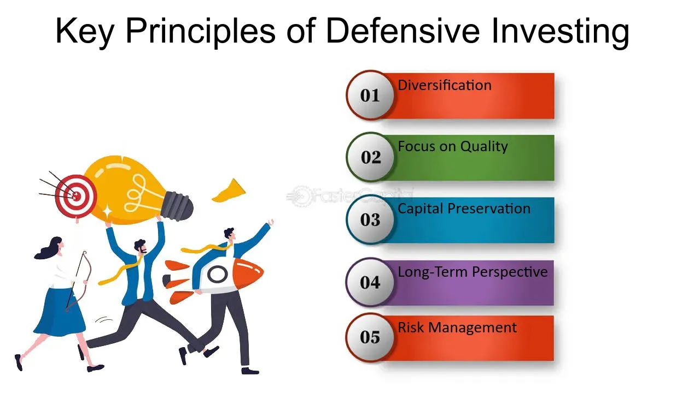

## Table of Contents

## What is a defensive investment strategy?

A defensive investment strategy is a way of investing that focuses on protecting your money from big losses. Instead of trying to make a lot of money quickly, people who use this strategy pick investments that are less risky. They choose things like utility companies, healthcare, and consumer goods that people need no matter what the economy is doing. These types of investments usually don't go up and down as much as others, so they are safer.

The main goal of a defensive strategy is to keep your money safe during tough times in the market. When the economy is not doing well, these safer investments can help you lose less money than if you had invested in riskier things. By choosing stable companies and sectors, investors can still make some money while waiting for better times to come. This approach is good for people who want to protect their savings and are okay with slower, steadier growth.

## Why would someone choose a defensive investment strategy?

Someone might choose a defensive investment strategy if they want to keep their money safe, especially during times when the economy is not doing well. This strategy focuses on picking investments that are less likely to lose a lot of value quickly. For example, companies that provide essential services like electricity or healthcare tend to be more stable because people need these services no matter what. By investing in these kinds of companies, an investor can protect their money from big drops in the market.

Another reason someone might choose a defensive strategy is if they are close to retirement or if they need their money to last for a long time. They might not want to take big risks with their savings because they can't afford to lose a lot of money. A defensive strategy helps them sleep better at night knowing their investments are safer. It might not make them rich quickly, but it can help them keep what they have and maybe even grow their money slowly over time.

## What are the key characteristics of defensive investments?

Defensive investments are all about keeping your money safe. They are usually in companies that make things people always need, like food, medicine, or electricity. These companies are often in industries like utilities, healthcare, and consumer goods. Because people need these things no matter what, these companies tend to be more stable. This means their stock prices don't go up and down as much as other companies, which makes them less risky.

Another key characteristic of defensive investments is that they can provide steady income. Many of these companies pay dividends, which are like little payments to shareholders. These dividends can help investors make money even when the stock market is not doing well. Also, defensive investments are good for people who want to keep their money safe over the long term. They might not grow as fast as other investments, but they are more likely to keep their value, which is important for people who can't afford to lose a lot of money.

## Can you list some common examples of defensive investments?

Defensive investments are things like utility companies, which make electricity or water. These are always needed, so their prices don't go up and down as much. Healthcare companies, like those that make medicine or run hospitals, are also good examples. People always need healthcare, so these companies stay stable. Consumer goods companies, like those that make food or cleaning products, are another type. Everyone needs to eat and keep their homes clean, so these companies do well even when the economy is bad.

Another example is companies that make personal care products, like toothpaste and shampoo. People will keep buying these things no matter what. Tobacco companies can also be defensive investments because smokers usually keep buying cigarettes even during tough times. Lastly, some people think of gold as a defensive investment. It's not a company, but it's something people buy when they want to keep their money safe during uncertain times.

## How does a defensive investment strategy differ from an aggressive one?

A defensive investment strategy and an aggressive one are pretty different. A defensive strategy is all about keeping your money safe. People who use this strategy pick investments that are less likely to lose a lot of value quickly. They choose companies that make things people always need, like electricity, medicine, or food. These investments don't go up and down as much, so they're safer. The goal is to protect your money, especially when the economy is not doing well. It's like putting on a seatbelt to stay safe.

On the other hand, an aggressive investment strategy is about trying to make a lot of money fast. People who use this strategy pick investments that can grow a lot, but they're also riskier. They might invest in new tech companies or small businesses that could become big one day. These investments can go up a lot, but they can also go down a lot. The goal is to make big profits, but it's like riding a roller coaster - it can be exciting, but it can also be scary.

## What are the potential benefits of adopting a defensive investment strategy?

One big benefit of a defensive investment strategy is that it helps keep your money safe. When you pick investments that are less likely to lose value quickly, you can protect your savings even if the economy is not doing well. For example, if you invest in companies that make things people always need, like electricity or medicine, you are less likely to see big drops in your investment's value. This is really helpful for people who can't afford to lose a lot of money, like those who are close to retirement.

Another benefit is that defensive investments can provide a steady income. Many of these companies pay dividends, which are like small payments to shareholders. This means you can earn some money from your investments even when the stock market is not doing great. Over time, this steady income can add up and help you keep your money growing slowly but surely. It's like having a safety net that catches you if things get tough.

## What are the potential drawbacks or risks associated with a defensive investment strategy?

One potential drawback of a defensive investment strategy is that it might not make you as much money as a more aggressive strategy. When you invest in safer companies like those in utilities or healthcare, you're choosing stability over big growth. These companies usually don't see their stock prices go up a lot, so your money might grow more slowly. If you're young and have a long time before you need your money, you might miss out on bigger gains from riskier investments.

Another risk is that even defensive investments can lose value. While they are generally more stable, they can still go down if something bad happens to the company or the economy. For example, if a utility company faces a big problem like a major lawsuit or if there's a sudden change in regulations, its stock price could drop. So, while these investments are safer, they're not completely safe. It's important to remember that no investment is totally risk-free.

## How can someone implement a defensive investment strategy in their portfolio?

To implement a defensive investment strategy, start by focusing on companies that provide essential services or products. Look for businesses in sectors like utilities, healthcare, and consumer goods. These companies make things like electricity, medicine, and food that people need no matter what the economy is doing. You can buy stocks in these companies or invest in mutual funds and ETFs that focus on these sectors. By choosing these types of investments, you're more likely to keep your money safe during tough times in the market.

Another way to build a defensive portfolio is to include assets that are known for their stability. For example, you might want to add some bonds, especially government or high-quality corporate bonds, because they usually don't lose as much value as stocks. Also, think about adding some cash or cash equivalents like money market funds. These can provide a cushion and help you buy other investments when prices are low. Remember, the goal is to protect your money, so take your time to research and choose investments that fit well with a defensive approach.

## What role do sectors like utilities and consumer staples play in a defensive strategy?

Sectors like utilities and consumer staples are really important in a defensive investment strategy. Utilities are companies that provide things like electricity, water, and gas. People need these services no matter what, so these companies are very stable. They don't usually see big changes in their stock prices, which makes them safer to invest in. When the economy is not doing well, utility companies can help keep your money safe because people will always need to pay their utility bills.

Consumer staples are also a big part of a defensive strategy. These are companies that make things like food, drinks, and cleaning products. People always need to buy these things, even during tough times. So, these companies tend to be more stable than others. By investing in consumer staples, you can protect your money from big drops in the market. These sectors help you keep your money safe and can even provide a steady income through dividends, making them a key part of a defensive approach.

## How does economic cycle influence the effectiveness of a defensive investment strategy?

The economic cycle can really affect how well a defensive investment strategy works. When the economy is doing well and growing, defensive investments like utilities and consumer staples might not grow as fast as other, riskier investments. This is because people might be more willing to spend money on things they don't need, like new tech gadgets or luxury items. So, if you're only investing in defensive sectors during good economic times, you might miss out on bigger gains from other parts of the market.

But when the economy starts to slow down or go into a recession, that's when a defensive strategy really shines. During tough times, people still need to buy essentials like food, medicine, and electricity. So, companies in these sectors usually don't lose as much value as others. By having a lot of your money in defensive investments, you can protect it from big drops in the market. This can help you keep your savings safe until the economy gets better and you can start investing more aggressively again.

## What metrics should investors monitor to assess the performance of their defensive investments?

When you're looking at how well your defensive investments are doing, you should keep an eye on a few important numbers. One of these is the dividend yield, which tells you how much money you're getting back from your investment in dividends. Since many defensive companies pay dividends, a good yield can show that your investment is giving you a steady income. Another number to watch is the price-to-earnings (P/E) ratio. This shows how much you're paying for the company's earnings. A lower P/E ratio might mean the stock is a good value, which is important for defensive investing.

You should also look at the beta of your investments. Beta measures how much the stock moves compared to the overall market. Defensive stocks usually have a lower beta, meaning they don't go up and down as much. This can help you see if your investments are really helping to keep your money safe. Finally, keep an eye on the company's earnings growth. Even though defensive companies grow slowly, steady earnings growth can show that the company is stable and doing well over time. By watching these numbers, you can make sure your defensive strategy is working the way you want it to.

## How can advanced investors use options and other derivatives to enhance a defensive strategy?

Advanced investors can use options and other derivatives to make their defensive strategy even better. One way to do this is by using put options. A put option gives you the right to sell a stock at a certain price, which can protect your money if the stock price goes down. For example, if you own a utility company stock, you can buy a put option to set a floor on how much you could lose. This way, you keep the safety of the defensive stock but add an extra layer of protection. Another tool is covered calls, where you own the stock and sell someone else the right to buy it from you at a set price. This can give you extra income, which is good for a defensive strategy because it adds to the steady dividends you might already be getting.

Derivatives can also be used to hedge against broader market risks. For instance, you can buy index put options, which protect your whole portfolio if the market goes down. This can be really helpful during tough economic times because it adds another layer of safety to your defensive investments. But remember, using options and derivatives can be tricky and comes with its own risks. It's important to understand how they work and to use them carefully. By adding these tools to your defensive strategy, you can make it stronger and better at protecting your money.

## References & Further Reading

[1]: ["Modern Portfolio Theory and Investment Analysis"](https://www.amazon.com/Modern-Portfolio-Theory-Investment-Analysis/dp/1118469941) by Edwin J. Elton, Martin J. Gruber, Stephen J. Brown, and William N. Goetzmann

[2]: ["Algorithmic Trading and DMA: An introduction to direct access trading strategies"](https://www.amazon.com/Algorithmic-Trading-DMA-introduction-strategies/dp/0956399207) by Barry Johnson

[3]: ["Technical Analysis of the Financial Markets: A Comprehensive Guide to Trading Methods and Applications"](https://www.amazon.com/Technical-Analysis-Financial-Markets-Comprehensive/dp/0735200661) by John J. Murphy

[4]: ["Risk Management and Financial Institutions"](https://www.simonfoucher.com/MBA/FINA%20695%20-%20Risk%20Management/riskmanagementandfinancialinstitutions4theditionjohnhull-150518225205-lva1-app6892.pdf) by John C. Hull

[5]: ["Algorithmic Trading: Winning Strategies and Their Rationale"](https://www.amazon.com/Algorithmic-Trading-Winning-Strategies-Rationale-ebook/dp/B00CY5HC0U) by Ernest P. Chan