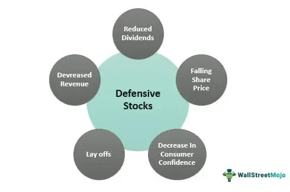

The stock market serves as a dynamic and intricate environment where investors strive to maximize returns through varied strategies. Within this environment, two prominent approaches gaining traction are investment in defensive stocks and the utilization of algorithmic trading, also referred to as algo trading. These strategies have emerged as efficient methods to navigate the challenges posed by volatile markets.

Defensive stocks, often characterized by their steady dividends and stable earnings, provide a layer of security for investors. They belong to industries such as utilities, healthcare, and consumer staples, sectors known for their resilience amidst economic fluctuations. This focus on stability makes defensive stocks an appealing option for those prioritizing long-term security over short-term gains, offering consistency even during adverse market conditions.



Conversely, algorithmic trading leverages cutting-edge technology to automate trading processes. By using sophisticated computer algorithms—capable of analyzing extensive datasets and executing trades with speed and accuracy—investors can make precise trading decisions. This approach minimizes human errors and allows for the exploitation of fleeting market opportunities, thereby enhancing trading efficiency.

The combination of risk management intrinsic to defensive stocks and the technological innovation offered by algo trading caters to a diverse investor base. Traditional investors, who may favor the reassurance of defensive stocks, and modern investors, who are drawn to the precision of algorithmic trading, can both harness these strategies effectively. Mastery of these methods enables investors to construct portfolios resilient to varying market conditions, balancing security with opportunities for optimization and growth.

By comprehensively understanding these two strategic paths, investors can position themselves better to withstand fluctuations in the market and potentially secure rewarding returns.

## Table of Contents

## Understanding Defensive Stocks

Defensive stocks are shares of companies known for their consistent delivery of dividends and stable earnings, independent of broader market volatility. Characteristically, these stocks are predominant in industries such as utilities, healthcare, and consumer staples—sectors that provide essential goods and services and thus exhibit resilience during economic fluctuations. 

Utilities companies, for instance, supply vital services like electricity and water, which maintain demand regardless of the economic cycle. Similarly, healthcare companies meet the perpetual demand for medical services and pharmaceuticals. Consumer staples, which include necessary goods such as food and household products, also enjoy stable demand. These sectors offer a reduced [volatility](/wiki/volatility-trading-strategies) investment landscape, making defensive stocks an appealing option for cautious investors.

Investing in defensive stocks is widely regarded as a conservative strategy, focusing on long-term stability rather than rapid gains. This approach suits investors looking to preserve capital while securing a steady income stream through dividends. During economic downturns, when markets tend to be volatile and unpredictable, defensive stocks hold their ground better than their counterparts, such as [growth stocks](/wiki/growth-stocks). Their capability to provide shelter through consistent returns makes them a safe haven during turbulent economic times.

Consider, for example, Procter & Gamble (consumer staples), Duke Energy (utilities), and Johnson & Johnson (healthcare). These firms have a track record of reliability in delivering dividends and maintaining earnings through various market conditions. By including such stocks in an investment portfolio, investors can achieve a more substantial and resilient financial strategy capable of weathering diverse economic challenges.

Ultimately, defensive stocks provide a foundation of stability and regular income, particularly advantageous during periods of economic uncertainty, thereby strengthening investment portfolios.

## The Role of Algo Trading in Modern Markets

Algorithmic trading, often abbreviated as algo trading, utilizes complex computer algorithms to execute trades, capitalizing on optimal times and prices with minimal human intervention. This strategy is a cornerstone of modern financial markets, driven by the capability of computers to process and analyze large datasets instantaneously, thereby making swift and precise trading decisions. Here, we explore the components and advantages of algo trading, as well as the potential risks associated with it.

At its core, algo trading leverages the speed and efficiency of computers to outperform traditional human-led trading in terms of execution speed and accuracy. The primary objective is to identify profitable trading opportunities by scanning for patterns and trends across vast datasets, which human traders might overlook due to limited processing power. This is achieved using a variety of algorithmic strategies that vary in complexity and application.

### Types of Algorithms

1. **Trend-following Strategies**: This is one of the simplest forms of algo trading, where the algorithm identifies and follows a specified trend in the market, such as moving averages or channel breakouts. This type of strategy is based on the assumption that prices follow trends, and by identifying and capitalizing on these trends, profits can be maximized.

2. **Arbitrage Opportunities**: Algorithms can detect price discrepancies between different markets or instruments that are typically difficult for human traders to exploit in real-time. Statistical arbitrage is one such example where small price inefficiencies are exploited rapidly before the market self-corrects.

3. **Mean Reversion**: This strategy is based on the theory that prices and returns eventually move back towards the mean or average. Algorithms monitor the market for deviations from the historical average and execute trades expecting a reversion to this mean.

4. **Market Making**: Algorithms provide liquidity to the market by placing limit orders on both the buy and sell sides, profiting from the bid-ask spread. This requires sophisticated algorithms to manage the risk of being "picked off" by more informed traders.

### Advantages of Algo Trading

- **Precision and Speed**: By eliminating human error, algorithms can execute trades with greater speed and precision, often measured in milliseconds or microseconds.

- **Consistency and Discipline**: Algorithms can operate continuously without fatigue and execute trades as per predefined strategies without emotion-driven deviations.

- **Backtesting Capabilities**: Algo trading allows strategies to be tested on historical data, enabling traders to gauge the viability and optimize strategies before deploying real capital.

### Risks and Challenges

Despite its advantages, algo trading is not without risks. 

- **Technical Failures**: Issues such as system crashes, network outages, and bugs in the code can result in significant financial losses.

- **Market Impact**: High-frequency trading strategies can sometimes lead to market phenomena like "flash crashes" due to the sheer volume and speed of trades executed.

- **Regulatory and Ethical Concerns**: As algo trading strategies become more complex, there are growing concerns about the transparency and fairness in the markets, with regulators increasingly scrutinizing trading activities.

### Basic Example in Python

A simple example of a trend-following algorithm using Python might involve using moving averages to trigger buy and sell signals:

```python
import numpy as np
import pandas as pd

# Sample dataset
data = pd.DataFrame({'price': [100, 102, 101, 104, 107, 103, 105]})

# Calculate moving averages
short_window = 2
long_window = 3
data['short_ma'] = data['price'].rolling(window=short_window, min_periods=1).mean()
data['long_ma'] = data['price'].rolling(window=long_window, min_periods=1).mean()

# Generate buy/sell signals
data['signal'] = np.where(data['short_ma'] > data['long_ma'], 'Buy', 'Sell')

print(data)
```

This example demonstrates a simple moving average cross-over strategy, often used in trend-following. The algorithm calculates short-term and long-term averages of the price and generates buy signals when the short-term average crosses above the long-term average and sell signals when it crosses below.

In conclusion, while [algorithmic trading](/wiki/algorithmic-trading) offers numerous advantages in executing trades effectively, it requires careful implementation and monitoring to mitigate potential risks. Investors need to balance these sophisticated technological tools with an understanding of the market dynamics to effectively harness their potential in modern markets.

## Choosing the Right Investment Strategy

When investing in the stock market, selecting the right investment strategy is crucial for aligning portfolio management with individual needs and market conditions. The choice of strategy is influenced by risk tolerance, market knowledge, and investment goals. Two prominent strategies, defensive stocks and algorithmic trading (algo trading), cater to different investor needs and market approaches.

Defensive stocks are an excellent match for investors prioritizing stable and consistent returns. These stocks are typically associated with sectors such as utilities, healthcare, and consumer staples, which exhibit resilience during economic fluctuations. Focusing on companies with a history of reliable dividend payouts and stable earnings, defensive stocks aim to mitigate volatility. This conservative approach provides a buffer against downturns and is ideal for those with a lower risk tolerance and a long-term investment horizon.

On the other hand, algo trading offers an avenue for investors who possess a strong understanding of market mechanics and technological proficiency. This strategy leverages sophisticated computer algorithms to conduct trades based on predefined criteria, capturing market opportunities with speed and precision. By automating decision-making processes, algo trading can minimize human error and exploit short-term price movements. It appeals to those who seek higher returns and are comfortable with the complexities and risks involved in modern financial markets.

The selection between defensive stocks and algo trading should reflect individual investment profiles and market conditions. For example, during periods of market uncertainty or economic decline, defensive stocks may provide the stability and peace of mind that investors seek. However, in bullish markets or when rapid changes in market dynamics are anticipated, algo trading could offer competitive advantages by executing timely trades and optimizing returns.

Moreover, investors might consider a hybrid approach, integrating both strategies to leverage their respective strengths. A balanced portfolio could combine the steady income from defensive stocks with the agility of algo trading, thereby achieving both resilience and growth potential.

Ultimately, the key to choosing the right investment strategy is grounded in a thorough understanding of one's financial goals, risk appetite, and market expertise. By consciously aligning these elements, investors can tailor their portfolios to navigate diverse market scenarios successfully, positioning themselves for long-term success.

## Integrating Defensive Stocks with Algo Trading

Combining defensive stocks with algorithmic trading presents an advanced investment strategy that enhances portfolio resilience while taking advantage of technological innovations. This synergy allows investors to harness the low-risk profile of defensive stocks with the dynamic capabilities of algorithmic systems, thereby achieving a well-balanced investment approach.

Algorithmic trading can optimize defensive stock portfolios by executing trades automatically based on predefined criteria. This capability ensures that buy and sell decisions are timely and are in alignment with market conditions, allowing for enhanced risk management. For instance, an algorithm can be programmed to consistently monitor stock price movements against historical volatility metrics and execute trades when a stock's price deviates significantly from expected patterns. This minimizes exposure to unfavorable market shifts and helps maintain the portfolio's stability.

One practical method to integrate these strategies is by employing a [pair trading](/wiki/pair-trading) algorithm that focuses on defensive stocks. Pair trading involves selecting two stocks that historically move together and executing trades based on their price divergence. In the context of defensive stocks, this method can be implemented to capitalize on the temporary mispricing between correlated assets, thereby ensuring steady returns independent of overall market trends.

For example, the following Python code snippet illustrates a simple [backtesting](/wiki/backtesting) strategy for pair trading involving two defensive stocks:

```python
import numpy as np
import pandas as pd
import statsmodels.api as sm
import matplotlib.pyplot as plt

# Load historical price data for two defensive stocks
stock_a = pd.Series(...)  # Prices for stock A
stock_b = pd.Series(...)  # Prices for stock B

# Compute the spread
spread = stock_a - stock_b

# Compute the z-score of the spread
spread_mean = spread.mean()
spread_std = spread.std()
z_score = (spread - spread_mean) / spread_std

# Generate trade signals
entry_threshold = 2.0
exit_threshold = 0.5

is_long = z_score < -entry_threshold
is_short = z_score > entry_threshold
position = np.where(is_long, 1, np.where(is_short, -1, 0))

# Plot the results
plt.figure(figsize=(12, 6))
plt.plot(spread.index, spread, label='Spread')
plt.plot(spread.index, z_score, label='Z-Score')
plt.plot(spread.index, position, label='Position')
plt.axhline(entry_threshold, color='r', linestyle='--', label='Entry Threshold')
plt.axhline(-entry_threshold, color='g', linestyle='--', label='Entry Threshold (Short)')
plt.axhline(exit_threshold, color='b', linestyle='-.', label='Exit Threshold')
plt.axhline(-exit_threshold, color='purple', linestyle='-.', label='Exit Threshold (Short)')
plt.legend(loc='upper right')
plt.title('Pair Trading Strategy on Defensive Stocks')
plt.show()
```

By strategically combining defensive stocks with algorithmic trading, investors can adhere to a diversified and balanced strategy that ensures both stability and responsiveness to market opportunities. This approach reduces the susceptibility to sudden market downturns while capitalizing on the protective nature of defensive stocks. Ultimately, the integration of these strategies allows investors to achieve robust portfolio management, aligning with their risk preferences and long-term financial objectives.

## Conclusion

Both defensive stocks and algorithmic trading stand out as prominent strategies capable of providing unique advantages in stock market investments. Defensive stocks are known for offering a consistent safety net during turbulent economic periods. They are often associated with companies in sectors that provide essential goods and services, thus ensuring more stable earnings and dividends irrespective of market volatility. This stability is particularly appealing to investors prioritizing risk aversion and long-term wealth preservation.

On the other hand, algorithmic trading leverages modern computational power to achieve strategic advantages. By enabling rapid and precise execution of trades based on pre-designed algorithms, it capitalizes on market efficiencies and minimizes human error. This technological edge not only enhances trading effectiveness but also opens opportunities for implementing complex strategies tailored to intricate market structures.

To successfully navigate complex market scenarios, investors may benefit from understanding and incorporating both strategies into their portfolios. When approached individually, defensive stocks can cushion against market downturns while safeguarding a steady income. Alternatively, algorithmic trading offers a dynamic mechanism to exploit short-term opportunities and improve trade timing and pricing.

Combining these strategies can lead to a well-rounded portfolio capable of addressing diverse financial goals and risk preferences. Investors might employ algorithmic methods to optimize their dealings in defensive stocks, ensuring timely transactions and proactive risk management without compromising on security. This synergy can potentially maximize returns while preserving the core benefits of each approach.

Readers are encouraged to further explore these investment strategies. Continuous learning and adaptation are crucial to making informed decisions in the ever-evolving financial landscape. By aligning investment approaches to individual goals and market conditions, investors are better positioned to achieve long-term financial success.

## References & Further Reading

[1]: ["The Little Book of Safe Money: How to Conquer Killer Markets, Con Artists, and Yourself"](https://www.amazon.com/Little-Book-Safe-Money-Yourself/dp/0470398523) by Jason Zweig

[2]: Frazzini, A., & Pedersen, L. H. (2014). ["Betting Against Beta."](https://www.sciencedirect.com/science/article/pii/S0304405X13002675) The Journal of Finance, 68(4), 1575-1618.

[3]: ["Global Algorithmic Trading Market 2021-2026: Industry Growth, Size, Share, Trends, Demand and Top Key Players"](https://www.gminsights.com/industry-analysis/algorithmic-trading-market) (Market Research Report)

[4]: ["Foundations of High-Frequency Trading"](https://forexbrokerlisting.com/education/high-frequency-trading/) by John F. Dibbs

[5]: ["The Handbook of Fixed Income Securities"](https://www.amazon.com/Handbook-Fixed-Income-Securities-Ninth/dp/1260473899) by Frank J. Fabozzi

[6]: Narang, R. K. (2009). ["Inside the Black Box: The Simple Truth About Quantitative Trading"](https://onlinelibrary.wiley.com/doi/book/10.1002/9781118267738) Wiley Trading Series.

[7]: ["Algorithmic And High-Frequency Trading"](https://assets.cambridge.org/97811070/91146/frontmatter/9781107091146_frontmatter.pdf) by Alvaro Cartea, Sebastian Jaimungal, and José Penalva

[8]: Wagner, W. H., & Lau, S. T. (1971). ["The Effect Of Diversification On Risk"](https://www.jstor.org/stable/4470866) Financial Analysts Journal, 27(6), 73-82.