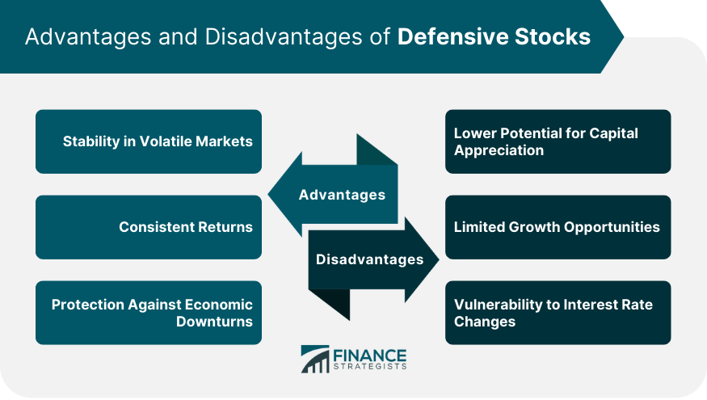

## Table of Contents

## What are defensive stocks?

Defensive stocks are types of stocks that tend to be more stable during economic downturns. They are from companies that provide essential goods and services, like food, utilities, and healthcare. People need these things no matter how the economy is doing, so these companies usually keep making money even when times are tough.

Because of their stability, defensive stocks can be a good choice for investors who want to protect their money during uncertain times. These stocks might not grow as fast as others during good economic times, but they are less likely to lose a lot of value when the economy is struggling. This makes them a safer bet for people looking to avoid big losses.

## Why are defensive stocks considered safe investments?

Defensive stocks are considered safe investments because they come from companies that sell things people always need, like food, electricity, and medicine. No matter if the economy is doing well or poorly, people still need these basic things. So, these companies usually keep making money even when times are tough. This means their stock prices don't drop as much during bad economic times.

Because these stocks are more stable, they can help protect an investor's money. They might not grow as fast as other stocks when the economy is booming, but they won't lose as much value when things go downhill. This makes them a good choice for people who want to keep their money safe and avoid big losses during uncertain times.

## What industries are typically associated with defensive stocks?

Defensive stocks usually come from industries that provide things people always need, no matter what's happening with the economy. These industries include food and beverages, utilities, and healthcare. Companies in the food and beverage industry, like those that make groceries or basic household items, keep selling their products because people need to eat and use these items every day. Utilities companies, which provide services like electricity, water, and gas, are also considered defensive because people can't live without these services.

Healthcare is another big industry for defensive stocks. Companies that make medicines, medical equipment, or provide healthcare services are always in demand because people need medical care all the time. Even during tough economic times, people still get sick and need treatment, so these companies tend to do well. These industries are less affected by economic ups and downs, which makes their stocks a safer choice for investors looking to protect their money.

## What are the main advantages of investing in defensive stocks?

The main advantage of investing in defensive stocks is that they help keep your money safe during tough economic times. These stocks come from companies that sell things people always need, like food, electricity, and medicine. Because people keep buying these things even when the economy is bad, the companies keep making money. This means their stock prices don't drop as much as other stocks might during a downturn. So, if you want to protect your money and avoid big losses, defensive stocks are a good choice.

Another advantage is that defensive stocks can provide a steady income. Many of these companies pay dividends, which are regular payments to shareholders. Since these companies are stable and keep making money, they can afford to pay these dividends regularly. This can be really helpful if you're looking for a reliable source of income from your investments. Overall, defensive stocks offer both safety and a steady income, making them a smart choice for many investors.

## Can defensive stocks provide significant growth opportunities?

Defensive stocks usually don't provide a lot of growth opportunities. These stocks come from companies that sell things people always need, like food and medicine. Because these companies are stable and don't change much, their stock prices don't go up a lot, even when the economy is doing well. So, if you're looking to make a lot of money quickly, defensive stocks might not be the best choice.

However, defensive stocks can still grow a bit over time. Companies in industries like healthcare or utilities might find new ways to make more money or improve their products. For example, a healthcare company might create a new medicine that sells well. This can help their stock price go up slowly. But compared to other stocks, like those in technology or new businesses, the growth of defensive stocks is usually smaller and slower.

## What are the potential disadvantages of investing in defensive stocks?

One big downside of investing in defensive stocks is that they usually don't grow much. These stocks come from companies that sell things people always need, like food and medicine. Because these companies are very stable and don't change a lot, their stock prices don't go up very fast, even when the economy is doing well. So, if you want to make a lot of money quickly, defensive stocks might not be the best choice for you.

Another disadvantage is that defensive stocks can still lose value. Even though they are more stable than other stocks, they can go down if something bad happens to the company or the whole industry. For example, if a food company has a big problem with one of its products, its stock price might drop. Also, because these stocks don't grow much, you might miss out on bigger gains from other types of stocks, like those in technology or new businesses.

## How do defensive stocks perform during economic downturns?

Defensive stocks tend to do better than other stocks during economic downturns. These stocks come from companies that sell things people always need, like food, medicine, and electricity. No matter how bad the economy gets, people still need to eat, stay healthy, and have power in their homes. So, these companies keep making money even when times are tough. This means their stock prices don't drop as much as other stocks might during a downturn.

While defensive stocks are more stable, they can still lose some value during really bad economic times. If a company in the food or healthcare industry has a big problem, its stock price might go down. But overall, defensive stocks lose less value than other types of stocks. They help protect your money when the economy is struggling, which is why many investors turn to them during uncertain times.

## What metrics should investors look at when evaluating defensive stocks?

When looking at defensive stocks, investors should pay attention to a few important numbers. One key metric is the dividend yield, which shows how much money the company pays out to its shareholders each year compared to the stock's price. Since many defensive companies are stable and make steady money, they often pay good dividends. Another important number is the price-to-earnings (P/E) ratio, which tells you how much you're paying for the company's earnings. A lower P/E ratio might mean the stock is a good deal, but you should compare it to other companies in the same industry.

Investors should also look at the company's debt levels. A company with too much debt might have trouble paying it back during tough times, even if it's in a defensive industry. You can check this by looking at the debt-to-equity ratio, which shows how much debt the company has compared to its own money. Finally, it's good to see how well the company is doing by looking at its revenue and earnings growth over time. Even though defensive stocks don't grow fast, steady growth can still be a good sign that the company is doing well.

## How do interest rates affect the performance of defensive stocks?

Interest rates can have a big effect on defensive stocks. When interest rates go up, it can make borrowing money more expensive for companies. Defensive stocks, like those in the utility or food industries, often have a lot of debt. If it costs them more to pay back this debt, it might hurt their profits. Also, when interest rates go up, other investments like bonds start to look more attractive because they offer higher returns. This can make people want to sell their defensive stocks and buy bonds instead, which can cause the stock prices to go down.

On the other hand, when interest rates are low, it can be good for defensive stocks. It's cheaper for companies to borrow money, so they can use that money to grow their business or pay dividends to shareholders. Low interest rates also make other investments like bonds less attractive, so people might keep their money in defensive stocks. This can help keep the stock prices stable or even make them go up a bit. Overall, the performance of defensive stocks can be influenced a lot by what's happening with interest rates.

## Can you provide examples of well-known defensive stocks?

Some well-known defensive stocks come from companies like Procter & Gamble and Coca-Cola. Procter & Gamble makes things like soap, toothpaste, and diapers that people use every day. No matter how the economy is doing, people still need these things. Coca-Cola makes drinks that people enjoy, and even in tough times, people still buy their favorite beverages. These companies are in the food and beverage industry, which is known for being stable because people always need to eat and drink.

Another example is Johnson & Johnson, a big name in the healthcare industry. They make medicines and medical devices that people need all the time, no matter what's happening with the economy. People get sick and need medical care no matter what, so Johnson & Johnson keeps making money even during bad times. Lastly, there's Duke Energy, a company in the utilities industry. They provide electricity, which is something people can't live without. Even when the economy is struggling, people still need power in their homes, so Duke Energy stays stable.

## How should defensive stocks be integrated into a diversified investment portfolio?

Defensive stocks should be a key part of a diversified investment portfolio because they help keep your money safe during bad economic times. These stocks come from companies that sell things people always need, like food, medicine, and electricity. By having some defensive stocks in your portfolio, you can protect your money when the economy is struggling. This is because these companies keep making money even when times are tough, so their stock prices don't drop as much as other stocks might.

You can balance your portfolio by mixing defensive stocks with other types of investments. For example, you might also invest in [growth stocks](/wiki/growth-stocks), which can make a lot of money when the economy is doing well, or in bonds, which are another safe investment. By having a mix of different investments, you can take advantage of good economic times while still having some protection during the bad times. This way, your portfolio can be more stable and better able to handle whatever the economy throws at it.

## What are some advanced strategies for investing in defensive stocks?

One advanced strategy for investing in defensive stocks is to use a sector rotation approach. This means you pay attention to what's happening in the economy and move your money around to different industries at different times. When you think the economy might be heading into a downturn, you can put more money into defensive stocks like those in the food, healthcare, and utilities industries. These stocks are less affected by economic ups and downs, so they can help protect your money. When the economy starts to get better, you might move some of your money back into other stocks that can grow faster.

Another strategy is to focus on dividend investing within the defensive stock sector. Many defensive companies, like those in utilities or consumer goods, pay regular dividends. You can choose stocks that have a history of paying good dividends and use those dividends to buy more shares. This is called dividend reinvestment, and it can help your investment grow over time. By focusing on companies with strong, stable dividends, you can build a steady income stream while also keeping your money safe during economic downturns.

## References & Further Reading

[1]: ["The Little Book of Safe Money: How to Conquer Killer Markets, Con Artists, and Yourself"](https://www.amazon.com/Little-Book-Safe-Money-Yourself/dp/0470398523) by Jason Zweig

[2]: Frazzini, A., & Pedersen, L. H. (2014). ["Betting Against Beta."](https://www.sciencedirect.com/science/article/pii/S0304405X13002675) The Journal of Finance, 68(4), 1575-1618.

[3]: ["Global Algorithmic Trading Market 2021-2026: Industry Growth, Size, Share, Trends, Demand and Top Key Players"](https://www.gminsights.com/industry-analysis/algorithmic-trading-market) (Market Research Report)

[4]: ["Foundations of High-Frequency Trading"](https://forexbrokerlisting.com/education/high-frequency-trading/) by John F. Dibbs

[5]: ["The Handbook of Fixed Income Securities"](https://www.amazon.com/Handbook-Fixed-Income-Securities-Ninth/dp/1260473899) by Frank J. Fabozzi

[6]: Narang, R. K. (2009). ["Inside the Black Box: The Simple Truth About Quantitative Trading"](https://onlinelibrary.wiley.com/doi/book/10.1002/9781118267738) Wiley Trading Series.

[7]: ["Algorithmic And High-Frequency Trading"](https://assets.cambridge.org/97811070/91146/frontmatter/9781107091146_frontmatter.pdf) by Alvaro Cartea, Sebastian Jaimungal, and José Penalva

[8]: Wagner, W. H., & Lau, S. T. (1971). ["The Effect Of Diversification On Risk"](https://www.jstor.org/stable/4470866) Financial Analysts Journal, 27(6), 73-82.