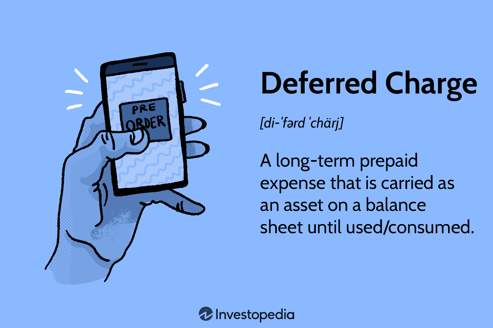

Deferred charges, often overshadowed by more immediate financial concepts, are critical in the expansive domains of accounting, finance, and algorithmic trading. These prepayments categorized as assets fundamentally support the financial architecture of organizations by spreading costs over time, which ameliorates cash flow management and aligns expenses with revenue. In automated trading systems, where precise and timely financial data is indispensable, the role of deferred charges cannot be overstated.

Financial decision-making thrives on accuracy. Deferred charges, through their meticulous management on balance sheets, provide a reliable financial picture over future periods. This reliable accounting practice ensures that financial analysts, traders, and accountants can trust the numbers they work with, reducing the risks associated with misinformed financial forecasting and strategy development.

In finance, understanding deferred charges helps analysts in assessing the true profitability and regulatory compliance of an organization. Their impact extends to investment decision-making and risk management as they represent future economic benefits. Any inaccuracies in the classification or amortization of these charges can skew profitability calculations, creating potential pitfalls in financial planning and analysis.

Algorithmic trading stands to gain significantly from accurate deferred charge management. Trading algorithms, designed to execute complex strategies based on real-time financial data, rely heavily on the precision of this data. With deferred charges accurately reflected in financial statements, algorithms operate on reliable prognostics, enhancing decision-making speed and efficiency. This reliable data foundation allows algorithms to optimize trading outcomes, making strategic decisions that can lead to greater profitability and reduced exposure to financial risks.

Ultimately, a comprehensive understanding of deferred charges equips professionals in these fields with the tools needed to maximize efficiencies. Properly managed, deferred charges can serve as a powerful ally in achieving fiscal discipline and strategic prowess, positioning organizations to capitalize on opportunities with a robust financial infrastructure underpinning their operations.

## Table of Contents

## Understanding Deferred Charges in Accounting

Deferred charges, also known as deferred expenses, are expenditures made by a business for costs that are expected to yield benefits in future periods. These prepayments are initially recorded as assets on the balance sheet. The underlying principle of their treatment is rooted in the matching principle of accrual accounting, which seeks to align expenses with the revenues they help generate.

Deferred charges are considered long-term assets as they are expensed gradually over a set period. This is done to accurately reflect their consumption and the benefits rendered over different accounting periods. A common instance of deferred charges in practice includes prepaid insurance premiums, where a business pays its insurance costs upfront but enjoys protection over a longer time frame. Similarly, prepaid rent, paid in advance for several months, is another typical example of a deferred charge.

The accounting for deferred charges involves several steps. Initially, when the expense is paid but not yet incurred, it is capitalized and recorded as an asset. As the accounting periods progress, the costs are systematically amortized. This involves spreading the expense across the periods that benefit from the expenditure. For instance, if a company pays for a three-year insurance policy costing $12,000, the monthly expense recognized would be calculated by dividing the total cost by the number of months, resulting in a monthly amortization of $333 ($12,000 / 36$).

Correct recognition and classification of deferred charges ensure that financial statements accurately portray the economic reality of a business. This precision is vital for adhering to Generally Accepted Accounting Principles (GAAP), ensuring that stakeholders can rely on the reported financial outcomes. Under GAAP, deferred charges are classified as assets, and their recognition must comply with the conceptual framework ensuring relevance, reliability, and comparability of financial information.

Adherence to these accounting standards provides businesses with a clear view of their operational efficiencies and long-term financial commitments, empowering them with data-driven insights for better decision-making.

## Deferred Charges vs. Deferred Revenue

In the context of financial accounting, it is essential to distinguish between deferred charges and deferred revenue as they represent differing financial obligations and benefits. Deferred charges, also referred to as deferred expenses, pertain to costs that have been paid in advance and are recorded as assets on the balance sheet. These charges are anticipated to result in future expenses and are systematically amortized over time to ensure they match the periods benefiting from the expense. Examples include prepaid expenses such as insurance and rent, where the benefit extends over several accounting periods.

Conversely, deferred revenue is associated with funds received for services or goods yet to be delivered. It is initially recognized as a liability, reflecting the company's obligation to provide the promised goods or services. As these obligations are fulfilled over time, the deferred revenue is converted into actual revenue, aligning the financial statements with the firm's economic activity. 

For instance, consider a software company that sells an annual subscription. Upon sale, the total revenue is deferred and recognized incrementally as the service is provided throughout the year.

Both deferred charges and deferred revenue are instrumental in mirroring an organization's true financial condition and activities within its financial statements, which supports accurate stakeholder analysis and decision-making. Misclassification between these two can severely distort financial reports, potentially misrepresenting a company's financial health and operational performance.

Inaccurately managing these categories could lead to faulty financial insights, impacting decision-making efficiency. Correct classification, therefore, is vital to maintain transparency, ensuring financial statements provide a truthful representation of the company's fiscal landscape which ultimately supports strategic decision-making processes.

## Importance in Finance and Algorithmic Trading

In finance, deferred charges are vital because they affect how profitability is calculated, impacting investment decisions and financial forecasting. These charges represent expenses paid in advance and are amortized over time, aligning with the accrual accounting method. Accurate representation of these expenses influences the apparent profitability of a company, thereby affecting investor perceptions and the timing of investment opportunities. The management of deferred charges can alter return on investment (ROI) calculations, influencing how financial analysts forecast a company’s future performance.

Algorithmic trading heavily relies on real-time and precise financial data, and the method of recording deferred charges plays a significant role in this domain. The recording impacts the data available to algorithms, which require accuracy for effective decision-making. For instance, if deferred charges are not accurately recorded, the algorithms may operate on flawed data, resulting in less optimal trading decisions. Consequently, managing deferred charges with precision ensures that the algorithms have the most accurate information, enhancing their ability to evaluate and execute trades strategically.

Timely and correctly managed financial data, including the proper classification of deferred charges, is essential for the smooth functioning of [algorithmic trading](/wiki/algorithmic-trading) systems. Such systems benefit greatly from rigorous financial controls that ensure data integrity. By adhering to these controls, trading operations can maximize efficiency and reduce errors, thereby optimizing resource allocation and minimizing potential risks associated with incorrect financial reporting.

In practice, optimizing the management of deferred charges translates to improved strategic outcomes for trading entities. Better management of these charges enables firms to allocate resources more effectively, maintain competitive edges through strategic trading, and ultimately achieve improved profitability. It also aids in reducing uncertainties that could stem from mismanaged financial data. Thus, proper management of deferred charges not only supports compliance with financial standards but also serves as a strategic tool in enhancing operational efficiency and long-term financial health. 

For trading firms utilizing algorithmic systems, mastering the nuances of deferred charge management is crucial. Ensuring that these charges are correctly recorded and reflected in the financial statements fosters transparency and bolsters stakeholder confidence, thereby reinforcing the strategic and financial stability of the organization.

## Best Practices for Managing Deferred Charges

### Best Practices for Managing Deferred Charges

Effectively managing deferred charges is essential for accurate financial reporting and maintaining operational efficiency. Establishing clear policies and robust internal controls is the first step in ensuring that deferred charge records accurately reflect actual financial activities. These controls should include periodic reviews and adjustments of the records to ensure alignment with current operations. This not only helps in maintaining accurate financial statements but also supports long-term financial stability.

Utilizing advanced accounting software can significantly enhance the management of deferred charges. These software solutions can automate the tracking and reporting processes, thereby reducing manual errors and increasing efficiency. Automation ensures that deferred charges are recorded and amortized accurately across appropriate periods, which is crucial for maintaining adherence to accrual accounting principles.

Investing in training for financial personnel is another critical practice. Staff must have a thorough understanding of deferred charges, their impact on financial statements, and the proper accounting treatments required. Training programs should cover the nuances of recognizing, classifying, and amortizing deferred charges in accordance with accounting standards. Well-informed personnel are better equipped to make accurate financial assessments and maintain compliance with regulatory requirements.

Aligning deferred charge management with overall financial strategies is also paramount. This alignment ensures that deferred charges contribute positively to the organization’s long-term financial goals and operational efficiency. By integrating deferred charge management into broader strategic plans, companies can optimize resource allocation and improve financial forecasting.

Lastly, consistent application of Generally Accepted Accounting Principles (GAAP) or International Financial Reporting Standards (IFRS) is vital. Adhering to these standards ensures transparency and reliability in financial reporting, which is critical for building stakeholder confidence. Consistent application also facilitates comparability and benchmarking against industry peers, providing valuable insights for decision-making.

By implementing these best practices, organizations can effectively manage deferred charges, thereby enhancing financial accuracy and strategic outcomes.

## Conclusion

Deferred charges hold a significant position in accounting, especially when considering their impact on long-term financial planning and operational efficiency. These charges, when managed accurately, ensure that financial statements reflect true economic activities, which is essential for strategic planning and decision-making.

In algorithmic trading, the need for precise financial data is paramount. These trading systems depend on real-time data for automated decision-making, which necessitates accurate management of deferred charges. When businesses maintain thorough and precise financial records, they enable algorithmic trading systems to function effectively, thus supporting sophisticated trading strategies and efficient capital usage.

Accurate management of deferred charges not only enhances internal financial health but also strengthens strategic outcomes. For trading firms focused on algorithmic strategies, this precision results in a competitive edge. With optimized strategies and prudent capital allocation, such firms can navigate markets more effectively.

Ultimately, understanding and implementing the correct practices for handling deferred charges is crucial. This knowledge enhances the robustness and transparency of financial operations and ensures the long-term success of financial and trading entities. By embedding rigorous controls and aligning them with global accounting standards, businesses can assure stakeholders of their financial integrity and sustainability.

## References & Further Reading

[1]: ["Intermediate Accounting: IFRS Edition"](https://books.google.com/books/about/Intermediate_Accounting_IFRS.html?id=3XntDwAAQBAJ) by Donald E. Kieso, Jerry J. Weygandt, and Terry D. Warfield

[2]: ["Algorithmic Trading: Winning Strategies and Their Rationale"](https://www.wiley.com/en-us/Algorithmic+Trading%3A+Winning+Strategies+and+Their+Rationale-p-9781118746912) by Ernie Chan

[3]: ["Financial Accounting and Reporting"](https://www.investopedia.com/terms/f/financialaccounting.asp) by Barry Elliott, Jamie Elliott

[4]: ["Principles of Financial Accounting"](https://www.investopedia.com/terms/a/accounting-principles.asp) by Jerry J. Weygandt, Paul D. Kimmel, and Donald E. Kieso

[5]: ["Amortization of Deferred Charges"](https://accountinginsights.org/understanding-deferred-costs-types-impact-and-amortization/) - Investopedia

[6]: ["Trading and Exchanges: Market Microstructure for Practitioners"](https://www.amazon.com/Trading-Exchanges-Market-Microstructure-Practitioners/dp/0195144708) by Larry Harris