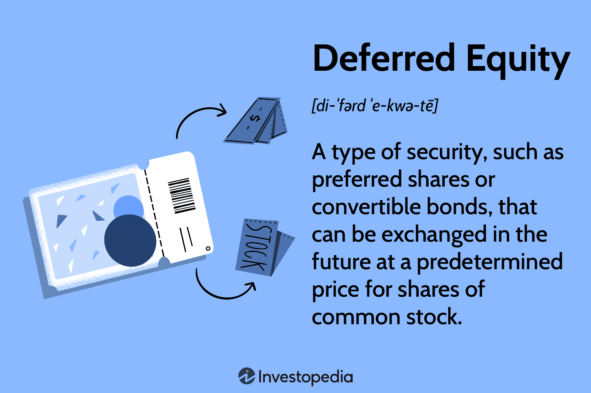

## Table of Contents

## What is deferred equity?

Deferred equity is a type of payment where instead of getting money right away, you get shares in a company later on. It's like a promise that you will own part of the company in the future. This is often used by startups or small businesses that don't have a lot of cash to pay their employees or partners upfront. By offering deferred equity, these companies can attract talented people who are willing to wait for their rewards.

When someone agrees to deferred equity, they are betting on the company's future success. If the company does well, the value of the shares they receive will go up, and they could make a lot of money. But if the company doesn't do well, the shares might not be worth much. This makes deferred equity a bit risky, but it can also be very rewarding if the company grows and becomes successful.

## How does deferred equity differ from traditional equity?

Deferred equity and traditional equity both give you a piece of a company, but they work differently. With traditional equity, you get your shares right away. You own part of the company from the start and can usually sell your shares whenever you want, as long as the company allows it. This means you have immediate ownership and can benefit from any increase in the company's value right away.

Deferred equity, on the other hand, means you don't get your shares immediately. Instead, you get them at a later time, based on an agreement with the company. This can be after a certain period or when certain goals are met. It's like a promise that you'll own part of the company in the future. This is often used by companies that don't have enough money to give out shares right away, so they use deferred equity to attract people who are willing to wait for their reward.

## What are the common reasons for using deferred equity?

Companies often use deferred equity when they don't have a lot of cash. Startups and small businesses might not be able to pay their employees or partners with money right away. So, they offer shares of the company later on instead. This helps them attract talented people who believe in the company's future and are willing to wait for their reward.

Deferred equity can also help keep people motivated. When employees or partners know they will get shares in the future, they might work harder to make the company successful. This is because the more successful the company becomes, the more valuable their future shares will be. It's a way to align everyone's goals and make sure everyone is working towards the same thing: the company's growth and success.

## Who typically benefits from deferred equity arrangements?

Deferred equity can be really good for startups and small businesses. These companies often don't have a lot of money to pay their employees or partners right away. By offering shares later on, they can attract talented people who believe in the company's future. This helps the company grow without spending a lot of cash upfront. It's like a promise that if the company does well, everyone will share in the success.

Employees and partners can also benefit from deferred equity. They get to own part of the company in the future, which can be very rewarding if the company becomes successful. It motivates them to work hard because the more the company grows, the more valuable their shares will be. However, it's a bit risky because they have to wait and hope that the company does well. If it doesn't, the shares might not be worth much.

## What are the key components of a deferred equity agreement?

A deferred equity agreement is like a promise between a company and someone who works for it or helps it grow. The main parts of this agreement include when the person will get their shares and how many shares they will get. The agreement might say that the shares will be given after a certain amount of time, like one or two years, or when the company reaches certain goals, like making a certain amount of money or launching a new product.

Another important part is what happens if the person leaves the company before they get their shares. The agreement needs to be clear about whether they still get the shares or if they lose them. It's also important to talk about what the shares are worth and how that might change over time. This helps everyone understand what they might gain from the company's success.

These agreements can be good for both the company and the person getting the shares. The company can save money now and use it to grow, while the person can look forward to owning part of the company in the future. But it's important that everyone understands the agreement and feels good about it, because it's a promise that depends on the company doing well.

## How is deferred equity valued and accounted for?

Deferred equity is valued based on what the company might be worth in the future. Since it's a promise of shares later on, the value depends on how well the company does. If the company grows and becomes successful, the value of the deferred equity goes up. But if the company doesn't do well, the value might be low or even zero. Companies often use financial models to guess what the shares might be worth when they are given out, but it's not an exact science because the future is uncertain.

When it comes to accounting for deferred equity, companies treat it as a type of expense called stock-based compensation. This means they need to record the value of the deferred equity as an expense on their financial statements over the time it takes for the shares to be given out. This helps show how much the company is spending to attract and keep talented people. The exact value recorded can change over time as the company's performance changes, which can make accounting for deferred equity a bit tricky.

## What are the tax implications of deferred equity?

When you get deferred equity, it means you will get shares in a company later on. This can affect your taxes in different ways. When you finally get the shares, it's usually considered income, and you have to pay taxes on the value of the shares at that time. The tax you pay depends on how much the shares are worth when you get them. If the company does well and the shares are worth a lot, you might have to pay more in taxes.

There's another tax to think about when you sell the shares you got from deferred equity. If you sell them for more than what they were worth when you got them, you have to pay capital gains tax on the profit. The tax rate for this can be different depending on how long you held the shares before selling them. If you held them for a year or less, it's a short-term capital gain, and you pay regular income tax on it. If you held them for more than a year, it's a long-term capital gain, and the tax rate is usually lower.

## Can deferred equity be used in startup companies, and if so, how?

Deferred equity is very popular in startup companies because they often don't have a lot of money to pay their employees or partners right away. Instead of giving cash, startups can offer shares of the company later on. This helps them attract talented people who believe in the company's future and are willing to wait for their reward. By using deferred equity, startups can save money now and use it to grow their business, while also giving people a chance to own part of the company if it becomes successful.

When a startup uses deferred equity, they make an agreement with the person who will get the shares. The agreement says when the person will get their shares and how many shares they will get. It might be after a certain amount of time or when the company reaches certain goals, like making a certain amount of money or launching a new product. This kind of agreement can motivate everyone to work hard because the more successful the company becomes, the more valuable their future shares will be.

## What are the potential risks associated with deferred equity?

Deferred equity can be risky for both the company and the person who gets the shares. For the person, the biggest risk is that the company might not do well. If the company fails or doesn't grow as expected, the shares they get later might not be worth much. This means they could work hard for a long time and end up with little or no reward. Also, if the person leaves the company before they get their shares, they might lose them altogether, depending on the agreement.

For the company, deferred equity can be tricky to manage. They have to keep track of when and how many shares they promised to give out, which can be complicated. If the company does really well, the value of the shares they give out can be very high, which means they might end up giving away a big part of the company. This can dilute the ownership of the original founders and investors. Plus, if the company doesn't have enough money to grow, using deferred equity might not be enough to attract the talent they need.

## How does deferred equity impact company valuation and investor relations?

Deferred equity can change how much a company is worth. When a company promises to give out shares later, it's like saying they will give away part of the company in the future. If the company does well and the shares become valuable, this can make the company worth less because they are giving away more of it. Investors might see this as a risk because it could mean less money for them if the company is sold or goes public. But if the company uses deferred equity to attract talented people who help it grow, it could also make the company more valuable in the long run.

Deferred equity can also affect how investors feel about the company. Some investors might like it because it shows the company is trying to save money and use it to grow. They might think it's smart to attract talented people without spending cash right away. But other investors might worry that the company is giving away too much of itself. They might be concerned about how much control they will have over the company in the future. It's important for the company to talk clearly with its investors about why they are using deferred equity and how it will help the company grow.

## What legal considerations must be taken into account with deferred equity?

When a company uses deferred equity, they need to make sure they follow the law. They have to write a clear agreement that says when the person will get their shares and how many shares they will get. This agreement should also talk about what happens if the person leaves the company before they get their shares. It's important to follow rules about giving out shares, like making sure everyone who gets shares knows what they are getting and when. If the company doesn't follow these rules, they could get in trouble with the law.

Another thing to think about is taxes. The company and the person getting the shares need to understand how deferred equity will affect their taxes. When the person finally gets the shares, they might have to pay taxes on them. The company needs to make sure they are doing everything right when it comes to taxes, so they don't get in trouble. It's a good idea for the company to talk to a lawyer and a tax expert to make sure they are following all the rules and doing things the right way.

## How can deferred equity be structured to maximize benefits for both the company and the recipients?

Deferred equity can be structured to benefit both the company and the recipients by setting clear goals and timelines. For the company, it's important to make sure the agreement says when the shares will be given out, like after a certain amount of time or when the company reaches certain goals. This helps the company keep control over when and how much of the company they are giving away. They can also use vesting schedules, which means the shares are given out slowly over time. This can keep people motivated to stay with the company and work hard because they know they will get more shares if they stick around.

For the recipients, the agreement should be fair and clear so they know what they are getting and when. The company can offer a bigger number of shares to make up for the fact that the recipients have to wait to get them. This can make the reward more attractive and worth waiting for. The agreement should also say what happens if the person leaves the company before they get their shares. If the terms are fair, it can make people feel more comfortable with the risk of waiting for their shares. By making the agreement clear and fair, both the company and the recipients can feel good about the deferred equity and work together to make the company successful.

## References & Further Reading

[1]: Bergstra, J., Bardenet, R., Bengio, Y., & Kégl, B. (2011). ["Algorithms for Hyper-Parameter Optimization."](https://dl.acm.org/doi/10.5555/2986459.2986743) Advances in Neural Information Processing Systems 24.

[2]: ["Advances in Financial Machine Learning"](https://www.amazon.com/Advances-Financial-Machine-Learning-Marcos/dp/1119482089) by Marcos Lopez de Prado

[3]: ["Evidence-Based Technical Analysis: Applying the Scientific Method and Statistical Inference to Trading Signals"](https://www.amazon.com/Evidence-Based-Technical-Analysis-Scientific-Statistical/dp/0470008741) by David Aronson

[4]: ["Machine Learning for Algorithmic Trading"](https://github.com/stefan-jansen/machine-learning-for-trading) by Stefan Jansen

[5]: ["Quantitative Trading: How to Build Your Own Algorithmic Trading Business"](https://www.amazon.com/Quantitative-Trading-Build-Algorithmic-Business/dp/1119800064) by Ernest P. Chan