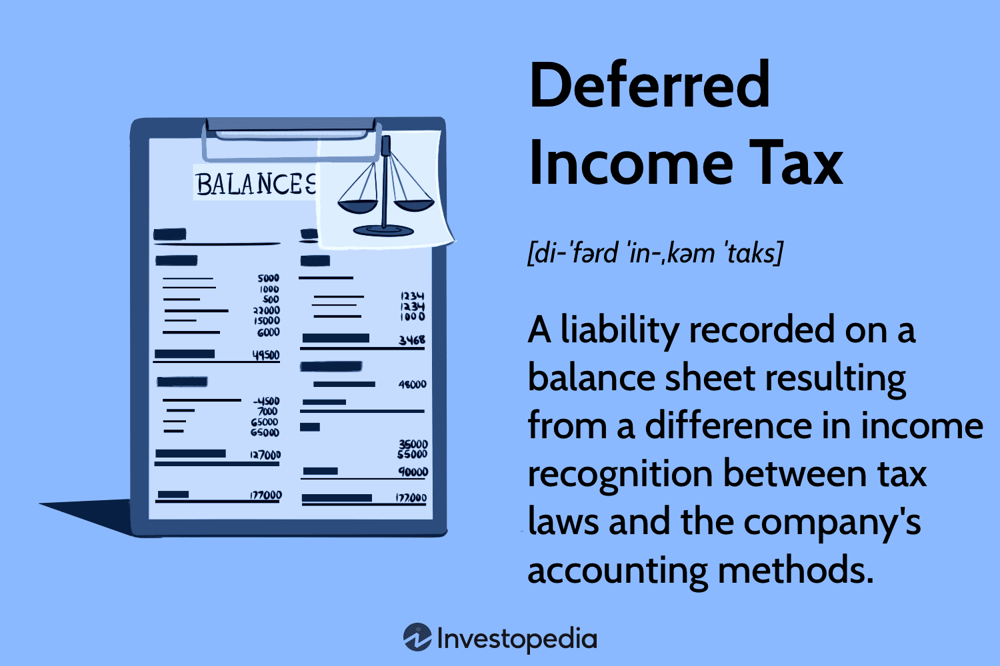

Taxation encompasses a broad spectrum of concepts crucial to both individuals and businesses, especially within financial markets. Key terms include income tax, a levy on individual or corporate earnings; capital gains tax, applicable to profits from asset sales; value-added tax (VAT), a consumption tax on goods and services; and deferred tax, an accounting mechanism reflecting timing differences between tax reporting and accounting figures. These elements, among others, are tightly interwoven, shaping financial strategies, compliance requirements, and market behaviors. Each tax category impacts cash flows and investment returns, influencing decisions ranging from asset allocation to profit maximization.

Algorithmic trading, which employs complex algorithms for executing trades at high speeds, has gained prominence in modern financial markets. Its growth is driven by technological advancements and the quest for efficiency. Algorithms can analyze vast datasets and execute orders with precision, making them essential for traders and institutions aiming to capitalize on market opportunities quickly. Despite its advantages, algorithmic trading introduces complexities, especially concerning tax obligations. Transactions occur at a rapid pace and high frequency, necessitating a thorough understanding of tax implications to ensure compliance and maintain profitability.



Understanding the tax landscape is pivotal in algorithmic trading due to the myriad of transactions that can result in diverse tax consequences. For example, the distinction between short-term and long-term gains may affect tax rates, while complex algorithms might trigger tax events that need meticulous tracking and reporting. As governments worldwide adapt tax regulations to the evolving financial ecosystem, traders must remain knowledgeable about tax laws relevant to automated trading strategies. This understanding will not only aid in regulatory compliance but also enhance trading strategies through effective tax planning.

This article proceeds by exploring income tax, which affects both individual and corporate traders by shaping the profitability of trading strategies. Deferred tax also plays a role in reflecting financial positions accurately on balance sheets. Through illustrative examples, the article will address the multifaceted nature of tax calculations in algorithmic trading, emphasizing the role of strategic planning in optimizing tax liabilities and trading performance.

## Table of Contents

## Understanding Income Tax in Financial Markets

Income tax is a government levy imposed on individuals and corporations, primarily based on their income or profits earned during a given tax period. It plays a critical role in financial markets, significantly impacting both individual and corporate traders. For individual traders, income tax applies to all earnings generated from their trading activities, such as profits from buying and selling securities. Similarly, for corporate entities engaging in trading, income tax is levied on net profits, affecting their overall financial health and investment strategy decisions.

Profits from trading activities are typically categorized as either capital gains or ordinary income, each subject to distinct tax rates. Short-term capital gains, resulting from assets held for one year or less, are usually taxed at ordinary income rates. Conversely, long-term capital gains enjoy preferential tax rates, which are often lower. The distinction between these two types of income is crucial, as it influences how traders time their trades and hold their assets, ultimately affecting their tax liabilities and net returns.

Investment strategies are heavily influenced by income tax considerations. Many traders engage in tax-efficient strategies, such as tax-loss harvesting, to minimize tax liabilities. Tax-loss harvesting involves selling underperforming securities at a loss to offset taxable gains from other investments, thereby reducing the overall tax burden. Income tax policies can also dictate the choice between actively managed strategies versus passive investment approaches, with passive strategies often offering tax efficiencies through lower turnover rates.

Traders are required to adhere to specific income tax filing requirements. They must report all income from trading activities on their tax returns, detailing net gains or losses and accounting for any carried forward losses. Deductible expenses relevant to trading, such as brokerage fees, software subscriptions, and home office space, can also be claimed to reduce taxable income. However, navigating deductions is often complex due to varying regulations and stipulations based on jurisdiction and trading status (e.g., individual, sole proprietor, corporation).

Algorithmic trading introduces additional challenges in calculating income tax. The high-frequency nature of trades and the vast [volume](/wiki/volume-trading-strategy) can lead to intricate record-keeping demands and complex tax computations. These complexities may necessitate advanced software solutions or professional tax services to ensure accurate reporting and compliance. Furthermore, distinguishing between short-term and long-term trades becomes more complicated due to the rapid execution of trades, which can significantly influence tax obligations.

In summary, understanding and managing income tax effectively is vital for traders in financial markets. Tax considerations not only affect immediate profitability but also have long-term implications for investment strategies and financial planning. Proactive tax management and adherence to regulatory requirements are essential for optimizing net returns and sustaining successful trading practices.

## Concept of Deferred Tax in Trading

Deferred tax is an accounting concept that represents the difference between the tax expense reported in financial statements and the taxes payable to tax authorities. This disparity arises due to timing differences in recognizing revenue and expenses for tax purposes versus accounting purposes. In trading businesses, especially those using [algorithmic trading](/wiki/algorithmic-trading) strategies, the notion of deferred tax is particularly relevant due to the complexity and volume of transactions.

Deferred tax assets and liabilities arise from temporary differences between the book value of assets and liabilities for financial reporting purposes and their tax base for tax purposes. For example, a trading firm might recognize revenue from a transaction immediately for accounting purposes, whereas for tax purposes, that revenue may only be recognized when cash is received. This creates a deferred tax liability, as the firm will owe taxes in the future. Conversely, a deferred tax asset might arise if a trading loss is recognized earlier for financial accounting than for tax purposes, allowing the firm to offset future taxable profits.

In algorithmic trading, deferred tax considerations are further complicated by the [high frequency](/wiki/high-frequency-trading) and automated nature of trades. For instance, a trading algorithm executing a large volume of intraday trades may generate realized gains and losses that are reported differently for financial and tax purposes. This timing difference can lead to significant deferred tax liabilities or assets on the trader's financial statements. For example, consider an algorithm that exploits price discrepancies in stocks between different markets, commonly known as [arbitrage](/wiki/arbitrage). If the profits from these trades are booked for accounting purposes in the current period but taxed in the future, a deferred tax liability is recorded.

To manage deferred tax effectively within a trading portfolio, strategic approaches are necessary. One approach is conducting regular reviews of the timing differences and understanding their impact on cash flows. Traders might prioritize strategies that align closely with their tax position—for instance, timing trades to match gains with available losses to minimize taxable income.

Tax software and professional consultation can be invaluable tools in navigating these complexities. Software solutions can automate the tracking of deferred tax assets and liabilities, while tax professionals can provide insights into regulatory changes and tax-planning opportunities.

Understanding and managing deferred tax is crucial for optimizing trading performance and financial reporting. As trading strategies evolve, continuous monitoring of tax implications ensures that traders remain compliant and that financial statements accurately reflect the firm's tax obligations.

## Tax Examples in Algorithmic Trading

Algorithmic trading involves automated transactions of financial assets based on pre-determined criteria. Understanding the tax implications of algorithmic trading requires exploring several key aspects, such as short-term gains, high-frequency trading, and specific trading strategies like [scalping](/wiki/gamma-scalping) and arbitrage.

**Illustrative Example of Tax Calculations:**

Consider a trader who employs an algorithmic trading system to execute high-frequency trades. Suppose they realize $500,000 in gross profits over a year. These transactions fall under short-term capital gains, typically taxed at the trader’s ordinary income tax rate, which could range from 10% to 37% in the United States, depending on total income bracket.

In a scenario where the trader's tax bracket is 35%, the tax liability on these gains would be calculated as follows:

$$
\text{Tax Liability} = 500,000 \times 0.35 = 175,000
$$

**Impact of High-Frequency Trading and Short-Term Gains:**

High-frequency trading ([HFT](/wiki/high-frequency-trading-strategies)) entails numerous trades executed in fractions of a second, often leading to significant short-term gains. These gains are subject to ordinary income tax rates. Frequent trading also impacts other factors like wash sale rules, which disallow the deduction of losses if a security is purchased within 30 days before or after a sale. This regulation poses a challenge for HFT, where rapid buy and sell transactions are common.

**Tax Considerations for Scalping and Arbitrage:**

Scalping involves profiting from small price changes, and transactions typically fall within the short-term gain category. These gains are considered as regular income. Arbitrage, exploiting price discrepancies across markets, may result in both short-term and long-term gains, depending on the holding period of the arbitraged assets. The tax treatment varies accordingly; long-term capital gains, for instance, may benefit from a reduced tax rate if the assets were held for over a year.

**Automated Trading Systems:**

Automated trading systems, while efficient in executing a multitude of trades, also consolidate gain and losses in a manner subject to taxation. One potential benefit is the ability to track and report all transactions systematically, minimizing human error. However, traders must remain vigilant about tax liabilities stemming from frequent interactions and ensure compliance with local tax regulations.

**Tax-Efficient Strategies in Algorithmic Trading:**

Traders can leverage tax-efficient strategies to mitigate liabilities. These may include optimizing the holding period to qualify for long-term capital gains rates, utilizing losses to offset gains, and adhering to tax-loss harvesting practices. Additionally, structuring trades through tax-advantaged accounts like IRAs can defer taxes.

Implementing a robust tax-aware algorithmic system can be beneficial. Using Python, one might integrate a library such as Pandas alongside NumPy for calculating tax efficiencies.

```python
import pandas as pd
import numpy as np

# Sample trades data
data = {'Profits': [1000, -500, 2000, -1000, 3000],
        'Status': ['win', 'loss', 'win', 'loss', 'win']}

# Create a DataFrame
df = pd.DataFrame(data)

# Calculate net gains (wins minus losses)
net_gains = df.loc[df['Status'] == 'win', 'Profits'].sum() + df.loc[df['Status'] == 'loss', 'Profits'].sum()
print("Net Gains: ", net_gains)

# Calculate tax liability assuming a tax rate of 35%
tax_rate = 0.35
tax_liability = net_gains * tax_rate
print("Tax liability: $", tax_liability)
```

Ultimately, understanding these tax intricacies is essential for optimizing returns in algorithmic trading. Traders must not only focus on developing sophisticated trading models but also incorporate tax resilience into their strategies to enhance profitability and compliance.

## Algorithmic Trading: Navigating Tax Regulations

Algorithmic trading, characterized by the use of complex algorithms to automate trading decisions, operates within a stringent regulatory framework designed to ensure transparency, fairness, and compliance with tax obligations. Tax regulations in algorithmic trading typically revolve around accurately reporting income and gains, adhering to specific financial disclosure requirements, and demonstrating compliance with relevant tax laws.

Key tax regulations for algorithmic traders often include maintaining adequate records of all trades, reporting gains and losses in alignment with accounting standards, and ensuring that tax filings reflect the true financial position of the trading activities. In jurisdictions such as the United States, laws like the Internal Revenue Code (IRC) play a significant role. Traders might be affected by various sections, such as Section 1256, which deals with the taxation of certain financial contracts, or the Wash Sale Rule, which disallows deductions on losses from trades intended to recover previous losses within a short time frame.

Compliance with tax laws is crucial in algorithmic trading environments. Non-compliance can result in severe penalties, including fines and legal action. Staying compliant involves not only understanding the applicable tax laws but also implementing robust reporting and record-keeping systems. Algorithmic traders often face the challenge of integrating complex tax codes with rapid trading cycles, necessitating systems that can reliably track and report activities.

Regulatory requirements can influence the profitability and tactical planning of algorithmic traders. Tax implications may dictate the selection of trading strategies, such as preferring long-term over short-term trades to capitalize on preferential tax treatments for long-term capital gains. Changes in tax policy can also prompt strategic adjustments to maintain cost-efficiency and profitability.

To maintain tax compliance, traders can leverage a variety of resources and consultancy services. Tax advisory services specializing in algorithmic trading can provide expert guidance tailored to the unique nature of automated trading systems. Furthermore, software solutions equipped with tax auditing capabilities can assist traders in maintaining accurate records and preparing timely, accurate tax filings.

In conclusion, navigating tax regulations in algorithmic trading necessitates a thorough understanding of the applicable tax codes and compliance requirements. Through effective planning and utilizing available resources, algorithmic traders can manage their tax obligations efficiently, ensuring their trading activities remain legally sound and financially beneficial.

## Conclusion

In conclusion, understanding taxation, particularly income tax and deferred tax, is essential for anyone involved in algorithmic trading. Income tax significantly affects both individual and corporate traders by influencing the profitability of trading activities through taxes on gains. Deferred tax, though more complex, plays a crucial role in strategic tax planning as it impacts financial statements and the apparent financial health of trading businesses.

Algorithmic traders face unique challenges regarding tax compliance, especially given the high-frequency nature of trades and the strategies employed, such as scalping or arbitrage, which can result in both short-term gains and intricate tax liabilities. It's crucial for traders to remain informed about the varying tax implications of different trading strategies and the jurisdictional tax laws governing these activities.

To capitalize on potential benefits and manage liabilities effectively, traders should prioritize continuous education and consultation with tax professionals. By doing so, they can implement tax-efficient strategies that might enhance trading performance, such as utilizing long-term investment positions during favorable tax periods or leveraging tax deductions appropriately.

Looking forward, the landscape of taxation in trading is expected to evolve alongside advancements in trading technology and financial regulations. Traders must stay abreast of these changes to ensure compliance and maintain profitability. Technological solutions, such as automated tax reporting tools and AI-driven analytics, could increasingly play a role in simplifying the management of tax obligations, providing pathways for optimization. By being proactive and adapting to these developments, traders can position themselves to navigate the future of taxation effectively, ultimately advancing their trading objectives and achieving better financial outcomes.

## References & Further Reading

[1]: ["Taxes and Trading Workshop"](https://www.thetradingworkshop.com/) - CME Group 

[2]: ["Algorithmic Trading: Winning Strategies and Their Rationale"](https://onlinelibrary.wiley.com/doi/pdf/10.1002/9781118676998.fmatter) by Ernest P. Chan

[3]: ["The Impact of High Frequency Trading on Market Quality"](https://www.sciencedirect.com/science/article/pii/S1057521921003185) National Bureau of Economic Research, by Alasdair Brown, Yan Lu, and Marco Rossi 

[4]: ["Taxation of Financial Products and Transactions"](https://www.pli.edu/programs/taxation-of-financial-products-and-transactions) - Thomson Reuters 

[5]: ["High-Frequency Trading: A Practical Guide to Algorithmic Strategies and Trading Systems"](https://www.ahmetbeyefendi.com/wp-content/uploads/2020/07/High-Frequency-Trading-Irene-Aldridge.pdf) by Irene Aldridge 

[6]: ["Handbook of High-Frequency Trading and Modeling in Finance"](https://onlinelibrary.wiley.com/doi/pdf/10.1002/9781118593486.fmatter) by Gerhard P. Dautzenberg 

[7]: U.S. Internal Revenue Service (IRS), [Section 1256 Contracts Marked to Market](https://www.irs.gov/pub/irs-drop/rr-24-22.pdf)