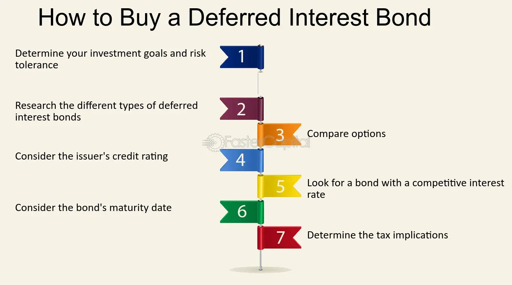

## Table of Contents

## What are Deferred Interest Bonds?

Deferred Interest Bonds are a type of bond where the interest payments are not paid to the bondholder right away. Instead, the interest is added to the bond's value over time. This means that the bondholder will receive a larger payment at the end of the bond's term, which includes all the interest that has built up.

These bonds can be useful for people who want to invest their money and get a bigger payment later. However, they can also be risky because if the issuer of the bond has financial problems, the bondholder might not get the full amount they are owed. It's important for investors to understand the risks and rewards before buying deferred interest bonds.

## How do Deferred Interest Bonds differ from regular bonds?

Deferred Interest Bonds are different from regular bonds mainly in how they handle interest payments. With regular bonds, you get interest payments usually every year or every six months. These payments are like a steady income from your investment. But with Deferred Interest Bonds, you don't get these regular payments. Instead, the interest that would have been paid to you is added to the bond's value. This means the bond grows in value over time, and you get all the interest at the end when the bond matures.

This difference can affect how people choose to invest. Regular bonds can be good if you want a steady income because you get money regularly. They are often seen as safer because you get your interest payments on time. On the other hand, Deferred Interest Bonds might be better if you want a bigger payout at the end and are okay with not getting money until then. But they can be riskier because if the company issuing the bond has money problems, you might not get the big payout you were expecting.

## What are the benefits of investing in Deferred Interest Bonds?

One benefit of investing in Deferred Interest Bonds is that they can offer a larger payout at the end of the bond's term. Instead of getting small interest payments every year, the interest is added to the bond's value. This means that when the bond matures, you get a bigger lump sum. This can be great if you're saving up for something big in the future, like buying a house or paying for college.

Another advantage is that Deferred Interest Bonds can be a good choice if you don't need regular income from your investments. If you can afford to wait and don't need money coming in every year, these bonds can help your investment grow more over time. This can be especially useful for younger investors who are planning for retirement and can wait for the bigger payout later on.

## What are the risks associated with Deferred Interest Bonds?

One big risk with Deferred Interest Bonds is that you might not get your money back. If the company or government that issued the bond runs into financial trouble, they might not be able to pay you the big lump sum at the end. This is different from regular bonds where you get interest payments along the way. With Deferred Interest Bonds, you don't get any money until the end, so if the issuer goes bankrupt, you could lose everything.

Another risk is that Deferred Interest Bonds can be harder to sell before they mature. If you need to get your money out early, you might have a hard time finding someone to buy your bond. This can make it less flexible than other types of investments where you can more easily sell and get your money back.

Lastly, these bonds can be affected more by changes in interest rates. If interest rates go up after you buy a Deferred Interest Bond, the value of your bond might go down. This is because new bonds being issued would offer higher interest rates, making your bond less attractive to other investors. So, if you need to sell your bond before it matures, you might have to sell it for less than you paid.

## How is the interest calculated on Deferred Interest Bonds?

The interest on Deferred Interest Bonds is calculated in a way that's a bit different from regular bonds. Instead of getting interest payments every year or every six months, the interest is added to the bond's value over time. This is called "accruing" interest. The interest rate is set when you buy the bond, and it stays the same for the whole time you own it. Every year, the interest for that year is added to the bond's value, making the bond worth more.

For example, if you have a Deferred Interest Bond with a face value of $1,000 and an annual interest rate of 5%, the first year, $50 (which is 5% of $1,000) would be added to the bond's value, making it worth $1,050. The next year, the interest would be calculated on the new value of $1,050, so you'd get 5% of $1,050, which is $52.50, making the bond worth $1,102.50. This process continues every year until the bond matures, and you get the final, bigger amount.

## When is the interest on Deferred Interest Bonds typically paid?

The interest on Deferred Interest Bonds is not paid out every year or every few months like with regular bonds. Instead, the interest is added to the bond's value over time. This means you don't get any money until the bond reaches its end date, which is called the maturity date.

When the bond matures, you get one big payment. This payment includes the original amount you invested, plus all the interest that has been added up over the years. So, instead of getting small amounts of interest regularly, you get a larger amount all at once at the end.

## Who typically issues Deferred Interest Bonds?

Deferred Interest Bonds are usually issued by governments or big companies. Governments might use them to borrow money for big projects like building roads or schools. They can be a good way for governments to manage their money because they don't have to pay interest every year. Instead, they can pay it all at once when the bond matures.

Big companies also issue Deferred Interest Bonds. They might use them to raise money for expanding their business or for other big investments. These bonds can help companies keep more cash on hand in the short term because they don't have to make regular interest payments. But, they need to be sure they can pay the big lump sum at the end when the bond matures.

## Can Deferred Interest Bonds be part of a diversified investment portfolio?

Yes, Deferred Interest Bonds can be part of a diversified investment portfolio. They can add variety to your investments because they work differently from regular bonds and stocks. Instead of getting small interest payments every year, you get one big payment at the end. This can be good if you want to save up for something big in the future, like buying a house or paying for college.

However, it's important to think about the risks too. Deferred Interest Bonds can be riskier because if the company or government that issued the bond has money problems, you might not get your big payment at the end. Also, these bonds can be harder to sell before they mature, so you need to be okay with keeping your money invested until the end. Adding Deferred Interest Bonds to your portfolio can help spread out your risk, but you should mix them with other types of investments to keep your portfolio balanced.

## What are the tax implications of investing in Deferred Interest Bonds?

When you invest in Deferred Interest Bonds, you need to know about the taxes. The interest that gets added to the bond's value every year is called "accrued interest." Even though you don't get this money until the bond matures, you still have to pay taxes on it every year. This means you need to report the interest as income on your tax return each year, even if you don't see the money yet.

This can be tricky because you're paying taxes on money you haven't received. You need to keep good records of the interest that's been added to your bond each year. When the bond matures and you get your big payment, you won't have to pay taxes on the interest again because you've already paid them each year. But, you might have to pay taxes on any capital gains if the bond's value went up more than the interest you've already paid taxes on.

## How do market conditions affect the value of Deferred Interest Bonds?

Market conditions can really change the value of Deferred Interest Bonds. If interest rates go up, the value of your bond might go down. This happens because new bonds that come out will have higher interest rates, making your bond less attractive to other people. If you want to sell your bond before it matures, you might have to sell it for less than you paid for it.

Also, the overall economy can affect Deferred Interest Bonds. If the company or government that issued the bond is doing well, the bond's value might stay strong or even go up. But if they start having money problems, the bond's value could drop because people might worry they won't be able to pay back the bond at the end. So, keeping an eye on the economy and the bond issuer's financial health can help you understand how your bond's value might change.

## What strategies should be used when investing in Deferred Interest Bonds?

When you're thinking about investing in Deferred Interest Bonds, it's a good idea to look at your long-term goals. These bonds are great if you don't need money right away and you're okay with waiting for a big payout at the end. They can help you save up for big things like buying a house or paying for college. But, you need to be sure you can wait until the bond matures before you need the money. Also, think about how much risk you're okay with. Deferred Interest Bonds can be riskier because if the company or government that issued the bond has money problems, you might not get your big payment at the end.

Another important thing to do is to keep an eye on interest rates and the economy. If interest rates go up, the value of your bond might go down because new bonds will offer higher interest rates. This can make your bond less attractive to other people if you want to sell it before it matures. Also, if the company or government that issued the bond is doing well, the bond's value might stay strong. But if they start having money problems, the bond's value could drop. So, it's smart to check on the bond issuer's financial health and the overall economy to see how your bond might be doing.

## How can one assess the creditworthiness of issuers of Deferred Interest Bonds?

When you want to know if the issuer of a Deferred Interest Bond is trustworthy, you should look at their credit rating. Credit rating agencies like Moody's, Standard & Poor's, and Fitch give ratings to companies and governments. A high rating means the issuer is likely to pay back the bond when it matures. A low rating means there's more risk that they might not be able to pay. You can find these ratings online or in financial news.

Another way to check the creditworthiness is to look at the issuer's financial statements. These statements show how much money the company or government has, how much they owe, and how they're doing overall. If they have a lot of debt and not much money coming in, it might be riskier to invest in their bonds. You can find these statements on the issuer's website or through financial databases. Talking to a financial advisor can also help you understand these statements better.

## What are Deferred Interest Bonds and how do they work?

Deferred interest bonds are a type of fixed-income investment wherein the accumulation of interest payments is delayed until the bond reaches its maturity date. These bonds differ from conventional bonds, which typically distribute interest (also known as coupons) to investors at regular intervals such as annually or semiannually.

### Features of Deferred Interest Bonds

The defining characteristic of deferred interest bonds is their approach to interest payments. Instead of receiving periodic interest, the investor does not receive any payouts until the bond matures. This arrangement can be beneficial for investors seeking to minimize taxes or those who prefer accumulating the interest to receive a lump sum payment eventually.

#### Accumulation of Interest

In deferred interest bonds, the interest is compounded over the lifespan of the bond and is paid out in full at maturity. The compounding nature means that interest earnings begin to generate their own interest over time, leading to a potentially significant payment at maturity. The yield on these bonds is computed based on the difference between the purchase price and the redemption value at maturity, which includes the compounded interest.

For example, consider a deferred interest bond with a face value of $1,000, a term of 10 years, and an annual coupon rate of 5%. The future value $FV$ of the bond, representing the lump sum paid at maturity, can be calculated using the formula for compound interest:

$$

FV = P \times (1 + r)^n 
$$

where:
- $P$ is the principal amount (or initial investment),
- $r$ is the annual interest rate,
- $n$ is the number of compounding periods.

Suppose the bond was bought at $500, then the accumulated amount at maturity would be:

$$

FV = 500 \times (1 + 0.05)^{10} \approx 814.45 
$$

### Advantages of Investing in Deferred Interest Bonds

1. **Tax Efficiency**: Investors can potentially defer tax liabilities because they do not receive income until maturity, which may be beneficial depending on their tax bracket at that time.

2. **Lump Sum Payment**: Some investors may prefer to receive a large sum at once, which can be useful for planning major expenses or investments.

3. **Compounding Benefits**: The nature of compounded interest over a long period can lead to a higher effective return on investment compared to receiving regular, smaller interest payments.

### Disadvantages of Investing in Deferred Interest Bonds

1. **Interest Rate Risks**: Investors do not benefit from periodic income, so there is a risk that changing interest rates could make these bonds less attractive compared to current market offerings.

2. **Liquidity Constraints**: These bonds are typically less liquid than regular coupon-bearing bonds because the investor cannot liquidate small portions of their interest over time.

3. **Market Volatility**: As with any fixed-income investment, the value of deferred interest bonds can be affected by market volatility and changes in credit ratings or economic conditions.

Investors must weigh these advantages and disadvantages when considering deferred interest bonds as part of their investment portfolio, keeping in mind their particular financial goals and risk tolerance.

## What are the types of Deferred Interest Bonds?

**Zero-Coupon Bonds**

Zero-coupon bonds are a primary form of deferred interest bond, characterized by not providing periodic interest payments, or coupons, during their term. Instead, they are sold at a significant discount to their face value and pay the full face amount at maturity. For example, an investor might purchase a zero-coupon bond with a face value of $1,000 for $800. Upon maturity, the investor receives $1,000, thereby realizing an implicit interest of $200. The absence of periodic interest payments means that the yield is a function of the price paid for the bond and the time until its maturity. The formula for calculating the yield to maturity (YTM) for a zero-coupon bond is:

$$
YTM = \left( \frac{Face \ Value}{Price} \right)^{\frac{1}{n}} - 1
$$

where $n$ is the number of years until maturity. Zero-coupon bonds are often used by investors looking to match asset and liability cash flows, making them popular for education savings and retirement plans.

**Toggle Notes**

Toggle notes are another variation within deferred interest bonds, which provide flexibility for issuers to choose between paying interest in cash or allowing it to accrue to the principal balance, often referred to as "pay-in-kind" (PIK) notes. This feature is particularly useful for issuers managing cash flow variability, as it allows them to conserve cash during tight [liquidity](/wiki/liquidity-risk-premium) periods. The toggle feature introduces a layer of optionality into the bond's structure, presenting both potential risks and rewards for investors. Investors need to consider the creditworthiness of the issuer and the likelihood of interest deferral being exercised when evaluating toggle notes.

**Other Variations**

STRIPS, an acronym for Separate Trading of Registered Interest and Principal of Securities, allow investors to purchase individual interest or principal components of Treasury securities. Each component acts like a zero-coupon bond and can be traded separately, providing additional flexibility for customizing duration and cash flows. STRIPS are a significant tool for portfolio managers seeking to immunize portfolios against [interest rate](/wiki/interest-rate-trading-strategies) risks.

Deferred interest mortgage-backed securities (MBS) represent another type, where the interest payments on underlying mortgages are deferred and capitalized. These securities are structured such that investors receive a single lump-sum payment at a predetermined date. The deferred nature of these securities introduces complexities in their valuation and cash flow analysis, necessitating sophisticated modeling techniques to accurately assess their potential returns and risks.

Overall, these variations of deferred interest bonds offer different mechanisms for balancing cash flows, risks, and returns, catering to the diverse needs of issuers and investors alike.

## References & Further Reading

[1]: ["Advances in Financial Machine Learning"](https://www.amazon.com/Advances-Financial-Machine-Learning-Marcos/dp/1119482089) by Marcos Lopez de Prado

[2]: ["Machine Learning for Algorithmic Trading"](https://www.amazon.com/Machine-Learning-Algorithmic-Trading-alternative/dp/1839217715) by Stefan Jansen

[3]: ["Quantitative Trading: How to Build Your Own Algorithmic Trading Business"](https://www.amazon.com/Quantitative-Trading-Build-Algorithmic-Business/dp/1119800064) by Ernest P. Chan

[4]: Fabozzi, F. J. (2007). ["Fixed Income Analysis"](https://www.amazon.com/Fixed-Income-Analysis-Frank-Fabozzi/dp/047005221X). CFA Institute Investment Series.

[5]: ["Algorithmic Trading and DMA: An Introduction to Direct Access Trading Strategies"](https://www.amazon.com/Algorithmic-Trading-DMA-introduction-strategies/dp/0956399207) by Barry Johnson

[6]: ["Evidence-Based Technical Analysis: Applying the Scientific Method and Statistical Inference to Trading Signals"](https://www.amazon.com/Evidence-Based-Technical-Analysis-Scientific-Statistical/dp/0470008741) by David Aronson

[7]: Bodie, Z., Kane, A., & Marcus, A. J. (2014). ["Investments"](https://www.mheducation.com/highered/product/Investments-Bodie.html). McGraw-Hill Education.