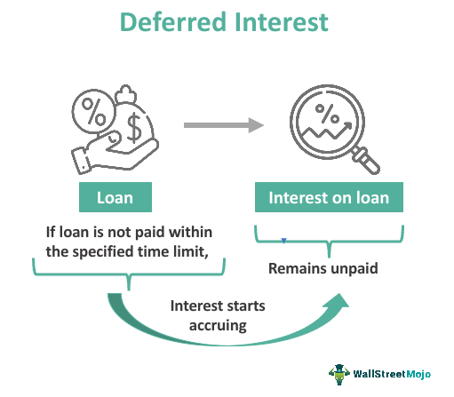

Deferred interest bonds are a specific category of fixed-income securities that differ from conventional bonds in terms of interest payment structure. Unlike standard bonds that provide periodic interest payments (or coupon payments) to the bondholders, deferred interest bonds accumulate interest and make a single lump-sum payment, including the accumulated interest and principal, at the bond's maturity. This characteristic allows issuers to postpone coupon payments, offering flexibility in cash flow management. These financial instruments are significant in markets as they cater to investors with varied risk appetites and financial strategies, offering potential benefits such as tax deferrals and capital appreciation.

This article aims to explore the workings of deferred interest bonds, providing a detailed understanding of their structure and unique features. It examines how these bonds accumulate interest over time and outlines their advantages and disadvantages. Moreover, the article categorizes different types of deferred interest bonds, such as zero-coupon bonds, toggle notes, and separated trading of registered interest and principal securities (STRIPS), highlighting their role and functionality within the broader financial landscape.

Algorithmic trading, a prominent aspect of modern financial markets, plays a pivotal role in trading and managing deferred interest bonds. Algorithmic trading involves using complex algorithms and computer programs to execute trades based on predefined criteria. This approach can effectively enhance the efficiency of trading deferred bonds by optimizing returns and managing risks. In this article, the integration of algorithmic trading strategies with deferred interest bonds is introduced, showcasing how technology is applied to refine investment strategies and decision-making processes in the bond market.

## Table of Contents

## Understanding Deferred Interest Bonds

Deferred interest bonds are a type of fixed-income investment wherein the accumulation of interest payments is delayed until the bond reaches its maturity date. These bonds differ from conventional bonds, which typically distribute interest (also known as coupons) to investors at regular intervals such as annually or semiannually.

### Features of Deferred Interest Bonds

The defining characteristic of deferred interest bonds is their approach to interest payments. Instead of receiving periodic interest, the investor does not receive any payouts until the bond matures. This arrangement can be beneficial for investors seeking to minimize taxes or those who prefer accumulating the interest to receive a lump sum payment eventually.

#### Accumulation of Interest

In deferred interest bonds, the interest is compounded over the lifespan of the bond and is paid out in full at maturity. The compounding nature means that interest earnings begin to generate their own interest over time, leading to a potentially significant payment at maturity. The yield on these bonds is computed based on the difference between the purchase price and the redemption value at maturity, which includes the compounded interest.

For example, consider a deferred interest bond with a face value of $1,000, a term of 10 years, and an annual coupon rate of 5%. The future value $FV$ of the bond, representing the lump sum paid at maturity, can be calculated using the formula for compound interest:

$$

FV = P \times (1 + r)^n 
$$

where:
- $P$ is the principal amount (or initial investment),
- $r$ is the annual interest rate,
- $n$ is the number of compounding periods.

Suppose the bond was bought at $500, then the accumulated amount at maturity would be:

$$

FV = 500 \times (1 + 0.05)^{10} \approx 814.45 
$$

### Advantages of Investing in Deferred Interest Bonds

1. **Tax Efficiency**: Investors can potentially defer tax liabilities because they do not receive income until maturity, which may be beneficial depending on their tax bracket at that time.

2. **Lump Sum Payment**: Some investors may prefer to receive a large sum at once, which can be useful for planning major expenses or investments.

3. **Compounding Benefits**: The nature of compounded interest over a long period can lead to a higher effective return on investment compared to receiving regular, smaller interest payments.

### Disadvantages of Investing in Deferred Interest Bonds

1. **Interest Rate Risks**: Investors do not benefit from periodic income, so there is a risk that changing interest rates could make these bonds less attractive compared to current market offerings.

2. **Liquidity Constraints**: These bonds are typically less liquid than regular coupon-bearing bonds because the investor cannot liquidate small portions of their interest over time.

3. **Market Volatility**: As with any fixed-income investment, the value of deferred interest bonds can be affected by market volatility and changes in credit ratings or economic conditions.

Investors must weigh these advantages and disadvantages when considering deferred interest bonds as part of their investment portfolio, keeping in mind their particular financial goals and risk tolerance.

## Types of Deferred Interest Bonds

**Zero-Coupon Bonds**

Zero-coupon bonds are a primary form of deferred interest bond, characterized by not providing periodic interest payments, or coupons, during their term. Instead, they are sold at a significant discount to their face value and pay the full face amount at maturity. For example, an investor might purchase a zero-coupon bond with a face value of $1,000 for $800. Upon maturity, the investor receives $1,000, thereby realizing an implicit interest of $200. The absence of periodic interest payments means that the yield is a function of the price paid for the bond and the time until its maturity. The formula for calculating the yield to maturity (YTM) for a zero-coupon bond is:

$$
YTM = \left( \frac{Face \ Value}{Price} \right)^{\frac{1}{n}} - 1
$$

where $n$ is the number of years until maturity. Zero-coupon bonds are often used by investors looking to match asset and liability cash flows, making them popular for education savings and retirement plans.

**Toggle Notes**

Toggle notes are another variation within deferred interest bonds, which provide flexibility for issuers to choose between paying interest in cash or allowing it to accrue to the principal balance, often referred to as "pay-in-kind" (PIK) notes. This feature is particularly useful for issuers managing cash flow variability, as it allows them to conserve cash during tight [liquidity](/wiki/liquidity-risk-premium) periods. The toggle feature introduces a layer of optionality into the bond's structure, presenting both potential risks and rewards for investors. Investors need to consider the creditworthiness of the issuer and the likelihood of interest deferral being exercised when evaluating toggle notes.

**Other Variations**

STRIPS, an acronym for Separate Trading of Registered Interest and Principal of Securities, allow investors to purchase individual interest or principal components of Treasury securities. Each component acts like a zero-coupon bond and can be traded separately, providing additional flexibility for customizing duration and cash flows. STRIPS are a significant tool for portfolio managers seeking to immunize portfolios against [interest rate](/wiki/interest-rate-trading-strategies) risks.

Deferred interest mortgage-backed securities (MBS) represent another type, where the interest payments on underlying mortgages are deferred and capitalized. These securities are structured such that investors receive a single lump-sum payment at a predetermined date. The deferred nature of these securities introduces complexities in their valuation and cash flow analysis, necessitating sophisticated modeling techniques to accurately assess their potential returns and risks.

Overall, these variations of deferred interest bonds offer different mechanisms for balancing cash flows, risks, and returns, catering to the diverse needs of issuers and investors alike.

## Examples of Deferred Interest Bonds

Deferred interest bonds are a unique category of fixed-income securities that differ from traditional bonds in terms of interest payment structures. Among the various types of deferred interest bonds, some notable examples include zero-coupon bonds, toggle notes, and treasury STRIPS.

**Zero-Coupon Bonds: Real-Life Examples and Features**

Zero-coupon bonds are a type of deferred interest bond that real-life investors might find appealing because they do not pay periodic interest during their life. Instead, they are issued at a discount to their face value and mature at par value. This makes them an attractive option for investors who want to lock in a specific yield over a set period.

A well-known example of zero-coupon bonds can be found in U.S. Treasury securities. These zero-coupon Treasury bonds, also known as STRIPS (Separate Trading of Registered Interest and Principal of Securities), allow investors to hold and trade the individual interest and principal components of eligible Treasury notes and bonds as separate securities. The appeal of STRIPS lies in their ability to provide a predictable income stream at maturity, often used by conservative investors to match long-term liabilities or savings goals. 

In the corporate world, companies such as Ford Motor Company have historically issued zero-coupon bonds. Corporate zero-coupon bonds can offer higher potential returns compared to traditional bonds due to the higher risk associated with the issuing company. However, these bonds also expose investors to risks such as interest rate risk and credit risk. If interest rates rise, the market value of zero-coupon bonds can significantly decrease, and in case of corporate defaults, investors may lose their principal investment.

**Toggle Notes: Mechanism and Market Examples**

Toggle notes introduce flexibility in cash flow management for the issuer, allowing them to toggle between paying cash interest or accruing interest to the principal. This can be particularly beneficial in periods of cash flow constraints. 

An example of toggle notes is those issued by leveraged buyout firms, where the company’s financial strategy involves higher risks and therefore benefits from the adjustability of payments. Toggle notes typically have a higher interest rate to compensate investors for this additional risk and the possibility of deferred interest. These notes are popular in the high-yield bond market, offering issuers and investors unique opportunities and challenges related to cash flow [volatility](/wiki/volatility-trading-strategies) and interest compounding.

In summary, deferred interest bonds like zero-coupon bonds, toggle notes, and treasury STRIPS provide various investment options with specific risk-return profiles. Zero-coupon bonds, with their simple accruing mechanism and discounted pricing, appeal to those seeking assured returns at maturity, despite interest rate volatility and credit risk concerns. Toggle notes cater to more flexible financial strategies, balancing immediate liquidity needs against potential returns over the bond's life. Understanding these instruments allows investors to make informed decisions based on their financial goals and risk appetite.

## The Role of Algorithmic Trading in Deferred Bonds

Algorithmic trading involves the use of complex mathematical models and computer programs to make high-speed trading decisions. In the context of deferred interest bonds, which are instruments that delay interest payments until maturity, [algorithmic trading](/wiki/algorithmic-trading) offers several advantages. The application of algorithmic trading in this context enhances efficiency, optimizes performance, and manages risks effectively.

One of the primary benefits of using algorithms to trade deferred interest bonds is the ability to process vast amounts of market data quickly and accurately. Algorithms can analyze market conditions, historical data, and bond prices in real-time, enabling traders to execute trades at optimal prices. This is crucial for deferred bonds, where market conditions can significantly affect bond valuation due to their unique interest payment structures.

Furthermore, algorithms help in maximizing returns by implementing sophisticated trading strategies that would be challenging for a human to execute manually. These strategies can include [arbitrage](/wiki/arbitrage) opportunities, where the algorithm identifies price inefficiencies between different markets or instruments that can be exploited for profit. Another strategy might involve interest rate trend analysis, predicting how changes in rates will affect the future value of deferred interest bonds.

Risk management is another area where algorithmic trading provides substantial benefits. Algorithms can assess volatility, credit risk, and interest rate risk continuously, enabling the trader to adjust their portfolio accordingly. For instance, if an algorithm predicts increased volatility that could negatively impact deferred bonds, it might suggest reducing their exposure or implementing hedging strategies.

Consider a scenario where an algorithm monitors macroeconomic indicators like inflation rates and uses [machine learning](/wiki/machine-learning) to predict future interest rate movements. This predictive capability can be vital for managing a portfolio of deferred interest bonds, which are highly sensitive to interest rate fluctuations. By adjusting positions in anticipation of rate changes, the algorithm can potentially enhance returns while mitigating risks.

Moreover, algorithmic trading systems can simulate various scenarios to stress test portfolios, ensuring they are resilient against potential market upheavals. For example, in the event of an unexpected economic downturn, the algorithm might execute pre-defined sell-off strategies to preserve capital.

In summary, algorithmic trading significantly enhances the trading of deferred interest bonds by providing an edge through rapid data processing, optimized trading strategies, and robust risk management practices. These advantages can drive better investment outcomes by maximizing returns and efficiently managing the inherent risks associated with these financial products.

## Conclusion

In conclusion, deferred interest bonds, including their distinct types such as zero-coupon bonds, toggle notes, and STRIPS, represent an essential component of the fixed-income market. These instruments offer unique features, such as the accrual of interest over time without periodic payments, until a lump sum is disbursed at maturity. Understanding these bonds is crucial for investors aiming to make informed decisions, as they differ significantly from conventional bonds in terms of risk profiles and potential returns.

Deferred interest bonds offer several advantages. They generally provide higher yields compared to traditional bonds due to the absence of interim coupon payments. This makes them attractive for investors seeking long-term growth. Additionally, they can be effective tools for issuers to manage cash flow, thanks to the flexibility in interest payments, as seen with toggle notes.

However, investing in deferred interest bonds also carries inherent risks. The lack of periodic interest payments can pose a challenge in terms of liquidity for investors needing regular income. Furthermore, the sensitivity of zero-coupon bonds and similar instruments to interest rate fluctuations can lead to increased price volatility. Investors must weigh these risks against potential benefits to determine their suitability for their investment strategies.

Algorithmic trading emerges as a powerful mechanism in optimizing investment strategies involving deferred interest bonds. By leveraging complex algorithms, investors can efficiently manage the risks associated with these bonds and maximize their returns. The application of algorithmic trading can include scenario analysis and adaptive strategies that swiftly respond to market dynamics, enhancing decision-making in bond trading.

Investors are encouraged to further explore how technology, particularly algorithmic trading, can enhance their approach to investing in deferred interest bonds. By understanding both the potential benefits and the accompanying risks, investors can position themselves strategically to capitalize on the opportunities presented by these unique financial instruments.

## References & Further Reading

[1]: ["Advances in Financial Machine Learning"](https://www.amazon.com/Advances-Financial-Machine-Learning-Marcos/dp/1119482089) by Marcos Lopez de Prado

[2]: ["Machine Learning for Algorithmic Trading"](https://www.amazon.com/Machine-Learning-Algorithmic-Trading-alternative/dp/1839217715) by Stefan Jansen

[3]: ["Quantitative Trading: How to Build Your Own Algorithmic Trading Business"](https://www.amazon.com/Quantitative-Trading-Build-Algorithmic-Business/dp/1119800064) by Ernest P. Chan

[4]: Fabozzi, F. J. (2007). ["Fixed Income Analysis"](https://www.amazon.com/Fixed-Income-Analysis-Frank-Fabozzi/dp/047005221X). CFA Institute Investment Series.

[5]: ["Algorithmic Trading and DMA: An Introduction to Direct Access Trading Strategies"](https://www.amazon.com/Algorithmic-Trading-DMA-introduction-strategies/dp/0956399207) by Barry Johnson

[6]: ["Evidence-Based Technical Analysis: Applying the Scientific Method and Statistical Inference to Trading Signals"](https://www.amazon.com/Evidence-Based-Technical-Analysis-Scientific-Statistical/dp/0470008741) by David Aronson

[7]: Bodie, Z., Kane, A., & Marcus, A. J. (2014). ["Investments"](https://www.mheducation.com/highered/product/Investments-Bodie.html). McGraw-Hill Education.