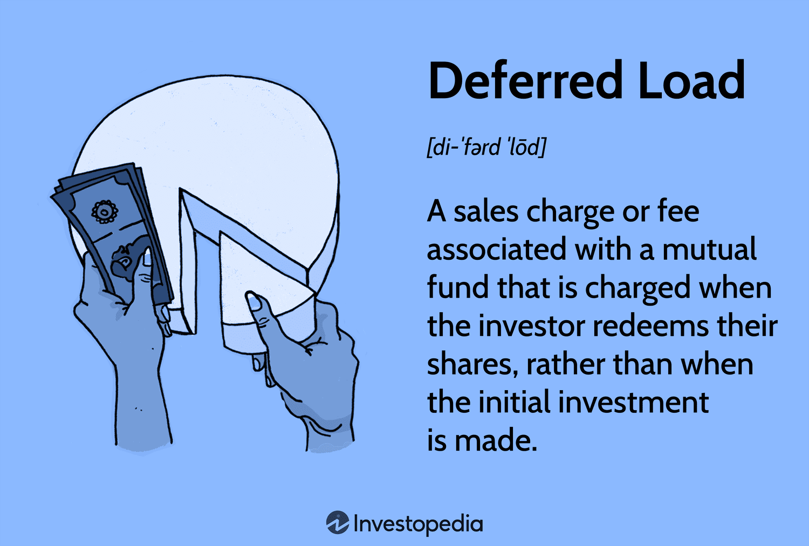

In today's fast-paced trading environment, algorithmic trading has become an integral part of the financial markets. It harnesses computational power and sophisticated algorithms to automate trading strategies, allowing traders to execute orders at speeds and frequencies that are impossible for human traders. This automation not only increases efficiency but also reduces the risk of human error, thus optimizing trading performance.

Traders are constantly seeking innovative technologies that can refine their strategies and enhance performance. One such technological advancement is deferred load functionality. This concept revolves around the strategic deferral of certain fees or charges until a later stage, typically upon asset redemption rather than at the point of purchase. This allows traders to optimally allocate their full capital initially, thereby improving their ability to build larger and potentially more profitable trading positions without the immediate burden of costs.



Deferred load functionality has made significant strides in algorithmic trading, where the timing and size of trade executions can be crucial determinants of success. By exploring this advancement, traders aim to leverage its benefits to optimize their algorithmic trading systems and achieve superior market outcomes. This article will explore what deferred load functionality entails, its operational mechanics, and how it can be applied within algorithmic trading frameworks.

## Table of Contents

## Understanding Deferred Load Functionality

Deferred load functionality refers to financial fees or charges that are applied during the redemption of an asset, rather than at the point of purchase. This mechanism enables traders to allocate their full capital into investments without immediate fee deductions. As such, it provides a strategic advantage by allowing the entire invested amount to potentially generate returns.

The mechanics of deferred load are straightforward: instead of paying a sales charge upfront (a front-end load), investors delay this payment until they redeem the asset. This approach is commonly used in mutual funds, where the fee structure of a deferred load includes a conditional deferred sales charge (CDSC). The CDSC is charged upon the sale or redemption of shares before a pre-defined time period, typically ranging from 3 to 7 years.

Financially, deferred load structures offer several advantages. By retaining the entire investment amount upfront, there is an opportunity for more significant capital compounding. For instance, consider an investment of $10,000 in a mutual fund. Without a deferred load, if there is a 5% front-end load, only $9,500 would be invested in the fund, immediately reducing the initial capital basis for potential returns. With a deferred load, the entire $10,000 initial investment participates in any market appreciation or accrual, potentially yielding higher returns before the final redemption charge is applied.

In larger trading positions, this mechanism becomes increasingly advantageous. The absence of initial deductions can significantly impact outcomes, especially when profits are compounded over long periods. By mitigating the immediate outflow of capital for fees, traders can maintain larger position sizes, which is especially beneficial in [algorithmic trading](/wiki/algorithmic-trading) systems aiming to maximize portfolio returns.

In summary, deferred load functionality allows investors to deploy greater capital upfront, enhancing the potential for increased returns. It is a strategic financial tool that provides cost advantages for building larger positions and optimizing long-term investment growth.

## Benefits of Deferred Load in Algo Trading

Deferred load functionality presents several benefits within the domain of algorithmic trading, primarily through its capacity to enhance returns by permitting capital to be fully invested from the outset. By deferring fees or charges until a later stage—such as during asset redemption—traders are able to maximize their initial investment capital. This maximization facilitates the accumulation of interest or returns on a larger principal amount.

### Enhancement of Returns

Deferred load enables traders to invest the full amount of their capital without any deductions at the onset. This approach allows traders to accrue interest on the entire sum, thereby potentially increasing their overall returns. The formula for compound interest, $A = P(1 + r/n)^{nt}$, can help illustrate this benefit, where:

- $A$ is the amount of money accumulated after n years, including interest.
- $P$ represents the principal amount (initial investment).
- $r$ is the annual interest rate (decimal).
- $n$ is the number of times that interest is compounded per year.
- $t$ is the time the money is invested for in years.

By deferring loads, the principal $P$ remains undiluted by any upfront fees, maximizing the amount $A$ accumulated over time.

### Alignment with Long-Term Strategies

Many algorithmic trading strategies, such as [trend following](/wiki/trend-following) or [momentum](/wiki/momentum)-based strategies, operate over longer time horizons. Deferred load aligns seamlessly with these long-term strategies, as it allows the strategies to benefit from the absence of immediate financial constraints associated with upfront fees. The delayed nature of fee payments means that the capital is unfettered for extended periods, facilitating the accumulation of returns.

### Leveraging Greater Returns

The ability to utilize the full investment amount without immediate financial deductions positions traders to take advantage of compounding effects over long strategy cycles. This potential for greater returns is particularly advantageous for traders employing quantitative models that require the reinvestment of profits to optimize algorithm performance. The absence of upfront fees ensures that more capital remains in play to be reinvested, thus enabling a continual cycle of potential growth.

In conclusion, deferred load not only provides a direct enhancement to potential returns but also complements the strategic approaches prevalent in algorithmic trading. By eliminating the immediate financial burden associated with upfront fees, it allows for more substantial initial investments and supports sustained growth over prolonged trading cycles.

## Integrating Deferred Load with Algorithmic Trading Systems

Algorithmic trading systems can incorporate deferred load functionalities to optimize trading strategies. Deferred load, in the context of algorithmic trading, involves structuring fee payments to occur at a future date, allowing traders to utilize their full initial capital for investment. This approach requires thorough analysis to ensure that the algorithm's structure is compatible with deferred load fee mechanisms.

Integrating deferred load within an algorithmic trading system starts with evaluating existing fee structures. Traders must analyze the impact of deferred fees on [liquidity](/wiki/liquidity-risk-premium) and cash flow. This involves understanding how fees accrue over time and predicting their impact on overall strategy performance. The goal is to ensure that deferred fees do not hinder the system's ability to capitalize on market opportunities.

One must also consider the coding aspect of integrating deferred load. Algorithm developers can enhance their systems by incorporating conditions that account for deferred fees in their calculations. For example, a Python-based algorithm could include modules that dynamically adjust position sizes or trading frequency based on the expected future fee deductions. Here's a simplified Python snippet illustrating this concept:

```python
def calculate_net_investment(capital, deferred_fee_percentage, horizon):
    deferred_fee = capital * (deferred_fee_percentage / 100)
    net_investment = capital - (deferred_fee / horizon)
    return net_investment

capital = 1000000  # Initial capital in dollars
deferred_fee_percentage = 2  # Deferred fee percentage
investment_horizon = 12  # Time horizon in months

net_investment = calculate_net_investment(capital, deferred_fee_percentage, investment_horizon)
print(f"Net Investment over {investment_horizon} months: ${net_investment}")
```

This function calculates the net investment after considering deferred fees over a specified investment horizon. Integrating such calculations into the trading algorithm ensures that strategies remain appropriately calibrated concerning fee deductions.

The next step involves testing and [backtesting](/wiki/backtesting) the modified algorithm. By running historical data simulations, traders can assess how deferred load adjustments play out under various market conditions. This testing phase is crucial to identifying any unintended consequences or opportunities arising from the new fee structure.

Finally, traders must monitor the operational performance of the integrated system in real-time. This includes keeping track of fee accumulation, strategy execution efficiency, and profit margins. Continuous optimization and adjustments are essential to ensure that the benefits of deferred load integration are fully realized without inadvertently introducing new risks.

In conclusion, integrating deferred load functionality into algorithmic trading systems involves strategic planning, coding, and rigorous testing. By doing so, traders can effectively leverage their capital, optimize long-term profits, and maintain a competitive edge in the financial markets.

## Example: Deferred Load in Practice

In algorithmic trading, the concept of deferred load can be practically applied to enhance strategy performance through optimal fee management. One effective strategy that can benefit from deferred load is the trend-following approach. This strategy typically involves buying or selling financial instruments based on sustained upward or downward trends. By utilizing deferred load, the trader can deploy more capital initially, as immediate fees are avoided, allowing the algorithm to potentially capitalize on larger position sizes and maximize returns during prolonged trend periods.

For instance, consider a trend-following algorithm that triggers a buy signal when a stock's price moves above its 50-day moving average. In a deferred load setup, the full amount of capital can be invested upfront without deductions, enhancing the algorithm's buying power. As a result, the algorithm may engage in a larger initial trade position compared to a scenario where fees are deducted immediately, leading to increased returns if the trend continues favorably.

Another strategy that can harness the advantage of deferred load is statistical [arbitrage](/wiki/arbitrage). This strategy relies on identifying statistical discrepancies between correlated financial instruments and executing buy or sell trades to profit from the eventual convergence of their prices. With deferred load, the complete capital amount is available for deploying arbitrage positions without initial fee concerns, potentially increasing the scale of positions and thus amplifying profits when price corrections occur as expected.

Python code implementing a simple trend-following algorithm considering deferred load might look like this:

```python
import pandas as pd
import numpy as np

def calculate_moving_average(data, window_size):
    return data['Close'].rolling(window=window_size).mean()

def trend_following_strategy(data, capital, deferred_load=True):
    moving_avg = calculate_moving_average(data, 50)
    positions = []
    cash = capital

    for i in range(1, len(data)):
        if data['Close'][i] > moving_avg[i] and (cash > 0 or deferred_load):
            # Buy signal
            buy_price = data['Close'][i]
            quantity = cash // buy_price if deferred_load else 0  # Full investment if deferred
            positions.append((buy_price, quantity))
            cash -= buy_price * quantity
        elif data['Close'][i] < moving_avg[i] and len(positions) > 0:
            # Sell signal
            sell_price = data['Close'][i]
            profit = sum([(sell_price - buy) * qty for buy, qty in positions])
            cash += profit
            positions.clear()

    return cash - capital  # Returns the profit or loss

# Example usage
data = pd.DataFrame({'Close': np.random.rand(100) * 100})
initial_capital = 10000
profit = trend_following_strategy(data, initial_capital)
print(f'Profit with deferred load: {profit}')
```

In this code, the strategy uses a 50-day moving average to generate buy and sell signals. The `deferred_load` parameter determines whether the algorithm utilizes the entire available capital upfront without simulating immediate fees, highlighting how the deferred load influences investment decisions.

While the implementation is simplified, it serves as a foundation to demonstrate how deferred load can function beneficially in algorithmic trading, enabling larger position sizes and potentially higher returns in strategies such as trend following and [statistical arbitrage](/wiki/statistical-arbitrage).

## Challenges and Considerations

Deferred load functionality, while advantageous, brings several challenges that traders must navigate to ensure effective strategy performance. One of the foremost challenges is the management of cash flows. In algorithmic trading, where precision and timing are critical, maintaining adequate liquidity is essential for executing trades efficiently. The delay in fee payments under deferred load can create complexities in cash management, leading to potential liquidity issues if not properly accounted for. Traders must develop robust cash flow models and forecasts to anticipate upcoming fees and ensure that sufficient funds are available to cover these costs when they are due.

Moreover, understanding the impact of deferred load on strategy performance is crucial. While deferred load allows for the investment of the full principal amount without immediate deductions, it can also mask the true cost of trades in the short term. Traders need to conduct comprehensive backtesting and performance analysis to simulate the effect of these delayed charges over time. This involves assessing how the postponed fees might affect cumulative returns and overall strategy viability, particularly for strategies with longer holding periods where deferred fees could accumulate significantly.

Another potential pitfall is the risk of complacency in strategy adaptation. The deferred nature of the fees might lead traders to underestimate their long-term impact, resulting in strategies that seem profitable in the short run but become less effective once all costs are realized. Continuous assessment and strategy optimization are essential practices to mitigate this risk. Algorithms should be recalibrated regularly, incorporating the expected impact of deferred fees to ensure that they continue to meet performance benchmarks.

To successfully implement deferred load functionality, traders need to develop sophisticated risk management frameworks. These frameworks should incorporate both quantitative and qualitative factors, taking into account market [volatility](/wiki/volatility-trading-strategies), interest rates, and other economic indicators that could influence the timing and magnitude of fees. Advanced analytics and [machine learning](/wiki/machine-learning) techniques could be employed to enhance predictive accuracy and optimize strategy adjustments based on anticipated fee schedules.

In conclusion, while deferred load offers significant benefits by enabling traders to leverage their full capital initially, it requires meticulous planning and constant vigilance to manage its challenges effectively. By prioritizing cash flow management, continuous performance evaluation, and proactive strategy optimization, traders can harness the advantages of deferred load while minimizing its potential drawbacks.

## Future Outlook

As technology in financial markets progresses, the concept of deferred load is likely to see expanded applications within algorithmic trading. One potential advancement revolves around the automation of fee optimization. As algorithms become more sophisticated, they can be programmed to account for deferred fees dynamically. This implies that trade algorithms will not only execute trades based on market signals but will also consider the timing and impact of fees, adjusting trade activities to maximize net returns over strategic periods. 

Future developments may incorporate machine learning techniques to enhance this optimization. By using historical trading data, algorithms could forecast the ideal times to minimize fee-related impacts better. Machine learning models, such as [reinforcement learning](/wiki/reinforcement-learning), could continuously learn from market outcomes to adapt strategies effectively. Python code leveraging libraries like TensorFlow or PyTorch might look like this:

```python
import numpy as np
import tensorflow as tf

# Simple setup for a reinforcement learning model
model = tf.keras.Sequential([
    tf.keras.layers.Dense(128, input_shape=(state_dim,), activation='relu'),
    tf.keras.layers.Dense(action_dim, activation='linear')
])

def train_model(data):
    # Implement training logic using historical data
    pass

# Placeholder for state dimensions and actions (e.g., invest, hold, sell)
state_dim = 10
action_dim = 3

# Simulate training with historical trade data
historical_data = np.random.rand(1000, state_dim)
train_model(historical_data)
```

Moreover, the enhanced connectivity and real-time data analytics facilitated by developments in 5G and edge computing can further refine the integration of deferred load in trading algorithms. These technologies enable faster data processing and execution speeds, allowing trading systems to make split-second decisions regarding deferred load impacts. 

Looking ahead, the integration of blockchain technology might also play a significant role. Smart contracts can automate the deferred load process, ensuring transparent and immutable records of fee structures. This can build trust and provide increased clarity in financial transactions, potentially setting a new standard for how algorithmic trading interacts with fee structures.

In conclusion, the future of deferred load in algorithmic trading promises greater sophistication and integration with emerging technologies, resulting in enhanced trading precision and profitability. As traders and technologists continue to innovate, the effective application of deferred load functions is poised to become a pivotal element in the competitive landscape of financial markets.

## Conclusion

Deferred load functionality emerges as an advantageous element for algorithmic traders, enhancing both financial and strategic dimensions of trading operations. By deferring fees to a later stage, traders can utilize their full capital investment initially, allowing them to capitalize on potential returns without immediate financial burdens. This deferral aligns seamlessly with algorithmic strategies that often rely on long-term positioning, enabling more significant capital deployment to leverage opportunities over extended periods.

Understanding and effectively incorporating deferred load into trading strategies can significantly enhance profitability. By postponing costs, traders can optimize the interest accumulation on the entire invested sum. This optimization can result in a higher compound return compared to strategies where fees are deducted upfront.

The strategic benefits of deferred load also result in increased operational efficiency. Traders can deploy algorithms that better match the deferment in fee structures with their long-term trading cycles, thus aligning financial costs with strategy performance cycles. For instance, algorithms designed for trend following or statistical arbitrage can benefit from the enhanced capital allocation capabilities that deferred load provides, potentially leading to more substantial yields.

Moreover, ongoing research and innovation in this area hold promise for algorithmic traders. New methodologies and integrations of deferred load are likely to emerge, driven by advancements in financial technology and data analytics. This evolutionary path could further refine trading algorithms and fee strategies, providing traders with competitive advantages in the ever-evolving financial markets.

In conclusion, deferred load functionality not only presents a tool for cost management but also serves as a catalyst for improving the overall effectiveness of algorithmic trading systems. As the financial landscape continues to advance, traders who harness the potential of deferred load will be well-positioned to capitalize on new opportunities and optimize their trading portfolios.

## References & Further Reading

[1]: ["Advances in Financial Machine Learning"](https://www.amazon.com/Advances-Financial-Machine-Learning-Marcos/dp/1119482089) by Marcos Lopez de Prado

[2]: ["Evidence-Based Technical Analysis: Applying the Scientific Method and Statistical Inference to Trading Signals"](https://www.amazon.com/Evidence-Based-Technical-Analysis-Scientific-Statistical/dp/0470008741) by David Aronson

[3]: ["Machine Learning for Algorithmic Trading"](https://www.amazon.com/Machine-Learning-Algorithmic-Trading-alternative/dp/1839217715) by Stefan Jansen

[4]: ["Quantitative Trading: How to Build Your Own Algorithmic Trading Business"](https://www.amazon.com/Quantitative-Trading-Build-Algorithmic-Business/dp/1119800064) by Ernest P. Chan

[5]: Bergstra, J., Bardenet, R., Bengio, Y., & Kégl, B. (2011). ["Algorithms for Hyper-Parameter Optimization."](https://dl.acm.org/doi/10.5555/2986459.2986743) Advances in Neural Information Processing Systems 24.