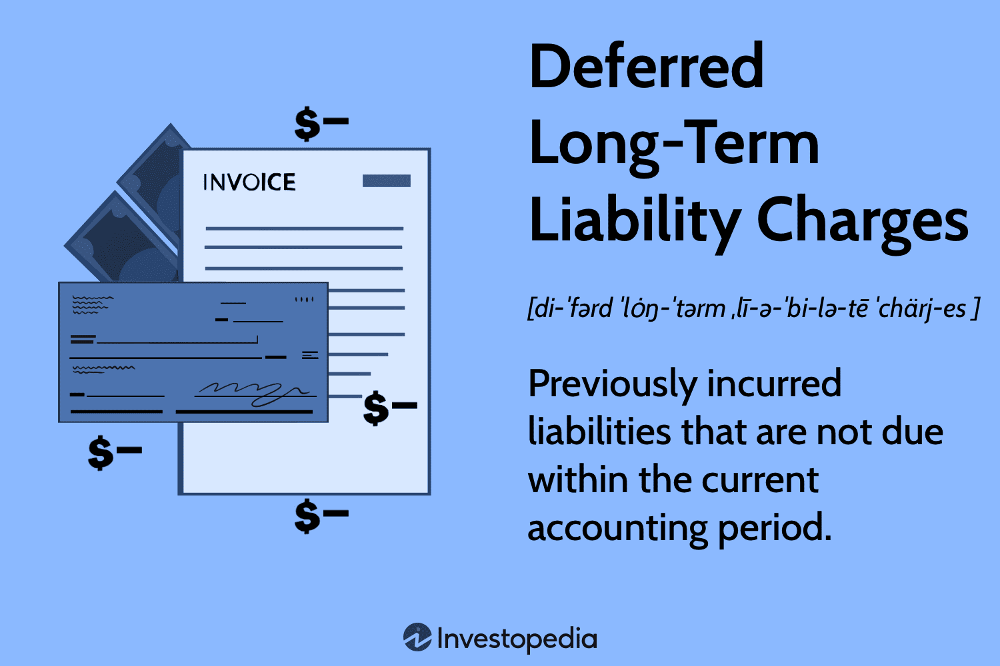

In the ever-evolving landscape of financial accounting and automated trading, understanding the interplay between long-term liabilities and algorithmic decision-making is pivotal. As businesses strategize for growth in an increasingly automated world, the complex dynamics of financial accounting and the technological advancements in trading systems become significant drivers of success. A core component in financial accounting is deferred liability charges, which arise when expenses are recorded before their actual payment. These charges, such as deferred tax liabilities and deferred compensation, affect a company's financial statements and influence its future cash flows. They provide insights into the company's strategic planning regarding financial obligations that extend over time.

Algorithmic trading, on the other hand, has transformed the trading landscape by utilizing computational algorithms to automate trading decisions. This technology leverages vast data sets and sophisticated analytical techniques to optimize trading strategies, thereby enhancing the efficiency and accuracy of executing trades. The integration of algorithmic trading strategies into financial operations allows for real-time data analysis and decision-making, which can significantly impact financial strategies related to long-term liabilities.



In this article, we examine key concepts like deferred liability charges in financial accounting and the transformative role of algorithmic trading. By exploring how these elements interact, we aim to highlight their implications for businesses seeking growth in an automated world. The ability to effectively manage long-term liabilities through advanced technologies can provide strategic advantages, allowing companies to maintain financial health, ensure compliance, and ultimately drive growth and innovation in the digital age.

## Table of Contents

## Understanding Long-Term Liabilities

Long-term liabilities are financial obligations that a company is expected to pay after more than one year. These liabilities are essential components of a company's financial position as they represent commitments that impact long-term financial health and cash flow management. In financial accounting, long-term liabilities are typically distinguished from current or short-term liabilities, which are due within a year.

Deferred tax liabilities and deferred compensation are prominent types of long-term liabilities. Deferred tax liabilities arise when there are discrepancies between the accounting for financial reporting and tax purposes. These differences create obligations to pay taxes in the future, often because companies use different methods for recognizing income or expenses in their financial statements versus tax filings. For example, if a company's tax depreciation exceeds the depreciation noted in its financial statements, it would likely incur a deferred tax liability until the temporary differences reverse.

Deferred compensation refers to an arrangement where a portion of an employee's compensation is paid at a later date, allowing companies to defer cash outflow and better manage current operational expenses. This delay can affect future cash flows, necessitating careful planning and forecasting to ensure that sufficient resources are available when payments become due.

On the balance sheet, long-term liabilities are recorded under non-current liabilities and are critical for assessing a company's leverage and ability to meet future obligations. The presence and amount of such liabilities can influence investors' perception of financial stability and risk. For example, a high level of long-term debt relative to equity might indicate a higher risk, especially if the company's cash flow is insufficient to cover debt servicing requirements.

Mathematically, the impact of long-term liabilities on a company's balance sheet can be expressed as follows: 

$$
\text{Equity} = \text{Assets} - (\text{Current Liabilities} + \text{Long-term Liabilities})
$$

This equation highlights how an increase in long-term liabilities, assuming constant assets and current liabilities, reduces equity. Thus, understanding these liabilities aids stakeholders in evaluating a company's financial condition, risk profile, and strategic financial decisions.

To further illustrate, consider a hypothetical company with the following simplified balance sheet figures:

- Assets: $10,000,000
- Current Liabilities: $2,000,000
- Long-term Liabilities: $5,000,000

Applying the balance sheet equation:

$$
\text{Equity} = \$10,000,000 - (\$2,000,000 + \$5,000,000) = \$3,000,000
$$

This calculation demonstrates how long-term liabilities are integral in determining the equity value of a company, thereby influencing its overall financial health. Efficient management of these liabilities is crucial, as mishandling can lead to [liquidity](/wiki/liquidity-risk-premium) issues and increased financial risk.

## Deferred Liability Charges: A Closer Look

Deferred liabilities are essential components of a company's financial architecture, representing expenses that have been incurred but for which the associated obligations are settled at a future date. These liabilities frequently manifest on balance sheets and have notable implications for a firm’s financial strategy and reporting.

One prevalent form of deferred liability is the deferred tax liability. These liabilities arise due to temporary differences between the accounting income reported in financial statements and the taxable income calculated for tax purposes. For instance, companies might use different depreciation methods for financial reporting and tax calculations, leading to discrepancies. Deferred tax liabilities recognize that while the taxable event has occurred based on financial accounting principles, the actual tax payment is deferred to a future period. These deferred taxes are crucial for budgeting and forecasting since they represent significant future cash commitments.

Consider a simplified example: a company that reports a $100,000 income on its financial statements but has taxable income of $80,000 due to accelerated depreciation for tax purposes. If the tax rate is 25%, the company would pay $20,000 in taxes for the current period ($80,000 * 25%) but would record a deferred tax liability of $5,000, representing future taxes payable on the additional $20,000 in income ($100,000 - $80,000) when the depreciation difference reverses. 

Another example of deferred liabilities can be found in deferred compensation arrangements. These are commitments a company makes to its employees to provide benefits at a later date, typically after retirement. By deferring compensation, companies can manage cash flows more effectively, while employees may benefit from tax advantages.

Understanding deferred liabilities is vital for gaining insights into a company's strategy for long-term financial obligation management. The manner in which these liabilities accrue and resolve over time can influence a company's liquidity and investment strategies, as well as its compliance with financial regulations. Analyzing deferred liabilities allows investors and stakeholders to evaluate how companies align their operational strategies with financial reporting and future fiscal responsibilities.

## Impact of Deferred Liabilities on Financial Statements

Deferred liabilities play a vital role in shaping a company's financial statements, impacting both the income statement and the balance sheet. These liabilities, which represent future financial obligations, need to be recognized in a timely manner to ensure businesses sustain financial compliance and maintain transparency with investors.

On the balance sheet, deferred liabilities are recorded as obligations that the company expects to settle after the current fiscal year. This has a direct effect on a company’s debt-to-equity ratio, influencing perceptions of financial health and leverage among investors and stakeholders. For instance, deferred tax liabilities arise due to differences in timing between accounting and tax practices, specifically when a company has recognized revenue for accounting purposes but not yet for tax purposes. This creates an obligation to pay taxes in the future, which is recorded as a deferred liability.

On the income statement, deferred liabilities can manifest as expenses. This is especially evident when accounting for deferred revenue, where cash is received upfront but the service or product delivery occurs in the future. In such scenarios, the revenue is recognized gradually as the obligation is fulfilled, thereby impacting the net income over multiple periods.

Accurate recognition and reporting of deferred liabilities are crucial for maintaining adherence to financial reporting standards such as the Generally Accepted Accounting Principles (GAAP) and International Financial Reporting Standards (IFRS). These frameworks dictate how and when deferred liabilities should be reported, ensuring that financial statements present a true and fair view of the organization’s fiscal position.

Professionals analyzing financial statements look at deferred liabilities to assess a company’s long-term financial obligations. They examine the timing and magnitude of these obligations to understand potential future cash flows and the company's ability to meet these obligations without jeopardizing its financial stability. For example, a high level of deferred tax liabilities might indicate future tax burdens that could affect cash flow, and this needs to be carefully weighed against liquidity and current assets.

In summary, deferred liabilities significantly influence a company's financial statements. They require careful accounting and strategic foresight to ensure that the business not only remains compliant but also transparent with its financial dealings. Recognizing these obligations allows investors and financial professionals to effectively analyze a company’s long-term fiscal strategy.

## The Rise of Algorithmic Trading

Algorithmic trading, a predominant force in modern financial markets, employs complex algorithms to automate the vast majority of trading decisions. This evolution leverages computational power and advanced data analytics, enabling high-frequency trading, [market making](/wiki/market-making), and portfolio management with unprecedented precision and speed. The integration of algorithmic approaches into trading strategies provides significant advantages in terms of efficiency and decision-making quality.

One of the primary ways [algorithmic trading](/wiki/algorithmic-trading) benefits financial strategies is through the optimization of trade execution. By analyzing vast amounts of market data in real-time, algorithms can identify patterns and correlations that allow traders to execute orders at optimal prices, thereby minimizing costs and maximizing profits. This high-frequency trading capability is particularly advantageous in volatile markets, where speed and precision are critical.

Algorithmic trading also plays a crucial role in the management of deferred and long-term liabilities. By accurately predicting future market trends, algorithms help in hedging strategies that mitigate risks associated with long-term financial obligations. For instance, through statistical [arbitrage](/wiki/arbitrage), algorithms exploit inefficiencies between related financial instruments to offset potential future liabilities.

Moreover, algorithms enhance decision-making processes by providing a systematic approach to risk assessment and financial forecasting. Machine learning techniques, such as [reinforcement learning](/wiki/reinforcement-learning) and neural networks, are increasingly used to develop predictive models that inform trading strategies. These models can incorporate extensive data sets, capturing market dynamics that traditional methods might overlook, thus offering more accurate predictions.

For example, consider the use of a simple moving average cross-over strategy, a commonly used algorithmic trading method:

```python
def moving_average(prices, window):
    return sum(prices[-window:]) / window

def moving_average_crossover(prices, short_window, long_window):
    short_ma = moving_average(prices, short_window)
    long_ma = moving_average(prices, long_window)
    return "Buy" if short_ma > long_ma else "Sell"

prices = [120, 121, 122, 123, 124, 125]
short_window = 3
long_window = 5

action = moving_average_crossover(prices, short_window, long_window)
print("Recommended Action:", action)
```

In this example, the algorithm recommends a "Buy" or "Sell" action based on the short-term and long-term moving averages of the asset's prices.

Furthermore, algorithmic trading can optimize financial outputs by enhancing liquidity provision and market stability. Automated trades executed via algorithms can help stabilize prices during periods of high [volatility](/wiki/volatility-trading-strategies) by continuously adjusting bid-ask spreads.

In conclusion, algorithmic trading significantly transforms financial strategies by blending computational intelligence with market activities. This not only enhances the efficacy of trading strategies but also aligns them with broader financial goals, such as managing long-term liabilities, thereby offering strategic leverage in navigating complex financial landscapes.

## Integrating Algorithmic Trading with Financial Accounting

The integration of algorithmic trading with financial accounting provides a robust framework for managing long-term liabilities effectively. Algorithmic insights enable businesses to analyze extensive datasets swiftly, enhancing decision-making and risk management in financial accounting practices. By leveraging algorithms, companies can optimize their strategies concerning long-term liabilities, such as deferred tax liabilities and pension obligations, leading to improved financial stability and transparency.

**Strategies for Leveraging Technology**

1. **Data Analytics**: Advanced algorithms allow for the real-time analysis of financial data, which aids in forecasting future cash flows and assessing the impact of long-term liabilities on a company's financial health. By employing machine learning models, businesses can predict trends in liabilities and adjust their financial strategies accordingly.

2. **Automated Reporting**: Automating the reporting process enables companies to maintain accuracy and consistency in their financial statements. With the implementation of algorithmic trading systems, the generation of financial reports that include adjustments for deferred liabilities becomes more efficient. This reduces the likelihood of errors and ensures compliance with accounting standards.

3. **Risk Management**: Algorithms assist in identifying potential financial risks associated with long-term liabilities. By simulating various market scenarios, businesses can develop strategies to mitigate risks, such as interest rate fluctuations affecting long-term debt.

**Real-World Examples**

A notable example of integrating algorithmic trading with financial accounting is the use of predictive algorithms in pension fund management. Pension funds often represent substantial long-term liabilities for companies. By using algorithms to assess market conditions and forecast pension fund performance, companies can better manage these liabilities. This approach not only aids in optimizing investment strategies but also ensures that pension obligations are met without straining financial resources.

Similarly, in the context of deferred tax liabilities, companies can employ algorithmic models to simulate different tax scenarios. This allows for strategic planning and allocation of resources to minimize tax liabilities over time. For instance, a retail corporation might utilize such algorithms to project changes in tax laws and adjust pricing or investment strategies accordingly.

The integration of algorithmic trading with financial accounting facilitates a proactive approach to handling long-term liabilities, enhancing both efficiency and precision. By adopting technology-driven methods, organizations can achieve significant cost savings and reduced financial risk, underscoring the strategic advantages of these innovations in the financial domain.

## Future Trends and Conclusion

Predicting future trends in algorithmic trading and financial accounting, particularly concerning deferred liabilities, remains a challenging endeavor due to the rapid evolution of technology and financial regulatory environments. However, several key developments can be anticipated.

Firstly, the integration of [artificial intelligence](/wiki/ai-artificial-intelligence) (AI) and [machine learning](/wiki/machine-learning) (ML) in algorithmic trading is primed to intensify. These technologies enhance predictive accuracy and enable more sophisticated trading strategies. For instance, machine learning algorithms can analyze vast datasets to identify patterns and trading opportunities, potentially optimizing the management of deferred liabilities. As these algorithms improve, they will likely offer more precise insights into the timing and realization of deferred liabilities, assisting companies in forecasting and strategizing more effectively.

Furthermore, blockchain and distributed ledger technologies are anticipated to play a significant role in financial accounting. These technologies can enhance transparency, reduce fraud, and provide immutable records of transactions, including those related to deferred liabilities. The adoption of blockchain could streamline processes and increase trust among stakeholders, ensuring that deferred liabilities are accurately recorded and reported.

Another trend is the increasing demand for real-time financial reporting and compliance. As regulatory bodies push for more transparency, businesses will need to adapt their accounting practices to provide up-to-date and accurate financial information. Algorithmic systems could automate aspects of this reporting, ensuring compliance while also offering strategic insights into deferred and long-term liabilities.

The synergy between technology and finance is expected to deepen, fostering more intelligent systems in financial management. This convergence will enable businesses to make informed decisions rapidly, optimize their tax strategies, and better align their financial and operational goals.

In conclusion, the strategic advantages for businesses willing to adapt and innovate in this digital age are manifold. By embracing advanced technological solutions and integrating them with traditional accounting practices, companies can achieve greater efficiency, transparency, and competitiveness. Those who invest in these technologies will likely be better positioned to navigate the complexities of deferred liabilities and capitalize on the opportunities presented by algorithmic trading, ultimately facilitating sustainable growth and financial stability.

## References & Further Reading

[1]: Bergstra, J., Bardenet, R., Bengio, Y., & Kégl, B. (2011). ["Algorithms for Hyper-Parameter Optimization."](https://dl.acm.org/doi/10.5555/2986459.2986743) Advances in Neural Information Processing Systems 24.

[2]: ["Advances in Financial Machine Learning"](https://www.amazon.com/Advances-Financial-Machine-Learning-Marcos/dp/1119482089) by Marcos Lopez de Prado

[3]: ["Evidence-Based Technical Analysis: Applying the Scientific Method and Statistical Inference to Trading Signals"](https://www.amazon.com/Evidence-Based-Technical-Analysis-Scientific-Statistical/dp/0470008741) by David Aronson

[4]: ["Machine Learning for Algorithmic Trading"](https://github.com/stefan-jansen/machine-learning-for-trading) by Stefan Jansen

[5]: ["Quantitative Trading: How to Build Your Own Algorithmic Trading Business"](https://www.amazon.com/Quantitative-Trading-Build-Algorithmic-Business/dp/1119800064) by Ernest P. Chan