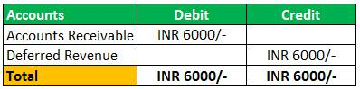

In this article, we explore important themes surrounding deferred month contracts in algorithmic trading, highlighting key financial concepts crucial for traders. Deferred month futures contracts, often referred to as "deferred months," represent agreements with expiration dates set significantly in the future compared to contracts known as "front month" contracts, which are nearing expiration. 

Deferred month contracts are significant in futures markets due to their ability to allow traders to plan and secure costs well in advance. In the context of commodities trading, these contracts enable market participants to hedge against potential price fluctuations, known as volatility, over a longer time horizon. This strategic foresight is essential for managing financial risk and ensuring pricing stability in various market conditions.



Algorithmic traders, in particular, leverage deferred month contracts to optimize their trading strategies. Algorithms can be designed to analyze and anticipate future market conditions, thereby allowing traders to execute informed decisions concerning buy and sell positions of futures contracts. This computational approach not only aids in risk management but also enhances the capabilities to speculate over extended periods, ultimately contributing to smarter and more efficient trading operations. Understanding the intricacies of deferred month contracts and their implications in algorithmic trading can significantly enhance a trader's ability to navigate and profit from future market trends.

## Table of Contents

## Understanding Deferred Month in Trading

Deferred month contracts are a type of futures contract characterized by their expiration dates, which typically extend further into the future compared to other futures contracts. These contracts serve as an essential tool within commodities trading, allowing traders to hedge against future price volatility or speculate on commodity price movements over extended periods. The extended timeline of deferred month contracts provides a distinct set of opportunities and challenges compared to front month contracts, which are contracts nearing their expiration dates and often subject to more immediate market dynamics and liquidity constraints.

Contrasting deferred month and front month contracts highlights crucial differences in their market behavior. Front month contracts are usually more liquid due to their imminently approaching maturity, which makes them attractive for traders seeking to capitalize on short-term price movements. In contrast, deferred month contracts typically have lower liquidity due to their distant expiration dates, but they offer trading opportunities for those involved in long-term strategic planning.

Deferred month contracts are particularly vital for commodities traders who aim to secure prices for future delivery. By locking in prices for commodities far in advance, traders can manage risks associated with price fluctuations and supply chain disruptions. This is especially critical in industries like agriculture and energy, where commodity prices can be highly volatile.

An example of a common usage of deferred month contracts is in hedging strategies. For instance, a farmer expecting a harvest in the coming year might use deferred month futures contracts to lock in a sales price, thereby reducing the financial uncertainty associated with volatile market prices. This approach allows the farmer to predict revenue more accurately and plan financially, regardless of unexpected market shifts.

## Implications for Algorithmic Trading

Algorithmic traders utilize deferred month contracts primarily to manage risks and to speculate on market dynamics over extended time frames. Deferred month contracts allow for strategic planning and anticipation of potential market shifts, thereby aiding traders in mitigating uncertainty and optimizing trading decisions.

The implementation of algorithms comes as a key component when dealing with deferred month contracts. These algorithms can be programmed to execute trades based on pre-determined rules that account for future market conditions. By doing so, they help traders in anticipating and swiftly responding to price movements, ensuring trades are executed with precision. This foresight is particularly valuable when dealing with longer-dated contracts, where price fluctuations can be more pronounced.

One specific challenge in [algorithmic trading](/wiki/algorithmic-trading) with deferred month contracts is managing roll yield costs. Roll yield can impact the profitability of a trade when a position is rolled from one contract to another as the current contract nears expiration. Algorithms can be tailored to minimize these costs by determining optimal points for contract rollovers based on current and anticipated market conditions. For example, balancing the yield derived from holding a deferred contract versus the cost of transitioning into a new contract can be programmed as part of a trading strategy.

Python, widely used for building trading algorithms, offers various libraries that assist in analyzing market trends and performing complex computations. Algorithms can be tailored to calculate optimal roll strategies:

```python
import numpy as np

def optimal_roll_strategy(current_price, future_price, transaction_costs):
    """
    Calculate optimal roll strategy for minimizing costs.

    Parameters:
    current_price (float): The current price of the contract nearing expiration.
    future_price (float): The price of the deferred month contract.
    transaction_costs (float): Associated costs with the roll.

    Returns:
    float: The calculated roll yield.
    """
    roll_yield = ((current_price - future_price) / current_price) - transaction_costs
    return roll_yield

# Example calculation with dummy data
current_price = 100
future_price = 105
transaction_costs = 0.005

yield_result = optimal_roll_strategy(current_price, future_price, transaction_costs)
print(f"The optimal roll yield is: {yield_result:.4f}")
```

Moreover, high-frequency trading algorithms can be optimized to adjust trading paces, ensuring that orders are filled with minimal market impact, thereby reducing slippage. In practice, this involves utilizing historical market data to train models capable of predicting future market states, allowing the algorithm to place trades that benefit from anticipated market trends.

By leveraging technological advances in data processing and AI, algorithmic traders are not only able to manage risks associated with deferred months but also capitalize on opportunities presented by long-term market patterns. This empowers traders with a competitive edge, utilizing technology to its fullest potential in tandem with deep market insights.

## Benefits of Incorporating Deferred Months in Algo Trading

Utilizing deferred month contracts in algorithmic trading strategies offers multiple benefits, enhancing flexibility by enabling traders to engage in long-term speculation. These contracts, representing futures with expiration dates set far into the future, provide a strategic advantage, allowing traders to anticipate and react to market dynamics over extended periods.

One of the primary benefits of using deferred month contracts in algorithmic trading setups is the ability to hedge against future price [volatility](/wiki/volatility-trading-strategies). By locking in prices for future delivery, traders can shield themselves from unforeseen market fluctuations. This hedging capability is essential for automated systems where trading decisions are data-driven and aim to minimize risk exposure. Algorithms can be tailored to monitor market indicators and adjust trading positions dynamically, ensuring comprehensive risk management.

The nature of market conditions, particularly the prevalence of contango and backwardation, plays a crucial role in the value of deferred month contracts. Contango occurs when the futures price is above the expected future spot price, often due to carrying costs such as storage and insurance. In contrast, backwardation occurs when the futures price is below the expected future spot price, usually reflecting immediate demand surpassing available supply. Deferred month contracts allow algorithmic traders to capitalize on these states by employing strategies that adapt to the evolving market structure.

Algorithmic systems are uniquely positioned to exploit these opportunities because they can process vast amounts of market data and execute trades at high frequencies. For instance, in a contango market, algorithms might identify [arbitrage](/wiki/arbitrage) opportunities by purchasing contracts that are undervalued relative to their expected future spot prices. Conversely, during backwardation, algorithms might short futures contracts, anticipating a decline in prices as supply constraints ease.

Incorporation of deferred month contracts into algorithmic trading also facilitates more sophisticated strategy development. For example, using Python, developers can create algorithms that analyze historical data to forecast potential market shifts and optimize entry and [exit](/wiki/exit-strategy) points for deferred contracts:

```python
import pandas as pd
import numpy as np

# Example function to simulate analysis of historical price data
def analyze_market_data(historical_data):
    # Calculate moving averages to indicate market trends
    short_term_avg = historical_data['Close'].rolling(window=20).mean()
    long_term_avg = historical_data['Close'].rolling(window=100).mean()

    # Identify buying and selling signals
    buy_signals = (short_term_avg > long_term_avg) & (historical_data['Close'] < short_term_avg)
    sell_signals = (short_term_avg < long_term_avg) & (historical_data['Close'] > short_term_avg)

    return buy_signals, sell_signals
```

By leveraging such analytical tools, traders can better manage the complexities of pricing and [liquidity](/wiki/liquidity-risk-premium) associated with deferred month contracts. Thus, these contracts not only act as a hedge against volatility but also integrate seamlessly into algorithmic strategies designed to maximize returns over the long term.

## Challenges in Trading Deferred Month Contracts

Trading deferred month contracts presents several challenges that are critical for traders, especially those utilizing algorithmic strategies. First, a robust understanding of market signals and data analysis is indispensable. Accurately forecasting changes over extended periods requires intricate modeling of variables such as supply and demand shifts, interest rates, geopolitical events, and macroeconomic indicators. Advanced statistical methods and [machine learning](/wiki/machine-learning) algorithms can be employed to enhance prediction accuracy. Machine learning models such as Random Forests or Neural Networks can be instrumental in analyzing vast datasets to glean insights:

```python
from sklearn.ensemble import RandomForestRegressor
from sklearn.model_selection import train_test_split
import pandas as pd

# Sample code to illustrate the use of Random Forest for predicting commodity prices
data = pd.read_csv('commodity_data.csv')
X = data.drop('Price', axis=1)
y = data['Price']

X_train, X_test, y_train, y_test = train_test_split(X, y, test_size=0.2, random_state=42)

model = RandomForestRegressor(n_estimators=100, random_state=42)
model.fit(X_train, y_train)
predictions = model.predict(X_test)
```

A further consideration is the impact of high storage and financing costs associated with holding commodities until the expiration of deferred contracts. These costs can erode the profitability of trades, particularly when market conditions change unexpectedly. For example, in contango markets—where future prices are higher than the spot price—holding costs can inflate, potentially turning profitable trades into losses. Conversely, in backwardation, where future prices are lower, traders might gain if cost management is efficient.

Algorithmic traders also face the complexities and potential inefficiencies inherent in pricing and market liquidity for deferred far futures contracts. Algorithmic strategies need to account for the bid-ask spread and liquidity depth, both of which can significantly affect execution prices and trade viability. For instance, during low liquidity phases, large orders in deferred contracts can lead to price slippage. Developing algorithms that monitor [order book](/wiki/order-book-trading-strategies) changes and predict liquidity conditions can mitigate such risks. Incorporating adaptive algorithms that dynamically adjust trade sizes and execution timing based on real-time market conditions is crucial.

Finally, price discovery in futures markets can be less efficient in deferred months compared to near contracts, due to less trading [volume](/wiki/volume-trading-strategy) and apparent information. Therefore, algorithms designed for deferred months must incorporate mechanisms to discern genuine price movements from noise. With thorough market analysis and vigilant strategy adjustments, traders can improve their prospects in handling the challenges of trading deferred month contracts effectively.

## Strategies for Successful Algo Trading with Deferred Months

Exploring [carry](/wiki/carry-trading) trades within the framework of algorithmic trading offers significant potential when dealing with deferred month contracts. Carry trades involve leveraging the price differences between near expiration and deferred contracts, thereby allowing traders to profit from the price discrepancies without holding the underlying asset until expiration. This strategy requires careful analysis of the cost of carry, including storage, interest, and insurance costs, which must be factored into the modeling to ensure profitability.

Algorithm development plays a critical role in successful deployment of such trades. Designing algorithms to predict shifts in market conditions—such as changes in supply and demand dynamics—is crucial. Predictive modeling can be achieved through various techniques, such as time series analysis, which involves examining data points collected at consistent time intervals to forecast future activity. Machine learning algorithms can also be utilized to identify patterns and correlations in large datasets, further enhancing the ability to anticipate market trends.

Implementing spread trading strategies is another effective method for managing risk and enhancing returns in the context of deferred contracts. Spread trading involves simultaneously buying and selling two related futures contracts, typically one near and one deferred, to capitalize on price discrepancies. Traders might employ inter-commodity spreads or intra-commodity calendar spreads, depending on the market conditions and their specific strategies.

A typical approach to executing these strategies in Python involves utilizing financial libraries such as NumPy and Pandas for data manipulation and analysis, alongside machine learning frameworks like scikit-learn for model building. Below is a snippet demonstrating a simple moving average crossover strategy, which can be a basis for more complex spread trading algorithms:

```python
import pandas as pd
import numpy as np

# Load historical price data
data = pd.read_csv('futures_prices.csv')
data['Date'] = pd.to_datetime(data['Date'])
data.set_index('Date', inplace=True)

# Calculate moving averages
data['Short_MA'] = data['Price'].rolling(window=20).mean()
data['Long_MA'] = data['Price'].rolling(window=50).mean()

# Generate trading signals
data['Signal'] = 0
data['Signal'][20:] = np.where(data['Short_MA'][20:] > data['Long_MA'][20:], 1, -1)

# Strategy returns
data['Strategy_Return'] = data['Signal'].shift(1) * data['Price'].pct_change()

# Plotting the data
data[['Price', 'Short_MA', 'Long_MA']].plot(figsize=(12, 8))
```

Risk management is also crucial for algorithmic trading in deferred month contracts. By monitoring key financial and commodity indicators and adjusting algorithms dynamically, traders can mitigate risks associated with price volatility and market liquidity challenges. Adopting a diversified approach can further cushion against market uncertainties, making the integration of deferred month trading strategies a comprehensive toolset for optimizing profitability.

## Conclusion: Insights for Traders

Understanding deferred month contracts empowers traders to capitalize on long-term market trends and secure advantageous trading positions. These futures contracts, which extend well into the future, offer strategic leverage by allowing traders to speculate on and manage potential price changes over time. This capability is particularly valuable in algorithmic trading, where automated systems can exploit these contracts to enhance flexibility and refine trading strategies.

Incorporating deferred month futures into algorithmic trading frameworks provides a comprehensive toolset for optimizing profitability in volatile markets. The ability to manage risk over longer periods is crucial for traders who employ automated systems, as it enables them to hedge against future price volatilities effectively. By leveraging these contracts, algorithmic traders can respond dynamically to shifts between contango and backwardation, adjusting their strategies accordingly to maintain a competitive edge.

Thorough market analysis, coupled with adaptive algorithms, is the key to maximizing the profitability of deferred month contracts. Traders must continuously evaluate economic indicators, supply and demand trends, and other market dynamics that could impact future prices. By refining algorithms to account for these factors, traders can improve the accuracy of their forecasts and the effectiveness of their trading strategies. Additionally, advanced data analysis techniques, such as machine learning, can be integrated to enhance the predictive capabilities of these algorithms.

Overall, the strategic use of deferred month contracts in algorithmic trading equips traders to navigate market complexities with greater agility and precision. By harnessing detailed market insights and employing sophisticated trading algorithms, traders can transform deferred month futures into a significant profit-driving component of their trading arsenal.

## Additional Resources and Further Study

To deepen your understanding of algorithmic trading and commodity futures, a variety of resources and educational materials can be beneficial. Financial education platforms like Coursera, Khan Academy, and Udemy offer courses specifically tailored to algorithmic trading and futures markets. These courses provide foundational knowledge, alongside advanced insights necessary for building sophisticated trading strategies.

Practical experience is invaluable, and engaging with live or simulated trading platforms is highly recommended. Platforms such as [Interactive Brokers](/wiki/interactive-brokers-api), Thinkorswim, or TradingView allow traders to practice deploying deferred month strategies in a risk-free environment. These simulations help in honing skills, understanding market behaviors, and testing theoretical knowledge without financial exposure.

To stay abreast of the latest industry trends and strategies, participating in webinars, workshops, and viewing expert financial analyses is beneficial. Websites like Investopedia and Bloomberg frequently host such events, covering a wide range of topics from basic market analysis to advanced algorithmic strategies. Additionally, renowned financial analysts and institutions often publish insights and forecasts which can be crucial for recognizing market trends.

Beyond these resources, joining online communities and forums dedicated to algorithmic trading can offer support and opportunities for knowledge exchange. Engaging with such communities can provide exposure to diverse trading philosophies and strategies, enhancing your adaptability and comprehension in the ever-evolving market landscape.

## References & Further Reading

[1]: Bergstra, J., Bardenet, R., Bengio, Y., & Kégl, B. (2011). ["Algorithms for Hyper-Parameter Optimization."](https://dl.acm.org/doi/10.5555/2986459.2986743) Advances in Neural Information Processing Systems 24.

[2]: ["Advances in Financial Machine Learning"](https://www.amazon.com/Advances-Financial-Machine-Learning-Marcos/dp/1119482089) by Marcos Lopez de Prado

[3]: ["Evidence-Based Technical Analysis: Applying the Scientific Method and Statistical Inference to Trading Signals"](https://www.amazon.com/Evidence-Based-Technical-Analysis-Scientific-Statistical/dp/0470008741) by David Aronson

[4]: ["Machine Learning for Algorithmic Trading"](https://github.com/stefan-jansen/machine-learning-for-trading) by Stefan Jansen

[5]: ["Quantitative Trading: How to Build Your Own Algorithmic Trading Business"](https://www.amazon.com/Quantitative-Trading-Build-Algorithmic-Business/dp/1119800064) by Ernest P. Chan