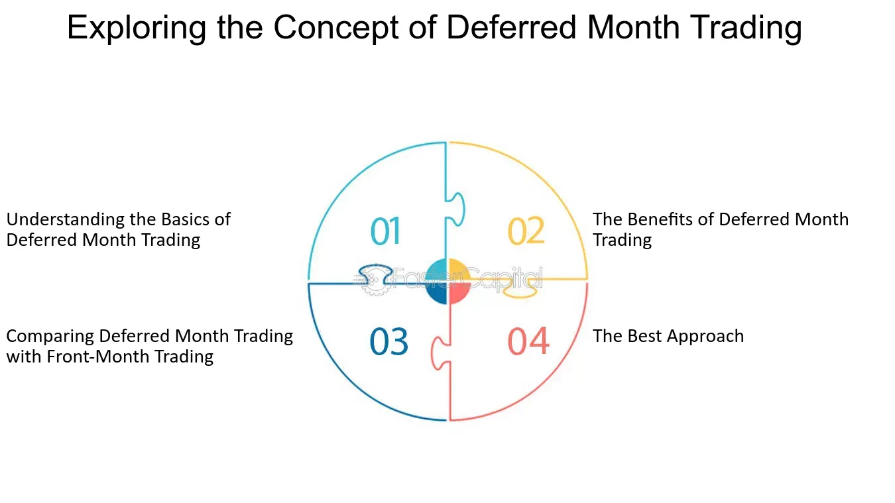

## Table of Contents

## What is a deferred month?

A deferred month is a future month when a futures contract will be delivered or settled. In trading, futures contracts are agreements to buy or sell something at a set price on a specific date in the future. The deferred month is important because it helps traders plan and manage their investments over time. For example, if you are trading oil futures, you might have contracts that are set to be delivered in January, March, and June. These months are called deferred months because they are set for the future.

Knowing about deferred months can help traders make better decisions. They can look at the prices for different deferred months and decide which one might be the best to invest in. This can be useful for planning and managing risks. For instance, if the price of oil is expected to go up in June, a trader might choose to buy a futures contract with a June deferred month. By understanding deferred months, traders can better predict market trends and make smarter trading choices.

## How does a deferred month work in futures trading?

In futures trading, a deferred month is a future month when a futures contract will be delivered or settled. Imagine you're buying a futures contract for corn. You can choose to have the corn delivered in March, June, or September. These months are called deferred months because they are set for the future. When you trade futures, you're making a deal to buy or sell something at a set price on a specific date in the future. The deferred month tells you when that date will be.

Deferred months are important because they help traders plan and manage their investments. If you think the price of corn will go up in June, you might buy a futures contract with a June deferred month. This way, you can lock in a good price now and get the corn later. Traders look at the prices for different deferred months to decide which one might be the best to invest in. By understanding deferred months, traders can better predict market trends and make smarter trading choices.

## Why might someone choose to use a deferred month?

Someone might choose to use a deferred month in futures trading to plan ahead and manage risks. By picking a deferred month, a trader can lock in a price for something they want to buy or sell in the future. For example, if a farmer knows they will have corn ready to sell in September, they can use a September deferred month to sell their corn at a price they agree on now. This helps them avoid the risk of prices dropping before they sell.

Using a deferred month also helps traders take advantage of price changes they expect to happen. If a trader thinks the price of oil will be higher in June, they can buy an oil futures contract with a June deferred month. This way, they can buy oil at today's price and sell it later at a higher price in June. By choosing the right deferred month, traders can make smarter decisions and possibly earn more money.

## What are the common deferred months used in commodity futures?

In commodity futures, common deferred months are the ones most often used for contracts. These months can change depending on the type of commodity, but some months are used a lot across different commodities. For example, March, May, July, September, and December are often used for grains like corn and wheat. These months are chosen because they match up with when farmers usually harvest their crops.

For other commodities, like oil, the common deferred months might be different. Oil futures often use months like January, March, May, July, September, and December. These months are picked because they help traders and companies plan for future oil needs. By using these common deferred months, people in the futures market can make plans and manage risks more easily.

## How do deferred months affect the pricing of futures contracts?

Deferred months affect the pricing of futures contracts because they show when the commodity will be delivered or settled. If a trader thinks the price of a commodity will go up in the future, they might buy a futures contract with a deferred month when they expect the price to be higher. For example, if someone believes oil prices will rise in June, they might buy an oil futures contract with a June deferred month. This way, they can buy oil at today's price and sell it later at a higher price. The prices for different deferred months can be different because they reflect what people think will happen to prices in the future.

The prices of futures contracts with different deferred months can also show what people expect about supply and demand. If there's a lot of a commodity available in one month, the price for that deferred month might be lower. But if people think there will be less of the commodity in another month, the price for that deferred month might be higher. For example, if farmers expect a big corn harvest in September, the price for September corn futures might be lower. But if they think there will be less corn in December, the price for December corn futures might be higher. By looking at the prices for different deferred months, traders can make better guesses about future prices and plan their trades accordingly.

## Can you explain the concept of rolling over to a deferred month?

Rolling over to a deferred month in futures trading means switching from one futures contract to another that has a later delivery date. Imagine you have a futures contract for oil that is set to expire in March. If you want to keep your position in the market but don't want to take delivery of the oil in March, you can sell your March contract and buy a new one for a later month, like June. This process is called rolling over.

When you roll over, you're basically extending your investment into the future. The price of the new contract might be different from the old one, which can affect your overall profit or loss. Traders roll over to deferred months to keep their positions open and to take advantage of price changes they expect in the future. By doing this, they can continue to trade without having to deal with the physical delivery of the commodity.

## What are the risks associated with trading in deferred months?

Trading in deferred months can be risky because the prices can change a lot between now and the future. If you buy a futures contract for a deferred month, you're guessing what the price will be in the future. If the price goes down instead of up, you could lose money. For example, if you buy a corn futures contract for September and the price of corn drops by then, you'll have to sell at a lower price than you bought it for.

Another risk is that the market might not move the way you expect. Things like weather, politics, or economic changes can affect the prices of commodities. If something unexpected happens, like a big storm that hurts crops, the price of corn in September could be very different from what you thought it would be. This makes it hard to predict and can lead to big losses if you're not careful.

## How do market conditions influence the choice of a deferred month?

Market conditions play a big role in choosing a deferred month for futures trading. If the market is expecting a lot of a commodity to be available in the future, like a big corn harvest in September, the price for that deferred month might be lower. Traders might choose a different month if they think the price will be better. For example, if there's a drought expected in the summer, the price for corn in December might be higher because there could be less corn available. By looking at what's happening in the market, traders can pick the deferred month that they think will give them the best price.

Another thing that affects the choice of a deferred month is how the economy is doing. If people think the economy will be strong in the future, they might expect prices to go up. This could make traders pick a deferred month when they think the price will be higher. On the other hand, if there's a chance of a recession, traders might choose a deferred month when they think prices will be lower. By keeping an eye on economic news and trends, traders can make smarter choices about which deferred month to use.

## What strategies can traders use when dealing with deferred months?

When dealing with deferred months, traders can use a strategy called "rolling over." This means they sell their current futures contract before it expires and buy a new one for a later month. This helps them keep their position in the market without having to take delivery of the commodity. For example, if a trader has a corn futures contract for March and doesn't want to take delivery, they can sell the March contract and buy a new one for June. This way, they can still trade corn without dealing with the physical product.

Another strategy is to look at the price differences between different deferred months. Traders can buy a contract for a month when they think the price will be low and sell it for a month when they think the price will be high. This is called "spreading." For example, if a trader thinks the price of oil will be low in March but high in June, they can buy a March oil futures contract and sell a June one. This way, they can make money from the difference in prices between the two months. By using these strategies, traders can manage their risks and take advantage of price changes in the future.

## How do deferred months impact hedging strategies?

Deferred months are important for hedging strategies because they let people lock in prices for the future. Imagine a farmer who wants to make sure they get a good price for their corn. They can use a futures contract with a deferred month that matches when their corn will be ready. For example, if their corn will be ready in September, they can sell a September futures contract now. This way, they know what price they'll get, even if the market price changes later. By choosing the right deferred month, farmers and other businesses can protect themselves from price drops.

Deferred months also help businesses plan for the future. If a company knows they will need oil in June, they can buy a June futures contract now. This helps them avoid the risk of oil prices going up before they buy it. By using deferred months, businesses can make sure they have the resources they need at a price they can predict. This makes it easier for them to budget and plan, knowing their costs won't change unexpectedly.

## What are the tax implications of trading futures in deferred months?

When you trade futures in deferred months, you need to know about the tax rules. In the United States, futures trading is treated as a type of investment called a Section 1256 contract. This means that any profits or losses you make from trading futures are taxed differently than regular income. At the end of the year, 60% of your gains or losses are taxed at the long-term capital gains rate, which is usually lower, and 40% are taxed at the short-term capital gains rate, which is the same as your regular income tax rate. This can be good because it might lower your overall tax bill.

You also need to keep good records of all your trades, including the ones in deferred months. This is because you have to report all your futures trading activity on your tax return. If you make a profit, you'll have to pay taxes on it. If you have a loss, you might be able to use it to lower your taxes. It's a good idea to talk to a tax professional to make sure you're doing everything right and taking advantage of all the tax rules that apply to futures trading.

## How do advanced traders analyze the performance of different deferred months?

Advanced traders look at the prices of futures contracts for different deferred months to see how they are doing. They use charts and graphs to see if the prices are going up or down over time. They also look at things like supply and demand, weather, and economic news to guess what might happen to prices in the future. By comparing the prices of contracts for different months, traders can see which months might be the best to buy or sell in.

Traders also use a tool called "spread analysis" to see how the price differences between different deferred months change. This helps them find good times to buy one contract and sell another. They might look at the price difference between a contract for March and one for June, for example. By understanding these price differences, traders can make smart choices about when to trade and how to make money from the changes in prices over time.

## References & Further Reading

[1]: Bergstra, J., Bardenet, R., Bengio, Y., & Kégl, B. (2011). ["Algorithms for Hyper-Parameter Optimization."](https://dl.acm.org/doi/10.5555/2986459.2986743) Advances in Neural Information Processing Systems 24.

[2]: ["Advances in Financial Machine Learning"](https://www.amazon.com/Advances-Financial-Machine-Learning-Marcos/dp/1119482089) by Marcos Lopez de Prado

[3]: ["Evidence-Based Technical Analysis: Applying the Scientific Method and Statistical Inference to Trading Signals"](https://www.amazon.com/Evidence-Based-Technical-Analysis-Scientific-Statistical/dp/0470008741) by David Aronson

[4]: ["Machine Learning for Algorithmic Trading"](https://github.com/stefan-jansen/machine-learning-for-trading) by Stefan Jansen

[5]: ["Quantitative Trading: How to Build Your Own Algorithmic Trading Business"](https://www.amazon.com/Quantitative-Trading-Build-Algorithmic-Business/dp/1119800064) by Ernest P. Chan