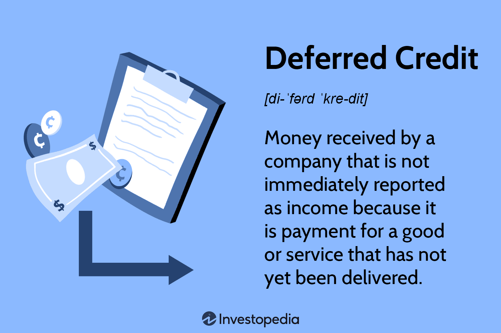

## Table of Contents

## What is a deferred payment option?

A deferred payment option is when you can buy something now but pay for it later. It's like getting a loan from the seller. You get the product or service right away, but you don't have to pay the full amount immediately. Instead, you agree to pay it off over time, often with added interest or fees.

This option can be helpful if you need something but don't have all the money right now. For example, you might use it to buy a new laptop or furniture. But, you need to be careful. Deferred payments can end up costing more because of the extra charges. Always read the terms carefully and make sure you can afford the payments before you agree to anything.

## How does a deferred payment option work?

When you choose a deferred payment option, you get to take home the item or use the service right away, but you don't pay the full amount immediately. Instead, you agree to pay it off over time. This is like getting a loan from the seller. They let you have the product now, and you promise to pay them back in smaller amounts over a set period. 

The seller might charge you interest or fees for this convenience. This means the total amount you end up paying could be more than the original price. It's important to read the agreement carefully to understand how much extra you'll have to pay and when your payments are due. If you miss a payment, there could be penalties, so make sure you can afford the payments before you agree to a deferred payment plan.

## What are the benefits of using a deferred payment option?

Using a deferred payment option can help you get something you need or want right away, even if you don't have all the money now. This can be really helpful if you need a new laptop for school or a big appliance like a refrigerator. You can start using the item immediately and then pay for it over time. This way, you don't have to wait until you've saved up enough money.

Another benefit is that it can help you manage your money better. Instead of paying a big amount all at once, you can spread the cost over several months. This can make it easier to fit the payments into your budget. It can also help you keep some money aside for other important things, like bills or emergencies, while still getting what you need.

## What are the potential risks or drawbacks of deferred payment options?

One big risk of deferred payment options is that they can end up costing you more money. You might have to pay extra fees or interest on top of the original price of the item. This means the total amount you pay could be a lot more than if you had just paid for it all at once. It's important to read the agreement carefully so you know exactly how much extra you will have to pay.

Another drawback is that if you miss a payment, you could face penalties or even have the item taken back. Missing payments can also hurt your credit score, which can make it harder to borrow money in the future. It's really important to make sure you can afford the payments before you agree to a deferred payment plan. If you're not careful, it can lead to more financial stress instead of helping you out.

Lastly, using deferred payment options too often can lead to a habit of spending money you don't have. It might feel easy to buy things now and pay later, but if you do this a lot, you can end up with a lot of debt. This can make it hard to keep up with all your payments and can put a strain on your finances. So, it's a good idea to use deferred payment options carefully and only when you really need to.

## Who typically offers deferred payment options?

Many different kinds of businesses offer deferred payment options. Big stores like furniture shops, electronics stores, and even some clothing stores might let you take things home now and pay later. They do this to help you buy their products even if you don't have all the money right away. Sometimes, special financing companies work with these stores to make these payment plans possible.

Online sellers also often have deferred payment options. Websites like Amazon or eBay might let you choose to pay over time when you check out. This can be really helpful if you're shopping online and see something you need but can't afford right now. Just remember to read the terms carefully so you know what you're agreeing to.

## In what situations is a deferred payment option most useful?

A deferred payment option is really helpful when you need something important right away but don't have all the money to pay for it. For example, if your fridge breaks and you need a new one fast, you can get it now and pay for it over time. This way, you don't have to wait until you've saved up enough money, and you can keep your food cold while you pay a little each month.

It's also useful when you're trying to manage your money carefully. Instead of spending a big chunk of money all at once, you can spread out the cost over several months. This can make it easier to fit the payments into your budget and still have money left for other important things like bills or emergencies. Just make sure you can afford the payments so you don't end up in more financial trouble.

## How does a deferred payment option affect credit scores?

Using a deferred payment option can affect your credit score in different ways. If you make all your payments on time, it can help your credit score. This is because it shows you can handle paying back money you owe. Lenders like to see this, so it can make it easier for you to borrow money in the future.

But, if you miss payments, it can hurt your credit score. Late payments can stay on your credit report for a long time and make it harder to get loans or credit cards later. So, it's really important to make sure you can afford the payments before you agree to a deferred payment plan. If you're not careful, it can lead to more financial problems instead of helping you out.

## What are the differences between deferred payment and other financing options?

Deferred payment is when you get something now but pay for it later. It's like the seller is giving you a loan. You agree to pay it back over time, often with extra fees or interest. Other financing options, like credit cards or personal loans, let you borrow money from a bank or a credit company instead of the seller. With a credit card, you can buy things and then pay the card company back, usually with interest if you don't pay the full amount each month. A personal loan gives you a lump sum of money that you pay back in fixed amounts over time, also with interest.

Deferred payment can be easier to get because the seller might not check your credit as much as a bank would. This makes it a good choice if you need something but don't have great credit. But, it can end up costing more because of the extra fees or interest. With credit cards and personal loans, you might have more flexibility in how you use the money, but they often require a good credit score and can have high interest rates if you don't pay them off quickly. So, it's important to think about the costs and your ability to pay back the money before choosing any financing option.

## What legal regulations govern deferred payment options?

In the United States, deferred payment options are governed by several laws to protect consumers. The Truth in Lending Act (TILA) is one of the main laws that make sure sellers tell you clearly about the costs of borrowing money, including any interest or fees. This law helps you understand how much you will really have to pay if you choose a deferred payment plan. The Federal Trade Commission (FTC) also has rules to make sure companies are honest about their payment plans and don't trick people into signing up for them.

State laws can also affect deferred payment options. Each state might have its own rules about how these plans can work, including limits on interest rates or fees. These laws are there to protect you from unfair practices and make sure you have all the information you need before agreeing to a deferred payment plan. It's a good idea to check the laws in your state to know your rights and what to expect when using these payment options.

## How can businesses implement a deferred payment option for their customers?

Businesses can start offering a deferred payment option by working with a financing company. These companies help set up the payment plans and handle the money side of things. The business just needs to choose a financing partner that fits their needs and sign an agreement with them. Then, they can let their customers know about the new payment option. This can be done by adding information about it on their website, in their store, or on their product pages.

Once the payment option is set up, the business needs to make sure they follow the rules. They have to tell customers clearly about the costs, like any interest or fees, and make sure they understand the terms of the payment plan. This helps keep everything fair and legal. By offering deferred payments, businesses can help more people afford their products, which can bring in more customers and boost sales.

## What advanced strategies can be used to manage deferred payment options effectively?

To manage deferred payment options effectively, businesses can use a few smart strategies. One is to work closely with a financing partner that has good technology. This technology can help track payments and make sure everything runs smoothly. It can also make it easier for customers to sign up for the payment plan and keep track of their payments. Another strategy is to offer different payment plans to fit different customers' needs. Some people might want to pay over a few months, while others might need more time. By offering choices, businesses can help more customers feel comfortable using the deferred payment option.

Another important strategy is to train staff well. They need to know all about the payment plans so they can explain them clearly to customers. This helps customers understand what they're signing up for and feel confident in their choice. Businesses should also keep an eye on how well the deferred payment option is working. They can do this by checking how many customers use it and how many of them pay on time. If there are problems, like a lot of late payments, the business can change the plan to make it better. By using these strategies, businesses can make sure their deferred payment options are helpful and successful.

## How do deferred payment options impact financial planning and cash flow management for both consumers and businesses?

For consumers, using deferred payment options can help with financial planning by letting them spread out the cost of big purchases over time. This can make it easier to fit the payments into their budget and still have money for other important things like bills or emergencies. But, it's important for consumers to be careful. If they don't pay on time, they might have to pay extra fees or interest, which can make the total cost a lot higher. Also, missing payments can hurt their credit score, making it harder to borrow money in the future. So, consumers need to make sure they can afford the payments before choosing a deferred payment plan.

For businesses, offering deferred payment options can help bring in more customers and boost sales. By letting people pay over time, businesses can make their products more affordable and attractive to buyers who might not have all the money right away. This can improve cash flow because more people will be able to buy things. But, businesses need to manage these payment plans well. They should work with a good financing partner to handle the payments and make sure they get their money back. If too many customers miss payments, it can hurt the business's cash flow and make it harder to keep running smoothly. So, businesses need to keep a close eye on how well their deferred payment options are working.

## References & Further Reading

[1]: Bergstra, J., Bardenet, R., Bengio, Y., & Kégl, B. (2011). ["Algorithms for Hyper-Parameter Optimization."](https://dl.acm.org/doi/10.5555/2986459.2986743) Advances in Neural Information Processing Systems 24.

[2]: ["Advances in Financial Machine Learning"](https://www.amazon.com/Advances-Financial-Machine-Learning-Marcos/dp/1119482089) by Marcos Lopez de Prado

[3]: ["Evidence-Based Technical Analysis: Applying the Scientific Method and Statistical Inference to Trading Signals"](https://www.amazon.com/Evidence-Based-Technical-Analysis-Scientific-Statistical/dp/0470008741) by David Aronson

[4]: ["Machine Learning for Algorithmic Trading"](https://github.com/stefan-jansen/machine-learning-for-trading) by Stefan Jansen

[5]: ["Quantitative Trading: How to Build Your Own Algorithmic Trading Business"](https://www.amazon.com/Quantitative-Trading-Build-Algorithmic-Business/dp/1119800064) by Ernest P. Chan

[6]: Johnson, B., & Xia, Y. S. (2002). ["Deferred Payments and the Valuation of Executive Stock Options."](https://www.semanticscholar.org/paper/Indexed-Executive-Stock-Options-Johnson-Tian/9be7c04da2484bd0589cce0503c0ad44defd188c) Journal of Finance, 57(3), 1285-1305.