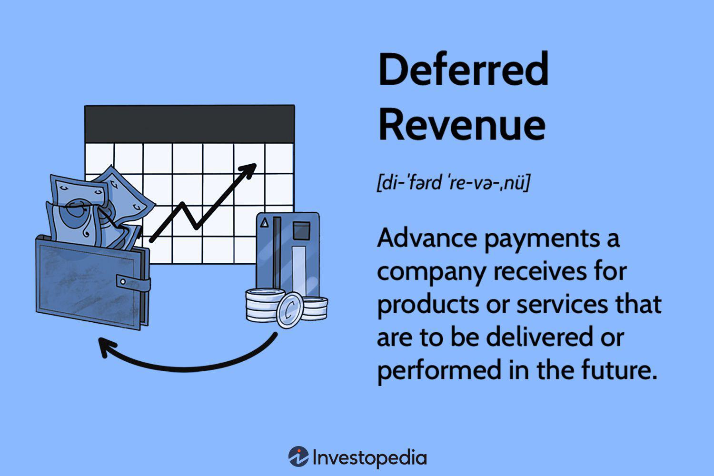

The world of finance and accounting is filled with complex terms and concepts that are crucial for businesses and investors to understand. Accounting liability, deferred revenue, unearned income, and algorithmic trading are among these essential concepts. Each plays a critical role in financial decision-making and strategic planning, directly impacting a company's ability to manage resources effectively.

Accounting liability refers to the financial obligations a company owes to external parties, which are vital for assessing a company’s financial health and creditworthiness. Deferred revenue and unearned income both pertain to payments received for services not yet performed, requiring careful financial reporting to ensure accurate reflections of a business's financial status. Algorithmic trading represents the swath of modern trading activities that automate decision-making using sophisticated algorithms. This technological advancement allows for rapid execution and analysis, providing a competitive edge in financial markets.



Understanding these terms helps bridge the gap between complex financial transactions and strategic business outcomes. When clearly comprehended, they empower accountants, investors, and business professionals to make informed decisions, optimize financial performance, and sustain competitive advantage in an ever-evolving economic environment.

## Table of Contents

## Understanding Accounting Liabilities

Accounting liability refers to the financial obligations a company owes to external parties. These liabilities are integral components of a company's balance sheet, reflecting its financial commitments. Liabilities commonly encompass loans, accounts payable, mortgages, and bonds, among others. They are systematically categorized into two primary types: current liabilities and long-term liabilities, based on their maturity.

Current liabilities are obligations that are due within a year. This category typically includes accounts payable, short-term debt, and other financial charges or taxes. For instance, if a company receives a loan that must be repaid within the next 12 months, it is classified as a current liability. This classification underscores the need for companies to manage their short-term financial position effectively to meet these obligations without financial distress.

Long-term liabilities, on the other hand, are obligations that are due beyond a year. Examples include bonds payable, long-term lease obligations, and pension liabilities. Long-term liabilities are crucial for financing major capital expenditures or business expansions that require substantial investment. Properly structuring these liabilities helps companies optimize their financial leverage, potentially leading to enhanced returns on equity while maintaining a stable credit profile.

Managing liabilities effectively is paramount for a company’s financial stability and creditworthiness. Companies must ensure that proper records are kept and reported accurately on financial statements to provide clear insight into their financial health. Inaccurately reporting liabilities can mislead investors, creditors, and other stakeholders, leading to adverse business consequences.

When documenting liabilities, adherence to accounting standards such as the Generally Accepted Accounting Principles (GAAP) or International Financial Reporting Standards (IFRS) is essential. These frameworks help maintain consistency and accuracy in financial reporting. For example, any discrepancies or omissions in accounting for liabilities can affect the outcome of financial ratios used by investors and analysts, such as the debt-to-equity ratio or the current ratio, which in turn influences perceptions of risk and profitability.

To illustrate: Python can be utilized for financial modeling, including liability analysis. Below is a basic example of how a company might represent and calculate its liability obligations using Python:

```python
# Sample Python code to calculate total liabilities
current_liabilities = {
    "accounts_payable": 50000,
    "short_term_loans": 20000,
    "taxes_payable": 5000
}

long_term_liabilities = {
    "bonds_payable": 100000,
    "long_term_lease": 25000
}

def calculate_total_liabilities(current, long_term):
    total_current = sum(current.values())
    total_long_term = sum(long_term.values())
    return total_current + total_long_term

total_liabilities = calculate_total_liabilities(current_liabilities, long_term_liabilities)
print("Total Liabilities:", total_liabilities)
```

In this example, the company's total liabilities are calculated by adding up the values of current and long-term liabilities. Companies use such models to maintain transparency in financial reporting, ensuring that all stakeholders have access to accurate, timely information regarding financial obligations. Proper liability management not only preserves financial health but also bolsters investor confidence and enhances the company’s capacity to attract future investment.

## The Concept of Deferred Revenue

Deferred revenue, also called unearned revenue, refers to funds that a company receives for services or products that have yet to be delivered. This concept is essential for businesses operating under subscription or pre-payment models, such as software companies, insurance providers, and online publications. Deferred revenue is recognized as a liability on a company's balance sheet because it reflects an obligation to deliver the agreed-upon goods or services in the future.

In accounting terms, deferred revenue impacts both cash flow and revenue recognition. When a payment is received, the company's cash flow benefits, but since the [earning](/wiki/earning-announcement) process is not complete, the revenue cannot be recognized immediately. This distinction ensures accurate financial reporting and helps stakeholders assess the company's financial performance.

Managing deferred revenue effectively involves monitoring contracts and service delivery timelines to transition amounts from liabilities to recognized revenue. For example, when a company receives an advance payment for a one-year subscription service, it initially records the total as deferred revenue. Over the subscription period, as services are rendered, it gradually shifts this amount from liabilities to revenue. Here's a simplified Python code snippet to illustrate this process:

```python
def recognize_revenue(deferred_revenue, service_period):
    monthly_revenue = deferred_revenue / service_period
    recognized_revenue = 0
    for month in range(service_period):
        recognized_revenue += monthly_revenue
        deferred_revenue -= monthly_revenue
        print(f"Month {month + 1}: Recognized Revenue = {recognized_revenue}, Deferred Revenue = {deferred_revenue}")
    return recognized_revenue

# Example usage
recognize_revenue(1200, 12)
```

This code simulates the monthly transition of a $1,200 deferred revenue amount over a 12-month service period, with each month's recognized revenue being $100.

Effective management of deferred revenue also supports accurate financial forecasting and planning. By understanding the timing of revenue recognition, businesses can better predict future income streams and make informed investment and operational decisions. Moreover, deferred revenue provides insights into customer commitment levels and the company's ability to sustain long-term relationships, which are crucial indicators of financial health. 

In summary, deferred revenue is a key component of financial accounting that plays a significant role in cash flow management and revenue recognition. Companies that handle it adeptly can enhance their financial strategies and maintain transparency in their financial statements.

## Unearned Income and Its Implications

Unearned income generally refers to money received by a company before it has been earned through the delivery of goods or services. This concept is closely related to deferred revenue, and both are recognized as liabilities on the balance sheet because they represent commitments that the company must fulfill in the future.

**Examples of Unearned Income:**
Common examples of unearned income include advance payments for rent, prepaid service contracts, and subscriptions. For instance, if a tenant pays rent for the upcoming three months in advance, that payment constitutes unearned income until the months are lived through. Similarly, a company that receives payment for a year-long software subscription must recognize this as unearned income until the service is fully delivered.

**Tax Implications and Accounting Treatments:**
Understanding the tax implications of unearned income is crucial. Recognizing unearned income correctly is essential to ensure compliance with tax regulations and to present an accurate financial position. For tax purposes, this income might need to be reported differently, impacting taxable income calculations. Businesses typically follow the accrual accounting system where revenue is recognized when it is earned, not when cash is received. This principle dictates that unearned income must be recorded as a liability until the service or product is delivered.

**Management Strategies:**
Effectively managing unearned income involves strategies for proper tracking and timely recognition. Steps include maintaining accurate records of all transactions involving advance payments and systematically converting unearned income to earned revenue as obligations are fulfilled. Automated accounting systems can facilitate this process by tracking service delivery timelines and adjusting the income on the balance sheet accordingly.

**Financial Reporting and Performance:**
Unearned income must be handled with care to ensure financial reports genuinely reflect the business's performance. Unearned income that is not tracked or reported accurately can lead to misinterpretation of a company's financial health. Regularly updating the balance sheet to reflect earned revenue helps in providing stakeholders with transparent insights into the company's finances.

Proper management and tracking of unearned income are vital. This ensures that financial statements accurately represent an organization's financial standing and aids in compliance with accounting standards and tax laws.

## Exploring Algo Trading

Algorithmic trading, commonly known as algo trading, is a sophisticated method that integrates advanced algorithms to automate trading decisions and execute large-scale trades. This approach leverages the efficiency of computers to analyze vast data sets much faster and more accurately than human traders, leading to more optimized trading opportunities.

### Speed, Data, and Efficiency

At the core of algo trading is the emphasis on speed, which is critical in markets where prices can shift in milliseconds. Algorithms can swiftly identify trends, assess market conditions, and execute trades with minimal delay. Data is another pillar of algo trading, with algorithms analyzing historical and real-time market data to identify profitable trading opportunities. Efficiency is achieved by reducing human error and emotional bias, often associated with manual trading, ensuring a disciplined and systematic approach to trading.

### Transformation of Financial Markets

Algo trading has revolutionized modern financial markets. The integration of algorithmic strategies has enhanced [liquidity](/wiki/liquidity-risk-premium), reduced transaction costs, and increased market efficiency. High-frequency trading ([HFT](/wiki/high-frequency-trading-strategies)), a subset of algo trading, is particularly influential, executing a large number of orders at extremely high speeds. However, the complexity and speed of algo trading can also introduce risks, such as the potential for market anomalies and flash crashes, where rapid sell-offs occur due to cascading algorithms.

### Advantages and Challenges

The advantages of algo trading are numerous. It allows for precise timing and execution of trades, mitigates the risk of manual errors, and can manage complex strategies that would be cumbersome for human traders.

However, challenges persist, including the need for robust infrastructure and technology to support trading systems. Market participants must also consider the regulatory environment governing algo trading, which varies significantly across different regions.

### Technological Insights for Traders

For investors and traders, understanding the mechanics of algo trading is essential. It presents an opportunity to leverage technology for creating sophisticated, data-driven trading strategies. Analyzing historical data for [backtesting](/wiki/backtesting), optimizing trading algorithms, and using [machine learning](/wiki/machine-learning) for predictive analytics are avenues to enhance trading performances.

In the Python example below, we illustrate a simple backtesting of a moving average crossover strategy:

```python
import pandas as pd
import numpy as np

# Simulated historical price data
data = pd.DataFrame({
    'price': np.random.random(100) + np.linspace(10, 11, 100)
})

# Calculate short and long moving averages
data['short_mavg'] = data['price'].rolling(window=5).mean()
data['long_mavg'] = data['price'].rolling(window=20).mean()

# Generate trading signals: 1 for buy, -1 for sell
data['signal'] = 0
data.loc[data['short_mavg'] > data['long_mavg'], 'signal'] = 1
data.loc[data['short_mavg'] < data['long_mavg'], 'signal'] = -1

# Display trading signals
print(data[['price', 'short_mavg', 'long_mavg', 'signal']].tail())
```

This code demonstrates the calculation of short- and long-term moving averages, followed by generating buy/sell signals based on their crossover. While simplistic, it underscores the essential principles of algo trading: automation, analysis, and execution.

In conclusion, as financial markets continue to evolve with technological advancements, [algorithmic trading](/wiki/algorithmic-trading) stands out as a pivotal innovation. Its capacity for rapid data processing and strategic execution positions it as a valuable tool for modern investors and traders. Understanding its intricacies, advantages, and limitations can provide a significant edge in the competitive landscape of financial trading.

## Interconnection Between These Concepts

The concepts of accounting liabilities, deferred revenue, unearned income, and algorithmic trading may seem disparate, yet they share significant intersections in the contexts of business and finance. The management of liabilities and revenues is crucial for companies, particularly those involved in algorithmic trading. Effective handling of these financial elements can optimize a company’s performance and increase its strategic positioning.

Algorithmic trading, a method known for its speed and precision, often deals with significant volumes of financial transactions. Companies utilizing algo trading techniques can apply these algorithms to hedge their liabilities effectively. For example, algorithms can be used to predict market conditions and adjust trading strategies accordingly, thus minimizing the risk associated with fluctuating liabilities. Efficiently managing liabilities and using algo trading strategies can safeguard a company from potential financial instability.

Deferred revenue and unearned income play integral roles in a company's financial strategy, particularly in industries reliant on subscription models or prepayments. Both are recorded as liabilities and require careful management to ensure accurate financial reporting. In this context, companies can use algorithmic approaches to forecast and manage revenue recognition more accurately. For instance, advanced algorithms can predict customer behavior and subscription renewal rates, allowing for more precise revenue and cash flow projections. 

Moreover, the interplay between these financial concepts can be demonstrated through the optimization of balance sheets. By using algo trading to enhance liquidity, companies may strategically reduce short-term liabilities. For example, they may sell financial assets or realign investment portfolios based on algorithmic insights, thus improving the balance sheet's structure.

Understanding how these financial concepts interconnect allows businesses to develop integrated financial and investment strategies that are resilient to market dynamics. Companies adopting such approaches are better positioned to anticipate financial challenges and capitalize on market opportunities, leading to sustainable business growth and stability.

## Conclusion

Accounting liability, deferred revenue, unearned income, and algo trading are essential concepts in finance and accounting. Grasping these topics is crucial for making informed decisions in business and investments. They each play unique roles: accounting liabilities highlight a firm's financial obligations, deferred revenue and unearned income address how future goods or services are compensated in advance, and algo trading showcases modern financial strategy through automated processes.

In a landscape marked by rapid technological advancements and evolving market conditions, having up-to-date knowledge on these subjects offers a strategic advantage. This awareness not only aids in accurate financial reporting but also enables leveraging opportunities brought by financial innovation like algorithmic trading.

We hope the insights shared in this article are useful for navigating these complex financial topics. For those seeking to deepen their understanding, consulting with financial professionals or enrolling in specialized training programs can be beneficial in mastering these integral concepts.

## References & Further Reading

[1]: Elliot, B., & Emett, G. (2014). ["Understanding Deferred Revenue Recognition: An Overview and Best Practices Guide."](https://www.researchgate.net/publication/343646928_The_dyslexia_debate_life_without_the_label) CFA Institute Research Foundation.

[2]: Shah, D., & Zhang, B. (2010). ["Bayesian Regression and Bitcoin: An Overview of Algorithmic Trading."](https://ieeexplore.ieee.org/document/7028484) MIT.

[3]: ["International Financial Reporting Standards (IFRS)" - Official Pronouncements As Issued at 1 July 2020](https://www.ifrs.org/) by the IFRS Foundation

[4]: Clements, J., & Hendry, D. (2011). ["Quantitative Risk Management: Concepts, Strategies, and Tools."](https://people.math.ethz.ch/~embrecht/ftp/quebec.pdf) Princeton University Press.

[5]: Hull, J. (2017). ["Options, Futures, and Other Derivatives."](https://www.pearson.com/en-us/subject-catalog/p/options-futures-and-other-derivatives/P200000005938/9780136939917) Pearson. 

[6]: Cartea, Á., Jaimungal, S., & Penalva, J. (2015). ["Algorithmic and High-Frequency Trading."](https://assets.cambridge.org/97811070/91146/frontmatter/9781107091146_frontmatter.pdf) Cambridge University Press. 

[7]: ["The Basics of Algorithmic Trading: Concepts and Examples"](https://www.investopedia.com/articles/active-trading/101014/basics-algorithmic-trading-concepts-and-examples.asp) by Investopedia. 

[8]: ["Principles of Corporate Finance"](https://www.mheducation.com/highered/product/Principles-of-Corporate-Finance-Brealey.html) by Richard A. Brealey, Stewart C. Myers, and Franklin Allen. 