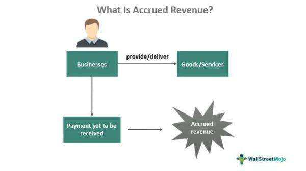

Financial accounting is essential for providing crucial information that aids decision-making processes across businesses and by finance professionals. The concepts of accrued expenses and deferred revenue are fundamental to understanding the intricacies of financial statements. Accrued expenses are incurred but not yet paid, while deferred revenue refers to payments received before delivering goods or services. These concepts present notable complexities because they require careful judgment to ensure transactions are recorded in the appropriate accounting periods, impacting the accuracy of a company's financial health representation.

The advent of algorithmic trading has introduced a significant evolution in financial markets. This approach uses mathematical models and algorithms to execute trades at speeds and frequencies beyond human capability, relying heavily on data precision and timing—elements that are deeply rooted in sound financial practices. Algorithmic trading is integral to modern finance due to its ability to analyze vast amounts of data efficiently, reduce transaction costs, and minimize human error.



This article will examine the differences and intersections between accrued expenses, deferred revenue, and algorithmic trading. The understanding of these key accounting concepts is imperative not only for maintaining accurate financial records but also for enhancing trading strategies. Through mastering these principles, finance professionals can improve financial forecasting, cash flow management, and error prevention in financial reporting, all of which contribute to informed trading decisions and sustainable financial practices.

In conclusion, as we explore these topics, it becomes evident that proficiency in these accounting concepts is crucial for accurate financial reporting and successful trading in today's fast-paced financial environment.

## Table of Contents

## Understanding Accrued Expenses

Accrued expenses are costs that have been incurred but not yet paid or recorded in the financial statements at the end of an accounting period. These expenses are recognized because the related liabilities must be recorded to provide an accurate picture of the organization’s financial status. Accrued expenses typically occur as a result of the economic principle of matching expenses with revenues in the appropriate accounting period, ensuring the financial statements reflect a true and fair view of the financial performance and position of an entity.

Accrued expenses are recorded in the financial statements by creating an accrual entry, which usually involves increasing an expense account on the income statement and increasing a liability account, often titled "Accrued Liabilities" or "Accrued Expenses," on the balance sheet. This entry ensures that expenses are matched with revenues generated during the same period, aligning with the accrual basis of accounting.

Common examples of accrued expenses across various industries include:

1. **Interest Expenses**: Businesses may incur interest on loans that have not yet been paid by the end of the reporting period. This interest expense needs to be accounted for, even if the cash payment will occur in a future period.

2. **Wages and Salaries**: Often, salaries and wages are paid after the services have been rendered. At the end of an accounting period, companies may owe employees for work performed but not yet paid, requiring an accrual for wage expenses.

3. **Utilities**: Businesses may have consumed utilities such as electricity, water, or gas, for which they have not yet received an invoice. These expenses need to be estimated and recorded to reflect the usage in the reporting period.

4. **Taxes**: Income taxes or property taxes that have been incurred but not paid by the end of the reporting period should be accrued to match the tax expense with the period’s revenue.

The impact of accrued expenses on a company's financial health and reporting practices is significant. By appropriately recording these liabilities, a company ensures that its financial statements accurately reflect its obligations, which is crucial for stakeholders, including investors, creditors, and management, to make informed decisions. If accrued expenses are not recorded accurately, it may result in misstated financial statements, leading to potential misinterpretation of a company's profitability and financial position. This can impair the organization's ability to manage its cash flow effectively and create challenges in financial forecasting and operational planning.

## Demystifying Deferred Revenue

Deferred revenue, commonly known as unearned revenue, represents funds received by a business for goods or services yet to be delivered or performed. In accounting terms, deferred revenue is considered a liability until fulfillment of the obligation, thereby transforming it into actual revenue. The accounting treatment of deferred revenue reflects its temporary nature and obligation to provide goods or services in the future.

### Differences Between Deferred Revenue and Actual Revenue

The primary distinction between deferred revenue and actual revenue lies in timing and service delivery. Deferred revenue is recognized when cash is received prior to delivering goods or services. Conversely, actual revenue materializes when the goods or services are fully delivered, adhering to the revenue recognition principle.

From an accounting perspective, recognition of deferred revenue ensures that income statements accurately reflect the period in which the service obligations are met. This distinction is crucial for ensuring that financial statements provide a realistic view of a company's performance.

### Reporting of Deferred Revenue on Financial Statements

Deferred revenue appears on the balance sheet as a liability, reflecting the company's obligation to provide goods or services. It remains a liability until the obligations are discharged. The gradual fulfillment of these obligations results in the systematic conversion to actual revenue, recorded in the income statement over time. Organizations typically report deferred revenue under current liabilities for short-term obligations or long-term liabilities depending on the expected delivery timeframe.

For example, if a company receives a $10,000 advance for a service to be performed across the next five months, it initially records $10,000 as deferred revenue. Each month, $2,000 is recognized as actual revenue until the service is fully performed and the deferred revenue account is subsequently cleared.

### Examples and Financial Implications of Deferred Revenue

Deferred revenue is prevalent in industries where services or goods are prepaid. Common instances include:

- **Subscription Services**: Companies offering monthly or annual subscriptions, such as magazines or streaming services, often encounter deferred revenue.

- **Software Licenses**: Firms providing annual software licenses recognize the whole term's fee as deferred revenue until they deliver the service along the tenure.

- **Rental Income**: Landlords collecting rent in advance also face deferred revenue situations until tenants use the rental services for the paid period.

The treatment of deferred revenue maintains the integrity of financial reporting, ensuring that income earned correlates with service delivery. This alignment aids investors and stakeholders in assessing the company’s future cash flows and current financial obligations critically. Mismanagement or incorrect accounting can distort financial health indicators, leading to misinformed decision-making. 

Incorporating deferred revenue correctly is integral to accurate accounting and financial analysis, facilitating informed strategic planning and investment evaluations.

## Accrued Expenses vs. Deferred Revenue: Key Differences

Accrued expenses and deferred revenue represent two fundamental accounting concepts that affect financial statements but serve different purposes within a company's accounting framework. Understanding these concepts and their differences is crucial for accurate financial reporting and effective cash flow management.

**Accrued Expenses vs. Deferred Revenue: Key Differences**

Accrued expenses are liabilities that a company incurs when it receives a service or benefit but has not yet paid for it. For example, employee salaries might be earned by employees by the month's end but are paid in the next month. Therefore, it's necessary to record this liability in the financial statements of the period in which the expense was incurred. This adheres to the matching principle in accounting, ensuring that all expenses related to the generation of revenue are recorded in the same accounting period as the revenue itself.

In contrast, deferred revenue, sometimes referred to as unearned revenue, represents money received by a company for goods or services that have yet to be delivered or completed. It is initially recorded as a liability because there is an obligation to deliver a product or service in the future. A common example is subscription-based services, where payment is received before the service period.

**Impact of Timing and Recognition Principles**

Timing and recognition are critical in distinguishing these two concepts. Accrued expenses require recognition when the financial obligation is incurred but not yet paid, whereas deferred revenue involves recognizing the obligation when payment is received but prior to fulfillment. According to the revenue recognition principle, revenue must be recognized when it is earned, regardless of when payment is received, which contrasts with how deferred revenue is initially recorded.

The recognition of accrued expenses helps ensure that a company's financial statements accurately reflect the expenses and liabilities of each accounting period. Conversely, deferred revenue recognition assures that revenue is recorded in the period it is earned, supporting compliance with accounting standards such as the International Financial Reporting Standards (IFRS) and Generally Accepted Accounting Principles (GAAP).

```python
# Simple demonstration of when to record accrued expenses and deferred revenue

import datetime

today = datetime.date.today()

def record_transaction(transaction_date, type_of_transaction):
    if type_of_transaction == "accrued_expense":
        # Record the expense if the transaction date has passed
        if transaction_date <= today:
            return "Record the accrued expense in the current period."
        else:
            return "Do not record the accrued expense yet; the period hasn't ended."
    elif type_of_transaction == "deferred_revenue":
        # Record the revenue as deferred until the service is provided
        if transaction_date <= today:
            return "Recognize revenue only when the service or product is delivered."
        else:
            return "Keep as deferred revenue until the service is delivered."

# Examples
print(record_transaction(datetime.date(2023, 9, 30), "accrued_expense"))
print(record_transaction(datetime.date(2023, 12, 1), "deferred_revenue"))
```

**Financial Forecasting and Cash Flow Management**

Both accrued expenses and deferred revenue play significant roles in financial forecasting and cash flow management. Accrued expenses can provide a clearer picture of an organization's future cash outflows, helping ensure sufficient [liquidity](/wiki/liquidity-risk-premium) for impending payments. On the other hand, deferred revenue offers insights into expected future inflows from customers who have prepaid for services or goods.

An accurate understanding of accrued expenses and deferred revenue aids financial managers and accountants in projecting cash needs and assigning resources efficiently. Misunderstanding these concepts can lead to misstatements in financial reports, causing poor financial decision-making and potential disruptions in cash flow.

**Error Prevention in Financial Reporting**

A thorough comprehension of accrued expenses and deferred revenue reduces errors in financial reporting. Ensuring that expenses and revenues are recorded in the correct periods prevents discrepancies and enhances the reliability of financial statements. Adhering to established accounting principles and standards can mitigate financial misrepresentation risks, fostering investor trust and aiding in regulatory compliance. 

Ultimately, distinguishing between these accounting elements is vital for precise financial analysis and maintaining the fiscal health of an organization.

## Algorithmic Trading: An Overview

Algorithmic trading refers to the use of computer algorithms to automate trading processes, allowing for the execution of orders at speeds and volumes impractical for human traders. It has become a cornerstone in contemporary finance, fundamentally transforming how financial markets operate. This section provides an overview of [algorithmic trading](/wiki/algorithmic-trading), focusing on its utilization of financial data, the technologies and methodologies employed, and both the advantages and challenges it presents.

Algorithmic trading leverages large sets of financial data to make trading decisions. These algorithms are designed to parse market data, detect patterns, and execute trades based on predefined criteria, such as timing, price, quantity, or any mathematical model derived from historical or real-time market data. For instance, algorithms might be programmed to execute a buy order when a specific stock price surpasses a moving average threshold. The ability to process and react to data with precision allows algorithms to capitalize on minute market inefficiencies that might not be obvious to individual traders.

The technologies and methodologies involved in algorithmic trading are diverse. High-frequency trading ([HFT](/wiki/high-frequency-trading-strategies)) is a prominent example, characterized by rapid trade execution at extremely high speeds, often microseconds. HFT relies heavily on sophisticated hardware and software infrastructure to minimize latency, which is crucial in capturing the fleeting opportunities that arise from small price discrepancies. Besides HFT, other methodologies include statistical [arbitrage](/wiki/arbitrage), [market making](/wiki/market-making), and [trend following](/wiki/trend-following), each employing various statistical and [machine learning](/wiki/machine-learning) models to predict market movements and implement trades effectively.

Advantages of algorithmic trading include increased market efficiency, improved liquidity, and reduced transaction costs. Algorithms can operate 24/7 without human intervention, thus optimizing opportunities across global markets. They also reduce emotional and cognitive biases that might affect human traders, enabling a more disciplined approach to trading. However, algorithmic trading also poses several challenges. It can contribute to market [volatility](/wiki/volatility-trading-strategies), as seen in events like the Flash Crash of 2010, where automated trading exacerbated rapid selling. Ensuring robust risk management and monitoring systems is essential to prevent unintended market impacts.

In summary, algorithmic trading plays a crucial role in modern finance, offering enhanced capabilities to analyze data and execute trades at exceptional speeds. While it provides significant advantages including efficiency and precision, the inherent challenges, particularly concerning market stability, warrant careful consideration and management. This balance is crucial for harnessing the full potential of algorithmic trading in the evolving financial landscape.

## Connecting Accounting Practices and Algorithmic Trading

Accurate accounting information is crucial for successful algorithmic trading as it provides essential data that influences trading decisions, risk management, and performance analysis. Algorithmic trading relies heavily on the quality and accuracy of input data to execute strategies effectively. Financial data such as accrued expenses and deferred revenue play a significant role in shaping these strategies.

### Accrued Expenses and Deferred Revenue in Trading Algorithms

Accrued expenses, which represent costs that a business has incurred but not yet paid, provide a clearer picture of a company's financial obligations. This information helps algorithms evaluate the cash flow status and liquidity of a company, affecting investment decisions such as credit assessments and company valuations. For instance, a sudden increase in accrued expenses might indicate potential cash flow issues, prompting algorithms to trigger sell signals or adjust trading positions.

Deferred revenue, representing payments received for services or goods not yet delivered, is another critical data point. It can provide insights into future earnings and cash flow stability. Algorithms can incorporate deferred revenue figures to predict future revenue streams, assisting in pricing models and earnings forecasts. The presence of substantial deferred revenue on a company's balance sheet might suggest robust future earnings, potentially influencing buy signals in trading algorithms.

### Utilization in Trading Strategies

Financial data is integral in [backtesting](/wiki/backtesting) and optimizing trading strategies. For example, machine learning models can be trained using historical data, including accrued expenses and deferred revenue, to identify patterns and predict future market movements. By integrating these accounting figures, algorithms can enhance predictive accuracy, identifying profitable trades with higher precision.

Moreover, financial ratios that include accrued expenses and deferred revenue, such as the quick ratio or debt-to-equity ratio, can be computed to assess financial health. These ratios can feed into decision-making algorithms to assess the risk-reward profile of trades. 

### Enhancing Algorithm Performance with High-Quality Data

High-quality data is indispensable for algorithmic trading performance. Algorithms require timely, accurate, and complete data to reduce the risk of erroneous trades and enhance strategy efficacy. Poor data quality can lead to incorrect predictions, resulting in potential financial losses. Ensuring that accounting information is meticulously recorded and promptly updated enhances the reliability of trading algorithms.

Python, being a preferred language in algorithm development, can be utilized to handle and analyze financial data effectively:

```python
import pandas as pd

# Example: Calculate the quick ratio using financial data
def calculate_quick_ratio(current_assets, inventory, current_liabilities):
    quick_assets = current_assets - inventory
    quick_ratio = quick_assets / current_liabilities
    return quick_ratio

# Example data
financial_data = {
    'current_assets': 500000,
    'inventory': 100000,
    'current_liabilities': 200000
}

quick_ratio = calculate_quick_ratio(**financial_data)
print(f"Quick Ratio: {quick_ratio}")
```

Accurate and high-quality accounting data enriches algorithmic trading strategies, significantly contributing to their success. Understanding and leveraging information such as accrued expenses and deferred revenue allows for better-informed trading decisions, ultimately enhancing the overall performance of trading algorithms.

## Practical Tips for Accountants and Traders

## Practical Tips for Accountants and Traders

### Strategies for Accountants to Ensure Accurate Recording of Accrued Expenses and Deferred Revenue

Accurate recording of accrued expenses and deferred revenue is essential for maintaining reliable financial statements. Accountants should adhere to the following best practices:

1. **Routine Reviews**: Regularly review all outstanding liabilities and prepaid accounts to ascertain any overlooked accrued expenses or deferred revenues. A monthly check is often beneficial to ensure updates reflect current liabilities and assets accurately.

2. **Use of Accounting Software**: Implement robust accounting software that can automatically track and record accrued expenses and deferred revenue. Software such as QuickBooks or SAP can assist in scheduling entries and generating alerts for upcoming accruals and deferrals.

3. **Clear Documentation**: Maintain comprehensive documentation for all transaction entries, including invoices, contracts, and service agreements. This documentation provides evidence for the existence and valuation of accrued expenses and deferred revenue, ensuring transparency.

4. **Regular Training**: Financial regulations and standards can change over time. Accountants should engage in regular training and professional development to keep abreast of the latest accounting standards and practices related to accrued and deferred items.

5. **Reconciliation and Audits**: Conduct periodic reconciliations and internal audits to verify the accuracy of recorded expenses and revenues. This is crucial for identifying discrepancies early and ensuring corrective measures are implemented promptly.

### Tips for Traders on Interpreting Financial Data for Algorithmic Trading

Traders relying on algorithmic trading can optimize their use of financial data through the following approaches:

1. **Data Analysis Skills**: Develop proficiency in quantitative data analysis and statistical techniques to interpret complex datasets correctly. Understanding metrics such as variance, correlation, and regression is critical for effective data analysis.

2. **Use of Real-Time Data**: Access to real-time financial data is imperative for algorithmic trading. Traders should invest in real-time data services to ensure they utilize the most current and relevant information for trade decisions.

3. **Model Testing**: Before deploying trading algorithms, conduct back-testing using historical data to assess the model's performance. This helps validate the efficacy of the algorithm and uncover any potential flaws.

4. **Risk Management Tools**: Incorporate robust risk management tools and strategies within the trading algorithms to minimize losses. Techniques such as stop-loss orders and diversification can significantly mitigate risks.

5. **Integration with Accounting Insights**: Traders should consider insights from accounting data, such as trends in accrued expenses and deferred revenues, when developing trading strategies. These elements can provide valuable foresight into a company's future financial performance.

### Best Practices for Collaboration Between Accounting Professionals and Traders

For effective financial operations, collaboration between accountants and traders is essential. Here are best practices to facilitate this synergy:

1. **Regular Communication**: Establish regular communication channels between accounting and trading departments. This ensures that financial decisions are aligned with accounting realities.

2. **Shared Platforms**: Use integrated IT platforms that allow seamless data sharing and reporting between accounting software and trading systems. This fosters transparency and enhances data accuracy.

3. **Joint Strategy Meetings**: Conduct joint strategy sessions where both accountants and traders can discuss current trends, financial forecasts, and cash flow projections. Such meetings ensure that both parties have a mutual understanding of financial goals.

4. **Data Literacy**: Promote data literacy within the organization, ensuring that both accountants and traders can effectively interpret and utilize financial data for decision-making. Training sessions and workshops can be beneficial in this regard.

5. **Feedback Mechanism**: Implement a feedback system where traders can provide insights about market trends that may affect accounting practices, and accountants can inform traders about financial reporting that may impact investment decisions.

### Tools and Resources to Improve Data Accuracy and Trading Strategy Efficacy

To bolster both financial reporting and trading outcomes, consider the following tools and resources:

1. **Financial Data Platforms**: Use platforms like Bloomberg Terminal or Thomson Reuters Eikon, which offer comprehensive financial data, analytics, and trading insights necessary for informed decision-making.

2. **Accounting Software Suites**: Implement accounting software with advanced capabilities such as Oracle Financials or Microsoft Dynamics GP, providing automated features for tracking and managing financial data effectively.

3. **Algorithm Development Environments**: Utilize platforms like MetaTrader or QuantConnect, which provide environments for developing, testing, and optimizing trading algorithms.

4. **Continuous Learning Platforms**: Encourage the use of online learning resources such as Coursera, edX, or Khan Academy to continually upgrade skills in both accounting and data analysis.

5. **Risk Assessment Tools**: Employ tools such as Monte Carlo simulations or scenario analysis software to evaluate potential risks and enhance strategic decision-making.

By implementing these practices, accountants and traders can enhance the accuracy and effectiveness of financial reporting and trading strategies, ultimately leading to more informed and strategic financial management.

## Conclusion

Accrued expenses and deferred revenue represent pivotal concepts in financial accounting, each with distinct roles in financial statements. Accrued expenses refer to costs that have been incurred but not yet paid, while deferred revenue involves funds received for goods or services not yet delivered. These differences underscore their unique impacts on a company's balance sheet and income statement. Accrued expenses typically reduce net income and increase liabilities, reflecting anticipated outflows. In contrast, deferred revenue is recorded as a liability until the obligation is fulfilled, at which point it is recognized as revenue.

In algorithmic trading, these accounting elements [carry](/wiki/carry-trading) significant weight. The accuracy of accrued expenses impacts cash flow predictions and risk assessments used by trading algorithms to optimize decision-making. Likewise, understanding deferred revenue allows algorithmic traders to better evaluate a company's future revenue flows, informing trading strategies based on anticipated financial performance.

Integrating precise accounting data into algorithmic trading systems enhances algorithm performance by providing critical insights for predictive analytics. For instance, trading algorithms may use accrued expense trends to anticipate liquidity events or deferred revenue patterns to gauge future profitability, streamlining trade execution strategies.

As financial markets evolve, professionals in accounting and trading must continually adapt, ensuring that their knowledge base aligns with emerging technologies and methodologies. This ongoing learning is essential for maintaining competitive advantage and ensuring financial strategies are both innovative and grounded in accurate data. Encouraging collaboration between accountants and traders can further bridge the gap between detailed financial reporting and dynamic market activities, fostering a cohesive approach that enhances overall financial operations.

## References & Further Reading

[1]: ["Advances in Financial Machine Learning"](https://www.amazon.com/Advances-Financial-Machine-Learning-Marcos/dp/1119482089) by Marcos Lopez de Prado

[2]: ["Quantitative Trading: How to Build Your Own Algorithmic Trading Business"](https://www.amazon.com/Quantitative-Trading-Build-Algorithmic-Business/dp/1119800064) by Ernest P. Chan

[3]: Kothari, S. P., & Barone, N. "Financial Statement Analysis". In "Financial Accounting Theory and Analysis: Text and Cases", John Wiley & Sons.

[4]: ["Accounting for Dummies"](https://www.youtube.com/watch?v=yYX4bvQSqbo) by John A. Tracy

[5]: ["Accounting Principles"](https://www.investopedia.com/terms/a/accounting-principles.asp) by Jerry J. Weygandt, Paul D. Kimmel, & Donald E. Kieso

[6]: Palguta, J., & Pertold-Gebicka, B. (2017). ["Deferred revenue: Evidence from a delivery industry"](https://www.aeaweb.org/articles?id=10.1257/pol.20150511). Journal of Accounting and Economics.