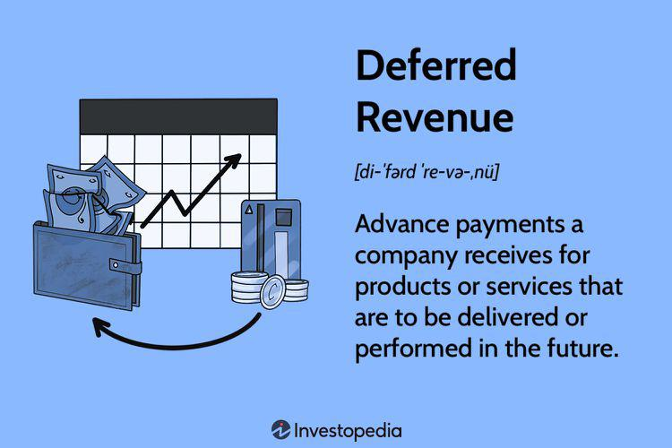

## Table of Contents

## What is deferred revenue?

Deferred revenue is money that a company receives for goods or services it hasn't delivered yet. Imagine you pay for a year-long magazine subscription upfront. The magazine company gets your money right away, but they can't count it as earnings until they actually send you the magazines each month. That's because they still owe you the service of sending the magazines.

This type of revenue is important for businesses because it helps them manage cash flow and plan for future expenses. It's recorded on the company's balance sheet as a liability, which means it's something the company owes to its customers. Once the company delivers the goods or services, the deferred revenue is then recognized as earned revenue on the income statement. This way, the financial statements accurately reflect the company's performance over time.

## How is deferred revenue classified as a liability?

Deferred revenue is considered a liability because it represents an obligation that a company has to its customers. When a customer pays in advance for a product or service, the company gets the money but hasn't fulfilled its part of the deal yet. This means the company owes the customer something in the future, like delivering a product or providing a service. Until that happens, the money received is not truly earned by the company, so it's treated as a debt to the customer.

In accounting terms, this is shown on the company's balance sheet as a liability. It's called "deferred" because the revenue is postponed until the company actually delivers what it promised. Once the company fulfills its obligation, the deferred revenue is moved from the liability section to the income statement as earned revenue. This way, the financial records accurately show when the company actually earns the money it received.

## Can you explain the concept of deferred revenue with a simple example?

Imagine you sign up for a gym membership that costs $120 for the whole year. You pay the full amount at the beginning of the year. The gym gets your $120 right away, but they can't say they've earned all that money yet because you haven't used the gym for the whole year.

So, the gym keeps track of your payment as deferred revenue. Each month, as you use the gym, a little bit of that $120 turns into earned revenue for the gym. By the end of the year, when you've used the gym for all 12 months, the gym has earned all the money you paid upfront. This way, the gym's financial records show the money as it's actually earned over time.

## What are the common sources of deferred revenue for a business?

A common source of deferred revenue for a business is when customers pay for services in advance. For example, a software company might sell annual subscriptions where customers pay for the whole year upfront. The company gets the money right away, but they can't count it as earnings until they provide the software service over the year. Another example is a fitness center that sells yearly memberships. When members pay for the entire year at once, the gym has to record that money as deferred revenue until the members use the gym over time.

Another source of deferred revenue comes from businesses that sell products with long delivery times. For instance, a furniture company might take orders for custom pieces that will be delivered months later. When customers pay in advance, the furniture company has to treat that money as deferred revenue until they actually deliver the furniture. This helps the company keep its financial records accurate, showing when the money is truly earned.

## How does deferred revenue impact a company's financial statements?

Deferred revenue impacts a company's financial statements in a big way. When a company gets money from customers before delivering a product or service, they can't count it as income right away. Instead, they record it as a liability on their balance sheet. This shows that the company owes something to the customers in the future. It's like saying, "We got the money, but we still need to do the work." This helps keep the financial statements honest and clear.

As the company delivers the product or service over time, the deferred revenue slowly turns into earned revenue. This means it moves from the liability section of the balance sheet to the income statement. For example, if a customer paid for a year-long service upfront, each month a little bit of that money becomes income as the service is provided. This way, the income statement shows the true earnings of the company over time, matching the money received with the work actually done. It's all about making sure the financial picture is accurate and reflects the real performance of the business.

## What are the accounting principles governing the recognition of deferred revenue?

The main accounting principle that governs the recognition of deferred revenue is the revenue recognition principle. This principle says that a company should only count money as income when it has earned it, not just when it gets paid. So, if a customer pays for a service in advance, like a yearly subscription, the company can't say it earned all that money right away. Instead, it has to wait until it actually provides the service over time. This makes sure the company's financial statements show the true picture of when money is earned, not just when it's received.

Another important principle is the matching principle. This principle says that expenses should be matched with the revenues they help to generate. For deferred revenue, this means that the costs of providing the service or product should be recorded in the same period that the revenue is recognized. So, if a company gets money upfront for a year-long service, it should also spread out the costs of providing that service over the same year. This way, the income statement shows a clear and fair view of the company's performance over time, matching the money earned with the costs incurred to earn it.

## How should deferred revenue be reported under GAAP and IFRS?

Under Generally Accepted Accounting Principles (GAAP), deferred revenue is treated as a liability on the balance sheet. When a company gets money from customers for goods or services it hasn't provided yet, it must record that money as deferred revenue. This means the company can't count the money as income until it actually delivers what it promised. As the company provides the goods or services over time, it slowly turns the deferred revenue into earned revenue on the income statement. GAAP follows the revenue recognition principle, which says that revenue should be recognized when it's earned, not just when it's received. This helps make sure the financial statements are accurate and show when the company truly earns the money.

International Financial Reporting Standards (IFRS) handle deferred revenue in a similar way. Like GAAP, IFRS requires companies to record money received in advance as a liability on the balance sheet. This is called deferred revenue until the company delivers the goods or services. Once the company fulfills its obligation, it can then recognize the money as revenue on the income statement. IFRS also follows the revenue recognition principle, ensuring that revenue is only recognized when it's earned. Both GAAP and IFRS aim to provide a clear and honest picture of a company's financial performance by matching revenue with the period in which it's earned.

## What are the tax implications of deferred revenue?

When a company gets money from customers before providing a product or service, that money is called deferred revenue. For tax purposes, this means the company can't count that money as income right away. Instead, they have to wait until they actually deliver what they promised. This is because tax laws usually follow the same rules as accounting principles, like the revenue recognition principle. So, if a customer pays for a year-long subscription upfront, the company can't include all that money in its taxable income for that year. They can only include the part they've earned by providing the service during the year.

This can affect how much tax a company has to pay each year. If a company gets a lot of money upfront but can't count it as income until later, it might pay less tax in the year it gets the money. But then, it will have to pay more tax in the following years as it recognizes the revenue. This can help the company manage its cash flow better because it doesn't have to pay taxes on money it hasn't earned yet. It's important for businesses to keep track of their deferred revenue carefully so they can report their taxes correctly and avoid any issues with tax authorities.

## How does deferred revenue affect cash flow management?

Deferred revenue can help a company manage its cash flow better. When customers pay for services or products in advance, the company gets the money right away. This means they have more cash on hand to use for things like paying bills, buying supplies, or investing in the business. It's like getting a loan from customers without having to pay interest. This can be really helpful, especially for businesses that need a lot of cash to keep running smoothly.

But, there's a catch. Even though the company gets the money upfront, they can't count it as income until they actually provide the service or product. This means they have to be careful about how they use that money. They need to make sure they have enough cash left to cover the costs of delivering what they promised to customers. If they spend too much of the deferred revenue on other things, they might not have enough money to fulfill their obligations later. So, managing deferred revenue well is all about balancing having enough cash now with making sure there's enough for the future.

## What are the challenges in managing deferred revenue for growing businesses?

Managing deferred revenue can be tough for growing businesses. As a business gets bigger, it might get more money upfront from customers for services or products that will be delivered later. This means they have to keep track of more deferred revenue. It can be hard to make sure all the money is recorded correctly and that they don't count it as income too soon. If they make a mistake, it can mess up their financial statements and cause problems with taxes or audits.

Another challenge is making sure they have enough cash to keep the business running. When a business gets a lot of money upfront, it's tempting to spend it right away. But they have to remember that this money is not theirs to keep until they deliver what they promised. They need to be careful not to use up all the cash on other things, or they might not have enough to cover the costs of providing the services or products later. It's a balancing act to use the cash wisely while also saving enough for the future.

Growing businesses also need to plan for the future. As they get more deferred revenue, they have to think about how it will affect their income over time. They need to make sure they can handle the work they promised and that they have enough resources to do it. This means they have to be good at forecasting and budgeting, so they can keep growing without running into money problems down the road.

## Can deferred revenue be considered a long-term liability? Under what conditions?

Deferred revenue can be considered a long-term liability if the goods or services a company owes to its customers will be delivered over a long period of time. For example, if a company sells a five-year software subscription and gets paid upfront, the money they receive for the parts of the subscription that will be delivered in future years is a long-term liability. This is because the company won't earn that money for a long time, and they have to keep it on their books as something they owe to their customers until they actually provide the service.

Usually, deferred revenue is split into short-term and long-term parts. The short-term part is the money that will be earned within the next year, and the long-term part is the money that will be earned after that. This helps the company show a clear picture of when they will actually earn the money they received. So, if a company has a lot of money coming in from long-term contracts, they need to carefully manage it as a long-term liability to make sure they can meet their obligations to customers in the future.

## How do advanced revenue recognition software solutions help in managing deferred revenue?

Advanced revenue recognition software solutions make managing deferred revenue a lot easier for businesses. These tools help keep track of all the money coming in from customers who pay for services or products in advance. The software automatically records this money as deferred revenue on the company's balance sheet, making sure it's treated as a liability until the company actually delivers what it promised. This helps the business avoid mistakes and ensures that the financial statements are accurate and up-to-date.

These software solutions also help companies recognize revenue at the right time. As the company provides the services or products over time, the software moves the deferred revenue to the income statement as earned revenue. This follows the revenue recognition principle, making sure that the company only counts money as income when it's truly earned. By automating these processes, the software saves time and reduces the chance of errors, allowing businesses to focus on growing and serving their customers better.

## References & Further Reading

[1]: ["Advances in Financial Machine Learning"](https://www.amazon.com/Advances-Financial-Machine-Learning-Marcos/dp/1119482089) by Marcos Lopez de Prado

[2]: ["Evidence-Based Technical Analysis: Applying the Scientific Method and Statistical Inference to Trading Signals"](https://www.amazon.com/Evidence-Based-Technical-Analysis-Scientific-Statistical/dp/0470008741) by David Aronson

[3]: ["Machine Learning for Algorithmic Trading"](https://github.com/PacktPublishing/Machine-Learning-for-Algorithmic-Trading-Second-Edition) by Stefan Jansen

[4]: ["Quantitative Trading: How to Build Your Own Algorithmic Trading Business"](https://books.google.com/books/about/Quantitative_Trading.html?id=j70yEAAAQBAJ) by Ernest P. Chan

[5]: Bergstra, J., Bardenet, R., Bengio, Y., & Kégl, B. (2011). ["Algorithms for Hyper-Parameter Optimization."](https://dl.acm.org/doi/10.5555/2986459.2986743) Advances in Neural Information Processing Systems 24.