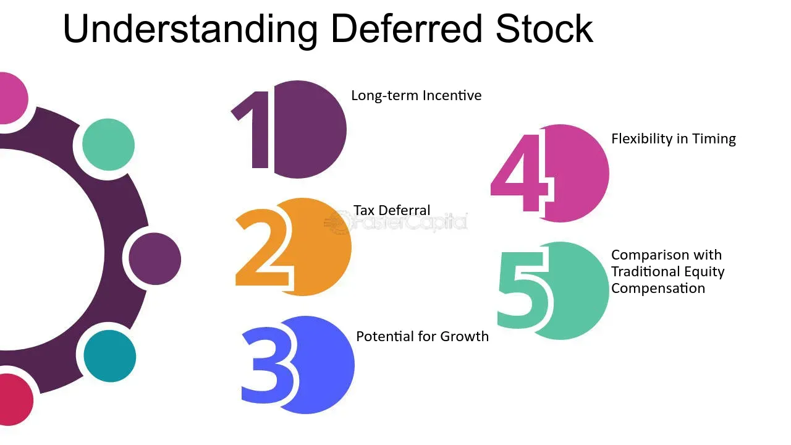

## Table of Contents

## What are deferred shares?

Deferred shares are a type of stock that usually pays dividends to shareholders after other types of shares have been paid. This means that if a company makes money and decides to share it with its shareholders, people who own deferred shares get their dividends last. These shares are often given to the founders or key employees of a company as a way to reward them for their long-term commitment.

Sometimes, deferred shares can also have special rights attached to them. For example, they might give the shareholder the right to vote on certain company decisions. However, these shares are considered riskier than other types of shares because they are the last to receive dividends. If the company doesn't make enough money, the owners of deferred shares might not get any dividends at all.

## How do deferred shares differ from common shares?

Deferred shares and common shares are both types of stock that companies issue, but they have some key differences. Common shares are the most basic type of stock that a company can issue. When a company makes a profit and decides to pay dividends, common shareholders usually get their dividends first. Common shareholders also usually have voting rights, which means they can vote on important company decisions, like who should be on the board of directors.

On the other hand, deferred shares are a bit different. They are called "deferred" because they get their dividends after the common shareholders have been paid. This means that if the company doesn't make enough profit to pay everyone, the people with deferred shares might not get any dividends at all. Deferred shares are often given to founders or key employees as a way to reward them for sticking with the company for a long time. Sometimes, these shares can also come with special rights, like the ability to vote on certain decisions, but they are generally considered riskier than common shares because of the uncertainty around dividend payments.

## What is the purpose of issuing deferred shares?

Companies issue deferred shares to reward key people, like founders or important employees, for their long-term commitment. These shares are a way to say "thank you" for sticking with the company and helping it grow. By giving these shares, the company hopes to keep these important people motivated and loyal, as they will want to see the company do well so they can eventually get their dividends.

Deferred shares are also a tool for companies to manage their finances better. Since the dividends on these shares are paid out after other types of shares, the company can use its profits to pay other shareholders first. This can help the company keep more cash on hand for important things like growing the business or paying off debts. So, deferred shares help the company balance rewarding key people with maintaining financial stability.

## Who typically receives deferred shares?

Deferred shares are usually given to people who are very important to a company, like the founders or key employees. These people have helped the company a lot and the company wants to thank them for their hard work and loyalty. By giving them deferred shares, the company is saying "we appreciate you and want you to stay with us for a long time."

The idea behind giving deferred shares to these key people is to keep them motivated. They know that if the company does well, they will get dividends from their shares, even if it's after other shareholders. This can make them work harder and stay loyal to the company because they want to see it succeed.

## How are deferred shares valued?

Deferred shares are valued based on a few things, like how well the company is doing and what rights come with the shares. Since these shares get dividends after other types of shares, their value can be less certain. If the company is making a lot of money, the deferred shares might be worth more because there's a better chance the shareholders will get dividends. But if the company isn't doing so well, the value of deferred shares might be lower because it's less likely they'll get paid.

Another thing that can affect the value of deferred shares is what special rights they have. Sometimes, deferred shares come with the right to vote on certain company decisions. If these rights are important, the shares might be worth more to someone who wants to have a say in how the company is run. But even with these rights, deferred shares are often seen as riskier than other types of shares, so their value can be lower compared to common shares.

## What are the voting rights associated with deferred shares?

Deferred shares can come with voting rights, but it depends on what the company decides when they issue the shares. Sometimes, people who own deferred shares can vote on important things, like who should be on the company's board of directors or big changes in how the company is run. These voting rights can make the deferred shares more valuable because the shareholders get to have a say in the company's future.

However, not all deferred shares have voting rights. Some companies might choose to give deferred shares without any voting power, which makes them less valuable compared to shares that do let you vote. The company decides what rights to give with the shares, so it's important for anyone thinking about buying or getting deferred shares to check what rights come with them.

## What are the dividend rights of deferred shares?

Deferred shares get their dividends after other types of shares have been paid. This means that if a company makes money and decides to give it to shareholders, people with deferred shares wait until everyone else gets their share first. If the company doesn't make enough money to pay everyone, the people with deferred shares might not get any dividends at all. This makes deferred shares riskier because there's no guarantee they'll get paid.

The idea behind this is to reward important people like founders or key employees for sticking with the company for a long time. By giving them deferred shares, the company hopes to keep these people motivated and loyal. They'll want to help the company do well so they can eventually get their dividends. This way, the company can balance rewarding key people while also keeping enough money for other important things like growing the business or paying off debts.

## How do deferred shares impact company control?

Deferred shares can affect who has control over a company, depending on what rights they come with. If deferred shares have voting rights, the people who own them can vote on important decisions like who should be on the company's board of directors or big changes in how the company is run. This means they have a say in the company's future, which can change who has the most control.

However, not all deferred shares come with voting rights. Some companies might choose to give deferred shares without any voting power, which means the people who own them can't vote on company decisions. In this case, deferred shares don't change who controls the company. It's important for anyone thinking about buying or getting deferred shares to check what rights come with them because this can affect how much control they have over the company.

## What are the tax implications of deferred shares?

The tax implications of deferred shares can be a bit tricky. When you get dividends from deferred shares, you usually have to pay taxes on them. The amount of tax you pay depends on where you live and how much money you make. If the company gives you deferred shares as part of your job, you might also have to pay taxes on the value of those shares when you get them. This is because the government sees it as part of your income.

If you sell your deferred shares later on, you might have to pay capital gains tax. This is a tax on the profit you make from selling something for more than you paid for it. The tax rate for capital gains can be different from the tax rate for your regular income, so it's important to know the rules in your country. Talking to a tax expert can help you understand exactly what you need to pay and when.

## How do deferred shares affect a company's financial statements?

Deferred shares can show up in a company's financial statements in a few ways. On the balance sheet, they are listed under shareholders' equity. This part of the balance sheet shows how much money the company has from its owners. When a company issues deferred shares, it increases the total equity because it's getting more money or value from its shareholders. This can make the company look more financially stable because it has more resources from its owners.

When it comes to the income statement, deferred shares affect the company's expenses and profits. If the company pays dividends on deferred shares, this payment is listed as an expense. This reduces the company's net income because paying dividends means the company is giving money away to its shareholders. However, because deferred shares get their dividends last, the company might not have to pay them out if it doesn't make enough money. This can help the company keep more of its profits for other uses like growing the business or paying off debts.

## What are the legal considerations when issuing deferred shares?

When a company decides to issue deferred shares, it has to follow the rules of the country it's in. These rules can be different depending on where the company is located. The company needs to write down exactly what rights come with the deferred shares, like if they can vote or when they get dividends. This information has to be clear so everyone knows what they're getting. The company also has to make sure it's treating all shareholders fairly, even if some have deferred shares and others don't.

If the company is public and its shares are traded on a stock market, there might be even more rules to follow. The company has to tell the stock market about the new shares and make sure it's following all the rules about how to issue them. This can include getting approval from the board of directors and sometimes even from the shareholders. The company also has to be careful not to break any laws about how it talks about the new shares to the public.

## How do deferred shares fit into long-term corporate strategy?

Deferred shares are a smart way for companies to keep important people, like founders or key employees, happy and motivated over a long time. By giving these shares, the company is saying "thank you" for their hard work and loyalty. These shares don't pay dividends right away, but only after other shareholders get paid. This makes the people with deferred shares want to help the company do well so they can get their dividends eventually. It's like a reward for sticking with the company and helping it grow.

Using deferred shares can also help a company manage its money better. Since the dividends on these shares are paid last, the company can use its profits to pay other shareholders first. This means the company can keep more cash for important things like growing the business or paying off debts. By balancing rewarding key people with keeping financial stability, deferred shares can be a big part of a company's long-term plan to stay strong and successful.

## References & Further Reading

[1]: Bergstra, J., Bardenet, R., Bengio, Y., & Kégl, B. (2011). ["Algorithms for Hyper-Parameter Optimization."](https://dl.acm.org/doi/10.5555/2986459.2986743) Advances in Neural Information Processing Systems 24.

[2]: ["Advances in Financial Machine Learning"](https://www.amazon.com/Advances-Financial-Machine-Learning-Marcos/dp/1119482089) by Marcos Lopez de Prado

[3]: ["Evidence-Based Technical Analysis: Applying the Scientific Method and Statistical Inference to Trading Signals"](https://www.amazon.com/Evidence-Based-Technical-Analysis-Scientific-Statistical/dp/0470008741) by David Aronson

[4]: ["Machine Learning for Algorithmic Trading"](https://github.com/stefan-jansen/machine-learning-for-trading) by Stefan Jansen

[5]: ["Quantitative Trading: How to Build Your Own Algorithmic Trading Business"](https://github.com/LucindaYa/quant-resources/blob/master/Quantitative%20Trading%20How%20to%20Build%20Your%20Own%20Algorithmic%20Trading%20Business.pdf) by Ernest P. Chan