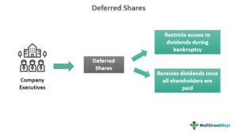

In the modern investment landscape, terms like equity investment, deferred share, share mechanics, and algorithmic trading are often thrown around. These concepts are not only buzzwords but are foundational elements that can significantly impact investment strategies and outcomes. Understanding these terms is crucial for both seasoned investors and newcomers looking to navigate the complexities of the financial markets effectively.

Equity investment forms the bedrock of many investment portfolios, offering opportunities for capital appreciation and dividend income. It involves the buying and holding of company shares, thereby entitling the investor to a claim on part of the company's earnings and assets. Deferred shares, on the other hand, add a layer of complexity, as they come with specific conditions such as delayed dividends, often used to incentivize company executives and founders. Understanding the mechanics behind these shares helps in assessing a company's capital structure and the potential implications for investors.

Algorithmic trading represents a technological evolution in financial markets, allowing trades to be executed with speed and precision based on pre-defined criteria. This method not only enhances trading efficiency but also influences market dynamics significantly. As algorithms manage large volumes of data, they are transforming traditional strategies in equity investment by providing a framework for high-frequency trading and enhanced risk management.

This article aims to demystify these concepts and explore how they interconnect. By the end, you'll have a clearer picture of how deferred shares operate, the basics of equity investment, and the value of algorithmic trading. Equipped with this knowledge, investors can make informed decisions and take advantage of the opportunities presented by the evolving financial landscape.

## Table of Contents

## Understanding Equity Investment

Equity investment is a critical component of the financial markets, involving the purchase and holding of shares in a company. When individuals or institutions invest in equities, they acquire ownership stakes, which provide claims on the company's earnings and assets. This ownership aspect is fundamental to understanding why equity investment serves as the backbone of many investment portfolios.

One of the primary attractions of equity investment is the potential for capital appreciation and dividend income. Capital appreciation occurs when the value of the shares increases over time, allowing investors to sell them at a profit. Dividends, on the other hand, are periodic payments made by the company to its shareholders out of its profits. Both of these features contribute to the overall return on equity investments.

However, equity investors must be aware of the inherent risks involved. Market [volatility](/wiki/volatility-trading-strategies) is a significant concern, as share prices can fluctuate widely due to economic, political, and market-specific factors. Additionally, company-specific issues, such as management decisions, competitive positions, and financial health, can impact the performance of the stock.

To mitigate these risks, investors often diversify their equity holdings. Diversification can be achieved through various financial instruments such as mutual funds and exchange-traded funds (ETFs), which pool resources from multiple investors to purchase a broad array of stocks. This approach helps reduce the impact of poor performance by any single equity, as the overall risk is spread across many different investments.

Moreover, long-term equity investments have historically outperformed other asset classes, making them particularly appealing for those aiming for wealth accumulation. Over extended periods, the growth potential of equities tends to outweigh the risks, emphasizing the importance of a long-term investment horizon. Historical data supports the view that, despite short-term volatility, equities typically offer superior returns compared to fixed-income or cash-equivalent investments.

In summary, equity investment provides a pathway for individuals and institutions to participate in the growth and success of companies. By understanding the dynamics of equity investment, including the potential for returns and associated risks, investors can make more informed decisions and strategically build their portfolios for long-term wealth creation.

## The Mechanics of Deferred Shares

Deferred shares represent a distinct class of stock characterized by specific conditions, often including delayed dividend rights. These shares are frequently issued to key individuals within a company, such as founders and executives, serving as a long-term incentive mechanism. This incentivization seeks to align these individuals' interests with the company's overall performance, motivating them towards long-term value creation.

Deferred shares can exhibit different trajectories depending on predetermined conditions, which may include conversion into common shares or the retention of special rights. The trigger for such conversions or the maintenance of these special privileges can be contingent upon the firm’s performance metrics or be linked to specific time frames. For instance, if a firm achieves certain revenue milestones or operational benchmarks, deferred shares might convert to common shares, allowing holders to benefit from regular shareholder rights, including voting and dividends.

Unlike restricted shares, deferred shares might not automatically convert upon vesting. This distinction introduces a layer of complexity in equity compensation schemes. Restricted shares typically convert to common shares once vesting conditions tied to time or performance are met, providing more straightforward value to the holder. In contrast, the conditions attached to deferred shares require careful monitoring, as the eventual benefit is not guaranteed upon vesting.

For employees, understanding the specific terms and conditions associated with deferred shares is crucial. Recognizing how these shares fit into their overall compensation strategy can impact personal financial planning decisions. From an investor’s perspective, analyzing a company's capital structure, which includes deferred shares, is essential for assessing the firm’s financial health and the potential implications for shareholder value. The issuance of deferred shares can signal management's confidence in long-term growth, but it also poses dilution risks that investors must weigh.

Overall, the mechanics of deferred shares demand attentive scrutiny from both employees receiving them and investors analyzing corporate financials, making them a pivotal element in the broader spectrum of equity investment and corporate strategy.

## Share Mechanics and Their Implications

The mechanics of share structuring play a crucial role in influencing both investors and companies, impacting various aspects such as corporate governance and financial returns. One of the primary considerations in share mechanics is the allocation of voting rights. Voting rights determine the level of influence an investor has in corporate decision-making. For instance, holders of common shares typically have voting rights in shareholder meetings, which can affect decisions related to mergers, acquisitions, and the election of board members. Conversely, preferred shares may offer limited or no voting rights, prioritizing dividends instead.

Another vital [factor](/wiki/factor-investing) is the preference in asset liquidation. In the event of a company's liquidation, the hierarchy of claims dictates the order in which investors are paid. Preferred shareholders usually have a higher claim on assets than common shareholders, reducing their risk in turbulent times. This preferential treatment can make preferred shares particularly appealing to risk-averse investors looking for more secure returns.

Dividend entitlements are also a significant aspect of share mechanics. Shareholders may receive dividends, which are distributions of a company's profits. While common shareholders may receive fluctuating dividends based on company performance, preferred shareholders often enjoy fixed dividend rates, establishing a predictable income stream. This distinction is crucial for income-focused investors who prioritize stable returns over potential capital appreciation.

The structure of shares can articulate corporate control dynamics and investor interest, especially during periods of financial stability and distress. Complex share structures, such as dual-class shares, allow a company to allocate more voting power to certain shareholders, often founders or executives. This configuration can secure prolonged control over the company, even if the economic interest is diluted. While it helps maintain strategic direction, it may deter investors seeking proportional influence based on their capital investments.

Moreover, complex share mechanics can strategically align management's interests with those of investors or safeguard particular stakeholder groups. For example, non-voting shares may prevent dilution of control while raising capital. Protective provisions, such as cumulative dividends or conversion rights, can ensure that shareholder interests are maintained over time, catering to varying investor needs.

Therefore, investors should conduct thorough due diligence on a company's share structure to understand the implications fully. Assessing considerations like voting rights, asset liquidation preference, and dividend policies is essential in determining potential returns and risks associated with an investment. Understanding these mechanics helps investors make informed decisions and aligns their investment strategy with their financial goals and risk tolerance.

## Algorithmic Trading: Transforming Market Dynamics

Algorithmic trading utilizes complex computer algorithms to automatically execute trades at high speeds and frequencies, often faster than human traders can achieve. By employing pre-defined criteria, these algorithms capitalize on market movements and price discrepancies, making trading more efficient and systematic than traditional methods.

One of the core advantages of [algorithmic trading](/wiki/algorithmic-trading) is its ability to process and analyze large volumes of data at rapid speeds—tasks that would be infeasible for human traders to perform with the same precision or timeliness. This capability allows for the quick identification and exploitation of trading opportunities, amplifying the potential for profit.

Several common strategies have emerged within algorithmic trading to enhance market participation. Trend following algorithms, for example, make trades based on the [momentum](/wiki/momentum) of stock price movements. Arbitrage strategies seek to exploit price differentials of the same asset in different markets, while mean reversion algorithms operate on the assumption that prices will revert to their historical average over time.

Despite these advantages, algorithmic trading is not without its challenges. Market volatility can lead to losses if algorithms are too sensitive to short-term price movements without considering broader market contexts. Technical glitches pose another significant risk, as failures can lead to dramatic and unintended trades, occasionally causing market disturbances like flash crashes.

Furthermore, the rise of algorithmic trading has shifted the dynamics of market participation. The efficiency and [volume](/wiki/volume-trading-strategy) of trading have increased, impacting [liquidity](/wiki/liquidity-risk-premium) and altering traditional trading practices. Human-driven trading decisions are increasingly giving way to algorithm-driven strategies, transforming how trades are executed and evaluated.

As algorithms continue to evolve, their role in the financial markets will likely become more pronounced, potentially reshaping the landscape of equity investing and trading. However, as market dynamics evolve, traders and investors must remain aware of the potential pitfalls of over-reliance on automated systems. Continuous technological advancements and rigorous risk management practices are essential to harness the full potential of algorithmic trading while mitigating its inherent risks.

## The Intersection of Equity Investment and Algorithmic Trading

Algorithmic trading platforms are playing an increasingly critical role in optimizing equity investment strategies by leveraging the capabilities of technology to automate and refine trading processes. These sophisticated algorithms facilitate precise timing for entry and [exit](/wiki/exit-strategy) points within equity markets, enhancing the potential for profitable trades. High-frequency trading, an aspect of algorithmic strategies, allows investors to achieve diversification on a scale not possible with manual trading methods.

One of the key advantages of algorithmic trading is the ability to conduct comprehensive [backtesting](/wiki/backtesting). This involves simulating a trading strategy on historical market data to evaluate its potential effectiveness. Advanced algorithmic trading software provides tools that enable investors to identify the most profitable algorithms, adjust parameters, and refine strategies before deploying them in live markets. This process helps in uncovering potential risks and optimizing strategies for better risk management.

However, while algorithmic trading offers significant opportunities, it also introduces technical and strategic risks. Algorithms operate with minimal human intervention, exposing them to potential errors stemming from incorrect coding or unforeseen market events. These errors can lead to substantial financial losses. Therefore, investors dealing with algorithmic trading must be diligent in monitoring and adjusting their strategies to account for these risks. It's also crucial to maintain a robust technical infrastructure to prevent and deal with potential failures swiftly.

The fusion of algorithmic trading with equity investing is revolutionizing market dynamics, creating both opportunities and complexities for market participants. This integration not only enhances the efficiency of executing trades and managing portfolios but also contributes to increased market liquidity. As algorithmic systems continue to evolve, they are likely to introduce further complexities, necessitating that investors remain proactive and knowledgeable about both technological advancements and market conditions.

## Conclusion and Future Trends

Deferred shares, share mechanics, and algorithmic trading are increasingly important in modern investment strategies. A comprehensive understanding of these elements is essential for investors who wish to make informed decisions and capitalize on opportunities within the ever-evolving financial markets. Deferred shares offer unique potential for aligning interests between company founders, executives, and shareholders through incentive structures, while share mechanics shape corporate governance and investor influence.

The future of equity investment is likely to witness the emergence of more sophisticated algorithmic solutions that promise enhanced efficiency and innovation. These algorithms are expected to further integrate equity investment strategies by optimizing entry and exit points, improving risk management, and diversifying portfolios through advanced trading methodologies. As shown by the progression in trading technology, successfully leveraging algorithmic trading could be transformative for traditional investment practices.

Markets and technology continue to evolve rapidly, making it crucial for investors to remain informed and adaptable. The dynamic nature of financial instruments and trading technologies presents both challenges and opportunities. Therefore, investors should make use of available educational resources and regularly consult with financial experts to keep their portfolios optimized in light of new trends and developments.

Ultimately, maintaining a proactive approach to education and consultation will enable investors to successfully navigate the complexities of the financial landscape. By doing so, they can ensure resilience and adaptability in their investment strategies in the face of inevitable market fluctuations and technological advancements.

## References & Further Reading

[1]: Bergstra, J., Bardenet, R., Bengio, Y., & Kégl, B. (2011). ["Algorithms for Hyper-Parameter Optimization."](https://dl.acm.org/doi/10.5555/2986459.2986743) Advances in Neural Information Processing Systems 24.

[2]: ["Advances in Financial Machine Learning"](https://www.amazon.com/Advances-Financial-Machine-Learning-Marcos/dp/1119482089) by Marcos Lopez de Prado

[3]: ["Evidence-Based Technical Analysis: Applying the Scientific Method and Statistical Inference to Trading Signals"](https://www.amazon.com/Evidence-Based-Technical-Analysis-Scientific-Statistical/dp/0470008741) by David Aronson

[4]: ["Machine Learning for Algorithmic Trading"](https://github.com/stefan-jansen/machine-learning-for-trading) by Stefan Jansen

[5]: ["Quantitative Trading: How to Build Your Own Algorithmic Trading Business"](https://github.com/LucindaYa/quant-resources/blob/master/Quantitative%20Trading%20How%20to%20Build%20Your%20Own%20Algorithmic%20Trading%20Business.pdf) by Ernest P. Chan