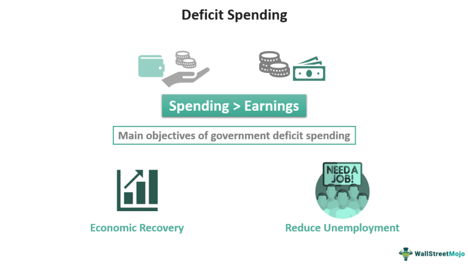

In today's rapidly evolving economic landscape, the intersection of deficit spending, fiscal policy, and algorithmic trading presents a multifaceted challenge and opportunity for governments and financial systems. Deficit spending and fiscal policy are critical tools used by governments to manage economic growth and stability, playing pivotal roles during economic fluctuations. Deficit spending occurs when a government's expenditures surpass its revenues, leading to borrowing to finance the shortfall. This approach is often employed during economic downturns to stimulate growth by injecting funds into the economy through public expenditures. Fiscal policy further complements this strategy by utilizing government spending and taxation to influence economic conditions, aiming to manage inflation and promote sustainable growth.

The rise of algorithmic trading, a significant technological advancement within financial markets, has introduced a new dimension to market dynamics. Algorithmic trading uses sophisticated computer algorithms to execute trades at lightning speeds, reacting to market changes and economic indicators in real time. This development has necessitated a recalibration of traditional economic strategies, as algorithmic trading significantly influences market liquidity, volatility, and price discovery processes.

Understanding how these elements interact is crucial for maintaining economic stability and orderly market behaviors. The integration of technology in trading systems means that changes in fiscal policy and instances of deficit spending can lead to rapid market reactions, magnifying economic trends both positively and negatively. As such, policymakers and economists must be attuned to the potential impacts of these interactions, as they hold profound implications for the future of economic planning and financial market operations. This article will explore the interplay between these elements, highlighting their influence on economic stability, market behaviors, and the broader financial landscape.

## Table of Contents

## Understanding Deficit Spending

Deficit spending occurs when a government's expenditures surpass its revenues over a given time frame, necessitating the government to borrow funds to bridge the gap. Traditionally, this spending strategy is employed intentionally during periods of economic downturns. By injecting capital into various sectors through public expenditures, governments aim to stimulate economic growth and recovery. This infusion of capital can boost demand, create jobs, and potentially pull an economy out of recession.

However, deficit spending must be approached with caution. While it can drive short-term recovery and growth, prolonged or excessive deficit spending can lead to an escalation in national debt. As national debt rises, the country may face increased interest obligations, leading to a larger portion of the budget being allocated for debt servicing. This scenario can restrict the government's ability to fund other vital programs, ultimately constraining economic development. Additionally, if deficit spending is not carefully managed, it can trigger inflationary pressures. As public spending increases the money supply without a corresponding increase in goods and services, prices may rise, leading to inflation.

Throughout history, there have been significant instances of deficit spending, each offering valuable insights into its economic effects. A notable example is the United States during the Great Depression. In the 1930s, the U.S. government, under President Franklin D. Roosevelt, implemented the New Deal—a series of programs, public work projects, and regulations. These initiatives dramatically increased public spending, aiming to reduce unemployment and revive the economy. While the New Deal did not immediately end the Great Depression, it contributed to economic stabilization and recovery, reinforcing the notion that strategic deficit spending can be a powerful tool in combating economic crises.

Another historical instance is Japan's use of deficit spending in the 1990s. Following the bursting of its asset price bubble, Japan faced a prolonged recession. In response, the government undertook numerous fiscal stimulus packages, heavily increasing public works spending. However, despite these efforts, the country struggled with stagnation and an ever-growing national debt, highlighting the potential pitfalls of excessive reliance on deficit spending without achieving the intended economic revitalization.

Therefore, while deficit spending can serve as a vital economic tool, its implementation should be balanced and strategic. Policymakers must ensure a prudent approach, carefully assessing the timing, scale, and allocation of deficit spending to mitigate risks such as rising debt levels and inflation, while maximizing the potential benefits for economic growth and stability.

## Fiscal Policy as a Stabilizing Force

Fiscal policy is a crucial tool for governments to manage economic conditions by using the levers of government spending and taxation. By adjusting these factors, fiscal authorities aim to influence macroeconomic outcomes such as growth, employment, and inflation.

### Expansionary Fiscal Policy

Expansionary fiscal policy involves increasing government expenditures and reducing taxes to stimulate economic activity. This approach is particularly effective during economic downturns or recessions when private sector demand is insufficient to sustain full employment. By injecting additional capital into the economy through enhanced public sector spending and tax cuts, the government seeks to boost consumer spending and investment. This can lead to higher aggregate demand, prompting businesses to hire more workers, thereby reducing unemployment.

Let $G$ represent government spending and $T$ denote taxes. The formula for net government spending in the context of expansionary fiscal policy can be expressed as:

$$
\Delta Y = \Delta G - \Delta T
$$

where $\Delta Y$ is the change in total output or GDP. An increase in government spending ($\Delta G$) or a decrease in taxes ($\Delta T$) typically leads to an increase in overall economic output.

### Contractionary Fiscal Policy

Conversely, contractionary fiscal policy is deployed to cool down an overheated economy and control inflation. This is achieved by reducing government spending and increasing taxes, thereby dampening aggregate demand. When an economy grows too quickly, it can lead to excessive inflation and asset bubbles. By adopting a contractionary stance, fiscal authorities can help stabilize prices and prevent economic instability.

The impact of contractionary policy can be represented similarly:

$$
\Delta Y = \Delta G - \Delta T
$$

In this case, a decrease in government spending ($\Delta G$) or an increase in taxes ($\Delta T$) helps to reduce aggregate demand and, consequently, economic output.

### Balancing Fiscal Policies

Achieving a balance between expansionary and contractionary policies is vital for sustaining economic stability and ensuring long-term growth. While expansionary policies can invigorate a sluggish economy, excessive application without regard to fiscal outcomes can exacerbate deficits and lead to unsustainable debt levels. On the other hand, overly contractionary measures can stifle growth and lead to higher unemployment.

**Key Considerations:**
- Policymakers must assess economic indicators such as GDP growth rates, inflation rates, and unemployment levels to determine the appropriate fiscal stance.
- Long-term sustainability requires a careful evaluation of fiscal multipliers, which measure the effectiveness of government spending and tax changes in boosting or dampening economic activity.
- Strategic fiscal adjustments, informed by economic data, can support stability while minimizing adverse effects on the fiscal deficit.

In summary, fiscal policy plays a pivotal role in moderating economic cycles. Through calibrated expansionary or contractionary measures, governments are tasked with fostering an environment conducive to sustainable economic growth, managing public resources effectively while responding to domestic and international market conditions.

## Algorithmic Trading: The New Market Driver

Algorithmic trading utilizes sophisticated computer algorithms to execute trades at remarkably high speeds, thus allowing traders to respond to market changes in real-time. This method of trading, often referred to as high-frequency trading ([HFT](/wiki/high-frequency-trading-strategies)), plays a pivotal role in shaping market dynamics, influencing aspects such as market [liquidity](/wiki/liquidity-risk-premium), [volatility](/wiki/volatility-trading-strategies), and price discovery.

Market liquidity is significantly enhanced by [algorithmic trading](/wiki/algorithmic-trading), as these systems can execute a multitude of transactions within milliseconds, providing tighter spreads and reducing transaction costs for traders. However, the same algorithms can amplify market volatility during stressed conditions, because automated systems might simultaneously reach similar conclusions based on their programming, causing a surge of buy or sell orders that can lead to rapid price swings.

Algorithmic trading is deeply interwoven with economic data, including fiscal indicators such as interest rates, inflation, and government borrowing. Algorithms can incorporate economic announcements and fiscal policy changes to adjust trading strategies automatically. For instance, if a government announces increased deficit spending, algorithms that [factor](/wiki/factor-investing) in potential inflationary pressures might react by rapidly adjusting positions in [interest rate](/wiki/interest-rate-trading-strategies)-sensitive assets.

The complexity of the relationship between algorithmic trading and fiscal deficits arises from how algorithms analyze and predict market behavior in response to shifting economic policies. Traders employing algorithmic systems frequently adjust their strategies based on expectations related to fiscal measures. For example, if a fiscal expansion is anticipated to spur economic growth, algorithm-driven trades might favor equities or other growth-oriented assets.

Additionally, the immediate nature of algorithmic trading means that markets can experience swift and significant reactions to fiscal announcements. This rapid response capability can introduce challenges for policymakers, who must understand how their fiscal decisions might impact markets through algorithm-driven trading. Unintended feedback loops could arise where fiscal policies intended to stabilize the economy may inadvertently contribute to market volatility.

Understanding the intricate relations between algorithmic trading and fiscal policies, especially in the context of government deficits, is essential for developing sound economic strategies. Effective policy-making requires recognition of how these trading systems might react to fiscal measures and adapting strategies accordingly to uphold market stability and investor confidence.

## Interplay Between Deficit Spending, Fiscal Policy, and Algorithmic Trading

Deficit spending and fiscal policy are two powerful levers that significantly influence economic indicators, which are crucial for algorithmic trading models. When a government engages in deficit spending, it often leads to changes in interest rates, inflation, and economic growth projections—all of which are essential data points for algorithmic trading systems.

Algorithmic trading, characterized by its ability to process large volumes of data and execute trades at high speeds, relies heavily on predictions about these economic indicators. For example, an increase in government spending may lead traders to anticipate inflationary pressure, potentially affecting interest rates. In reaction, algorithms might adjust their trading strategies, favoring securities that perform well in inflationary conditions such as commodities or inflation-protected bonds.

The real-time nature of algorithmic trading means that fiscal policy decisions can trigger instantaneous market responses. For instance, should a government announce a significant fiscal stimulus, algorithms could quickly detect changes in economic forecasts and adjust their buy or sell orders accordingly. This rapid reaction capability can amplify market movements, contributing to both increased liquidity and volatility.

However, the swift adjustments made by algorithms can also pose challenges to market stability and investor confidence. Sudden changes in fiscal policy might lead to extreme market fluctuations if algorithms execute trades simultaneously in response to new information. This could create negative feedback loops, where the collective reaction of algorithms causes exaggerated price movements, potentially destabilizing markets.

Policymakers, therefore, face the challenge of considering the indirect effects of fiscal decisions on algorithmic trading. Understanding these dynamics is crucial for mitigating potential destabilizing effects. Strategies could include staggered announcements of fiscal measures to allow markets to adjust more gradually or implementing regulatory mechanisms that limit excessive trading speed during volatile periods.

Overall, the interplay between deficit spending, fiscal policy, and algorithmic trading highlights the need for comprehensive policy strategies that account for the technological dimensions of modern markets. By aligning fiscal decisions with an awareness of how they influence algorithmic behaviors, policymakers can help maintain economic stability and foster a more predictable trading environment.

## Future Outlook and Strategic Considerations

As technology and economic policy continue to undergo rapid changes, the interplay between fiscal policy and algorithmic trading becomes more pronounced. This evolving dynamic requires a nuanced understanding to harness potential benefits while mitigating associated risks.

Policymakers are encouraged to adopt data-driven strategies to effectively respond to the swift feedback mechanisms created by algorithmic trading. The integration of advanced algorithms in trading platforms allows for real-time analysis and execution, meaning fiscal measures often provoke immediate market responses. By leveraging big data and [machine learning](/wiki/machine-learning), policymakers can anticipate these reactions more accurately, informing better decision-making processes.

Strategic fiscal management can significantly enhance economic resilience when aligned with technological advancements. For instance, incorporating predictive analytics can help in forecasting the economic impact of fiscal policies. This approach allows for preemptive adjustments to financial strategies, mitigating adverse effects and enhancing growth prospects. The synergy between fiscal policy and technology-driven insights can potentially stabilize economic fluctuations, leading to more robust economic frameworks.

Furthermore, the development and implementation of regulatory frameworks sensitive to both technological innovation and financial stability are paramount. As algorithmic trading continues to gain prominence, regulations must balance the encouragement of innovation with the safeguarding of market integrity. This could involve setting limits on high-frequency trading to prevent extreme volatility or establishing transparency requirements to ensure fair market practices.

By prioritizing these strategic considerations, policymakers can craft fiscal policies that not only accommodate but also capitalize on the rapid technological shifts in trading. This forward-looking approach is crucial for fostering sustainable economic environments in which innovation and stability coexist. Through meticulous planning and adaptive strategies, the complexities of fiscal policy and algorithmic trading can be navigated effectively, paving the way for resilient and prosperous economies in the future.

## Conclusion

The integration of deficit spending, fiscal policy, and algorithmic trading poses both challenges and opportunities for contemporary economies. As these elements converge, their interaction demands careful examination to devise effective economic strategies. Deficit spending and fiscal policy are traditional tools aimed at influencing economic stability and growth, but their impact is now compounded by the rise of algorithmic trading. This confluence necessitates a nuanced understanding to harness benefits while mitigating risks.

Algorithmic trading, characterized by high-speed and data-driven decision-making processes, can rapidly reflect shifts in fiscal policy and government spending. Its sensitivity to economic indicators means that changes in deficit levels or fiscal strategies can lead to sudden market fluctuations. This interconnectedness requires policymakers to adopt informed strategies that take into account the feedback mechanisms of modern trading technologies.

Understanding the risks inherent in this intersection is critical. Algorithmic trading can exacerbate volatility if not anticipated carefully, potentially destabilizing markets in response to fiscal policy changes or shifts in government borrowing. However, these intersections also offer opportunities for enhanced economic insight, as algorithms provide real-time data that can inform policy adjustments and fine-tune fiscal responses.

Looking ahead, informed policy-making and strategic foresight are pivotal in navigating this complex landscape. Policymakers must recognize the implications of digital and fiscal integration, adopting data-driven approaches to monitor and influence economic conditions effectively. By balancing innovation with financial stability, governments can create resilient economies capable of sustainable growth.

## References & Further Reading

[1]: ["The Impact of Algorithmic Trading on Market Liquidity"](https://www.sciencedirect.com/science/article/pii/S0927538X16300956) by Bank for International Settlements.

[2]: Keynes, J. M. (1936). ["The General Theory of Employment, Interest, and Money."](https://link.springer.com/book/10.1007/978-3-319-70344-2) Harcourt, Brace & World.

[3]: Mishkin, Frederic S. (2006). ["The Economics of Money, Banking, and Financial Markets"](https://www.pearsonhighered.com/assets/preface/0/1/3/4/0134855388.pdf). Pearson, 8th Edition.

[4]: ["Fiscal Policy, Inflation, and Long-Term Interest Rates"](https://www.pgpf.org/article/how-can-fiscal-policy-help-reduce-inflation/) by Eric M. Leeper, in National Bureau of Economic Research.

[5]: Treynor, Jack L. (2009). ["The Financial Crisis and What to Do About It"](https://blogs.cfainstitute.org/investor/2016/05/20/jack-l-treynor-and-the-birth-of-the-quants/). Financial Analysts Journal, CFA Institute.

[6]: "The Role of Algorithmic Trading on the Incidence of Flash Crashes." Journal of Financial Markets, Kyle, A. S., & Lee, S. S. (2017).