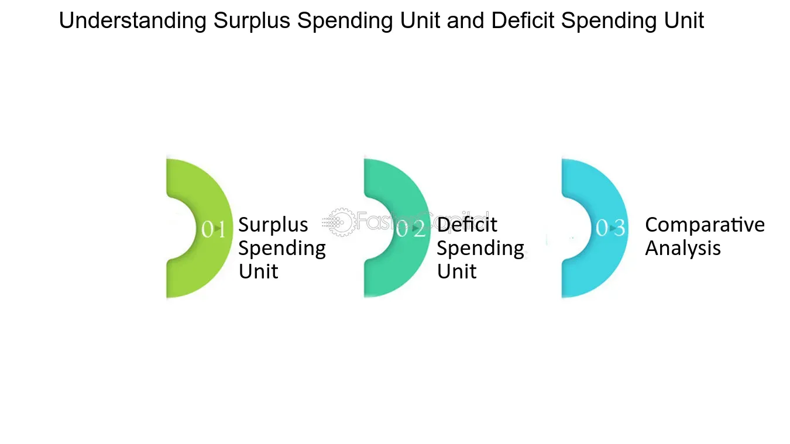

## Table of Contents

## What is a Deficit Spending Unit (DSU)?

A Deficit Spending Unit (DSU) is an entity, like a person, a family, a business, or a government, that spends more money than it earns. This means they have to borrow money to cover the difference between what they spend and what they earn. For example, if a family earns $3,000 a month but spends $3,500, they are a DSU because they need to borrow $500 to meet their expenses.

DSUs are important to understand because they affect the economy. When many people or businesses are DSUs, it can lead to more borrowing and higher debt levels in the economy. This can be good if it helps grow the economy, like when businesses borrow to invest in new projects. But it can also be bad if too much borrowing leads to financial problems, like when people can't pay back their loans. Governments often use deficit spending to help manage the economy, but they need to be careful not to borrow too much.

## How does a Deficit Spending Unit differ from a Surplus Spending Unit?

A Deficit Spending Unit (DSU) is someone or something, like a person, a business, or a government, that spends more money than it makes. This means they have to borrow money to pay for what they need or want. For example, if a person earns $2,000 a month but spends $2,500, they are a DSU because they need to borrow $500 to cover their expenses.

On the other hand, a Surplus Spending Unit (SSU) is someone or something that earns more money than it spends. This means they have extra money left over, which they can save or invest. For example, if a business earns $10,000 a month and only spends $8,000, it is an SSU because it has $2,000 left over. The main difference between a DSU and an SSU is whether they need to borrow money or have money to save or invest.

## Can you provide examples of Deficit Spending Units?

A family can be a Deficit Spending Unit if they spend more money than they earn. For example, if a family earns $4,000 a month from their jobs but spends $4,500 on things like rent, food, and bills, they are a DSU. They need to borrow $500 every month to pay for everything they need. This could be through credit cards, loans, or other types of borrowing.

A government can also be a Deficit Spending Unit. If a government collects $1 billion in taxes but spends $1.2 billion on things like schools, roads, and healthcare, it is a DSU. The government needs to borrow $200 million to cover the difference. This borrowing can be in the form of government bonds or other types of loans. Governments often use deficit spending to help the economy grow or to provide important services, but they need to be careful not to borrow too much.

## What are the main causes of deficit spending in these units?

One main cause of deficit spending in families and people is when they don't earn enough money to pay for all their needs and wants. This can happen because of things like losing a job, having a lot of bills, or wanting to buy things they can't afford right now. Families might need to borrow money to pay for important things like food, rent, or healthcare. Sometimes, they might also borrow money to buy things they want, like a new car or a vacation.

Governments can also have deficit spending when they spend more money than they get from taxes. This can happen because the government wants to help the economy grow by spending more on things like building roads, schools, and hospitals. Sometimes, governments need to spend more money because of emergencies, like a natural disaster or a war. Even though this spending can help people, the government needs to borrow money to do it, which can lead to a lot of debt if they're not careful.

## How does deficit spending impact the economy?

Deficit spending can help the economy grow. When families, businesses, or governments spend more money than they earn, they often need to borrow money. This borrowing can lead to more money being spent in the economy. For example, if a government borrows money to build a new road, the construction workers get paid and then spend that money on things like food and clothes. This can create more jobs and help the economy grow. Businesses might also borrow money to invest in new projects, which can lead to more jobs and more money being spent in the economy.

However, too much deficit spending can also cause problems. When many people or businesses borrow a lot of money, it can lead to high levels of debt. If people can't pay back their loans, it can cause financial problems for them and for the banks that lent them the money. This can lead to less spending in the economy, which can slow down economic growth. Governments need to be careful about how much they borrow because too much debt can lead to higher interest rates and make it harder for them to pay back what they owe. Balancing the benefits and risks of deficit spending is important for keeping the economy healthy.

## What are the potential benefits of deficit spending for a DSU?

Deficit spending can help a Deficit Spending Unit (DSU) in important ways. For a family, borrowing money can help them pay for things they need right now, like food or a place to live. If a family doesn't have enough money to pay for these things, borrowing can help them get by. For a business, borrowing money can help them invest in new projects or buy things they need to grow. This can lead to more jobs and more money for the business in the future. Governments can also use deficit spending to help the economy grow. By borrowing money to build roads, schools, or hospitals, the government can create jobs and help people in the community.

However, there are also risks with deficit spending. If a DSU borrows too much money, it can be hard to pay it back. This can lead to financial problems for the DSU and for the people who lent them the money. For example, if a family borrows a lot of money and can't pay it back, they might have to cut back on spending or even lose their home. For businesses, too much debt can make it hard to invest in new projects or pay their workers. Governments also need to be careful about how much they borrow because too much debt can lead to higher interest rates and make it harder to pay back what they owe. Balancing the benefits and risks of deficit spending is important for DSUs to stay healthy and grow.

## What are the risks associated with deficit spending for a DSU?

Deficit spending can be risky for a Deficit Spending Unit (DSU) because it means borrowing money to pay for things. If a family, business, or government borrows too much, it can be hard to pay back the money they owe. This can lead to financial problems. For example, if a family can't pay back their loans, they might have to cut back on spending or even lose their home. A business with too much debt might have trouble investing in new projects or paying their workers. Governments that borrow too much might face higher interest rates, making it harder to pay back what they owe.

Too much deficit spending can also affect the economy. When many DSUs borrow a lot of money, it can lead to high levels of debt in the economy. If people and businesses can't pay back their loans, it can cause problems for the banks that lent them the money. This can lead to less spending in the economy, which can slow down economic growth. Governments need to be careful about how much they borrow because too much debt can make it harder for them to help the economy and provide services for people. Balancing the benefits and risks of deficit spending is important for keeping DSUs and the economy healthy.

## How is deficit spending financed in a DSU?

Deficit spending in a Deficit Spending Unit (DSU) is financed by borrowing money. For a family, this might mean using credit cards or taking out loans from a bank. They might need to borrow money to pay for things like food, rent, or healthcare. If they don't have enough money to pay for these things, borrowing can help them get by. But they need to be careful because if they borrow too much, it can be hard to pay back the money they owe.

For a business, deficit spending can be financed by borrowing money to invest in new projects or buy things they need to grow. This can help the business make more money in the future, but it also means they have to pay back the loans. If they borrow too much and can't pay it back, it can cause financial problems for the business. Governments finance deficit spending by borrowing money through things like government bonds. They might need to borrow money to build roads, schools, or hospitals. This can help the economy grow, but if the government borrows too much, it can lead to higher interest rates and make it harder to pay back what they owe.

## What role do government policies play in managing deficit spending?

Government policies play a big role in managing deficit spending. When a government spends more money than it earns from taxes, it needs to borrow money to cover the difference. This borrowing can help the economy grow by creating jobs and helping people, but it can also lead to a lot of debt. Governments use policies to decide how much to spend and how much to borrow. They might set rules about how much debt they can have or make plans to pay back what they owe. By doing this, they can try to keep the economy healthy and avoid too much debt.

Sometimes, governments use policies to control how much people and businesses borrow too. They might change interest rates to make borrowing more or less expensive. If borrowing is cheap, more people and businesses might borrow money, which can help the economy grow. But if too many people borrow too much, it can lead to problems. So, governments need to find a balance. They also need to make sure that families and businesses can pay back their loans. By using the right policies, governments can help manage deficit spending and keep the economy strong.

## How can a Deficit Spending Unit transition to a balanced or surplus state?

A Deficit Spending Unit can transition to a balanced or surplus state by first figuring out why they are spending more than they earn. If it's because they don't earn enough money, they might need to find ways to make more money, like getting a better job or working more hours. If they are spending too much, they can look for ways to cut back on spending, like buying cheaper things or not buying things they don't need. They might also need to make a budget to keep track of their money and make sure they are spending less than they earn. By doing these things, a DSU can slowly start to spend less than they make and pay back any money they owe.

Another way a DSU can move to a balanced or surplus state is by managing their debt carefully. If they have borrowed a lot of money, they need to make a plan to pay it back. This might mean paying off the debt a little bit at a time or finding ways to get lower interest rates on their loans. They should also try to save some money each month, even if it's just a small amount. Saving money can help them have a cushion for emergencies and stop them from needing to borrow more. Over time, by earning more, spending less, and paying off debt, a DSU can move from spending more than they earn to spending less or even having money left over at the end of the month.

## What are some advanced strategies for managing long-term deficit spending?

One advanced strategy for managing long-term deficit spending is to create a detailed financial plan that looks far into the future. This plan should include projections of income and expenses, as well as strategies for increasing income and reducing costs. For example, a government might plan to invest in education and technology to boost the economy over time, which could lead to higher tax revenues. At the same time, they could look for ways to make their services more efficient, like using technology to reduce administrative costs. By having a long-term plan, a Deficit Spending Unit can make smart choices about where to spend money and how to reduce their deficit over time.

Another important strategy is to manage debt carefully. This means not just borrowing money to cover short-term needs, but also thinking about how to pay it back over the long term. A DSU might choose to refinance their debt to get lower interest rates, which can make it easier to pay back what they owe. They could also set up a sinking fund, where they put aside money each month to pay off their debt. This can help them avoid having to borrow more money in the future. By managing their debt wisely, a DSU can slowly reduce their deficit and move towards a more stable financial future.

## How do global economic conditions influence the effectiveness of deficit spending in DSUs?

Global economic conditions can make a big difference in how well deficit spending works for Deficit Spending Units. When the world economy is doing well, it's easier for a DSU to borrow money because interest rates are usually low. This means they can spend more without worrying too much about paying it back right away. For example, if a country's economy is growing, its government might borrow money to build new roads or schools, knowing that the economy will help them pay it back later. But if the global economy is not doing well, borrowing money can be harder and more expensive. High interest rates can make it tough for a DSU to pay back what they owe, which can lead to more financial problems.

Also, global economic conditions can affect how much money a DSU makes and spends. When the world economy is strong, businesses might sell more products to other countries, which can help them earn more money. This can make it easier for them to move from being a DSU to a balanced or surplus unit. But if the global economy is weak, businesses might sell less, and people might lose their jobs, making it harder for them to earn enough money to cover their expenses. Governments might also have to spend more on things like unemployment benefits, which can make their deficits worse. So, the global economy plays a big role in whether deficit spending helps or hurts a DSU.

## Can Fiscal Policy Act as a Stabilizing Force?

Fiscal policy is a crucial tool for governments to manage economic conditions by using the levers of government spending and taxation. By adjusting these factors, fiscal authorities aim to influence macroeconomic outcomes such as growth, employment, and inflation.

### Expansionary Fiscal Policy

Expansionary fiscal policy involves increasing government expenditures and reducing taxes to stimulate economic activity. This approach is particularly effective during economic downturns or recessions when private sector demand is insufficient to sustain full employment. By injecting additional capital into the economy through enhanced public sector spending and tax cuts, the government seeks to boost consumer spending and investment. This can lead to higher aggregate demand, prompting businesses to hire more workers, thereby reducing unemployment.

Let $G$ represent government spending and $T$ denote taxes. The formula for net government spending in the context of expansionary fiscal policy can be expressed as:

$$
\Delta Y = \Delta G - \Delta T
$$

where $\Delta Y$ is the change in total output or GDP. An increase in government spending ($\Delta G$) or a decrease in taxes ($\Delta T$) typically leads to an increase in overall economic output.

### Contractionary Fiscal Policy

Conversely, contractionary fiscal policy is deployed to cool down an overheated economy and control inflation. This is achieved by reducing government spending and increasing taxes, thereby dampening aggregate demand. When an economy grows too quickly, it can lead to excessive inflation and asset bubbles. By adopting a contractionary stance, fiscal authorities can help stabilize prices and prevent economic instability.

The impact of contractionary policy can be represented similarly:

$$
\Delta Y = \Delta G - \Delta T
$$

In this case, a decrease in government spending ($\Delta G$) or an increase in taxes ($\Delta T$) helps to reduce aggregate demand and, consequently, economic output.

### Balancing Fiscal Policies

Achieving a balance between expansionary and contractionary policies is vital for sustaining economic stability and ensuring long-term growth. While expansionary policies can invigorate a sluggish economy, excessive application without regard to fiscal outcomes can exacerbate deficits and lead to unsustainable debt levels. On the other hand, overly contractionary measures can stifle growth and lead to higher unemployment.

**Key Considerations:**
- Policymakers must assess economic indicators such as GDP growth rates, inflation rates, and unemployment levels to determine the appropriate fiscal stance.
- Long-term sustainability requires a careful evaluation of fiscal multipliers, which measure the effectiveness of government spending and tax changes in boosting or dampening economic activity.
- Strategic fiscal adjustments, informed by economic data, can support stability while minimizing adverse effects on the fiscal deficit.

In summary, fiscal policy plays a pivotal role in moderating economic cycles. Through calibrated expansionary or contractionary measures, governments are tasked with fostering an environment conducive to sustainable economic growth, managing public resources effectively while responding to domestic and international market conditions.

## References & Further Reading

[1]: ["The Impact of Algorithmic Trading on Market Liquidity"](https://www.sciencedirect.com/science/article/pii/S0927538X16300956) by Bank for International Settlements.

[2]: Keynes, J. M. (1936). ["The General Theory of Employment, Interest, and Money."](https://link.springer.com/book/10.1007/978-3-319-70344-2) Harcourt, Brace & World.

[3]: Mishkin, Frederic S. (2006). ["The Economics of Money, Banking, and Financial Markets"](https://www.pearsonhighered.com/assets/preface/0/1/3/4/0134855388.pdf). Pearson, 8th Edition.

[4]: ["Fiscal Policy, Inflation, and Long-Term Interest Rates"](https://www.pgpf.org/article/how-can-fiscal-policy-help-reduce-inflation/) by Eric M. Leeper, in National Bureau of Economic Research.

[5]: Treynor, Jack L. (2009). ["The Financial Crisis and What to Do About It"](https://blogs.cfainstitute.org/investor/2016/05/20/jack-l-treynor-and-the-birth-of-the-quants/). Financial Analysts Journal, CFA Institute.

[6]: "The Role of Algorithmic Trading on the Incidence of Flash Crashes." Journal of Financial Markets, Kyle, A. S., & Lee, S. S. (2017).