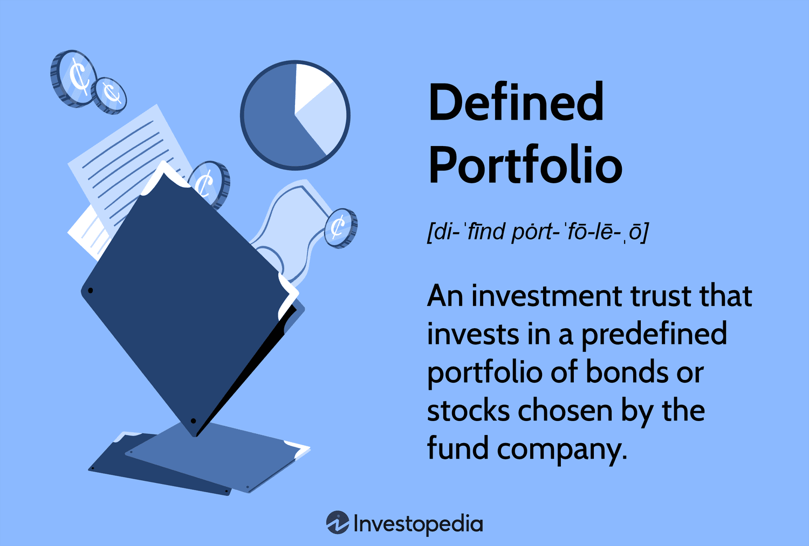

In today's dynamic financial landscape, investment portfolios are fundamental to effective wealth management. These portfolios, comprising a diverse array of financial assets, serve as the bedrock upon which individuals and institutions build and grow their financial wealth. Investment strategies continually evolve, and one of the most transformative developments in recent times is algorithmic trading. This integration of technology into portfolio management has revolutionized how assets are managed and optimized for better returns.

Algorithmic trading, often referred to as algo trading, involves the use of automated and pre-defined rules to execute trades with minimal human intervention. This technological advance has introduced a new level of precision and speed, transforming trading operations. By employing complex mathematical models, algorithms can identify market opportunities and execute trades in a fraction of the time it would take a human trader. As a result, the traditional boundaries of trading are being rapidly expanded and redefined.



This article aims to explore the intricate relationship between defined portfolios, finance, and algorithmic trading. It seeks to clarify the definitions, outline the benefits, and describe the strategies involved in integrating algorithmic trading into investment portfolios. The objective is to provide a comprehensive understanding of how algorithmic strategies can enhance portfolio performance and align it more closely with an investor’s financial objectives.

By grasping these concepts, investors can better navigate the complexities and uncertainties of modern financial markets. With a deeper understanding of how algorithmic trading can redefine portfolio management, investors are poised to make more informed decisions, optimizing their portfolios to achieve desired financial outcomes. Whether an investor is looking to manage risk, enhance returns, or ensure timely execution of trades, the insights drawn from this article are invaluable in the context of today’s ever-evolving financial environment.

## Table of Contents

## Understanding Investment Portfolios

An investment portfolio represents a collection of financial assets held by an individual or an institution. The primary aim of constructing a portfolio is to achieve a balance between maximizing returns and managing risk in line with the investor's goals, risk tolerance, and investment horizon.

Investment portfolios typically comprise a mix of asset classes to balance risk and reward. Stocks, bonds, commodities, and derivatives are common components. Stocks represent equity stakes in companies and offer potential for capital appreciation and dividends. Bonds are fixed-income securities that provide periodic interest payments and are generally considered less risky than stocks. Commodities include physical goods like gold and oil, providing a hedge against inflation or when stock markets are volatile. Derivatives, such as options and futures, derive their value from underlying assets and are often used for risk management or speculative purposes.

Effective portfolio management involves strategic diversification, asset rebalancing, and risk management. Diversification is the practice of spreading investments across various asset classes and sectors to reduce unsystematic risk. Asset rebalancing refers to adjusting the portfolio to maintain the desired asset allocation, which can change due to market movements. Risk management techniques are employed to monitor and control exposure, often by using tools like value-at-risk (VaR) or the Sharpe ratio.

Harry Markowitz's Modern Portfolio Theory (MPT) underscores the importance of diversification for optimizing returns vis-à-vis the risk taken. MPT suggests that an investor can construct a portfolio representing the optimal risk-return trade-off by selecting a mix of assets that have little correlation with each other. The theory employs quantitative methods to determine the proportion of assets in a portfolio that minimizes risk for a given level of expected return, often represented by the equation for the expected return of a portfolio:

$$
E(R_p) = \sum_{i=1}^{n} w_i \cdot E(R_i)
$$

where $E(R_p)$ is the expected return of the portfolio, $w_i$ is the weight of asset $i$ in the portfolio, and $E(R_i)$ is the expected return of asset $i$.

The covariance of asset returns can be measured to understand the risk dynamics, expressed in the formula for portfolio variance:

$$
\sigma^2_p = \sum_{i=1}^{n} \sum_{j=1}^{n} w_i \cdot w_j \cdot \sigma_{ij}
$$

where $\sigma^2_p$ is the variance of the portfolio's return, $\sigma_{ij}$ is the covariance between the returns of asset $i$ and asset $j$.

By applying these principles, investors can craft investment portfolios aligned with their financial goals, ensuring efficient performance across varying market conditions.

## Defining Algorithmic Trading

Algorithmic trading, commonly referred to as algo trading, employs automated systems guided by predefined rules to execute trades. These systems predominantly rely on sophisticated mathematical models and algorithms to identify profitable trading opportunities and capitalize on them with precision and speed. An essential advantage of algo trading is its ability to minimize human error, thereby enhancing the efficiency and effectiveness of trade execution.

The algorithms used in trading systems are designed to recognize market conditions and trigger trades based on specific parameters. These systems are structured around various strategies, which include trend-following, [arbitrage](/wiki/arbitrage), and statistical methods. Each of these strategies employs a unique approach to profit from the financial markets:

1. **Trend-following strategies**: These strategies identify and exploit the momentum of asset prices. They assume that trends, once established, have a higher likelihood of continuing than reversing. The strategy involves entering the market when a trend is established and exiting when it wanes.

2. **Arbitrage strategies**: These involve exploiting price differentials of the same asset in different markets or forms. For example, in a simple arbitrage situation, if an asset is trading at different prices in two separate markets, the algo will buy the asset in the cheaper market and sell it in the more expensive market to capture the price difference.

3. **Statistical methods**: These involve the use of statistical techniques to identify pricing inefficiencies and mean-reversion opportunities. These strategies often utilize historical data to identify patterns that have predictive power for future price movements.

Implementing these strategies requires the use of programming languages, with Python being particularly popular due to its ease of use and extensive libraries tailored for quantitative finance. A simple example of an [algorithmic trading](/wiki/algorithmic-trading) strategy in Python uses the Moving Average Crossover logic, which is a basic trend-following approach:

```python
import numpy as np
import pandas as pd

def moving_average_crossover(prices, short_window, long_window):
    signals = pd.DataFrame(index=prices.index)
    signals['price'] = prices
    signals['short_ma'] = prices.rolling(window=short_window, min_periods=1).mean()
    signals['long_ma'] = prices.rolling(window=long_window, min_periods=1).mean()
    signals['signal'] = 0.0
    signals['signal'][short_window:] = np.where(signals['short_ma'][short_window:] > signals['long_ma'][short_window:], 1.0, 0.0)
    signals['positions'] = signals['signal'].diff()
    return signals

# Usage with historical price data
prices = pd.Series([your_price_data_here])
signals = moving_average_crossover(prices, short_window=40, long_window=100)
```

This code creates buy and sell signals based on moving averages of asset prices over short and long-term windows. When the short-term average crosses above the long-term average, it signals a buy. Conversely, when it crosses below, it indicates a sell.

By automating these processes, algorithmic trading systems can enter and [exit](/wiki/exit-strategy) trades with remarkable speed and accuracy, far beyond the capacity of human traders. This efficiency, combined with the robustness of algorithmic strategies, makes algorithmic trading a crucial component in modern investment portfolio management.

## Benefits of Algorithmic Trading in Portfolio Management

Algorithmic trading has emerged as a transformative tool in portfolio management, offering a multitude of benefits that enhance the efficiency and effectiveness of trading activities. One of the primary advantages is the timely execution of trades. Algorithmic systems are designed to analyze market conditions in real-time and execute trades at optimal moments. This capability often results in securing better prices than those obtained through manual trading, as these systems can react to market fluctuations within milliseconds.

Moreover, algorithmic trading significantly reduces transaction costs. By automating trade executions and minimizing manual interventions, these systems streamline trading processes, which leads to lower operational expenses. Their ability to handle large volumes of trades efficiently is pivotal, especially in high-frequency trading environments, where speed and [volume](/wiki/volume-trading-strategy) are critical.

Another notable benefit is the ability to perform [backtesting](/wiki/backtesting), which involves testing trading strategies using historical data to assess their potential effectiveness in different market conditions. This process enhances the robustness of trading strategies by allowing for the optimization and refinement of algorithms before they are deployed in live markets. Backtesting provides insights into how strategies might perform, helping to identify potential pitfalls and adjust parameters accordingly.

Algorithmic trading systems also facilitate dynamic portfolio rebalancing. These systems can continuously monitor the portfolio's performance in relation to predefined goals and automatically adjust the asset allocation to maintain the desired risk-return profile. This dynamic approach ensures that portfolios remain aligned with the investor's objectives, even as market conditions evolve.

Overall, the benefits of algorithmic trading offer investors a competitive edge in portfolio management. By optimizing trade execution, reducing costs, and enabling strategic adjustments, algorithmic trading systems play a vital role in enhancing overall portfolio performance. Investors who effectively utilize these technologies can achieve greater precision and adaptability, crucial components in navigating today's complex financial landscapes.

## Challenges and Risks in Algo Trading

Algorithmic trading, while transformative, presents several challenges and risks that need careful consideration. One primary concern is the potential for technical failures that can disrupt trading activities and result in financial losses. These failures may arise from hardware malfunctions, software bugs, or network connectivity issues, which can delay or entirely prevent the execution of trades.

The heavy reliance on technology in algorithmic trading mandates constant updates and the implementation of robust cybersecurity measures. Trading algorithms require regular maintenance to ensure their continued effectiveness and security in the face of evolving cyber threats. Failure to address these technological needs can expose trading systems to breaches and unauthorized access, potentially leading to manipulation and financial harm.

Large algorithmic trades can substantially impact market dynamics, occasionally contributing to increased [volatility](/wiki/volatility-trading-strategies). Algorithms that execute a high volume of trades in a short timeframe can strain market [liquidity](/wiki/liquidity-risk-premium), causing price fluctuations that can amplify existing market trends or create new patterns of volatility. This effect is especially pronounced in less liquid markets, where the entry or exit of sizable trades can dramatically shift market prices.

Navigating the often complex regulatory frameworks governing algorithmic trading is another significant challenge. Regulations vary by jurisdiction and are designed to ensure market integrity, protect investors, and mitigate systemic risks. Compliance with these regulations necessitates a thorough understanding of legal requirements, as non-compliance can lead to significant financial penalties and reputational damage.

Lastly, balancing the technological advantages of algorithmic trading with its associated risks is critical for successful implementation. This balance requires a strategic approach to risk management, developing contingency plans for potential technical disruptions, and maintaining a comprehensive understanding of the regulatory environment. Investors and traders must continuously assess these factors to leverage the benefits of algorithmic trading effectively, while minimizing associated risks.

## Implementing Algo Trading in an Investment Portfolio

Implementing algorithmic trading in an investment portfolio requires a methodical approach to align it with an investor's objectives and risk appetite. A foundational step is to define clear trading goals that harmonize with investment objectives and risk tolerance. Without these predefined goals, the trading strategy may become misaligned with the overarching financial plan, potentially increasing exposure to unforeseen risks.

Access to comprehensive market data and reliable trading platforms is crucial for successful algorithmic trading. High-quality data feeds provide the granular insights necessary for making informed decisions, while robust trading platforms offer the technological infrastructure to execute trades with minimal latency and error rates. In addition, these platforms often provide essential features such as automated order routing and real-time analytics, which are imperative for day-to-day operations in algorithmic trading.

Backtesting constitutes an essential phase in the refinement of trading algorithms. This process involves testing the algorithm against historical data to assess its performance and robustness under various market conditions. Python, a favored programming language in the financial sector due to its extensive libraries and user-friendly syntax, is often employed for backtesting purposes. For example, libraries such as `pandas` for data manipulation and `matplotlib` for plotting results are commonly used.

```python
import pandas as pd
import matplotlib.pyplot as plt

# Example of a simple moving average crossover strategy backtest
data = pd.read_csv('historical_data.csv')
data['SMA_short'] = data['Close'].rolling(window=50).mean()
data['SMA_long'] = data['Close'].rolling(window=200).mean()

data['Signal'] = 0
data['Signal'][50:] = np.where(data['SMA_short'][50:] > data['SMA_long'][50:], 1, 0)
data['Position'] = data['Signal'].diff()

# Plotting the results
plt.figure(figsize=(12, 6))
plt.plot(data['Close'], label='Close Price')
plt.plot(data['SMA_short'], label='50-Day SMA', alpha=0.7)
plt.plot(data['SMA_long'], label='200-Day SMA', alpha=0.7)
plt.legend()
plt.show()
```

Continuous monitoring of deployed algorithms is imperative to ensure they adapt to evolving market conditions. This requires a feedback mechanism where performance metrics are constantly analyzed, and adjustments are made in real-time. Monitoring can include tracking key performance indicators (KPIs) such as profit and loss, benchmark comparisons, and volatility measures.

Careful management of these elements—goal alignment, data integrity, platform reliability, rigorous backtesting, and continuous monitoring—maximizes the potential of algorithmic trading within an investment portfolio. By adhering to these principles, algorithmic strategies can be more adeptly adjusted to capture opportunities and mitigate risks, thereby enhancing the overall portfolio performance. However, it is critical to remain vigilant about changing market environments and technological advancements, which necessitate ongoing refinement and operational diligence in algorithmic trading strategy execution.

## Conclusion

Algorithmic trading has profoundly influenced investment portfolio management by enhancing efficiency, precision, and adaptability to volatile market conditions. With the utilization of sophisticated algorithms and automated systems, trades are executed at optimal prices with remarkable speed, significantly reducing the influence of human error. This precision enables portfolios to align more closely with investment objectives and risk tolerance levels.

Despite the numerous advantages, algorithmic trading is not without challenges. Technical failures, cybersecurity threats, and regulatory compliance are significant areas of concern. However, through careful implementation and continuous monitoring, these risks can be mitigated. Ensuring that algorithms are well-calibrated and subjected to rigorous backtesting using historical data fortifies their robustness against unforeseen market shifts.

Investors equipped with thorough knowledge and understanding can strategically utilize algorithmic trading to their advantage. By harnessing comprehensive market data and employing reliable trading platforms, they can maximize the potential of algorithmic systems. Constant adaptation to market dynamics further enhances the efficacy of these strategies, ensuring that portfolios are progressively optimized. Through strategic execution, algorithmic trading becomes a powerful tool for enhancing portfolio outcomes, providing a competitive edge in an increasingly complex financial landscape.

## References & Further Reading

[1]: Bergstra, J., Bardenet, R., Bengio, Y., & Kégl, B. (2011). ["Algorithms for Hyper-Parameter Optimization."](https://dl.acm.org/doi/10.5555/2986459.2986743) Advances in Neural Information Processing Systems 24.

[2]: ["Advances in Financial Machine Learning"](https://www.amazon.com/Advances-Financial-Machine-Learning-Marcos/dp/1119482089) by Marcos Lopez de Prado

[3]: ["Evidence-Based Technical Analysis: Applying the Scientific Method and Statistical Inference to Trading Signals"](https://www.amazon.com/Evidence-Based-Technical-Analysis-Scientific-Statistical/dp/0470008741) by David Aronson

[4]: ["Machine Learning for Algorithmic Trading"](https://github.com/stefan-jansen/machine-learning-for-trading) by Stefan Jansen

[5]: ["Quantitative Trading: How to Build Your Own Algorithmic Trading Business"](https://www.amazon.com/Quantitative-Trading-Build-Algorithmic-Business/dp/1119800064) by Ernest P. Chan