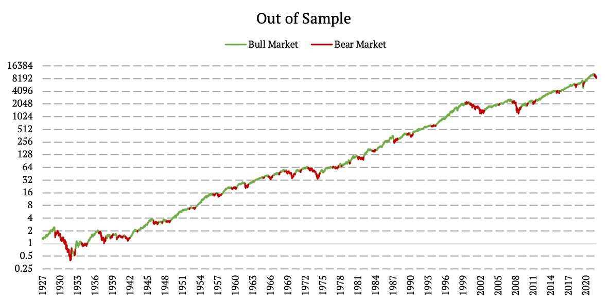

## Table of Contents

## What are market cycles and why are they important?

Market cycles are the ups and downs that happen in the economy and in stock markets over time. They are like the seasons, but for money and business. There are usually four parts to a market cycle: growth, peak, decline, and recovery. During the growth part, things are going well, and people are buying and selling a lot. The peak is when things are at their best, but then they start to go down. The decline is when things get worse, and people might lose money. Finally, recovery is when things start to get better again.

Understanding market cycles is important because it helps people make better choices with their money. If you know where we are in the cycle, you can decide when to buy or sell things. For example, if you think we are at the peak, you might want to sell before prices go down. If you think we are in the recovery part, it might be a good time to buy because prices could go up soon. Knowing about market cycles can help you plan for the future and maybe even make more money.

## How can market cycles be identified in historical data?

To identify market cycles in historical data, you need to look at patterns over time. You can start by looking at a graph of stock prices or economic indicators like GDP. When you see the prices going up for a while, that's usually the growth part of the cycle. When the prices stop going up and start to level off, that could be the peak. After the peak, if prices start to go down, that's the decline. Finally, when prices start to go up again after being down, that's the recovery part of the cycle.

It's also helpful to look at other signs, like how much people are buying and selling, or how many people have jobs. These can give you more clues about where we are in the cycle. For example, if lots of people are buying things and companies are hiring more workers, that might mean we are in the growth or peak part. If people are buying less and companies are letting workers go, that might mean we are in the decline part. By putting all these pieces together, you can get a good idea of the market cycles from the past.

## What is the difference between in-sample and out-of-sample data?

In-sample data is the information you use to build and train your model. It's like practicing with a set of questions before a test. You use this data to see patterns and make predictions. For example, if you're trying to predict stock prices, you might use past stock prices from the last five years as your in-sample data. This helps you understand how the market has moved in the past.

Out-of-sample data, on the other hand, is the information you use to test how well your model works on new data it hasn't seen before. It's like taking the actual test after you've practiced. This data is important because it shows if your model can make good predictions on new information. If you used the last five years of stock prices for your in-sample data, you might use the next year's stock prices as your out-of-sample data to see if your model can still predict well.

## Why is it important to define market cycles out of sample?

It's important to define market cycles out of sample because it helps us see if our understanding of the market is really good. When we use in-sample data, we're just looking at the past. But the past doesn't always tell us what will happen in the future. By using out-of-sample data, we can check if our ideas about market cycles work on new information. This is like testing a recipe you learned at home in a new kitchen to see if it still works.

If we only use in-sample data, we might think we have a perfect way to predict market cycles, but it might not work when things change. Out-of-sample data helps us be more sure that our predictions are useful. It's like checking if a map still helps you find your way even if you're in a different city. This way, we can make better decisions about when to buy or sell in the market, knowing our methods have been tested in different situations.

## What are the common methodologies used to identify market cycles out of sample?

One common way to identify market cycles out of sample is by using technical analysis. This means looking at charts and graphs of stock prices or other economic indicators. People who use technical analysis look for patterns like peaks and troughs that show where the market might be in its cycle. They use these patterns from the past to guess where the market will go next. By testing these guesses on new data, they can see if their methods work well outside of the time they used to learn them.

Another method is using economic indicators like GDP growth, unemployment rates, and consumer spending. These indicators can help show where we are in the market cycle. For example, if GDP is growing and unemployment is low, it might mean we're in the growth or peak part of the cycle. By comparing these indicators to new data, we can see if they still help us understand market cycles. This way, we can make sure our understanding of the market is strong and can be used in different situations.

A third approach is through statistical models. These models use math to find patterns in data. For example, a model might look at stock prices over time and try to predict when the next peak or trough will happen. By applying these models to new data, we can check if they are good at predicting market cycles. This helps us trust the models more because we know they work even when things change.

## How can statistical tools be applied to detect market cycles in out-of-sample data?

Statistical tools can help detect market cycles in out-of-sample data by using math to find patterns in stock prices or other economic numbers. One way to do this is by using something called time series analysis. This method looks at how numbers change over time and tries to find repeating patterns. For example, a statistical model might look at past stock prices to guess when the next peak or trough will happen. When this model is used on new data that it hasn't seen before, it can show if it's good at predicting market cycles. If the model's guesses are right a lot of the time, we can trust it more.

Another way to use statistical tools is by using regression analysis. This method helps see how different things, like unemployment rates or consumer spending, affect stock prices. By making a model that shows these relationships, we can predict where the market might be in its cycle. When we use this model on new data, we can check if it still works well. If it does, it means our model is good at understanding market cycles even when things change. This helps us make better choices about when to buy or sell in the market.

## What are the challenges faced when defining market cycles out of sample?

One big challenge when trying to define market cycles out of sample is that the future is always different from the past. Even if a model works well with old data, it might not work the same way with new data. Things like new laws, big world events, or changes in how people act can change how the market moves. So, a model that was good at guessing market cycles before might not be as good when things change. This makes it hard to trust the model completely, even if it did well before.

Another challenge is that markets can be really unpredictable. Sometimes, small changes can lead to big effects, and it's hard to know what will happen next. This means that even the best models can be wrong sometimes. When we test a model on new data, it might not catch all the new patterns or changes in the market. This can make our predictions less accurate and make it harder to know where we are in the market cycle. So, we need to be careful and keep learning to make our models better over time.

## How can machine learning models improve the accuracy of out-of-sample market cycle predictions?

Machine learning models can get better at predicting market cycles out of sample by learning from lots of data. These models can look at past stock prices, economic numbers, and even news to find patterns that humans might miss. By using these patterns, the models can make guesses about where the market is going. When these models are used on new data, they can keep learning and getting better. This means they can adjust to changes in the market and make more accurate predictions over time.

One way [machine learning](/wiki/machine-learning) helps is through something called "ensemble methods." This means using a bunch of different models together to make a better guess. Each model might be good at finding different parts of the market cycle, so when you put them all together, you get a more complete picture. This can make the predictions more reliable, even when the market does something unexpected. By constantly updating and learning from new data, machine learning models can help us understand market cycles better and make smarter choices about buying and selling.

## What are some case studies where out-of-sample market cycle definitions have been successfully applied?

One case study where out-of-sample market cycle definitions were successfully applied is in the work of a team of researchers at a major financial institution. They used machine learning models to predict stock market trends. The team trained their models on historical data from the past 20 years, looking at stock prices, economic indicators, and even news articles. When they tested these models on new data from the following year, they found that their predictions were more accurate than traditional methods. This helped investors make better decisions about when to buy and sell stocks, leading to higher returns.

Another example comes from a study done by a group of economists who wanted to predict housing market cycles. They used a combination of statistical models and machine learning to analyze data on housing prices, interest rates, and employment rates. After training their models on data from the past decade, they applied them to new data from the next two years. The results showed that their models could accurately predict when the housing market would enter a growth or decline phase. This information was valuable for real estate investors and policymakers who needed to plan for future market conditions.

## How do different economic indicators correlate with market cycles identified out of sample?

Economic indicators like GDP growth, unemployment rates, and consumer spending can help show where we are in a market cycle, even when looking at new data. When GDP is growing and unemployment is low, it often means the market is in the growth or peak part of the cycle. People are buying more things, and businesses are doing well. When these indicators are used to test models on new data, they can help predict when the market will keep growing or start to go down. This helps investors know when it might be a good time to buy or sell.

On the other hand, when unemployment starts to go up and consumer spending goes down, it can be a sign that the market is entering a decline. These indicators can be used in models to see if they still work well on new data. If the models can predict these changes accurately, it means they are good at understanding market cycles, even when things change. By looking at these economic indicators and using them in models, people can make better guesses about where the market is headed and plan their money choices accordingly.

## What advanced techniques can be used to refine the detection of market cycles in out-of-sample scenarios?

One advanced technique to refine the detection of market cycles in out-of-sample scenarios is using [deep learning](/wiki/deep-learning). Deep learning models can look at a lot of different data all at once, like stock prices, news, and even social media posts. These models can find patterns that are really hard for people to see. When these models are tested on new data, they can keep learning and getting better. This means they can adjust to new things happening in the market and make more accurate predictions about where the market is in its cycle.

Another technique is called [reinforcement learning](/wiki/reinforcement-learning). This is where a model learns by trying different things and seeing what works best. It's like playing a game where the model gets points for making good guesses about the market. Over time, the model gets better at knowing what to do in different situations. When this model is used on new data, it can help predict market cycles more accurately because it has learned from past mistakes and successes. By using these advanced techniques, people can get a better understanding of market cycles and make smarter choices with their money.

## How can investors use out-of-sample market cycle analysis to enhance their investment strategies?

Investors can use out-of-sample market cycle analysis to make better choices about when to buy and sell. By using models that have been tested on new data, investors can see if their guesses about the market are still good even when things change. This helps them know if the market is in a growth, peak, decline, or recovery part of the cycle. If the model says the market is at the peak, an investor might decide to sell their stocks before prices start to go down. If the model says the market is in recovery, it might be a good time to buy because prices could go up soon. This way, investors can plan their moves better and maybe even make more money.

Another way investors can use out-of-sample market cycle analysis is by looking at different economic indicators. These indicators, like GDP growth or unemployment rates, can show where the market is in its cycle. By using models that have been tested on new data, investors can see if these indicators still help predict market changes. If the model shows that unemployment is going up and consumer spending is going down, it might mean the market is entering a decline. Knowing this, an investor might decide to be more careful with their money or even move it to safer investments. By using these tools, investors can feel more confident in their decisions and be ready for whatever the market does next.

## What is the advantage of out-of-sample analysis?

Out-of-sample analysis in [algorithmic trading](/wiki/algorithmic-trading) is a method utilized to evaluate the predictive power of trading models on datasets that were not used during the model's development. This technique helps validate the model's performance in real-world trading scenarios by providing a reality check against data it hasn't "seen" before. The primary benefit of this approach lies in reducing the risk of overfitting—where a model performs exceptionally well on historical data but fails when applied to new, unseen data.

In-sample analysis often relies heavily on historical data for constructing and tuning models, creating a risk of these models being overly tailored to the specific patterns and noise of the past dataset. This form of analysis can lead to a deceptive sense of model efficacy, as it lacks a mechanism for ensuring that the model's performance will hold under new conditions. By contrast, out-of-sample testing addresses this limitation by evaluating the model's accuracy using data that plays no part in the initial training process. This distinction emphasizes the impermanent nature of past market conditions and encourages developing models resilient to such changes.

Mathematically, if $D_{\text{train}}$ represents the dataset used to train the model, and $D_{\text{test}}$ represents the out-of-sample data, the evaluation function $E$ would be applied as follows:

$$
E(D_{\text{train}}, D_{\text{test}}) = \frac{\sum_{i=1}^{n} \left( y_i - f(x_i) \right)^2}{n}
$$

where $f(x_i)$ denotes the model's prediction, $y_i$ is the actual outcome, and $n$ is the number of observations in the out-of-sample set $D_{\text{test}}$.

Another advantage of out-of-sample analysis is its ability to provide unbiased performance metrics. Models validated through this approach tend to offer insights that better reflect their potential under different market conditions. This robustness is crucial for algorithmic trading systems, where adaptability to unforeseen market conditions can significantly impact profitability.

Additionally, out-of-sample analysis helps highlight and address assumptions that may not hold in future market scenarios. It serves as an early warning system for potential model failures, allowing traders to continuously refine and adjust their strategies before deploying them in the market. Employing both in-sample and out-of-sample analysis produces more balanced and informed algorithmic strategies that are likely to perform steadily over varying market cycles.

In conclusion, out-of-sample analysis amplifies the credibility of predictive models by filtering out the noise of historical overfitting and ensuring the model's adaptability and effectiveness in real trading environments.

## What are the methodologies for out-of-sample analysis?

Out-of-sample analysis in algorithmic trading is essential for testing and validating predictive models using new data points, which helps avoid biases linked with historical datasets. Various methodologies are employed to enhance the reliability of forecasts within this framework.

### Moving Averages

Moving averages are fundamental tools in identifying trends across different market cycles. They smooth out price data by creating a constantly updated average price, aiding in distinguishing between bull and bear markets. The simple moving average (SMA) is calculated using:

$$
\text{SMA} = \frac{P_1 + P_2 + \ldots + P_n}{n}
$$

Here, $P$ represents the price and $n$ the number of periods. The Exponential Moving Average (EMA) gives more weight to recent prices, being thus more responsive to new information. The formula for EMA incorporates a smoothing [factor](/wiki/factor-investing), $\alpha$:

$$
\text{EMA}_t = \alpha \times P_t + (1 - \alpha) \times \text{EMA}_{t-1}
$$

### Median CPI Values

To decipher inflation trends, the median Consumer Price Index (CPI) is regarded as a robust indicator. It eliminates outliers by focusing on the middle of a data distribution, hence offering a stable viewpoint of core inflation trends, essential for gauging long-term market conditions.

### Rate Movement Indicators

Interest rate movements are crucial for assessing economic conditions. Indicators such as the yield curve analysis provide insights into forward-looking economic expectations. An inverted yield curve often signals a recession, while a steepening yield curve might indicate economic expansion. Rates are often tracked using:

$$
\text{Yield Curve = Long-term Interest Rates - Short-term Interest Rates}
$$

### Defining Bull/Bear Markets

The methodologies described help define bull or bear markets by identifying upward or downward trends, changes in [volatility](/wiki/volatility-trading-strategies), and shifts in economic indicators. For instance, a consistent upward movement in 50-day and 200-day moving averages may suggest a bull market, while their crossing in a downward direction often signals a shift to a bear market scenario.

By leveraging these methodologies, traders can construct models that more accurately reflect and respond to real-world market dynamics beyond historical confines. Implementing a combination of moving averages, median CPI analysis, and [interest rate](/wiki/interest-rate-trading-strategies) trend assessment provides a comprehensive toolkit for effective out-of-sample model validation.

## What are the challenges and limitations?

Defining market cycles out-of-sample presents several challenges that traders and analysts must navigate to ensure their predictive models remain effective and reliable. One primary challenge is the lagged reaction to market changes. Market cycles tend to evolve over time, influenced by various macroeconomic factors, investor behavior, and geopolitical events. Out-of-sample analysis, by its nature, relies on data that has not been previously observed by the model, which can lead to delays in recognizing these evolving patterns. Such delays mean that predictive models might not immediately capture the onset or conclusion of a market cycle, resulting in suboptimal trading decisions.

Another significant issue is the potential for false signals. As out-of-sample methods involve testing models on data outside of the initial sample set, there is an inherent risk that noise or anomalies within this data could be misinterpreted as meaningful market trends. This misinterpretation can lead to the execution of trades based on erroneous assumptions, ultimately affecting the profitability and performance of a trading strategy.

The balance between complexity and overfitting in model design is a critical consideration in out-of-sample analysis. Complexity in models can be advantageous, as it allows for the capture of nuanced relationships within the data. However, overly complex models run the risk of overfitting, where a model might perform exceptionally well on historical data but fail to generalize to new, unseen data. Overfitting occurs when models identify patterns that are merely coincidental rather than indicative of genuine relationships. This issue can be addressed by employing regularization techniques, such as Lasso and Ridge regression, which penalize extreme coefficient values and help maintain model simplicity while retaining predictive power.

Regularization can be mathematically expressed as follows:

- Lasso (Least Absolute Shrinkage and Selection Operator): 
$$
  \text{minimize} \quad \sum_{i=1}^n (y_i - \hat{y}_i)^2 + \lambda \sum_{j=1}^p |\beta_j|

$$

- Ridge Regression: 
$$
  \text{minimize} \quad \sum_{i=1}^n (y_i - \hat{y}_i)^2 + \lambda \sum_{j=1}^p \beta_j^2

$$

Where $(y_i - \hat{y}_i)^2$ is the residual sum of squares, $\beta_j$ are the coefficients, $n$ is the number of observations, $p$ is the number of predictors, and $\lambda$ is the penalty term that controls the amount of shrinkage applied.

Ultimately, developing robust market cycle models requires a careful trade-off between the advantages of complex model structures and the risks of overfitting. Through rigorous testing and continuous refinement, traders can enhance model accuracy and adaptability, thus improving long-term decision-making in the ever-changing financial markets.

## References & Further Reading

[1]: Bergstra, J., Bardenet, R., Bengio, Y., & Kégl, B. (2011). ["Algorithms for Hyper-Parameter Optimization."](https://papers.nips.cc/paper/4443-algorithms-for-hyper-parameter-optimization) Advances in Neural Information Processing Systems 24.

[2]: ["Advances in Financial Machine Learning"](https://www.amazon.com/Advances-Financial-Machine-Learning-Marcos/dp/1119482089) by Marcos Lopez de Prado

[3]: ["Evidence-Based Technical Analysis: Applying the Scientific Method and Statistical Inference to Trading Signals"](https://www.amazon.com/Evidence-Based-Technical-Analysis-Scientific-Statistical/dp/0470008741) by David Aronson

[4]: ["Machine Learning for Algorithmic Trading"](https://github.com/stefan-jansen/machine-learning-for-trading) by Stefan Jansen

[5]: ["Quantitative Trading: How to Build Your Own Algorithmic Trading Business"](https://www.amazon.com/Quantitative-Trading-Build-Algorithmic-Business/dp/1119800064) by Ernest P. Chan