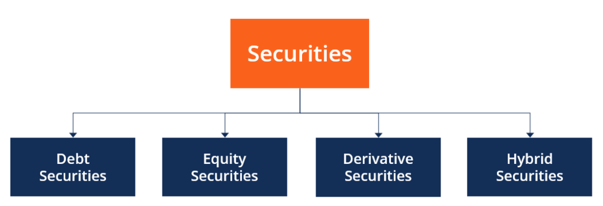

In the rapidly evolving world of finance, securities hold a pivotal position within investment portfolios and trading strategies. These instruments serve as foundational elements in financial markets, facilitating the flow of capital and enabling investors to manage risks effectively. Securities, whether they manifest as traditional paper-based certificates or modern digital entries, are indispensable for various market participants, including individual investors, institutions, and governments.

The increasing digitization of financial markets has revolutionized the traditional methods of handling securities, introducing a shift from physical certificates to electronic records. This transformation has not only enhanced the efficiency and security of transactions but also broadened access to global markets. In this context, understanding definitive securities, particularly those with physical representations, becomes vital as they provide historical insights into the evolution of the financial system.



Algorithmic trading represents another significant development in the world of securities, fundamentally altering how trades are executed. By leveraging computer programs that follow predetermined strategies, algorithmic trading ensures high speed and precision, significantly reducing emotional biases and human errors traditionally associated with trading. This technological advancement enables rapid decision-making, which can be crucial in markets where conditions fluctuate within fractions of a second.

These elements—definitive securities and algorithmic trading—together construct the framework of contemporary investment practices. As financial markets continue to integrate technological advancements, understanding these components is essential for investors and institutions aiming to optimize their strategies amidst an environment characterized by constant change and innovation.

## Table of Contents

## Understanding Definitive Securities

Definitive securities, historically fundamental in establishing ownership rights, refer to securities issued in physical form, typically through paper certificates. These physical representations served as tangible evidence of ownership, providing holders with certain rights such as the receipt of interest or dividends and, in some cases, voting rights in the issuing entity. In the past, the transfer of these securities required the physical exchange of documents, which often resulted in slow and cumbersome transactions.

One prominent example of definitive securities is bearer bonds. These bonds were issued as physical certificates and provided advantages in terms of anonymity and ease of transfer; the holder of the document was considered the rightful owner. However, this feature also presented significant risks, such as loss or theft. Due to such security concerns and the advent of regulatory changes aimed at preventing illegal activities like money laundering and tax evasion, bearer bonds have become obsolete in many jurisdictions.

While definitive securities played a crucial role historically, their prevalence has significantly declined with the progression towards digitization. The shift to electronic or book-entry securities has facilitated more efficient trading, settlement, and record-keeping processes. Digital securities have largely replaced their paper-based predecessors, offering enhanced security, reduced transaction costs, and improved accessibility.

In conclusion, though definitive securities were once central to financial markets, advancements in digital technology and regulatory frameworks have rendered them less common today. Their legacy, however, underscores the evolution of financial instruments and the continual push towards more secure and efficient market practices.

## The Evolution and Significance of Financial Securities

Financial securities represent an essential aspect of modern financial markets, serving multiple roles within an investment portfolio. These instruments are primarily divided into stocks, bonds, derivatives, and other categories, each fulfilling unique economic functions.

Stocks, or equities, represent ownership in a corporation and entitle the shareholder to a portion of the company's profits in the form of dividends. Companies issue stocks to raise capital for expansion and operations, offering investors the potential for capital appreciation. In contrast, bonds are debt instruments through which investors lend money to an issuer, typically a corporation or government, in exchange for periodic interest payments and the return of principal at maturity. Bonds serve the dual purpose of providing a stable income stream and diversifying portfolio risk, as their value is generally less volatile than stocks.

Derivatives are financial contracts whose value depends on an underlying asset, index, or rate. These include options, futures, and swaps, among others. Derivatives provide powerful tools for hedging existing exposures or speculating on future price movements. Their flexibility allows for complex investment strategies aimed at mitigating risk or enhancing returns.

The digital era has significantly transformed financial securities through innovations such as book-entry systems. These systems eliminate the need for physical certificates, allowing for electronic recording and transfer of securities ownership. Book-entry securities increase security by reducing the risks associated with handling paper certificates, such as loss or forgery. They also enhance efficiency through faster, more reliable transactions and easier record-keeping.

These innovations contribute to a more robust and streamlined financial system, facilitating both the issuance and trading of securities. In turn, they enable market participants to efficiently allocate resources and optimize their investment strategies within an increasingly complex financial landscape.

## Functionality of Securities in Financial Markets

Securities are pivotal instruments within financial markets, serving multiple purposes that contribute to the overall functionality and efficiency of the financial ecosystem. One of the primary functions of securities is to provide a mechanism for raising capital. Companies issue stocks or bonds to the public and institutional investors to obtain funds necessary for business expansion, research, and development, or debt restructuring. For instance, when a company issues equity shares, it essentially offers ownership stakes to investors, thereby procuring capital in exchange for partial ownership.

Moreover, securities facilitate risk management through hedging. Investors utilize derivatives—such as options and futures contracts—to protect against price fluctuations in various assets. By locking in prices, these financial instruments mitigate potential losses that could occur from adverse market movements. For example, a portfolio manager might use put options to hedge against a potential decline in stock prices, thus prescribing a predetermined sell price and safeguarding the portfolio's value.

Securities also enable investors to participate in growth prospects by offering diverse investment opportunities. Bonds provide fixed income, while stocks offer the potential for capital appreciation. This variety allows investors to tailor their portfolios to align with their financial goals and risk tolerance levels, balancing between stability and growth.

Liquidity is another crucial function of securities within financial markets. Liquid markets, characterized by high volumes of securities transactions, enable quick and seamless buying or selling of assets with minimal impact on the asset's price. This [liquidity](/wiki/liquidity-risk-premium) ensures that investors can access their funds when needed and contributes to the market's overall stability.

Furthermore, securities promote diversification by allowing investors to spread risk across different asset classes and markets. By allocating investments across various securities, investors can reduce the overall risk of their portfolios. This diversification minimizes the impact of poor performance from any single investment, thus enhancing portfolio stability and potential returns.

Finally, securities set the stage for complex financial instruments and strategies. Innovations like mortgage-backed securities and collateralized debt obligations illustrate how basic securities can evolve into sophisticated products. These instruments often cater to specific investor needs, such as income generation or risk exposure reduction, and require advanced trading strategies to maximize their potential benefits.

Collectively, these functionalities underscore the critical role securities play in financial markets, providing mechanisms for [capital raising](/wiki/hedge-fund-capital-raising), risk management, growth investment, liquidity facilitation, diversification, and the development of complex instruments.

## Algorithmic Trading: Transforming Financial Securities

Algorithmic trading, often referred to as algo trading, leverages sophisticated computer programs to execute buy and sell orders in financial markets with minimal human intervention. By using predefined criteria, these programs are designed to make trading decisions at speeds and volumes not achievable by human traders. The primary benefits of this approach include the elimination of emotional biases, reduction of human errors, and the ability to react to market changes with unparalleled speed and precision.

The core mechanism of [algorithmic trading](/wiki/algorithmic-trading) lies in its ability to process large datasets and adhere to strict trading guidelines, thereby ensuring discipline in execution and strategy implementation. Traders and institutions often rely on algorithms to capitalize on small price discrepancies across different markets or to exploit intra-day price movements.

Several strategies are pivotal to the functioning of algo trading. Trend-following strategies, for instance, are based on the analysis of historical price patterns to predict future price directions. These algorithms may use moving averages or other technical indicators to determine buy or sell signals. 

Another popular strategy is [arbitrage](/wiki/arbitrage), where the algorithm seeks to profit from the price inefficiencies of identical or similar financial instruments across different markets or formats. By simultaneously buying and selling these instruments, the algorithm can lock in profits with minimal risk. An example would be noticing that a stock listed on two different exchanges is trading at slightly different prices, thereby presenting an opportunity for profit by buying low on one and selling high on the other.

Mean reversion strategies operate on the assumption that high and low prices are temporary anomalies and that a stock's price will revert to its mean or average value over time. These algorithms identify opportunities by looking for deviations from historical price patterns and predicting a convergence towards the average.

These strategies are often implemented using programming languages like Python, which offers numerous libraries for financial data analysis and algorithm development. Here is a simple example of using Python to implement a basic moving average crossover strategy:

```python
import pandas as pd

# Load historical price data
data = pd.read_csv('historical_prices.csv')

# Calculate short and long-term moving averages
data['short_mavg'] = data['Close'].rolling(window=40, min_periods=1).mean()
data['long_mavg'] = data['Close'].rolling(window=100, min_periods=1).mean()

# Generate buy and sell signals
data['signal'] = 0
data.loc[data['short_mavg'] > data['long_mavg'], 'signal'] = 1
data.loc[data['short_mavg'] < data['long_mavg'], 'signal'] = -1

# Output the date and signal
print(data[['Date', 'signal']])
```

This code snippet demonstrates a classic moving average crossover strategy, where buy signals are generated when a shorter-term moving average crosses above a longer-term average, and sell signals when it crosses below.

Overall, algorithmic trading represents a transformative tool in modern financial markets, enabling efficient and disciplined trading operations. However, it requires continual development and optimization to adapt to changing market conditions and maintain competitive edges.

## Advantages and Challenges of Algorithmic Trading

Algorithmic trading, or algo trading, revolutionizes financial markets by leveraging computer algorithms to execute trades based on predetermined criteria. One of its most significant advantages is enhanced trading speed. Algorithms can process and react to market data far faster than human traders, executing transactions in milliseconds. This speed is crucial in markets where prices can change rapidly, allowing for the capture of fleeting arbitrage opportunities.

Reduced psychological influences are another benefit. By relying on algorithms rather than human judgment, trades are devoid of emotional biases, such as fear and greed, which often lead to suboptimal decision-making. Algorithms ensure that pre-established trading rules are consistently followed, fostering discipline and strategic integrity.

Cost efficiency is also associated with algo trading. The automation of trading processes reduces the need for manual intervention, minimizing labor costs. Additionally, algorithms can execute large volumes of trades without incurring significant transaction fees, as they are typically routed to optimize cost across multiple venues.

Despite these advantages, challenges exist. Technical failures pose a significant risk, as malfunctions in code or network infrastructure can lead to substantial financial losses. Ensuring system robustness and implementing fail-safes is crucial to mitigate these risks.

Overfitting is another challenge, where algorithms are excessively tailored to historical data, making them less adaptable to unforeseen market conditions. This can lead to poor performance in live environments. Regular validation and testing on diverse datasets can help mitigate overfitting.

High infrastructure costs are a barrier to entry for many investors. Developing and maintaining the technologically advanced systems required for algorithmic trading involves significant investment in hardware, software, and connectivity solutions. These costs must be weighed against potential benefits to ensure a viable trading strategy.

In conclusion, understanding both the advantages and challenges of algorithmic trading is essential for effectively leveraging its potential. By addressing technical challenges and implementing robust strategies, investors can capitalize on the efficiencies offered by algo trading in today's fast-paced financial markets.

## Real-World Applications and Examples

Algorithmic trading, commonly referred to as algo trading, has significantly altered the landscape of modern financial markets. Its application spans various asset classes, including equities, [forex](/wiki/forex-system), and options, providing traders with enhanced speed and precision.

In the equity markets, algo trading is extensively used for executing large orders using strategies like Volume Weighted Average Price (VWAP) and Time Weighted Average Price (TWAP). These strategies break down large orders into smaller, market-consistent trades, minimizing market impact.

The forex market benefits from algorithmic trading through strategies like [statistical arbitrage](/wiki/statistical-arbitrage) and [momentum](/wiki/momentum) trading. These methodologies harness price differentials across various currency pairs to capitalize on short-lived trends. Algorithms can quickly execute trades across global exchanges, leveraging minute foreign exchange rate variations.

Options trading also reaps the advantages of algo trading, where complex options strategies like delta-neutral, straddle, and strangle leverage algorithms for optimal pricing and hedging. The ability to assess market conditions rapidly and execute trades instantaneously is crucial in managing the intricacies of options trading.

A notable real-world example is Apple's Eurobond issuance. In this instance, algorithmic mechanisms facilitated optimal pricing and distribution across diverse European financial markets. The use of algorithms ensured effective investor targeting and [order book](/wiki/order-book-trading-strategies) management, crucial for achieving favorable issuance outcomes in a competitive global landscape.

As algorithmic trading continues to evolve, its applications and examples will expand further across various markets, driving innovation and efficiency in trading practices.

## Conclusion: Future of Financial Securities and Algo Trading

As technology continues to advance, the landscape of financial securities and algorithmic trading is undergoing significant transformation. Algorithmic trading, leveraging the power of computing and sophisticated algorithms, is becoming increasingly intricate, offering enhanced precision and opportunities for investors and institutions worldwide. Its prevalence is not just a trend—it's a fundamental shift in how trading operations are conducted globally.

Algorithmic trading's potential for growth is vast, owing largely to advancements in [artificial intelligence](/wiki/ai-artificial-intelligence) and [machine learning](/wiki/machine-learning). These technologies enable the development of more advanced trading algorithms that can analyze complex datasets, identify patterns, and execute trades with remarkable speed and accuracy. As these tools become more refined, traders can anticipate markets more effectively, unlocking new strategies that were previously unimaginable.

Investors and institutions must be agile and proactive in adapting to these technological advancements. The competitive landscape is rapidly changing, and staying at the forefront requires not only understanding but also leveraging these modern securities and trading techniques. This might involve investing in technology infrastructures, adopting new data analytics tools, and continually updating trading strategies to accommodate evolving market dynamics.

Furthermore, the integration of blockchain technology is poised to redefine securities transactions. With blockchain, transactions can be conducted more securely and transparently, reducing the risk of fraud and enhancing trust among market participants. As this technology matures, it is likely to play a more significant role in the securities market, leading to greater decentralization and democratization of trading activities.

In conclusion, the future of financial securities and algorithmic trading is bright, with evolving technologies offering unprecedented opportunities and challenges. Those who can adeptly harness these advancements are likely to gain a competitive edge, benefiting from both operational efficiencies and strategic advantages. Embracing innovation and continuous learning will be crucial for investors and institutions aiming to thrive in this dynamic financial ecosystem.

## References & Further Reading

[1]: Bergstra, J., Bardenet, R., Bengio, Y., & Kégl, B. (2011). ["Algorithms for Hyper-Parameter Optimization."](https://dl.acm.org/doi/10.5555/2986459.2986743) Advances in Neural Information Processing Systems 24.

[2]: ["Advances in Financial Machine Learning"](https://www.amazon.com/Advances-Financial-Machine-Learning-Marcos/dp/1119482089) by Marcos Lopez de Prado

[3]: ["Evidence-Based Technical Analysis: Applying the Scientific Method and Statistical Inference to Trading Signals"](https://www.amazon.com/Evidence-Based-Technical-Analysis-Scientific-Statistical/dp/0470008741) by David Aronson

[4]: ["Machine Learning for Algorithmic Trading"](https://github.com/stefan-jansen/machine-learning-for-trading) by Stefan Jansen

[5]: ["Quantitative Trading: How to Build Your Own Algorithmic Trading Business"](https://www.amazon.com/Quantitative-Trading-Build-Algorithmic-Business/dp/1119800064) by Ernest P. Chan