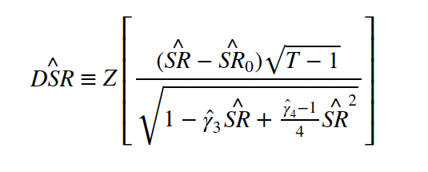

## Table of Contents

## What is the Deflated Sharpe Ratio (DSR)?

The Deflated Sharpe Ratio (DSR) is a measure used to evaluate the performance of an investment or a portfolio. It is an adjustment to the traditional Sharpe Ratio, which compares the return of an investment to its risk. The DSR takes into account the impact of inflation on the returns, making it a more accurate measure of real performance. By considering inflation, the DSR helps investors understand the true value of their returns after accounting for the rising cost of living.

In simple terms, the DSR helps you see if your investment is really doing well when you think about the money losing value over time because of inflation. If the traditional Sharpe Ratio shows a high return, but inflation is also high, the DSR might show a lower, more realistic return. This makes the DSR a useful tool for investors who want to make sure their money is growing in real terms, not just on paper.

## How does the DSR differ from the traditional Sharpe Ratio?

The Deflated Sharpe Ratio (DSR) and the traditional Sharpe Ratio both measure how well an investment is doing compared to the risk it takes. The traditional Sharpe Ratio looks at the extra return you get from an investment over a risk-free rate, like a savings account, and then divides that by how much the investment's value goes up and down. It helps you see if the extra return is worth the extra risk.

The DSR adds another step to this process. It takes the returns used in the traditional Sharpe Ratio and adjusts them for inflation. This means the DSR shows you the real value of your investment returns after accounting for the fact that money loses value over time due to inflation. So, while the traditional Sharpe Ratio might make an investment look good, the DSR could show it's not as great when you think about the rising cost of living.

In short, the DSR gives you a clearer picture of an investment's performance in real terms. If inflation is high, the DSR might be lower than the traditional Sharpe Ratio, helping investors see if their money is really growing or if inflation is eating away at their returns.

## Why was the DSR developed?

The Deflated Sharpe Ratio (DSR) was developed because people realized that the traditional Sharpe Ratio did not account for inflation. Inflation is when prices go up over time, making money worth less. So, if you're looking at how well an investment is doing, you need to think about what that money can actually buy after inflation. The DSR helps investors see the real value of their returns by taking inflation into account.

The traditional Sharpe Ratio might make an investment look good on paper, but if inflation is high, the actual value of those returns could be much lower. By adjusting for inflation, the DSR gives a more honest view of an investment's performance. This is really important for investors who want to make sure their money is growing in a way that keeps up with or beats the rising cost of living.

## What are the key components of the DSR formula?

The Deflated Sharpe Ratio (DSR) formula has three main parts: the investment return, the risk-free rate, and the inflation rate. The investment return is how much money you make from your investment. The risk-free rate is what you would earn from a very safe investment, like a savings account. The inflation rate is how much prices go up over time, which makes money worth less.

To calculate the DSR, you first find the difference between the investment return and the risk-free rate. This shows the extra return you get for taking on more risk. Then, you adjust this extra return for inflation. You do this by subtracting the inflation rate from the extra return. Finally, you divide this adjusted return by the investment's [volatility](/wiki/volatility-trading-strategies), which is how much the investment's value goes up and down. This gives you the DSR, which shows how well your investment is doing in real terms, after accounting for inflation.

## How is the DSR calculated?

The Deflated Sharpe Ratio (DSR) is a way to see how well an investment is doing when you think about inflation. First, you find out how much more money you make from your investment compared to a safe investment like a savings account. This is called the extra return. Then, you take away the inflation rate from this extra return. Inflation is when prices go up and money loses value over time. This step helps you see what your investment is really worth after prices have gone up.

After you adjust the extra return for inflation, you divide it by the investment's volatility. Volatility is how much the investment's value goes up and down. This gives you the DSR. The DSR tells you if the extra return you get from your investment is worth the risk you take, even after thinking about inflation. It's a useful number for investors who want to know if their money is really growing, not just on paper.

## What does a higher DSR indicate about an investment's performance?

A higher Deflated Sharpe Ratio (DSR) means that an investment is doing really well when you think about both the risk you're taking and the effect of inflation. It shows that the extra money you're making from the investment, after taking away the safe money you could have made and adjusting for rising prices, is a lot compared to how much the investment's value goes up and down. So, a high DSR tells you that the investment is giving you a good return for the risk you're taking, even when prices are going up.

This is really important for investors because it helps them see if their money is growing in a way that keeps up with or beats inflation. If the DSR is high, it means the investment is not just doing well on paper, but it's also doing well in real life, where money loses value over time. A higher DSR can give investors more confidence that their money is working hard for them, even after thinking about the rising cost of living.

## Can you provide an example of how to apply the DSR to a real-world investment scenario?

Let's say you have $10,000 to invest and you're looking at a stock that has given an average return of 10% per year over the last five years. The risk-free rate, which is what you could earn from a very safe investment like a savings account, is 2%. Inflation over the same period has been running at 3% per year. The stock's volatility, or how much its value goes up and down, is 15%.

To find the Deflated Sharpe Ratio (DSR), you first calculate the extra return you get from the stock. That's the stock's return of 10% minus the risk-free rate of 2%, which gives you an extra return of 8%. Then, you adjust this extra return for inflation by subtracting the inflation rate of 3% from the 8%, leaving you with a real extra return of 5%. Finally, you divide this real extra return by the stock's volatility of 15%. So, the DSR is 5% divided by 15%, which equals 0.33. A DSR of 0.33 means that for every unit of risk you take, you're getting a real return of 0.33 units after accounting for inflation. This helps you see if the stock is a good investment when you think about both risk and the rising cost of living.

## What are the limitations of using the DSR as a performance metric?

Using the Deflated Sharpe Ratio (DSR) as a performance metric has some limitations. One big problem is that the DSR depends a lot on the numbers you use, like the investment return, the risk-free rate, and the inflation rate. If these numbers are not right or if they change a lot, the DSR might not give you a good picture of how well your investment is doing. Also, the DSR looks at past data, but past performance doesn't always tell you what will happen in the future. So, it's hard to use the DSR to predict how an investment will do.

Another limitation is that the DSR might not be the best way to compare different kinds of investments. For example, it might not work well if you're comparing a stock to a bond because they have different risks and ways of making money. The DSR also doesn't tell you everything about an investment. It doesn't look at things like how easy it is to buy or sell the investment, or other risks that might affect it. So, while the DSR can help you see if an investment is doing well after thinking about inflation, you should use it along with other ways of measuring performance to get a full picture.

## How does the DSR account for non-normality in return distributions?

The Deflated Sharpe Ratio (DSR) assumes that returns follow a normal distribution, which means they are evenly spread out around the average. But in real life, returns often don't follow this pattern. They can have big jumps or drops that happen more often than a normal distribution would predict. Because of this, the DSR might not give a full picture of an investment's risk if the returns are not normally distributed.

To deal with this, some investors use other measures along with the DSR. These measures can look at how often big losses happen or how returns are spread out in ways that a normal distribution doesn't show. By using these other tools, investors can get a better idea of the true risks of an investment, even if the DSR doesn't account for non-normal returns on its own.

## What statistical methods are used to estimate the parameters in the DSR?

To calculate the Deflated Sharpe Ratio (DSR), you need to estimate three main things: the investment return, the risk-free rate, and the inflation rate. For the investment return, you usually look at the average return over a certain time, like the last five years. This is done by adding up all the returns and dividing by the number of periods. The risk-free rate is often taken from the yield of a safe investment like a government bond. The inflation rate can be found from official [statistics](/wiki/bayesian-statistics), like those published by government agencies, which show how much prices have gone up over time.

The next step is to figure out the investment's volatility, which is how much the investment's value goes up and down. This is usually measured by the standard deviation of the returns. To find the standard deviation, you first find out how far each return is from the average return, square those differences, add them up, divide by the number of periods, and then take the square root of the result. Once you have all these numbers, you can plug them into the DSR formula to see how well your investment is doing after accounting for inflation and risk.

## How does the DSR perform in comparison to other risk-adjusted performance measures in empirical studies?

In empirical studies, the Deflated Sharpe Ratio (DSR) is often compared to other risk-adjusted performance measures like the traditional Sharpe Ratio, the Sortino Ratio, and the Treynor Ratio. The DSR tends to give a more realistic view of an investment's performance because it takes inflation into account. This makes it especially useful in times when inflation is high, as it shows how well an investment is doing in real terms. Studies have found that the DSR can be more helpful than the traditional Sharpe Ratio for investors who want to know if their money is really growing, not just on paper. However, the DSR still has some of the same problems as the traditional Sharpe Ratio, like assuming returns are normally distributed, which they often are not.

Other measures like the Sortino Ratio focus on downside risk, which is the risk of losing money, rather than just looking at overall volatility. This can be more useful for investors who are more worried about big losses than about the investment going up and down a lot. The Treynor Ratio looks at how well an investment does compared to the risk it takes, but it uses a different kind of risk called beta, which measures how much an investment moves with the market. In some studies, these measures have been found to be better at showing the true risk of an investment, especially when returns are not normally distributed. So, while the DSR is good at showing real returns after inflation, it's often used along with other measures to get a full picture of an investment's performance.

## What are the advanced applications of the DSR in portfolio management and risk assessment?

In portfolio management, the Deflated Sharpe Ratio (DSR) helps investors see if their whole group of investments is doing well after thinking about inflation. It's like looking at a team's score in a game but also considering how the weather might affect their play. By using the DSR, portfolio managers can decide if they need to change their investments to keep up with or beat the rising cost of living. For example, if the DSR is low, it might mean they need to find investments that can give better returns or lower the risk they're taking. This way, the DSR helps them make smarter choices about where to put their money.

In risk assessment, the DSR is also very useful. It shows not just the risk of losing money but also how inflation can make that risk worse. If inflation is high, even a small loss can hurt more because the money you have left is worth less. By using the DSR, investors can get a better idea of the true risk they're facing. This can help them plan better for the future, like saving more money or choosing investments that are less affected by inflation. So, the DSR is a powerful tool that helps investors see the full picture of their risks and rewards.

## What is the Concept and Calculation of the Deflated Sharpe Ratio?

The Deflated Sharpe Ratio (DSR), developed by López de Prado and Bailey, is designed to overcome the inherent limitations in the traditional Sharpe Ratio, particularly in the context of [algorithmic trading](/wiki/algorithmic-trading). The DSR adjusts for the potential inflationary impact introduced by conducting multiple trials and addresses statistical biases such as non-normality of returns and the overfitting risk associated with [backtesting](/wiki/backtesting).

Mathematically, the DSR is an extended version of the Probabilistic Sharpe Ratio (PSR), which itself is an adjustment of the Sharpe Ratio to account for the statistical properties of return distributions. The DSR adjusts the PSR for various biases, ultimately offering a more conservative estimate of strategy performance. This is especially relevant in algorithmic trading, where extensive backtesting may uncover spurious strategies that seem profitable purely by chance.

The formula for the Deflated Sharpe Ratio can be expressed as follows:

$$
\text{DSR} = \frac{SR - \theta}{\sigma(SR)}
$$

Where:
- $SR$ is the Sharpe Ratio of the strategy.
- $\theta$ is a correction factor for the inflation effect of multiple testing.
- $\sigma(SR)$ is the standard deviation of the Sharpe Ratio, adjusted for sample variability.

The correction [factor](/wiki/factor-investing) $\theta$ considers the trial multiplicity effect, effectively reducing the performance estimate of strategies derived from repeated testing. This correction ensures that only strategies with a genuine market edge are identified as statistically significant.

The calculation of the DSR also integrates skewness and kurtosis of the return distribution, acknowledging that financial returns often deviate from a normal distribution. Adjusting for these factors provides a more robust measure of performance by penalizing excessive tail risks and asymmetries in the distribution. Therefore, skewness and kurtosis are embedded into the estimation of $\sigma(SR)$, bringing precision to the performance assessment beyond standard assumptions.

In practice, the implementation of the DSR involves assessing the distribution characteristics of portfolio returns, adjusting the traditional Sharpe Ratio using the outlined corrections, and incorporating empirical data from backtests. Evaluating skewness, kurtosis, and trial multiplicity leads to a deflated performance metric that genuinely reflects the strategy's ability to outperform the market rather than merely benefiting from statistical flukes.

Adopting the DSR thus provides traders with an advanced tool for risk-adjusted strategy evaluation, aiding in the identification of strategies that possess true excess returns.

## References & Further Reading

[1]: Bergstra, J., Bardenet, R., Bengio, Y., & Kégl, B. (2011). ["Algorithms for Hyper-Parameter Optimization."](https://papers.nips.cc/paper/4443-algorithms-for-hyper-parameter-optimization) Advances in Neural Information Processing Systems 24.

[2]: ["Advances in Financial Machine Learning"](https://www.amazon.com/Advances-Financial-Machine-Learning-Marcos/dp/1119482089) by Marcos López de Prado

[3]: ["Evidence-Based Technical Analysis: Applying the Scientific Method and Statistical Inference to Trading Signals"](https://www.amazon.com/Evidence-Based-Technical-Analysis-Scientific-Statistical/dp/0470008741) by David Aronson

[4]: ["Machine Learning for Algorithmic Trading"](https://github.com/stefan-jansen/machine-learning-for-trading) by Stefan Jansen

[5]: ["Quantitative Trading: How to Build Your Own Algorithmic Trading Business"](https://books.google.com/books/about/Quantitative_Trading.html?id=j70yEAAAQBAJ) by Ernest P. Chan